# 功能增强

<cite>
**本文引用的文件**
- [package.json](file://portfolio/package.json)
- [vite.config.ts](file://portfolio/vite.config.ts)
- [index.html](file://portfolio/index.html)
- [src/index.css](file://portfolio/src/index.css)
- [src/main.tsx](file://portfolio/src/main.tsx)
- [src/App.tsx](file://portfolio/src/App.tsx)
- [src/components/Header.tsx](file://portfolio/src/components/Header.tsx)
- [src/components/Hero.tsx](file://portfolio/src/components/Hero.tsx)
- [src/components/About.tsx](file://portfolio/src/components/About.tsx)
- [src/components/Projects.tsx](file://portfolio/src/components/Projects.tsx)
- [src/components/Contact.tsx](file://portfolio/src/components/Contact.tsx)
- [src/components/Footer.tsx](file://portfolio/src/components/Footer.tsx)
- [src/data/projects.ts](file://portfolio/src/data/projects.ts)
- [src/data/skills.ts](file://portfolio/src/data/skills.ts)
</cite>

## 目录
1. [引言](#引言)
2. [项目结构](#项目结构)
3. [核心组件](#核心组件)
4. [架构总览](#架构总览)
5. [详细组件分析](#详细组件分析)
6. [依赖分析](#依赖分析)
7. [性能考虑](#性能考虑)
8. [故障排查指南](#故障排查指南)
9. [结论](#结论)
10. [附录](#附录)

## 引言
本指南面向希望为 AIWs 项目进行功能增强的开发者，围绕以下目标展开：新增页面功能（Contact 表单集成、社交媒体链接管理、地图嵌入）、第三方库集成方法（npm 安装、配置文件修改、依赖注入）、SEO 优化策略（Meta 标签、结构化数据、友好 URL）、国际化支持方案（多语言切换、翻译管理、本地化适配）、性能优化技巧（代码分割、懒加载、缓存策略）以及 PWA 功能集成与离线支持。文档同时提供可视化图示，帮助快速理解架构与流程。

## 项目结构
项目采用 Vite + React + TypeScript 架构，使用 Tailwind CSS 进行样式组织，组件按功能拆分至 src/components，全局样式位于 src/index.css，入口文件为 src/main.tsx，应用根组件为 src/App.tsx。路由采用锚点滚动与平滑滚动实现，无需额外路由库。

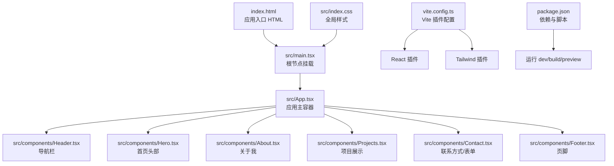

**图示来源**
- [index.html:1-14](file://portfolio/index.html#L1-L14)
- [src/main.tsx:1-12](file://portfolio/src/main.tsx#L1-L12)
- [src/App.tsx:1-28](file://portfolio/src/App.tsx#L1-L28)
- [src/components/Header.tsx:1-129](file://portfolio/src/components/Header.tsx#L1-L129)
- [src/components/Hero.tsx:1-142](file://portfolio/src/components/Hero.tsx#L1-L142)
- [src/components/About.tsx:1-151](file://portfolio/src/components/About.tsx#L1-L151)
- [src/components/Projects.tsx:1-151](file://portfolio/src/components/Projects.tsx#L1-L151)
- [src/components/Contact.tsx:1-149](file://portfolio/src/components/Contact.tsx#L1-L149)
- [src/components/Footer.tsx:1-48](file://portfolio/src/components/Footer.tsx#L1-L48)
- [src/index.css:1-46](file://portfolio/src/index.css#L1-L46)
- [vite.config.ts:1-9](file://portfolio/vite.config.ts#L1-L9)
- [package.json:1-37](file://portfolio/package.json#L1-L37)

**章节来源**
- [index.html:1-14](file://portfolio/index.html#L1-L14)
- [src/main.tsx:1-12](file://portfolio/src/main.tsx#L1-L12)
- [src/App.tsx:1-28](file://portfolio/src/App.tsx#L1-L28)
- [vite.config.ts:1-9](file://portfolio/vite.config.ts#L1-L9)
- [package.json:1-37](file://portfolio/package.json#L1-L37)

## 核心组件
- Header：固定导航栏，包含品牌标识与锚点导航，支持滚动时样式变化与活动区检测。
- Hero：首页大标题区域，包含头像、姓名、职位、简介、CTA 按钮与社交链接。
- About：个人介绍与技能展示，按类别分组技能并以动画展示掌握程度。
- Projects：项目卡片网格，支持在线链接与 GitHub 链接，悬停显示操作按钮。
- Contact：联系方式卡片，包含邮箱、GitHub、LinkedIn、Twitter 等链接，使用动画与渐变样式。
- Footer：版权信息与返回顶部按钮，具备平滑滚动交互。

这些组件均通过 App 组合并统一在深色主题背景上，配合全局样式与动画库实现一致的视觉与交互体验。

**章节来源**
- [src/components/Header.tsx:1-129](file://portfolio/src/components/Header.tsx#L1-L129)
- [src/components/Hero.tsx:1-142](file://portfolio/src/components/Hero.tsx#L1-L142)
- [src/components/About.tsx:1-151](file://portfolio/src/components/About.tsx#L1-L151)
- [src/components/Projects.tsx:1-151](file://portfolio/src/components/Projects.tsx#L1-L151)
- [src/components/Contact.tsx:1-149](file://portfolio/src/components/Contact.tsx#L1-L149)
- [src/components/Footer.tsx:1-48](file://portfolio/src/components/Footer.tsx#L1-L48)
- [src/App.tsx:1-28](file://portfolio/src/App.tsx#L1-L28)
- [src/index.css:1-46](file://portfolio/src/index.css#L1-L46)

## 架构总览
下图展示了从浏览器加载到组件渲染的关键路径，以及第三方库（动画与图标）的使用位置。

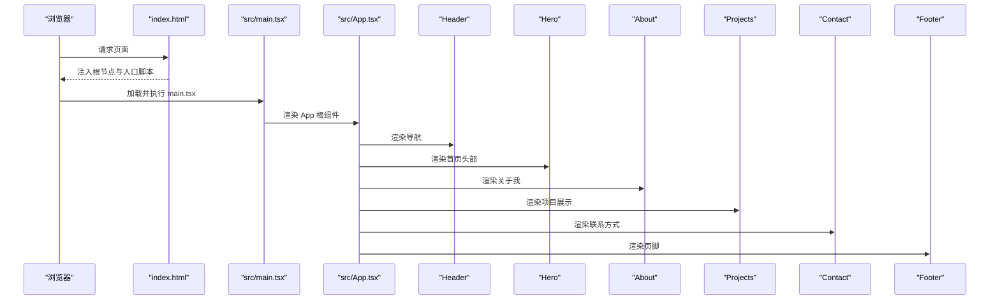

**图示来源**
- [index.html:1-14](file://portfolio/index.html#L1-L14)
- [src/main.tsx:1-12](file://portfolio/src/main.tsx#L1-L12)
- [src/App.tsx:1-28](file://portfolio/src/App.tsx#L1-L28)
- [src/components/Header.tsx:1-129](file://portfolio/src/components/Header.tsx#L1-L129)
- [src/components/Hero.tsx:1-142](file://portfolio/src/components/Hero.tsx#L1-L142)
- [src/components/About.tsx:1-151](file://portfolio/src/components/About.tsx#L1-L151)
- [src/components/Projects.tsx:1-151](file://portfolio/src/components/Projects.tsx#L1-L151)
- [src/components/Contact.tsx:1-149](file://portfolio/src/components/Contact.tsx#L1-L149)
- [src/components/Footer.tsx:1-48](file://portfolio/src/components/Footer.tsx#L1-L48)

## 详细组件分析

### Contact 组件增强：表单集成
目标：在 Contact 区域增加可提交的联系表单，支持必填字段校验与提交反馈。

实现步骤
- 新增表单状态与字段校验逻辑，建议使用受控组件与简单校验规则。
- 提交成功后显示反馈消息，失败时展示错误提示。
- 可选：集成第三方服务（如 EmailJS、Formspree 或自建后端接口）进行邮件发送或数据存储。

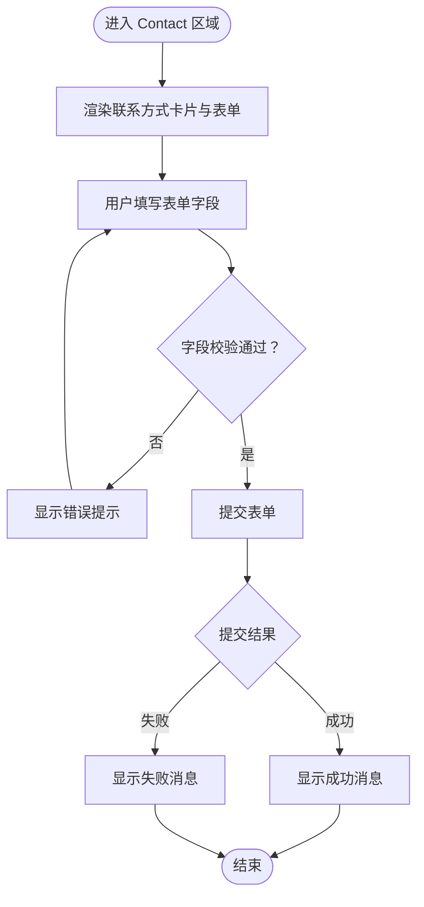

**图示来源**
- [src/components/Contact.tsx:1-149](file://portfolio/src/components/Contact.tsx#L1-L149)

**章节来源**
- [src/components/Contact.tsx:1-149](file://portfolio/src/components/Contact.tsx#L1-L149)

### 社交媒体链接管理增强
目标：集中管理社交链接，支持动态配置、图标扩展与新平台接入。

实现步骤
- 将现有硬编码链接迁移至配置对象或外部 JSON 文件，便于维护。
- 为每种社交平台定义图标、颜色与跳转规则，支持新平台快速添加。
- 在 Header 与 Hero 中复用该配置，保持风格一致。

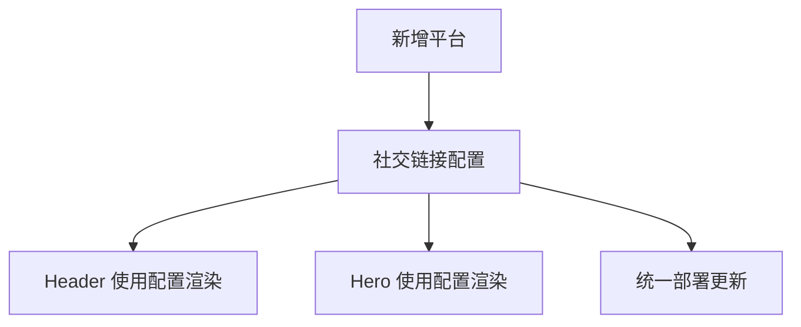

**图示来源**
- [src/components/Header.tsx:5-10](file://portfolio/src/components/Header.tsx#L5-L10)
- [src/components/Hero.tsx:101-119](file://portfolio/src/components/Hero.tsx#L101-L119)

**章节来源**
- [src/components/Header.tsx:5-10](file://portfolio/src/components/Header.tsx#L5-L10)
- [src/components/Hero.tsx:101-119](file://portfolio/src/components/Hero.tsx#L101-L119)

### 地图嵌入增强
目标：在 Contact 区域或新增页面中嵌入地图（如 Google Maps），提升可达性与专业度。

实现步骤
- 选择嵌入式地图服务（如 Google Maps Embed），生成 iframe 或使用官方 SDK。
- 在 Contact 区域底部添加地图容器，设置响应式尺寸与无障碍属性。
- 可选：提供“路线规划”与“电话/导航”快捷方式，增强用户体验。

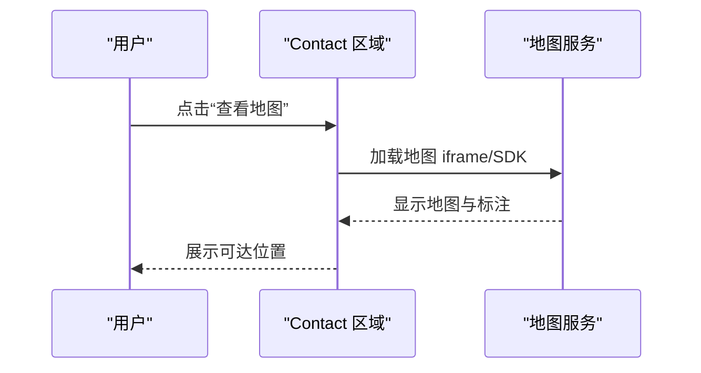

**图示来源**
- [src/components/Contact.tsx:1-149](file://portfolio/src/components/Contact.tsx#L1-L149)

**章节来源**
- [src/components/Contact.tsx:1-149](file://portfolio/src/components/Contact.tsx#L1-L149)

### 第三方库集成方法
目标：以最小侵入方式引入新功能库（如地图 SDK、表单验证、国际化框架）。

通用流程
- 安装：通过 npm/yarn/pnpm 安装依赖包。
- 配置：在 Vite 配置中启用必要插件（如 @vitejs/plugin-react、@tailwindcss/vite）。
- 依赖注入：在入口文件或根组件中初始化第三方库（如 i18n 实例、地图 SDK 初始化）。
- 使用：在组件中按需导入并调用 API。

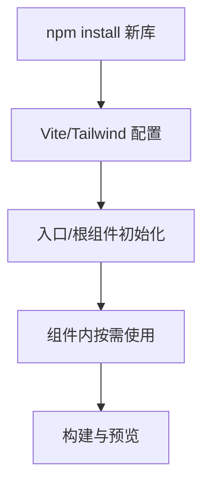

**图示来源**
- [package.json:12-17](file://portfolio/package.json#L12-L17)
- [vite.config.ts:1-9](file://portfolio/vite.config.ts#L1-L9)

**章节来源**
- [package.json:12-17](file://portfolio/package.json#L12-L17)
- [vite.config.ts:1-9](file://portfolio/vite.config.ts#L1-L9)

### SEO 优化策略
目标：提升搜索引擎可见性与点击率，改善结构化数据与 URL 设计。

策略清单
- Meta 标签：在 index.html 中补充描述、关键词、Open Graph、Twitter Card 等。
- 结构化数据：在 About/Projects 页面添加 JSON-LD（如 Person、ItemList、Product）。
- URL 设计：采用语义化锚点与清晰的页面分区；避免动态路由，维持静态友好结构。
- 内容优化：确保标题层级清晰、Alt 文本完整、内容可读性强。

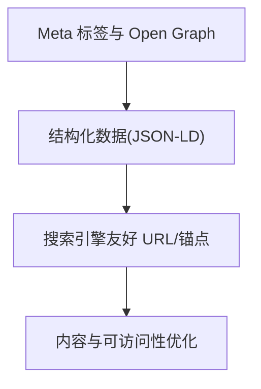

**图示来源**
- [index.html:3-8](file://portfolio/index.html#L3-L8)
- [src/components/About.tsx:1-151](file://portfolio/src/components/About.tsx#L1-L151)
- [src/components/Projects.tsx:1-151](file://portfolio/src/components/Projects.tsx#L1-L151)

**章节来源**
- [index.html:3-8](file://portfolio/index.html#L3-L8)
- [src/components/About.tsx:1-151](file://portfolio/src/components/About.tsx#L1-L151)
- [src/components/Projects.tsx:1-151](file://portfolio/src/components/Projects.tsx#L1-L151)

### 国际化支持方案
目标：支持多语言切换与本地化适配，兼顾维护成本与扩展性。

方案建议
- 选择轻量级 i18n 库（如 react-i18next），在入口处初始化资源与语言回退。
- 将文案集中管理为键值对，组件中通过 hooks 获取翻译函数。
- 本地化适配：日期、数字、货币格式化使用 Intl API；文本方向 RTL 支持按需扩展。
- 切换逻辑：在 Header 添加语言切换器，持久化用户选择。

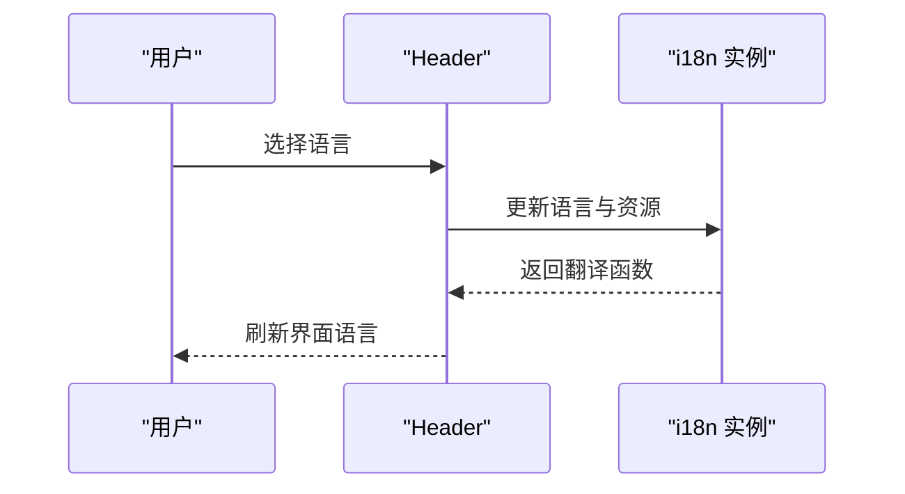

**图示来源**
- [src/components/Header.tsx:1-129](file://portfolio/src/components/Header.tsx#L1-L129)

**章节来源**
- [src/components/Header.tsx:1-129](file://portfolio/src/components/Header.tsx#L1-L129)

### 性能优化技巧
目标：提升首屏速度、减少带宽占用与增强交互流畅度。

实践要点
- 代码分割：将大型组件或依赖按需加载（如地图、图表库）。
- 懒加载：图片与非首屏组件使用懒加载策略。
- 缓存策略：利用浏览器缓存与 CDN；静态资源版本化。
- 动画与滚动：合理使用动画库，避免过度重绘；平滑滚动已在全局样式中启用。

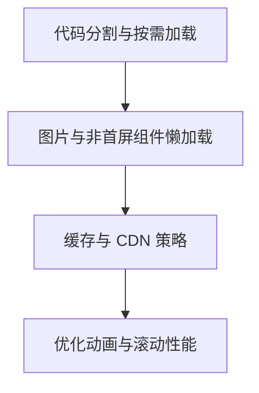

**图示来源**
- [src/index.css:11-13](file://portfolio/src/index.css#L11-L13)
- [src/components/Projects.tsx:67-100](file://portfolio/src/components/Projects.tsx#L67-L100)

**章节来源**
- [src/index.css:11-13](file://portfolio/src/index.css#L11-L13)
- [src/components/Projects.tsx:67-100](file://portfolio/src/components/Projects.tsx#L67-L100)

### PWA 功能集成与离线支持
目标：将网站升级为 PWA，提供应用体验与离线可用能力。

实施步骤
- Service Worker：注册并配置缓存策略（静态资源、API 缓存）。
- Manifest：在 index.html 中引入 manifest 文件，定义名称、图标、主题色。
- 渐进增强：优先保证核心内容在无网络时可访问，次要功能降级处理。
- 测试：使用浏览器 DevTools 的 Application/PWAs 面板验证安装与离线行为。

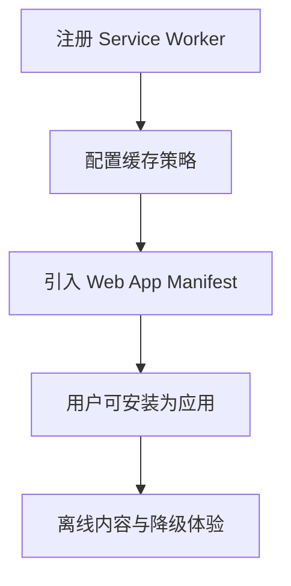

**图示来源**
- [index.html:1-14](file://portfolio/index.html#L1-L14)

**章节来源**
- [index.html:1-14](file://portfolio/index.html#L1-L14)

## 依赖分析
项目依赖以 React 生态为主，包含动画与图标库，构建工具链由 Vite 与 Tailwind 组成。

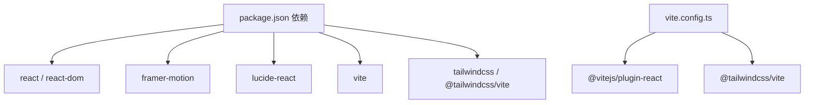

**图示来源**
- [package.json:12-17](file://portfolio/package.json#L12-L17)
- [vite.config.ts:1-9](file://portfolio/vite.config.ts#L1-L9)

**章节来源**
- [package.json:12-17](file://portfolio/package.json#L12-L17)
- [vite.config.ts:1-9](file://portfolio/vite.config.ts#L1-L9)

## 性能考虑
- 首屏优化：将非关键资源延迟加载，减少主线程阻塞。
- 资源体积：定期分析打包产物，移除未使用依赖，启用压缩与 Tree Shaking。
- 交互体验：保持动画简洁，避免频繁布局抖动；充分利用硬件加速。
- 网络效率：开启 Gzip/Brotli 压缩，合理设置缓存头，CDN 分发静态资源。

[本节为通用指导，无需特定文件引用]

## 故障排查指南
- 构建失败：检查 Vite 插件是否正确安装与配置，确认 TypeScript 类型无误。
- 样式异常：确认 Tailwind 插件已启用，CSS 变量与类名拼写正确。
- 动画不生效：检查 framer-motion 版本兼容性与组件包裹关系。
- 锚点滚动无效：确认目标元素 ID 存在且与导航链接匹配。

**章节来源**
- [vite.config.ts:1-9](file://portfolio/vite.config.ts#L1-L9)
- [src/index.css:1-46](file://portfolio/src/index.css#L1-L46)
- [src/components/Header.tsx:44-49](file://portfolio/src/components/Header.tsx#L44-L49)

## 结论
通过在现有架构基础上引入表单、地图与国际化能力，结合 SEO 与 PWA 优化，可显著提升 AIWs 项目的功能性、可访问性与用户体验。建议优先实现 Contact 表单与地图嵌入，随后扩展国际化与 PWA 能力，持续监控性能指标并迭代优化。

[本节为总结，无需特定文件引用]

## 附录
- 数据模型：项目与技能数据结构清晰，便于扩展与复用。
- 组件复用：导航、页脚等横切组件可在各页面复用，降低维护成本。

**章节来源**
- [src/data/projects.ts:1-49](file://portfolio/src/data/projects.ts#L1-L49)
- [src/data/skills.ts:1-39](file://portfolio/src/data/skills.ts#L1-L39)