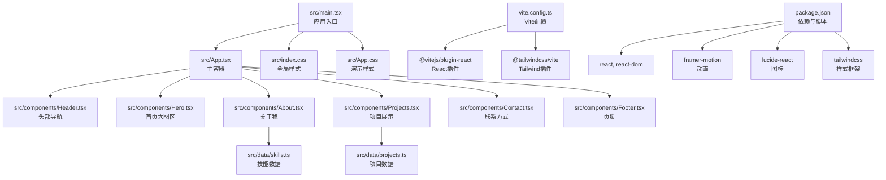
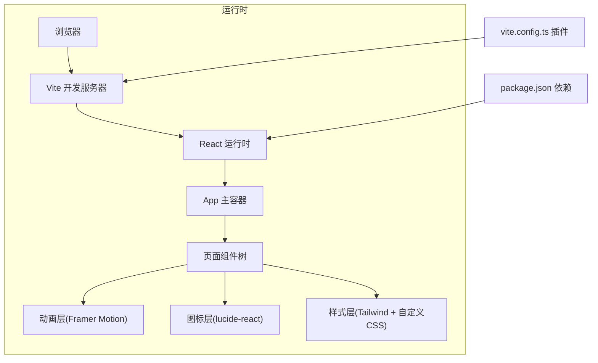
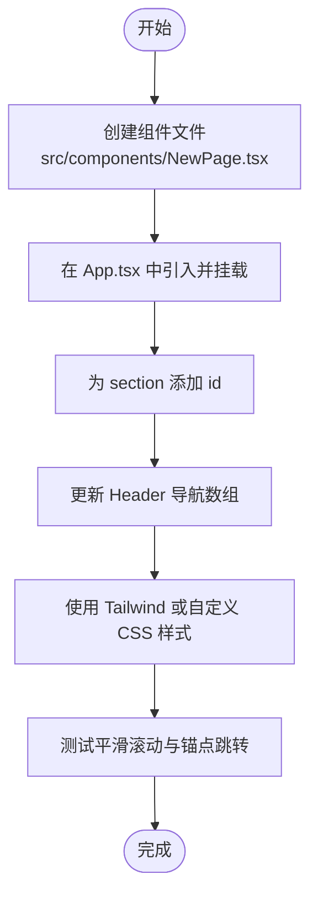
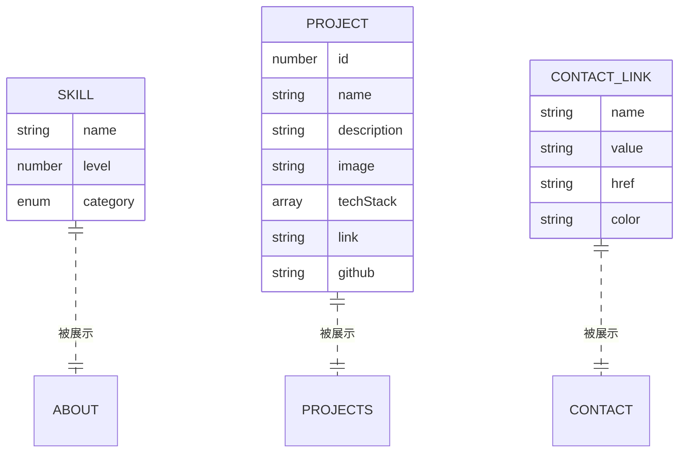
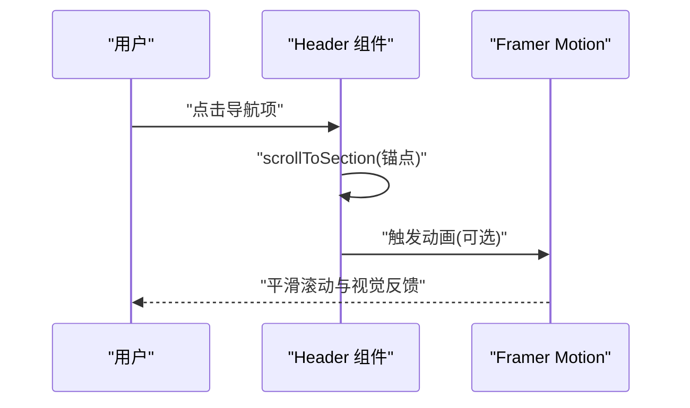
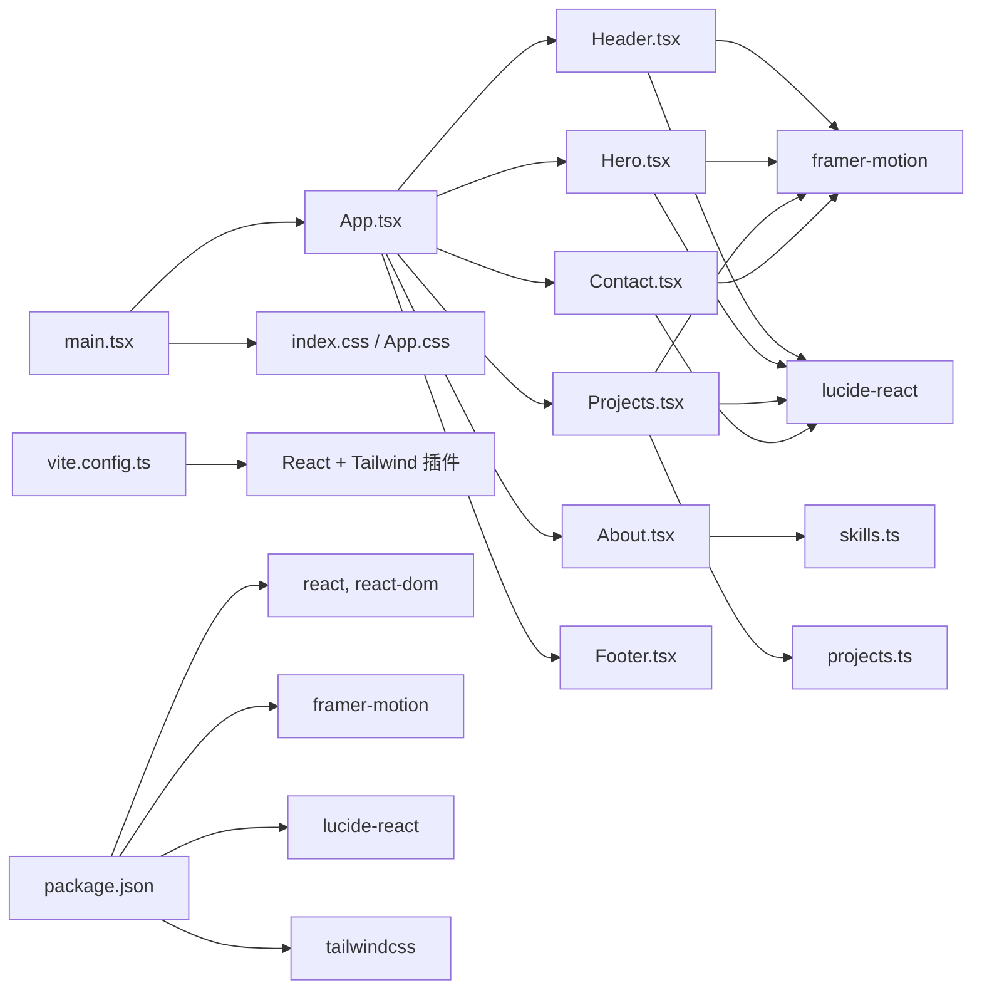

# 定制与扩展

<cite>
**本文引用的文件**
- [package.json](file://portfolio/package.json)
- [vite.config.ts](file://portfolio/vite.config.ts)
- [src/main.tsx](file://portfolio/src/main.tsx)
- [src/App.tsx](file://portfolio/src/App.tsx)
- [src/index.css](file://portfolio/src/index.css)
- [src/App.css](file://portfolio/src/App.css)
- [src/components/Header.tsx](file://portfolio/src/components/Header.tsx)
- [src/components/Hero.tsx](file://portfolio/src/components/Hero.tsx)
- [src/components/About.tsx](file://portfolio/src/components/About.tsx)
- [src/components/Projects.tsx](file://portfolio/src/components/Projects.tsx)
- [src/components/Contact.tsx](file://portfolio/src/components/Contact.tsx)
- [src/components/Footer.tsx](file://portfolio/src/components/Footer.tsx)
- [src/data/skills.ts](file://portfolio/src/data/skills.ts)
- [src/data/projects.ts](file://portfolio/src/data/projects.ts)
- [README.md](file://portfolio/README.md)
</cite>

## 目录
1. [简介](#简介)
2. [项目结构](#项目结构)
3. [核心组件](#核心组件)
4. [架构总览](#架构总览)
5. [详细组件分析](#详细组件分析)
6. [依赖关系分析](#依赖关系分析)
7. [性能考虑](#性能考虑)
8. [故障排查指南](#故障排查指南)
9. [结论](#结论)
10. [附录](#附录)

## 简介
本指南面向希望对 AIWs 项目进行定制与扩展的开发者，涵盖新增页面组件（创建流程、路由配置、样式集成）、数据扩展（技能、项目、联系方式）、样式定制（主题色、字体、布局）、动画扩展（过渡与交互反馈）、第三方库与插件集成、SEO 与元数据配置、以及多语言国际化扩展方案。内容基于仓库现有实现，确保可操作性与一致性。

## 项目结构
项目采用 React + TypeScript + Vite + Tailwind CSS 架构，组件按功能拆分至 components 目录，数据模型位于 data 目录，入口文件在 src 目录下，样式通过全局 CSS 与 Tailwind 类组合使用。

**图表来源**
- [src/main.tsx:1-12](file://portfolio/src/main.tsx#L1-L12)
- [src/App.tsx:1-28](file://portfolio/src/App.tsx#L1-L28)
- [src/components/Header.tsx:1-129](file://portfolio/src/components/Header.tsx#L1-L129)
- [src/components/Hero.tsx:1-142](file://portfolio/src/components/Hero.tsx#L1-L142)
- [src/components/About.tsx:1-151](file://portfolio/src/components/About.tsx#L1-L151)
- [src/components/Projects.tsx:1-151](file://portfolio/src/components/Projects.tsx#L1-L151)
- [src/components/Contact.tsx:1-149](file://portfolio/src/components/Contact.tsx#L1-L149)
- [src/components/Footer.tsx:1-48](file://portfolio/src/components/Footer.tsx#L1-L48)
- [src/data/skills.ts:1-39](file://portfolio/src/data/skills.ts#L1-L39)
- [src/data/projects.ts:1-49](file://portfolio/src/data/projects.ts#L1-L49)
- [src/index.css:1-46](file://portfolio/src/index.css#L1-L46)
- [src/App.css:1-185](file://portfolio/src/App.css#L1-L185)
- [vite.config.ts:1-9](file://portfolio/vite.config.ts#L1-L9)
- [package.json:1-37](file://portfolio/package.json#L1-L37)

**章节来源**
- [src/main.tsx:1-12](file://portfolio/src/main.tsx#L1-L12)
- [src/App.tsx:1-28](file://portfolio/src/App.tsx#L1-L28)
- [vite.config.ts:1-9](file://portfolio/vite.config.ts#L1-L9)
- [package.json:1-37](file://portfolio/package.json#L1-L37)

## 核心组件
- 主容器 App：聚合所有页面组件，统一背景与布局。
- 页面组件：Header、Hero、About、Projects、Contact、Footer，分别负责导航、首屏、个人介绍、项目展示、联系信息与页脚。
- 数据层：skills.ts、projects.ts 提供类型化数据模型与静态数据。
- 样式层：index.css 定义深色主题变量与全局样式；App.css 提供演示类样式；Tailwind 类贯穿组件样式组织。

**章节来源**
- [src/App.tsx:1-28](file://portfolio/src/App.tsx#L1-L28)
- [src/components/Header.tsx:1-129](file://portfolio/src/components/Header.tsx#L1-L129)
- [src/components/Hero.tsx:1-142](file://portfolio/src/components/Hero.tsx#L1-L142)
- [src/components/About.tsx:1-151](file://portfolio/src/components/About.tsx#L1-L151)
- [src/components/Projects.tsx:1-151](file://portfolio/src/components/Projects.tsx#L1-L151)
- [src/components/Contact.tsx:1-149](file://portfolio/src/components/Contact.tsx#L1-L149)
- [src/components/Footer.tsx:1-48](file://portfolio/src/components/Footer.tsx#L1-L48)
- [src/data/skills.ts:1-39](file://portfolio/src/data/skills.ts#L1-L39)
- [src/data/projects.ts:1-49](file://portfolio/src/data/projects.ts#L1-L49)
- [src/index.css:1-46](file://portfolio/src/index.css#L1-L46)
- [src/App.css:1-185](file://portfolio/src/App.css#L1-L185)

## 架构总览
应用采用“组件即页面”的单页架构，通过平滑滚动与锚点定位实现页面内导航；动画由 Framer Motion 提供；图标由 lucide-react 提供；样式由 Tailwind CSS 与自定义 CSS 组合实现。

**图表来源**
- [src/main.tsx:1-12](file://portfolio/src/main.tsx#L1-L12)
- [src/App.tsx:1-28](file://portfolio/src/App.tsx#L1-L28)
- [package.json:12-16](file://portfolio/package.json#L12-L16)
- [vite.config.ts:1-9](file://portfolio/vite.config.ts#L1-L9)

## 详细组件分析

### 新增页面组件：创建流程、路由配置与样式集成
- 创建步骤
  1) 在 src/components 下新增组件文件（例如 NewPage.tsx），导出默认函数组件。
  2) 在 src/App.tsx 中引入并挂载到主容器中合适位置。
  3) 如需锚点导航，为新 section 设置 id，并在 Header 的导航数组中添加对应项。
  4) 使用 Tailwind 类或自定义 CSS 实现样式；如需动画，引入 motion 并使用其变体与过渡。
- 路由配置
  - 当前项目未使用集中式路由库，而是通过锚点与平滑滚动实现页面内导航。若需要 SPA 路由，请安装路由库并在入口处包裹 Router，再将页面组件映射到路径。
  - 参考路径：[src/components/Header.tsx:5-10](file://portfolio/src/components/Header.tsx#L5-L10)、[src/components/Hero.tsx:9-12](file://portfolio/src/components/Hero.tsx#L9-L12)、[src/App.tsx:12-25](file://portfolio/src/App.tsx#L12-L25)
- 样式集成
  - 组件内优先使用 Tailwind 类；必要时在 src/index.css 或组件局部样式中补充。
  - 参考路径：[src/index.css:1-46](file://portfolio/src/index.css#L1-L46)、[src/App.css:1-185](file://portfolio/src/App.css#L1-L185)

**图表来源**
- [src/App.tsx:1-28](file://portfolio/src/App.tsx#L1-L28)
- [src/components/Header.tsx:5-10](file://portfolio/src/components/Header.tsx#L5-L10)
- [src/components/Hero.tsx:9-12](file://portfolio/src/components/Hero.tsx#L9-L12)
- [src/index.css:1-46](file://portfolio/src/index.css#L1-L46)

**章节来源**
- [src/App.tsx:1-28](file://portfolio/src/App.tsx#L1-L28)
- [src/components/Header.tsx:5-10](file://portfolio/src/components/Header.tsx#L5-L10)
- [src/components/Hero.tsx:9-12](file://portfolio/src/components/Hero.tsx#L9-L12)
- [src/index.css:1-46](file://portfolio/src/index.css#L1-L46)

### 数据扩展：新增技能、项目与联系方式
- 新增技能
  - 在 src/data/skills.ts 中追加 Skill 对象，选择合适的 category，并在 skillCategories 中添加本地化名称。
  - 参考路径：[src/data/skills.ts:8-31](file://portfolio/src/data/skills.ts#L8-L31)、[src/data/skills.ts:33-38](file://portfolio/src/data/skills.ts#L33-L38)
- 新增项目
  - 在 src/data/projects.ts 中追加 Project 对象，注意 id 唯一性与可选字段（如 github）。
  - 参考路径：[src/data/projects.ts:12-48](file://portfolio/src/data/projects.ts#L12-L48)
- 新增联系方式
  - 在 Contact 组件的 contactLinks 数组中添加新条目，设置 name、value、href、icon 与 color。
  - 参考路径：[src/components/Contact.tsx:9-38](file://portfolio/src/components/Contact.tsx#L9-L38)

**图表来源**
- [src/data/skills.ts:2-6](file://portfolio/src/data/skills.ts#L2-L6)
- [src/data/projects.ts:2-10](file://portfolio/src/data/projects.ts#L2-L10)
- [src/components/Contact.tsx:9-38](file://portfolio/src/components/Contact.tsx#L9-L38)

**章节来源**
- [src/data/skills.ts:1-39](file://portfolio/src/data/skills.ts#L1-L39)
- [src/data/projects.ts:1-49](file://portfolio/src/data/projects.ts#L1-L49)
- [src/components/Contact.tsx:1-149](file://portfolio/src/components/Contact.tsx#L1-L149)

### 样式定制：主题色、字体与布局
- 主题色
  - 修改 :root 变量或 Tailwind 主题配置中的颜色；组件中使用渐变色时，保持一致的色板。
  - 参考路径：[src/index.css:4-8](file://portfolio/src/index.css#L4-L8)
- 字体
  - 在 body 中调整字体族，确保可读性与跨平台兼容。
  - 参考路径：[src/index.css:15-21](file://portfolio/src/index.css#L15-L21)
- 布局
  - 使用 Tailwind 的容器、间距、网格与响应式断点；必要时在 src/App.css 中补充复杂布局。
  - 参考路径：[src/App.css:59-105](file://portfolio/src/App.css#L59-L105)

**章节来源**
- [src/index.css:1-46](file://portfolio/src/index.css#L1-L46)
- [src/App.css:59-105](file://portfolio/src/App.css#L59-L105)

### 动画效果扩展：过渡与交互反馈
- 动画库
  - 使用 Framer Motion 的 motion、variants、layoutId、whileHover、whileTap 等特性实现流畅过渡与交互反馈。
  - 参考路径：[src/components/Header.tsx:52-103](file://portfolio/src/components/Header.tsx#L52-L103)、[src/components/Projects.tsx:61-99](file://portfolio/src/components/Projects.tsx#L61-L99)
- 扩展建议
  - 为新组件设计 enter/exit 变体，结合 viewport 触发与延迟控制，提升加载体验。
  - 使用 whileInView 与 viewport={{ once }} 控制只触发一次的动画。

**图表来源**
- [src/components/Header.tsx:44-49](file://portfolio/src/components/Header.tsx#L44-L49)
- [src/components/Projects.tsx:72-99](file://portfolio/src/components/Projects.tsx#L72-L99)

**章节来源**
- [src/components/Header.tsx:1-129](file://portfolio/src/components/Header.tsx#L1-L129)
- [src/components/Projects.tsx:1-151](file://portfolio/src/components/Projects.tsx#L1-L151)

### 第三方库集成与插件开发
- 依赖管理
  - 在 package.json 的 dependencies 或 devDependencies 中添加新包，执行安装后即可在组件中导入使用。
  - 参考路径：[package.json:12-16](file://portfolio/package.json#L12-L16)
- 插件与构建
  - Vite 插件在 vite.config.ts 中注册；如需新增插件，直接在此文件中添加并配置。
  - 参考路径：[vite.config.ts:1-9](file://portfolio/vite.config.ts#L1-L9)
- 图标与动画
  - lucide-react 用于图标；framer-motion 用于动画；两者均已在依赖中声明。
  - 参考路径：[package.json:12-16](file://portfolio/package.json#L12-L16)

**章节来源**
- [package.json:1-37](file://portfolio/package.json#L1-L37)
- [vite.config.ts:1-9](file://portfolio/vite.config.ts#L1-L9)

### SEO 优化与元数据配置
- HTML 元数据
  - 在 public/index.html 中设置 title、description、viewport 等基础元信息；如需结构化数据，可在 head 中添加 JSON-LD。
  - 参考路径：[src/main.tsx:1-12](file://portfolio/src/main.tsx#L1-L12)
- 动态元信息
  - 若使用路由库，可在各页面组件中动态设置 meta 标签；当前项目通过锚点导航，建议在页面组件中通过 script 注入或服务端渲染时注入。
- 结构化数据
  - 在 About/Contact 等页面中以 JSON-LD 形式提供个人信息、技能与项目摘要，提升搜索结果丰富度。

[本节为通用实践指导，不直接分析具体文件，故无“章节来源”]

### 多语言支持与国际化扩展
- 当前状态
  - 项目文本主要为中文，未见 i18n 方案。
- 扩展方案
  - 选择 i18n 库（如 react-i18next 或 @lingui/react），在组件中以 key 替换硬编码文本。
  - 在数据层（skills.ts、projects.ts）保留多语言字段或分离文案与数据。
  - 在入口处初始化语言环境与回退语言，根据用户偏好或 URL 参数切换语言。
- 渲染策略
  - 保持组件纯函数式，通过 props 接收翻译函数或上下文，避免在组件内部直接访问全局状态。

[本节为通用实践指导，不直接分析具体文件，故无“章节来源”]

## 依赖关系分析
- 组件间耦合
  - App 作为父容器，仅负责组合子组件；子组件之间低耦合，通过 props 传递少量数据（如导航项）。
- 外部依赖
  - React 生态与动画、图标、样式相关库已声明；构建与开发工具链通过 Vite 插件启用。
- 潜在风险
  - 若引入大型第三方库，需评估打包体积与按需加载策略。

**图表来源**
- [src/App.tsx:1-28](file://portfolio/src/App.tsx#L1-L28)
- [src/components/Header.tsx:1-3](file://portfolio/src/components/Header.tsx#L1-L3)
- [src/components/Hero.tsx:1-3](file://portfolio/src/components/Hero.tsx#L1-L3)
- [src/components/About.tsx:1-2](file://portfolio/src/components/About.tsx#L1-L2)
- [src/components/Projects.tsx:1-3](file://portfolio/src/components/Projects.tsx#L1-L3)
- [src/components/Contact.tsx:1-2](file://portfolio/src/components/Contact.tsx#L1-L2)
- [src/main.tsx:1-4](file://portfolio/src/main.tsx#L1-L4)
- [src/index.css:1-1](file://portfolio/src/index.css#L1-L1)
- [src/App.css:1-1](file://portfolio/src/App.css#L1-L1)
- [vite.config.ts:1-9](file://portfolio/vite.config.ts#L1-L9)
- [package.json:12-16](file://portfolio/package.json#L12-L16)

**章节来源**
- [src/App.tsx:1-28](file://portfolio/src/App.tsx#L1-L28)
- [package.json:1-37](file://portfolio/package.json#L1-L37)
- [vite.config.ts:1-9](file://portfolio/vite.config.ts#L1-L9)

## 性能考虑
- 代码分割与懒加载
  - 将大型组件或依赖按需加载，减少首屏体积。
- 动画与滚动
  - 使用 viewport 触发与 once 控制，避免重复计算；合理设置动画持续时间与缓动曲线。
- 样式体积
  - 优先使用 Tailwind 实用类，避免生成冗余 CSS；清理未使用的类名。
- 图标与媒体
  - 使用矢量图标与压缩后的图片资源，按需懒加载图片。

[本节提供通用指导，不直接分析具体文件，故无“章节来源”]

## 故障排查指南
- 动画不生效
  - 检查是否正确导入 motion；确认组件处于视口范围内或触发条件满足。
  - 参考路径：[src/components/About.tsx:18-35](file://portfolio/src/components/About.tsx#L18-L35)、[src/components/Projects.tsx:10-27](file://portfolio/src/components/Projects.tsx#L10-L27)
- 锚点跳转异常
  - 确认 section id 与导航 href 一致；检查滚动行为与元素可见性。
  - 参考路径：[src/components/Hero.tsx:9-12](file://portfolio/src/components/Hero.tsx#L9-L12)、[src/components/Header.tsx:44-49](file://portfolio/src/components/Header.tsx#L44-L49)
- 样式未生效
  - 检查 Tailwind 是否正确加载；确认类名拼写与作用域；必要时在 index.css 中补充覆盖。
  - 参考路径：[src/index.css:1-1](file://portfolio/src/index.css#L1-L1)、[vite.config.ts:1-9](file://portfolio/vite.config.ts#L1-L9)
- 依赖安装问题
  - 清理 node_modules 与 lock 文件后重新安装；核对 package.json 依赖版本。
  - 参考路径：[package.json:1-37](file://portfolio/package.json#L1-L37)

**章节来源**
- [src/components/About.tsx:18-35](file://portfolio/src/components/About.tsx#L18-L35)
- [src/components/Projects.tsx:10-27](file://portfolio/src/components/Projects.tsx#L10-L27)
- [src/components/Hero.tsx:9-12](file://portfolio/src/components/Hero.tsx#L9-L12)
- [src/components/Header.tsx:44-49](file://portfolio/src/components/Header.tsx#L44-L49)
- [src/index.css:1-1](file://portfolio/src/index.css#L1-L1)
- [vite.config.ts:1-9](file://portfolio/vite.config.ts#L1-L9)
- [package.json:1-37](file://portfolio/package.json#L1-L37)

## 结论
本指南提供了从组件创建、数据扩展到样式与动画定制的完整路径，并给出了第三方库集成、SEO 与国际化扩展的实践建议。遵循本文档可快速在现有架构上安全地进行定制与扩展，同时保持性能与可维护性。

## 附录
- 快速检查清单
  - 新增组件：创建文件 → 引入 App → 添加锚点 → 更新导航 → 应用样式 → 测试滚动
  - 新增数据：在对应 data 文件中添加对象 → 在组件中消费 → 本地化文案（如适用）
  - 样式变更：修改主题变量或 Tailwind 配置 → 组件内类名更新 → 验证深色模式
  - 动画扩展：设计变体 → 使用 viewport 触发 → 控制延迟与缓动
  - 依赖与插件：在 package.json 添加 → 在 vite.config.ts 注册 → 重启开发服务器
  - SEO：在 HTML 中设置元信息 → 生成结构化数据 → 验证搜索引擎抓取
  - 国际化：选择 i18n 库 → 提取文案 → 分离数据与文案 → 初始化语言环境

[本节为通用附录，不直接分析具体文件，故无“章节来源”]