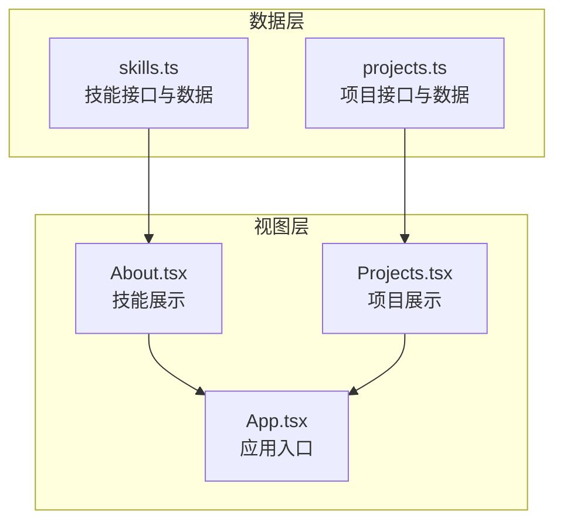
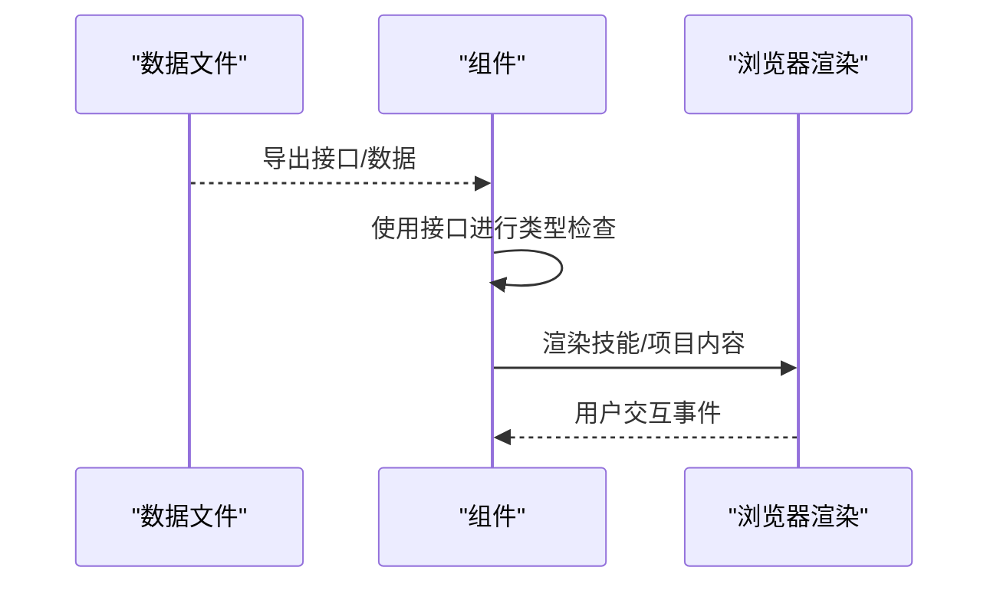
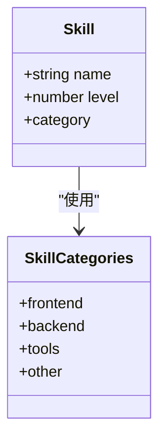
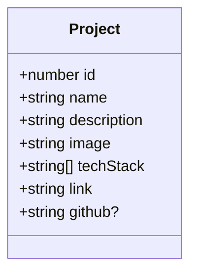
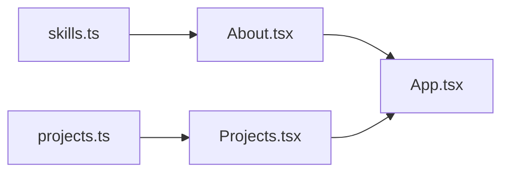

# 数据扩展

<cite>
**本文引用的文件**
- [skills.ts](file://portfolio/src/data/skills.ts)
- [projects.ts](file://portfolio/src/data/projects.ts)
- [About.tsx](file://portfolio/src/components/About.tsx)
- [Projects.tsx](file://portfolio/src/components/Projects.tsx)
- [App.tsx](file://portfolio/src/App.tsx)
- [package.json](file://portfolio/package.json)
- [tsconfig.app.json](file://portfolio/tsconfig.app.json)
- [tsconfig.node.json](file://portfolio/tsconfig.node.json)
- [tsconfig.json](file://portfolio/tsconfig.json)
</cite>

## 目录
1. [简介](#简介)
2. [项目结构](#项目结构)
3. [核心组件](#核心组件)
4. [架构总览](#架构总览)
5. [详细组件分析](#详细组件分析)
6. [依赖关系分析](#依赖关系分析)
7. [性能考虑](#性能考虑)
8. [故障排查指南](#故障排查指南)
9. [结论](#结论)
10. [附录](#附录)

## 简介
本指南面向需要为 AIWs 项目添加新数据（技能与项目）的开发者，提供从接口扩展、数据格式规范、分类管理到导入导出与版本管理的完整实践路径。文档同时覆盖类型安全、数据验证、缓存与性能优化策略，帮助你在不破坏现有结构的前提下，安全地扩展现有数据模型。

## 项目结构
项目采用“数据文件 + React 组件”的扁平化组织方式：
- 数据层：位于 src/data 下，分别定义技能与项目两类数据及其接口
- 视图层：位于 src/components 下，通过导入数据并在组件中渲染
- 构建与类型：通过 Vite + TypeScript 配置进行编译与类型检查

**图表来源**
- [skills.ts:1-39](file://portfolio/src/data/skills.ts#L1-L39)
- [projects.ts:1-49](file://portfolio/src/data/projects.ts#L1-L49)
- [About.tsx:1-151](file://portfolio/src/components/About.tsx#L1-L151)
- [Projects.tsx:1-151](file://portfolio/src/components/Projects.tsx#L1-L151)
- [App.tsx:1-28](file://portfolio/src/App.tsx#L1-L28)

**章节来源**
- [skills.ts:1-39](file://portfolio/src/data/skills.ts#L1-L39)
- [projects.ts:1-49](file://portfolio/src/data/projects.ts#L1-L49)
- [About.tsx:1-151](file://portfolio/src/components/About.tsx#L1-L151)
- [Projects.tsx:1-151](file://portfolio/src/components/Projects.tsx#L1-L151)
- [App.tsx:1-28](file://portfolio/src/App.tsx#L1-L28)

## 核心组件
- 技能数据模型：包含名称、熟练度等级与分类三要素，提供分类映射表用于本地化显示
- 项目数据模型：包含标识、名称、描述、图片、技术栈、线上链接与可选的 GitHub 链接
- 视图组件：About 负责按分类渲染技能条形图；Projects 负责渲染项目卡片与链接

**章节来源**
- [skills.ts:2-6](file://portfolio/src/data/skills.ts#L2-L6)
- [skills.ts:33-38](file://portfolio/src/data/skills.ts#L33-L38)
- [projects.ts:2-10](file://portfolio/src/data/projects.ts#L2-L10)
- [About.tsx:9-16](file://portfolio/src/components/About.tsx#L9-L16)
- [Projects.tsx:60-124](file://portfolio/src/components/Projects.tsx#L60-L124)

## 架构总览
数据从源文件流向组件渲染，遵循单向数据流与类型约束：
- 数据文件导出接口与常量数组
- 组件通过 ES Module 导入数据
- 渲染逻辑在组件内部完成，保持低耦合

**图表来源**
- [skills.ts:1-39](file://portfolio/src/data/skills.ts#L1-L39)
- [projects.ts:1-49](file://portfolio/src/data/projects.ts#L1-L49)
- [About.tsx:1-151](file://portfolio/src/components/About.tsx#L1-L151)
- [Projects.tsx:1-151](file://portfolio/src/components/Projects.tsx#L1-L151)

## 详细组件分析

### 技能数据扩展指南
- 新增技能字段
  - 扩展接口：在技能接口中添加新字段，确保与现有字段保持一致的类型约束
  - 数据填充：在技能数组中为每个条目补充新字段值
  - 分类映射：如需本地化显示，更新分类映射对象
- 分类管理
  - 当前分类枚举为字面量联合类型，新增分类时需同步更新接口与映射
- 类型安全与验证
  - 利用 TypeScript 的接口与字面量联合类型实现编译期校验
  - 可结合运行时校验（例如使用 Zod）在开发或构建阶段进行额外验证

**图表来源**
- [skills.ts:2-6](file://portfolio/src/data/skills.ts#L2-L6)
- [skills.ts:33-38](file://portfolio/src/data/skills.ts#L33-L38)

**章节来源**
- [skills.ts:2-6](file://portfolio/src/data/skills.ts#L2-L6)
- [skills.ts:33-38](file://portfolio/src/data/skills.ts#L33-L38)
- [About.tsx:10-16](file://portfolio/src/components/About.tsx#L10-L16)

### 项目数据扩展指南
- 新增项目字段
  - 扩展接口：在项目接口中添加可选或必填字段
  - 数据填充：在项目数组中为每个条目补充对应字段
- 技术栈标注
  - 技术栈为字符串数组，建议统一命名风格（如“框架名 版本”）
- 链接配置
  - 线上链接为必填，GitHub 链接为可选
  - 组件中已针对可选链接进行条件渲染
- 类型安全与验证
  - 接口字段明确类型，配合 TypeScript 实现强类型约束
  - 如需更严格的运行时校验，可在导入后进行结构化校验

**图表来源**
- [projects.ts:2-10](file://portfolio/src/data/projects.ts#L2-L10)

**章节来源**
- [projects.ts:2-10](file://portfolio/src/data/projects.ts#L2-L10)
- [Projects.tsx:77-98](file://portfolio/src/components/Projects.tsx#L77-L98)

### 数据导入与导出策略
- 导入策略
  - 使用 ES Module 导入数据文件，避免在组件内重复加载
  - 将数据拆分为多个文件（如按领域或页面）以提升可维护性
- 导出策略
  - 通过构建工具（Vite + TypeScript）输出静态资源与打包产物
  - 若需要外部系统消费，可将数据导出为 JSON 文件并提供版本号
- 版本管理
  - 在数据文件头部添加版本注释或在包信息中管理版本
  - 对外发布时提供变更日志，记录字段增删与类型变化

**章节来源**
- [package.json:1-37](file://portfolio/package.json#L1-L37)

### 数据验证规则与类型安全保证
- 编译期类型约束
  - 技能接口中的分类使用字面量联合类型，防止无效值进入
  - 项目接口中的可选字段使用问号标记，明确可空性
- 运行时校验建议
  - 使用 Zod 或类似库对导入的数据进行结构化校验
  - 在开发环境打印校验失败信息，在生产环境可选择静默或抛错
- 错误处理
  - 对缺失字段或类型不符的情况，提供默认值或回退方案
  - 对于可选链接，组件中已做条件渲染，避免空链接导致的异常

**章节来源**
- [skills.ts:4-5](file://portfolio/src/data/skills.ts#L4-L5)
- [projects.ts](file://portfolio/src/data/projects.ts#L9)
- [Projects.tsx:87-98](file://portfolio/src/components/Projects.tsx#L87-L98)

### 数据缓存与性能优化策略
- 内存缓存
  - 将数据作为常量导入，避免重复计算与网络请求
  - 在组件内部使用稳定的键（如 id 或 name）进行渲染，减少不必要的重排
- 渲染优化
  - 使用虚拟滚动（如需要大量数据）或分页加载
  - 对长列表使用 key 值稳定且唯一的标识符，提升 diff 性能
- 图片与资源
  - 项目图片建议使用懒加载与合适的尺寸，降低首屏压力
- 构建优化
  - 利用 Vite 的按需打包与 Tree Shaking，确保未使用的数据不会被打包进最终产物

**章节来源**
- [Projects.tsx:60-124](file://portfolio/src/components/Projects.tsx#L60-L124)

## 依赖关系分析
- 组件依赖数据文件
  - About 依赖 skills.ts 中的接口与数据
  - Projects 依赖 projects.ts 中的接口与数据
- 应用入口组合
  - App.tsx 组合了所有页面组件，形成单一入口

**图表来源**
- [skills.ts:1-39](file://portfolio/src/data/skills.ts#L1-L39)
- [projects.ts:1-49](file://portfolio/src/data/projects.ts#L1-L49)
- [About.tsx:1-151](file://portfolio/src/components/About.tsx#L1-L151)
- [Projects.tsx:1-151](file://portfolio/src/components/Projects.tsx#L1-L151)
- [App.tsx:1-28](file://portfolio/src/App.tsx#L1-L28)

**章节来源**
- [App.tsx:1-28](file://portfolio/src/App.tsx#L1-L28)

## 性能考虑
- 数据规模
  - 技能与项目数量有限，内存占用低，无需复杂缓存
- 渲染开销
  - 技能列表使用分组渲染，按类别分块，减少单次渲染压力
  - 项目卡片使用条件渲染可选链接，避免多余 DOM
- 资源加载
  - 图片懒加载与尺寸控制有助于提升首屏性能
- 构建与打包
  - TypeScript 与 Vite 配置已启用严格模式与无副作用导出，有利于 Tree Shaking

[本节为通用性能指导，不直接分析具体文件]

## 故障排查指南
- 类型错误
  - 当新增字段后出现编译错误，检查接口定义是否与数据值匹配
  - 确保字面量联合类型的取值集合与实际数据一致
- 运行时异常
  - 可选字段为空时，组件应具备条件渲染逻辑，避免访问空值
  - 对外部链接，确保协议与域名合法
- 数据一致性
  - 新增分类时，同步更新接口与本地化映射
  - 技术栈命名应统一，避免重复与歧义

**章节来源**
- [skills.ts:33-38](file://portfolio/src/data/skills.ts#L33-L38)
- [projects.ts](file://portfolio/src/data/projects.ts#L9)
- [Projects.tsx:87-98](file://portfolio/src/components/Projects.tsx#L87-L98)

## 结论
通过在数据层定义清晰的接口与常量数组，并在组件中进行类型安全的渲染，AIWs 项目实现了良好的可扩展性与可维护性。遵循本文提供的扩展流程、验证规则与性能策略，即可在不破坏现有结构的前提下，安全地添加新的技能与项目数据，并支持后续的导入导出与版本管理。

[本节为总结性内容，不直接分析具体文件]

## 附录

### TypeScript 配置要点
- 应用与 Node 环境分别配置，确保类型检查与打包行为一致
- JSX 语法与模块解析策略已在配置中启用

**章节来源**
- [tsconfig.app.json:1-25](file://portfolio/tsconfig.app.json#L1-L25)
- [tsconfig.node.json:1-24](file://portfolio/tsconfig.node.json#L1-L24)
- [tsconfig.json:1-7](file://portfolio/tsconfig.json#L1-L7)