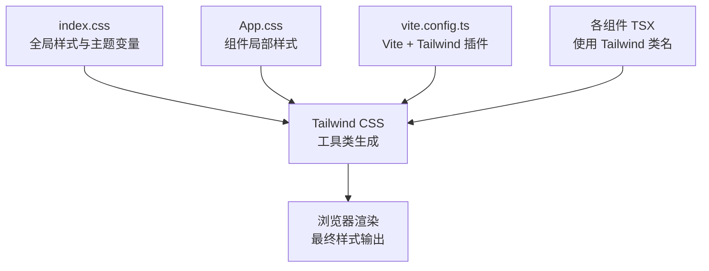
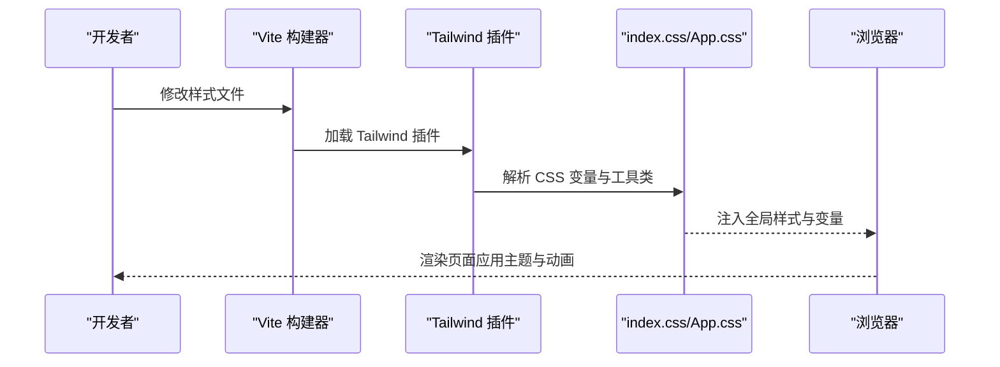
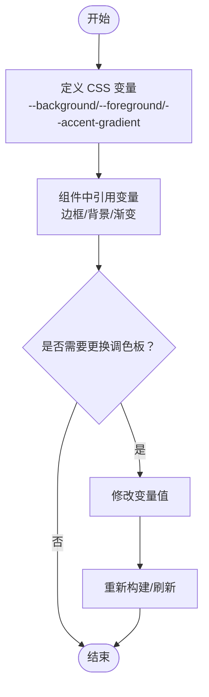
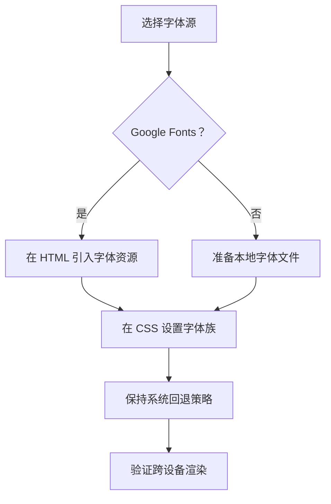
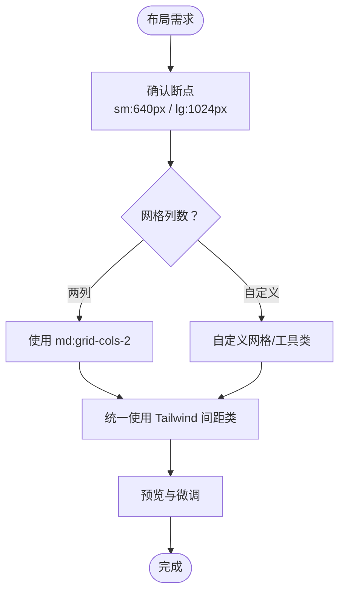
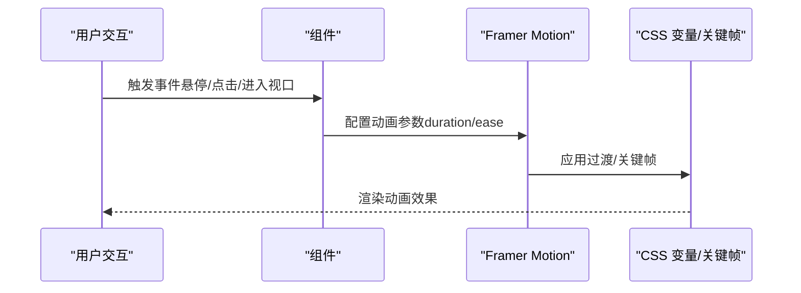
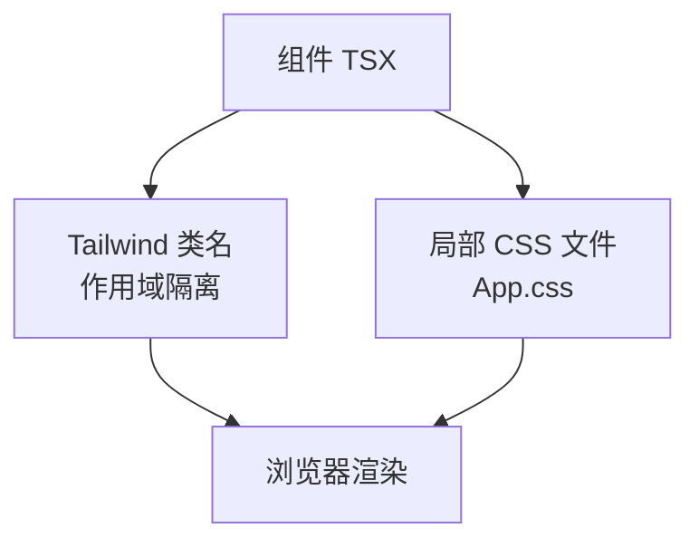
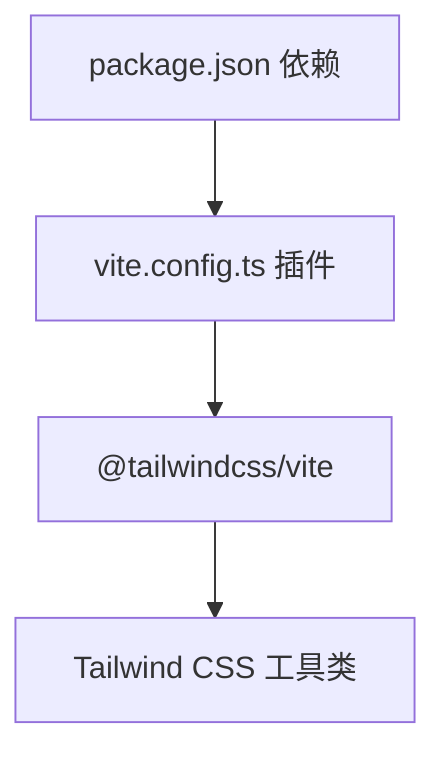

# 样式定制

<cite>
**本文引用的文件**
- [index.css](file://portfolio/src/index.css)
- [App.css](file://portfolio/src/App.css)
- [vite.config.ts](file://portfolio/vite.config.ts)
- [package.json](file://portfolio/package.json)
- [Header.tsx](file://portfolio/src/components/Header.tsx)
- [Hero.tsx](file://portfolio/src/components/Hero.tsx)
- [About.tsx](file://portfolio/src/components/About.tsx)
- [Projects.tsx](file://portfolio/src/components/Projects.tsx)
- [Contact.tsx](file://portfolio/src/components/Contact.tsx)
- [Footer.tsx](file://portfolio/src/components/Footer.tsx)
</cite>

## 目录
1. [引言](#引言)
2. [项目结构](#项目结构)
3. [核心组件](#核心组件)
4. [架构总览](#架构总览)
5. [详细组件分析](#详细组件分析)
6. [依赖分析](#依赖分析)
7. [性能考虑](#性能考虑)
8. [故障排除指南](#故障排除指南)
9. [结论](#结论)
10. [附录](#附录)

## 引言
本指南面向需要对 AIWs 项目进行样式定制的开发者，重点覆盖以下方面：
- 主题颜色系统：Tailwind CSS 配置、CSS 变量定义与颜色调色板管理
- 字体替换方案：Google Fonts 集成、本地字体加载与字体回退策略
- 布局调整方法：响应式断点修改、网格系统定制与间距系统优化
- 动画效果定制：过渡时间、缓动函数与关键帧动画
- 样式模块化与组件样式隔离策略
- 提供 Tailwind 类名使用指南与具体 CSS 示例路径

## 项目结构
该项目采用 React + TypeScript + Vite 构建，样式体系由 Tailwind CSS 与自定义 CSS 变量共同构成。关键样式入口与工具链如下：
- 入口样式：全局重置与主题变量定义位于 [index.css](file://portfolio/src/index.css)
- 组件级样式：通过 Tailwind 类名与局部 CSS（如 [App.css](file://portfolio/src/App.css)）实现
- 工具链：Vite 插件中启用 Tailwind CSS，见 [vite.config.ts](file://portfolio/vite.config.ts)
- 依赖：Tailwind CSS 与相关插件在 [package.json](file://portfolio/package.json) 中声明

**图表来源**
- [index.css:1-46](file://portfolio/src/index.css#L1-L46)
- [App.css:1-185](file://portfolio/src/App.css#L1-L185)
- [vite.config.ts:1-9](file://portfolio/vite.config.ts#L1-L9)

**章节来源**
- [index.css:1-46](file://portfolio/src/index.css#L1-L46)
- [vite.config.ts:1-9](file://portfolio/vite.config.ts#L1-L9)
- [package.json:1-37](file://portfolio/package.json#L1-L37)

## 核心组件
本节聚焦样式相关的三个层面：
- 主题颜色系统：基于 CSS 变量的深色主题与渐变色定义
- 字体系统：默认字体族与回退策略
- 动画与交互：Framer Motion 的过渡与关键帧动画

要点与示例路径：
- 深色主题变量与渐变背景：参考 [index.css:3-8](file://portfolio/src/index.css#L3-L8)
- 全局字体与回退策略：参考 [index.css:18-21](file://portfolio/src/index.css#L18-L21)
- 组件内渐变色与过渡：参考 [Header.tsx:71-76](file://portfolio/src/components/Header.tsx#L71-L76)、[Hero.tsx:21-26](file://portfolio/src/components/Hero.tsx#L21-L26)、[Projects.tsx:67-70](file://portfolio/src/components/Projects.tsx#L67-L70)
- 动画过渡参数：参考 [Header.tsx:52-60](file://portfolio/src/components/Header.tsx#L52-L60)、[Hero.tsx:16-18](file://portfolio/src/components/Hero.tsx#L16-L18)

**章节来源**
- [index.css:3-21](file://portfolio/src/index.css#L3-L21)
- [Header.tsx:52-76](file://portfolio/src/components/Header.tsx#L52-L76)
- [Hero.tsx:16-26](file://portfolio/src/components/Hero.tsx#L16-L26)
- [Projects.tsx:67-70](file://portfolio/src/components/Projects.tsx#L67-L70)

## 架构总览
下图展示了从源码到浏览器渲染的样式管线，强调 Tailwind 工具类与 CSS 变量的协作关系。

**图表来源**
- [vite.config.ts:1-9](file://portfolio/vite.config.ts#L1-L9)
- [index.css:1-46](file://portfolio/src/index.css#L1-L46)
- [App.css:1-185](file://portfolio/src/App.css#L1-L185)

## 详细组件分析

### 主题颜色系统与 CSS 变量
- 定义位置：根作用域变量集中于 [index.css:4-8](file://portfolio/src/index.css#L4-L8)，包含背景、前景与渐变色变量
- 使用位置：组件与局部样式广泛使用 CSS 变量，例如：
  - 对话框与按钮边框：参考 [App.css:5-17](file://portfolio/src/App.css#L5-L17)
  - 分割线与装饰：参考 [App.css:75-104](file://portfolio/src/App.css#L75-L104)
  - 渐变色文本与背景：参考 [Header.tsx:71-76](file://portfolio/src/components/Header.tsx#L71-L76)、[Hero.tsx:35-37](file://portfolio/src/components/Hero.tsx#L35-L37)
- 调色板建议：
  - 保持变量命名一致性（如 --accent、--accent-bg、--accent-border）
  - 将常用色值抽象为变量，便于统一修改
  - 渐变色优先使用变量，避免硬编码

**图表来源**
- [index.css:4-8](file://portfolio/src/index.css#L4-L8)
- [App.css:5-17](file://portfolio/src/App.css#L5-L17)
- [Header.tsx:71-76](file://portfolio/src/components/Header.tsx#L71-L76)
- [Hero.tsx:35-37](file://portfolio/src/components/Hero.tsx#L35-L37)

**章节来源**
- [index.css:4-8](file://portfolio/src/index.css#L4-L8)
- [App.css:5-17](file://portfolio/src/App.css#L5-L17)
- [Header.tsx:71-76](file://portfolio/src/components/Header.tsx#L71-L76)
- [Hero.tsx:35-37](file://portfolio/src/components/Hero.tsx#L35-L37)

### 字体替换与回退策略
- 默认字体族：参考 [index.css:18-21](file://portfolio/src/index.css#L18-L21)，包含 Inter 与多级回退
- Google Fonts 集成步骤（建议流程）：
  1) 在 HTML 中引入字体资源（如通过 public/index.html 或动态加载）
  2) 在 CSS 中设置字体族与字体权重
  3) 保持与现有回退策略一致，确保无字体闪烁与 FOIT
- 本地字体加载：
  - 将字体文件置于 public 目录，使用 @font-face 引入
  - 通过 CSS 变量或工具类统一切换字体族
- 回退策略：
  - 优先使用系统字体栈，保证跨平台一致性
  - 为关键文本保留高可读性回退

**图表来源**
- [index.css:18-21](file://portfolio/src/index.css#L18-L21)

**章节来源**
- [index.css:18-21](file://portfolio/src/index.css#L18-L21)

### 布局与响应式定制
- 响应式断点：项目使用 Tailwind 默认断点（sm: 640px、lg: 1024px），可在组件中直接使用
  - 示例：容器最大宽度与内边距在组件中使用 sm:、lg: 前缀控制
- 网格系统定制：
  - 使用 Tailwind 的 grid 列数与间距类（如 md:grid-cols-2、gap-8）
  - 如需自定义列宽，可通过 CSS Grid 或自定义工具类扩展
- 间距系统优化：
  - 优先使用 Tailwind 间距类（px-4、py-8 等）
  - 对于复杂布局，结合 CSS 变量统一管理间距基准

**图表来源**
- [Projects.tsx:58-64](file://portfolio/src/components/Projects.tsx#L58-L64)
- [About.tsx:57-63](file://portfolio/src/components/About.tsx#L57-L63)

**章节来源**
- [Projects.tsx:58-64](file://portfolio/src/components/Projects.tsx#L58-L64)
- [About.tsx:57-63](file://portfolio/src/components/About.tsx#L57-L63)

### 动画效果定制
- 过渡时间与缓动函数：
  - 组件中常见 duration 与 transition 配置，如 Header 的 300ms、Hero 的 0.5s
  - 可通过 CSS 变量统一管理过渡时长与缓动曲线
- 关键帧动画：
  - 使用 Framer Motion 的 animate/transition 控制关键帧
  - 对于复杂动画，可在 App.css 中定义关键帧并通过类名复用
- 示例路径：
  - Header 滚动态效与过渡：[Header.tsx:52-60](file://portfolio/src/components/Header.tsx#L52-L60)
  - Hero 子元素入场动画：[Hero.tsx:16-18](file://portfolio/src/components/Hero.tsx#L16-L18)
  - Footer 文案淡入：[Footer.tsx:21-23](file://portfolio/src/components/Footer.tsx#L21-L23)

**图表来源**
- [Header.tsx:52-60](file://portfolio/src/components/Header.tsx#L52-L60)
- [Hero.tsx:16-18](file://portfolio/src/components/Hero.tsx#L16-L18)
- [Footer.tsx:21-23](file://portfolio/src/components/Footer.tsx#L21-L23)

**章节来源**
- [Header.tsx:52-60](file://portfolio/src/components/Header.tsx#L52-L60)
- [Hero.tsx:16-18](file://portfolio/src/components/Hero.tsx#L16-L18)
- [Footer.tsx:21-23](file://portfolio/src/components/Footer.tsx#L21-L23)

### 样式模块化与组件隔离
- 组件样式隔离：
  - 使用 Tailwind 类名限定作用域，避免全局污染
  - 局部样式通过独立 CSS 文件（如 [App.css](file://portfolio/src/App.css)）管理
- 模块化策略：
  - 将通用样式抽离为工具类或变量，减少重复
  - 对组件内的动画与交互参数进行集中配置，便于统一维护

**图表来源**
- [App.css:1-185](file://portfolio/src/App.css#L1-L185)
- [Header.tsx:51-126](file://portfolio/src/components/Header.tsx#L51-L126)

**章节来源**
- [App.css:1-185](file://portfolio/src/App.css#L1-L185)
- [Header.tsx:51-126](file://portfolio/src/components/Header.tsx#L51-L126)

## 依赖分析
- 工具链依赖：Tailwind CSS 与 @tailwindcss/vite 插件在 [package.json:18-34](file://portfolio/package.json#L18-L34) 中声明
- 构建配置：Vite 启用 Tailwind 插件，见 [vite.config.ts:1-9](file://portfolio/vite.config.ts#L1-L9)

**图表来源**
- [package.json:18-34](file://portfolio/package.json#L18-L34)
- [vite.config.ts:1-9](file://portfolio/vite.config.ts#L1-L9)

**章节来源**
- [package.json:18-34](file://portfolio/package.json#L18-L34)
- [vite.config.ts:1-9](file://portfolio/vite.config.ts#L1-L9)

## 性能考虑
- 减少全局样式体积：优先使用 Tailwind 工具类，避免冗余 CSS
- 合理使用动画：控制动画数量与复杂度，避免影响滚动性能
- 字体优化：使用字体子集与回退策略，降低首屏渲染压力
- 构建优化：利用 Vite 的按需编译与 Tailwind 的摇树优化

## 故障排除指南
- 样式未生效：
  - 检查 Tailwind 插件是否正确启用（参考 [vite.config.ts](file://portfolio/vite.config.ts#L7)）
  - 确认 CSS 变量是否在 :root 中定义（参考 [index.css:4-8](file://portfolio/src/index.css#L4-L8)）
- 动画卡顿：
  - 降低动画复杂度或减少同时运行的动画数量
  - 使用 transform/opacity 等硬件加速属性（参考组件中的过渡配置）
- 字体渲染异常：
  - 确保字体回退链完整（参考 [index.css:18-21](file://portfolio/src/index.css#L18-L21)）
  - 若使用 Google Fonts，检查网络与跨域策略

**章节来源**
- [vite.config.ts](file://portfolio/vite.config.ts#L7)
- [index.css:4-8](file://portfolio/src/index.css#L4-L8)
- [index.css:18-21](file://portfolio/src/index.css#L18-L21)

## 结论
通过统一的 CSS 变量体系、Tailwind 工具类与组件化的样式组织，AIWs 项目实现了清晰的主题定制与良好的可维护性。建议在后续迭代中：
- 将常用颜色与字体族抽象为变量，集中管理
- 扩展网格与间距工具类，提升布局一致性
- 以 CSS 变量统一动画参数，便于主题切换与性能优化

## 附录
- Tailwind 类名使用建议：
  - 使用语义化前缀（如 bg-、text-、border-）与尺寸类（如 px-、py-、gap-）
  - 在组件内部尽量使用 sm:/lg: 断点类，避免全局样式污染
- CSS 示例路径参考：
  - 主题变量与全局样式：[index.css:3-21](file://portfolio/src/index.css#L3-L21)
  - 组件局部样式与变量使用：[App.css:5-17](file://portfolio/src/App.css#L5-L17)
  - 组件动画与渐变：[Header.tsx:71-76](file://portfolio/src/components/Header.tsx#L71-L76)、[Hero.tsx:21-26](file://portfolio/src/components/Hero.tsx#L21-L26)、[Projects.tsx:67-70](file://portfolio/src/components/Projects.tsx#L67-L70)