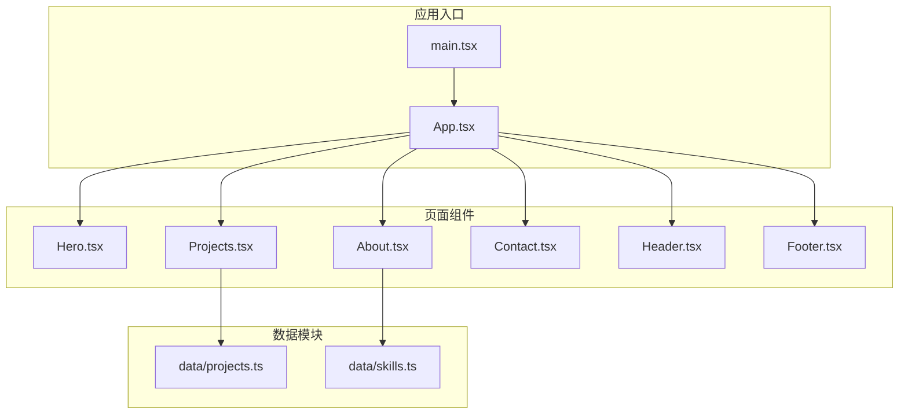
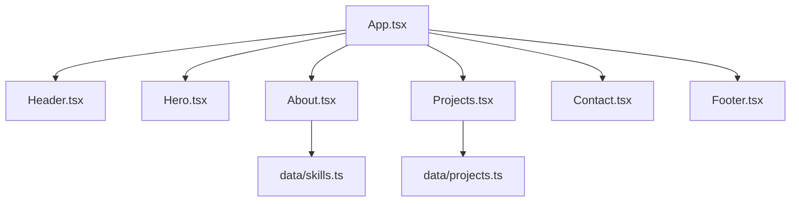
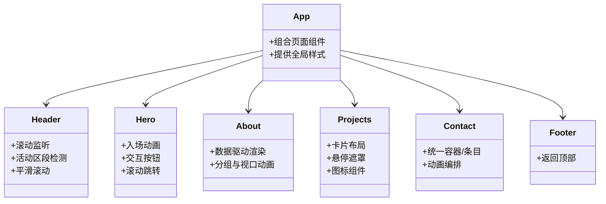
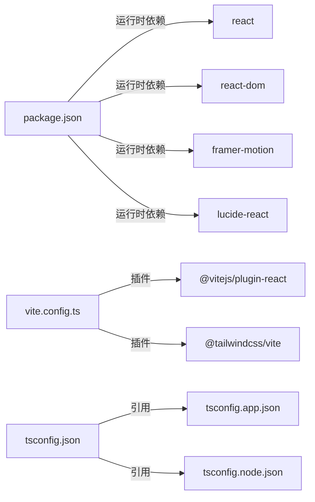

# 组件扩展

<cite>
**本文引用的文件**
- [App.tsx](file://portfolio/src/App.tsx)
- [Hero.tsx](file://portfolio/src/components/Hero.tsx)
- [About.tsx](file://portfolio/src/components/About.tsx)
- [Projects.tsx](file://portfolio/src/components/Projects.tsx)
- [Contact.tsx](file://portfolio/src/components/Contact.tsx)
- [Footer.tsx](file://portfolio/src/components/Footer.tsx)
- [Header.tsx](file://portfolio/src/components/Header.tsx)
- [projects.ts](file://portfolio/src/data/projects.ts)
- [skills.ts](file://portfolio/src/data/skills.ts)
- [package.json](file://portfolio/package.json)
- [vite.config.ts](file://portfolio/vite.config.ts)
- [tsconfig.json](file://portfolio/tsconfig.json)
- [README.md](file://portfolio/README.md)
</cite>

## 目录
1. [简介](#简介)
2. [项目结构](#项目结构)
3. [核心组件](#核心组件)
4. [架构总览](#架构总览)
5. [详细组件分析](#详细组件分析)
6. [依赖关系分析](#依赖关系分析)
7. [性能考量](#性能考量)
8. [故障排查指南](#故障排查指南)
9. [结论](#结论)
10. [附录：组件扩展实践清单](#附录：组件扩展实践清单)

## 简介
本指南面向希望在 AIWs 项目中新增页面组件的开发者，提供从“创建流程、命名规范、结构设计、导入导出”到“生命周期、状态管理、事件处理”的完整方法论；并结合现有 Hero、About、Projects 等页面组件，给出可直接复用的扩展模板与抽象化技巧，帮助你快速、安全地扩展组件生态。

## 项目结构
AIWs 使用 React + TypeScript + Vite 构建，采用按“功能域”组织的组件目录（src/components），数据通过独立模块（src/data）提供，入口在 src/main.tsx 中挂载到 DOM。

图示来源
- [App.tsx:1-28](file://portfolio/src/App.tsx#L1-L28)
- [Hero.tsx:1-142](file://portfolio/src/components/Hero.tsx#L1-L142)
- [About.tsx:1-151](file://portfolio/src/components/About.tsx#L1-L151)
- [Projects.tsx:1-151](file://portfolio/src/components/Projects.tsx#L1-L151)
- [Contact.tsx:1-149](file://portfolio/src/components/Contact.tsx#L1-L149)
- [Header.tsx:1-129](file://portfolio/src/components/Header.tsx#L1-L129)
- [Footer.tsx:1-48](file://portfolio/src/components/Footer.tsx#L1-L48)
- [projects.ts:1-49](file://portfolio/src/data/projects.ts#L1-L49)
- [skills.ts:1-39](file://portfolio/src/data/skills.ts#L1-L39)

章节来源
- [App.tsx:1-28](file://portfolio/src/App.tsx#L1-L28)
- [package.json:1-37](file://portfolio/package.json#L1-L37)
- [vite.config.ts:1-9](file://portfolio/vite.config.ts#L1-L9)
- [tsconfig.json:1-8](file://portfolio/tsconfig.json#L1-L8)

## 核心组件
- App.tsx：应用主容器，负责组合各页面组件并提供全局样式背景。
- Hero.tsx：首页大标题区域，演示动画、交互与滚动跳转。
- About.tsx：关于我区域，演示数据驱动渲染、分组与视口触发动画。
- Projects.tsx：项目展示区域，演示卡片布局、悬停遮罩与图标组件。
- Contact.tsx：联系方式区域，演示统一容器/条目变体的动画编排。
- Header.tsx：顶部导航，演示滚动监听、活动区段检测与平滑滚动。
- Footer.tsx：页脚，演示简单交互与返回顶部。

章节来源
- [App.tsx:1-28](file://portfolio/src/App.tsx#L1-L28)
- [Hero.tsx:1-142](file://portfolio/src/components/Hero.tsx#L1-L142)
- [About.tsx:1-151](file://portfolio/src/components/About.tsx#L1-L151)
- [Projects.tsx:1-151](file://portfolio/src/components/Projects.tsx#L1-L151)
- [Contact.tsx:1-149](file://portfolio/src/components/Contact.tsx#L1-L149)
- [Header.tsx:1-129](file://portfolio/src/components/Header.tsx#L1-L129)
- [Footer.tsx:1-48](file://portfolio/src/components/Footer.tsx#L1-L48)

## 架构总览
组件以“页面组件 + 数据模块”的方式解耦，App.tsx 作为组合器，Header/Navigation 与 Footer 提供横纵贯穿的横切关注点，页面组件通过 props 或数据模块注入内容。

图示来源
- [App.tsx:1-28](file://portfolio/src/App.tsx#L1-L28)
- [Header.tsx:1-129](file://portfolio/src/components/Header.tsx#L1-L129)
- [Hero.tsx:1-142](file://portfolio/src/components/Hero.tsx#L1-L142)
- [About.tsx:1-151](file://portfolio/src/components/About.tsx#L1-L151)
- [Projects.tsx:1-151](file://portfolio/src/components/Projects.tsx#L1-L151)
- [Contact.tsx:1-149](file://portfolio/src/components/Contact.tsx#L1-L149)
- [Footer.tsx:1-48](file://portfolio/src/components/Footer.tsx#L1-L48)
- [projects.ts:1-49](file://portfolio/src/data/projects.ts#L1-L49)
- [skills.ts:1-39](file://portfolio/src/data/skills.ts#L1-L39)

## 详细组件分析

### 页面组件通用结构与最佳实践
- 文件命名：采用帕斯卡命名（如 Hero.tsx），与组件名一致，便于 IDE 识别与导入。
- 导入导出：默认导出函数式组件，避免命名冲突；在 App.tsx 中集中引入并组合。
- 结构设计：
  - 外层容器：使用语义化 section 标签并配合 id，便于锚点跳转与无障碍访问。
  - 内容分区：标题、描述、列表/网格、CTA 等区块清晰分层。
  - 动画与交互：优先使用 framer-motion 的 whileInView/initial/animate 组合，确保首屏与滚动触发动画。
  - 响应式：使用 Tailwind 的 sm:、md:、lg: 前缀，保证在不同设备上的表现。
- 事件处理：
  - 使用 preventDefault 阻止默认行为，再通过原生 DOM API 实现平滑滚动。
  - 对外暴露的交互建议通过回调或事件冒泡向上层传递，而非直接操作 DOM。

章节来源
- [Hero.tsx:1-142](file://portfolio/src/components/Hero.tsx#L1-L142)
- [About.tsx:1-151](file://portfolio/src/components/About.tsx#L1-L151)
- [Projects.tsx:1-151](file://portfolio/src/components/Projects.tsx#L1-L151)
- [Contact.tsx:1-149](file://portfolio/src/components/Contact.tsx#L1-L149)
- [Header.tsx:1-129](file://portfolio/src/components/Header.tsx#L1-L129)
- [Footer.tsx:1-48](file://portfolio/src/components/Footer.tsx#L1-L48)

### 生命周期与状态管理
- Header.tsx 展示了滚动监听与活动区段检测的典型模式：
  - 使用 useEffect 注册 scroll 事件，在组件卸载时清理。
  - 使用 getBoundingClientRect 判断当前可见区域，更新 activeSection。
- Hero.tsx 展示了进入页面时的入场动画，适合在组件挂载时执行一次性动画。
- About.tsx/Projects.tsx/Contact.tsx 展示了“视口进入即动画”的模式，通过 whileInView 触发，viewport={{ once: true }} 避免重复触发。

章节来源
- [Header.tsx:20-41](file://portfolio/src/components/Header.tsx#L20-L41)
- [Hero.tsx:15-137](file://portfolio/src/components/Hero.tsx#L15-L137)
- [About.tsx:44-144](file://portfolio/src/components/About.tsx#L44-L144)
- [Projects.tsx:53-125](file://portfolio/src/components/Projects.tsx#L53-L125)
- [Contact.tsx:83-131](file://portfolio/src/components/Contact.tsx#L83-L131)

### 组件间通信模式
- Props 传递：页面组件之间通过 App.tsx 的组合关系进行串联，无需跨组件直接通信。
- Context 使用：若需要跨多层级共享主题、语言或用户态，可在 App.tsx 中引入 React Context 并在子树中消费。
- 事件冒泡：在交互层（如导航点击）通过 preventDefault + DOM API 实现平滑滚动，避免事件在组件树中过度上抛。

章节来源
- [App.tsx:1-28](file://portfolio/src/App.tsx#L1-L28)
- [Header.tsx:44-49](file://portfolio/src/components/Header.tsx#L44-L49)

### 数据驱动与抽象化
- 数据模块：skills.ts 与 projects.ts 将静态数据与组件解耦，便于维护与扩展。
- 抽象化技巧：
  - 将“容器 + 条目”的通用结构抽象为可复用的卡片组件（如项目卡片），减少重复代码。
  - 将动画变体（如 containerVariants/itemVariants）抽取为常量或工具函数，统一风格。
  - 将图标组件（如 ExternalLink、Github）作为变量传入，提升可配置性。

章节来源
- [skills.ts:1-39](file://portfolio/src/data/skills.ts#L1-L39)
- [projects.ts:1-49](file://portfolio/src/data/projects.ts#L1-L49)
- [About.tsx:10-35](file://portfolio/src/components/About.tsx#L10-L35)
- [Projects.tsx:10-27](file://portfolio/src/components/Projects.tsx#L10-L27)

### 新增页面组件的步骤与示例路径
- 步骤一：在 src/components 下新建组件文件（如 MyPage.tsx），采用帕斯卡命名。
- 步骤二：在 App.tsx 中引入并添加到渲染树中。
- 步骤三：在 src/data 下新增或复用数据模块，供组件读取。
- 步骤四：为新组件编写语义化 section + id，确保与导航联动。
- 示例参考路径（不展示具体代码）：
  - [Hero.tsx:1-142](file://portfolio/src/components/Hero.tsx#L1-L142)：演示动画、交互与滚动跳转
  - [About.tsx:1-151](file://portfolio/src/components/About.tsx#L1-L151)：演示数据驱动渲染、分组与视口触发动画
  - [Projects.tsx:1-151](file://portfolio/src/components/Projects.tsx#L1-L151)：演示卡片布局、悬停遮罩与图标组件
  - [Contact.tsx:1-149](file://portfolio/src/components/Contact.tsx#L1-L149)：演示统一容器/条目变体的动画编排
  - [Header.tsx:1-129](file://portfolio/src/components/Header.tsx#L1-L129)：演示滚动监听、活动区段检测与平滑滚动
  - [Footer.tsx:1-48](file://portfolio/src/components/Footer.tsx#L1-L48)：演示简单交互与返回顶部

章节来源
- [App.tsx:1-28](file://portfolio/src/App.tsx#L1-L28)
- [Hero.tsx:1-142](file://portfolio/src/components/Hero.tsx#L1-L142)
- [About.tsx:1-151](file://portfolio/src/components/About.tsx#L1-L151)
- [Projects.tsx:1-151](file://portfolio/src/components/Projects.tsx#L1-L151)
- [Contact.tsx:1-149](file://portfolio/src/components/Contact.tsx#L1-L149)
- [Header.tsx:1-129](file://portfolio/src/components/Header.tsx#L1-L129)
- [Footer.tsx:1-48](file://portfolio/src/components/Footer.tsx#L1-L48)

### 类图：页面组件关系

图示来源
- [App.tsx:1-28](file://portfolio/src/App.tsx#L1-L28)
- [Header.tsx:1-129](file://portfolio/src/components/Header.tsx#L1-L129)
- [Hero.tsx:1-142](file://portfolio/src/components/Hero.tsx#L1-L142)
- [About.tsx:1-151](file://portfolio/src/components/About.tsx#L1-L151)
- [Projects.tsx:1-151](file://portfolio/src/components/Projects.tsx#L1-L151)
- [Contact.tsx:1-149](file://portfolio/src/components/Contact.tsx#L1-L149)
- [Footer.tsx:1-48](file://portfolio/src/components/Footer.tsx#L1-L48)

## 依赖关系分析
- 运行时依赖：react、react-dom、framer-motion、lucide-react。
- 构建与开发：vite、@vitejs/plugin-react、@tailwindcss/vite、tailwindcss、typescript、eslint 等。
- 项目通过 vite.config.ts 启用 React 与 Tailwind 插件，tsconfig.json 通过 references 组织 app 与 node 两个 tsconfig。

图示来源
- [package.json:1-37](file://portfolio/package.json#L1-L37)
- [vite.config.ts:1-9](file://portfolio/vite.config.ts#L1-L9)
- [tsconfig.json:1-8](file://portfolio/tsconfig.json#L1-L8)

章节来源
- [package.json:1-37](file://portfolio/package.json#L1-L37)
- [vite.config.ts:1-9](file://portfolio/vite.config.ts#L1-L9)
- [tsconfig.json:1-8](file://portfolio/tsconfig.json#L1-L8)

## 性能考量
- 首屏体验：Hero 等首屏组件使用初始动画，建议控制动画数量与时长，避免阻塞渲染。
- 视口动画：About/Projects/Contact 使用 whileInView + viewport={{ once: true }}，减少重复计算。
- 滚动监听：Header 的滚动事件需在组件卸载时清理，避免内存泄漏。
- 图标与第三方库：lucide-react 为轻量图标库，按需引入即可；避免在高频渲染路径中重复创建对象。

章节来源
- [Hero.tsx:15-137](file://portfolio/src/components/Hero.tsx#L15-L137)
- [About.tsx:44-144](file://portfolio/src/components/About.tsx#L44-L144)
- [Projects.tsx:53-125](file://portfolio/src/components/Projects.tsx#L53-L125)
- [Contact.tsx:83-131](file://portfolio/src/components/Contact.tsx#L83-L131)
- [Header.tsx:20-41](file://portfolio/src/components/Header.tsx#L20-L41)

## 故障排查指南
- 动画不生效
  - 检查是否正确安装并引入 framer-motion。
  - 确认 whileInView 与 viewport 配置是否合理，必要时移除 once 或调整阈值。
- 滚动跳转无效
  - 确保目标元素存在且有正确的 id。
  - 检查 preventDefault 是否正确阻止默认行为。
- 图标不显示
  - 确认 lucide-react 已安装，且图标组件正确导入。
- 构建报错
  - 检查 package.json 中依赖版本与 Vite/Tailwind 插件兼容性。
  - 清理 node_modules 并重新安装依赖。

章节来源
- [package.json:12-17](file://portfolio/package.json#L12-L17)
- [Header.tsx:44-49](file://portfolio/src/components/Header.tsx#L44-L49)
- [Hero.tsx:68-91](file://portfolio/src/components/Hero.tsx#L68-L91)
- [Contact.tsx:93-129](file://portfolio/src/components/Contact.tsx#L93-L129)

## 结论
通过遵循本文档的命名规范、结构设计与状态/事件管理原则，并复用现有组件的动画与交互模式，你可以快速、稳定地在 AIWs 项目中新增页面组件。同时，将数据与组件解耦、抽象通用结构与动画变体，有助于长期维护与团队协作。

## 附录：组件扩展实践清单
- 创建组件文件：在 src/components 下新建 MyPage.tsx，采用帕斯卡命名。
- 组合到 App.tsx：在 App.tsx 中引入并添加到渲染树。
- 设计结构：section + id + 语义化内容分区。
- 引入动画：优先使用 whileInView/initial/animate，控制 viewport 与 once。
- 引入数据：在 src/data 下新增或复用数据模块，组件内读取。
- 交互处理：使用 preventDefault + DOM API 实现平滑滚动。
- 响应式设计：使用 Tailwind 前缀适配多端。
- 性能优化：避免在渲染路径中创建不必要的对象，清理滚动监听。
- 测试与调试：在本地开发环境验证动画与交互，必要时使用浏览器开发者工具检查事件绑定与 DOM 结构。