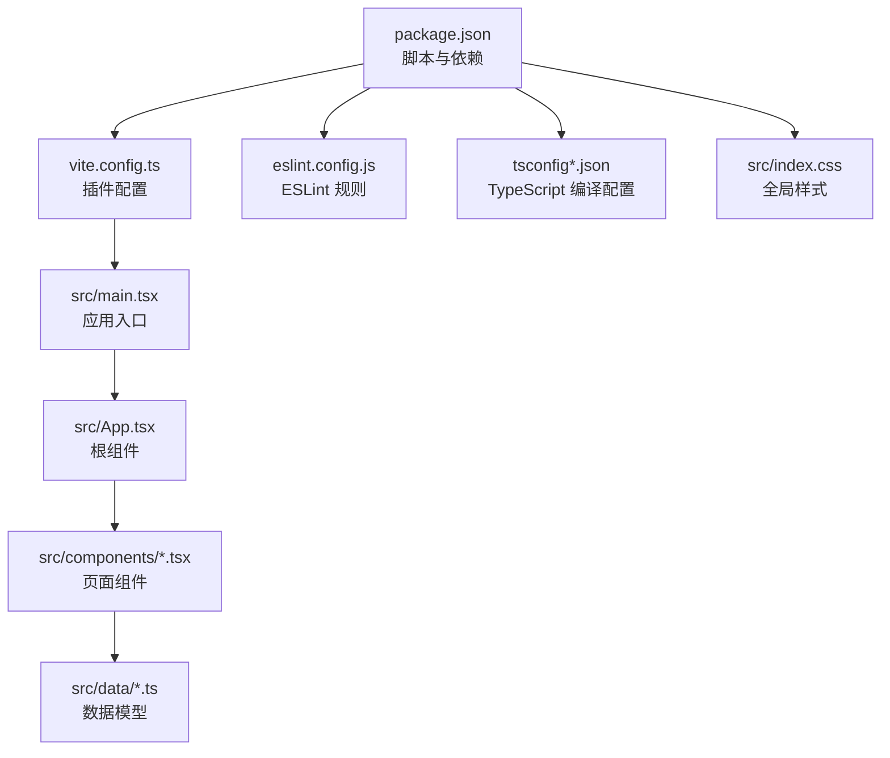
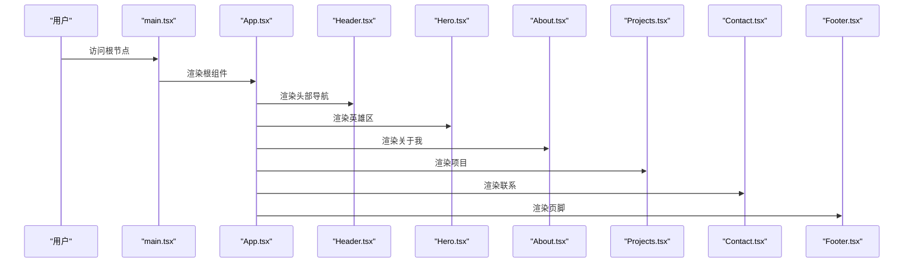
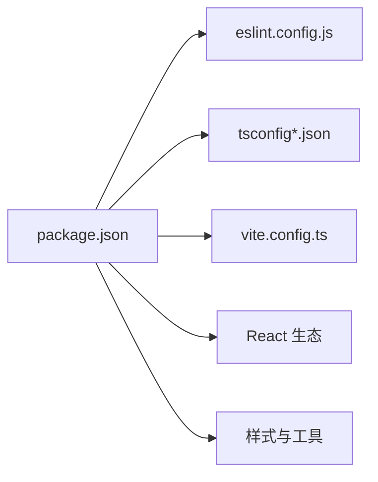

# 代码规范

<cite>
**本文引用的文件**
- [eslint.config.js](file://portfolio/eslint.config.js)
- [package.json](file://portfolio/package.json)
- [tsconfig.json](file://portfolio/tsconfig.json)
- [tsconfig.app.json](file://portfolio/tsconfig.app.json)
- [tsconfig.node.json](file://portfolio/tsconfig.node.json)
- [vite.config.ts](file://portfolio/vite.config.ts)
- [index.css](file://portfolio/src/index.css)
- [main.tsx](file://portfolio/src/main.tsx)
- [App.tsx](file://portfolio/src/App.tsx)
- [Header.tsx](file://portfolio/src/components/Header.tsx)
- [Hero.tsx](file://portfolio/src/components/Hero.tsx)
- [About.tsx](file://portfolio/src/components/About.tsx)
- [Projects.tsx](file://portfolio/src/components/Projects.tsx)
- [Contact.tsx](file://portfolio/src/components/Contact.tsx)
- [Footer.tsx](file://portfolio/src/components/Footer.tsx)
- [projects.ts](file://portfolio/src/data/projects.ts)
- [skills.ts](file://portfolio/src/data/skills.ts)
</cite>

## 目录
1. [引言](#引言)
2. [项目结构](#项目结构)
3. [核心组件](#核心组件)
4. [架构总览](#架构总览)
5. [详细组件分析](#详细组件分析)
6. [依赖关系分析](#依赖关系分析)
7. [性能考量](#性能考量)
8. [故障排查指南](#故障排查指南)
9. [结论](#结论)
10. [附录](#附录)

## 引言
本文件为 AIWs 项目的代码规范文档，聚焦于 ESLint 规则与 TypeScript 类型定义标准、命名约定、代码格式化、注释规范与最佳实践；同时覆盖 React 组件编写规范（函数组件、Hook 使用、Props 类型定义与状态管理模式）、代码审查清单与质量保证流程、IDE 推荐配置与自动格式化设置，以及错误处理与异常管理规范。内容以仓库现有实现为依据，结合可推广的最佳实践进行总结。

## 项目结构
项目采用 Vite + React + TypeScript 的现代前端工程化结构，TypeScript 通过多配置文件分层管理应用与 Node 环境编译选项；ESLint 作为统一的静态检查工具，配合 React Hooks 与 React Refresh 插件保障开发体验与代码质量；TailwindCSS 提供原子化样式基础，全局样式集中于入口 CSS 文件。

图示来源
- [package.json:1-37](file://portfolio/package.json#L1-L37)
- [vite.config.ts:1-9](file://portfolio/vite.config.ts#L1-L9)
- [main.tsx:1-12](file://portfolio/src/main.tsx#L1-L12)
- [App.tsx:1-28](file://portfolio/src/App.tsx#L1-L28)
- [eslint.config.js:1-24](file://portfolio/eslint.config.js#L1-L24)
- [tsconfig.json:1-8](file://portfolio/tsconfig.json#L1-L8)
- [index.css:1-46](file://portfolio/src/index.css#L1-L46)

章节来源
- [package.json:1-37](file://portfolio/package.json#L1-L37)
- [vite.config.ts:1-9](file://portfolio/vite.config.ts#L1-L9)
- [main.tsx:1-12](file://portfolio/src/main.tsx#L1-L12)
- [App.tsx:1-28](file://portfolio/src/App.tsx#L1-L28)
- [eslint.config.js:1-24](file://portfolio/eslint.config.js#L1-L24)
- [tsconfig.json:1-8](file://portfolio/tsconfig.json#L1-L8)
- [index.css:1-46](file://portfolio/src/index.css#L1-L46)

## 核心组件
- ESLint 配置：启用推荐规则集、React Hooks 推荐规则、React Refresh Vite 支持，并限定仅对 ts/tsx 文件生效，全局忽略 dist 目录。
- TypeScript 配置：采用复合配置（references）拆分应用与 Node 环境，开启严格未使用检测与 switch 无穿透检测，JSX 使用 react-jsx。
- 构建与运行：dev/build/lint/preview 脚本，构建链路先执行 tsc -b 再走 Vite 打包，lint 调用 ESLint 对项目全量扫描。
- 样式体系：TailwindCSS 作为基础，全局深色主题变量与自定义滚动条、选中样式等统一风格。

章节来源
- [eslint.config.js:8-23](file://portfolio/eslint.config.js#L8-L23)
- [tsconfig.json:3-6](file://portfolio/tsconfig.json#L3-L6)
- [tsconfig.app.json:18-22](file://portfolio/tsconfig.app.json#L18-L22)
- [tsconfig.node.json:17-21](file://portfolio/tsconfig.node.json#L17-L21)
- [package.json:6-11](file://portfolio/package.json#L6-L11)
- [index.css:1-46](file://portfolio/src/index.css#L1-L46)

## 架构总览
下图展示从入口到组件的数据与控制流，以及样式与构建链路：

图示来源
- [main.tsx:6-11](file://portfolio/src/main.tsx#L6-L11)
- [App.tsx:1-28](file://portfolio/src/App.tsx#L1-L28)
- [Header.tsx:16-128](file://portfolio/src/components/Header.tsx#L16-L128)
- [Hero.tsx:7-141](file://portfolio/src/components/Hero.tsx#L7-L141)
- [About.tsx:8-150](file://portfolio/src/components/About.tsx#L8-L150)
- [Projects.tsx:9-150](file://portfolio/src/components/Projects.tsx#L9-L150)
- [Contact.tsx:8-148](file://portfolio/src/components/Contact.tsx#L8-L148)
- [Footer.tsx:8-47](file://portfolio/src/components/Footer.tsx#L8-L47)

## 详细组件分析

### ESLint 配置与规则
- 规则范围：仅对 ts/tsx 文件生效，避免对生成产物与第三方库误报。
- 推荐规则：继承 @eslint/js 与 typescript-eslint 的推荐规则，确保基础语法与类型安全。
- React 生态：启用 React Hooks 推荐规则与 React Refresh 的 Vite 集成，提升 Hook 使用正确性与热更新稳定性。
- 语言环境：浏览器全局变量启用，便于 DOM 相关 API 的静态检查。
- 忽略策略：全局忽略 dist 输出目录，减少无关文件扫描。

章节来源
- [eslint.config.js:8-23](file://portfolio/eslint.config.js#L8-L23)

### TypeScript 类型定义与配置
- 复合配置：通过 references 将应用与 Node 环境配置解耦，分别管理编译目标、模块解析与 JSX 行为。
- 严格未使用检测：开启 noUnusedLocals/noUnusedParameters，降低冗余代码与潜在逻辑陷阱。
- switch 无穿透：开启 noFallthroughCasesInSwitch，避免遗漏 break 导致的逻辑分支错误。
- JSX 与模块解析：应用侧使用 react-jsx，Node 侧禁用 emit，均采用 bundler 模式与 verbatimModuleSyntax，确保与 Vite/打包器兼容。
- 类型声明：数据模型统一导出接口与常量数组，便于组件消费与 IDE 类型推断。

章节来源
- [tsconfig.json:3-6](file://portfolio/tsconfig.json#L3-L6)
- [tsconfig.app.json:18-22](file://portfolio/tsconfig.app.json#L18-L22)
- [tsconfig.node.json:17-21](file://portfolio/tsconfig.node.json#L17-L21)
- [projects.ts:2-10](file://portfolio/src/data/projects.ts#L2-L10)
- [skills.ts:2-6](file://portfolio/src/data/skills.ts#L2-L6)

### React 组件编写规范
- 函数组件优先：所有页面组件采用函数组件，保持简洁与可读性。
- Hook 使用：
  - 事件监听与清理：在 Header 中使用 useEffect 注册/注销滚动事件，避免内存泄漏。
  - 交互行为：Hero/Projects/About/Contact/Footer 中广泛使用 Framer Motion 的 whileHover/whileTap/viewport 动画钩子，增强交互体验。
- Props 类型定义：
  - 数据模型：projects.ts 与 skills.ts 明确定义接口与枚举联合类型，组件直接消费，避免隐式 any。
  - 组件间传递：App 组合多个页面组件，组件内部不跨层级共享状态，保持单向数据流。
- 状态管理模式：
  - 本地状态：Header 使用 useState 管理滚动态与活动区域，逻辑简单且局部化。
  - 外部状态：组件间无 Redux/Pinia 等状态库，通过 props 与事件回调传递，符合小型项目规模。
- 无障碍与可访问性：组件内使用语义化标签与可聚焦元素，图标使用 SVG，具备替代文本能力。

章节来源
- [Header.tsx:16-41](file://portfolio/src/components/Header.tsx#L16-L41)
- [Hero.tsx:7-141](file://portfolio/src/components/Hero.tsx#L7-L141)
- [About.tsx:8-150](file://portfolio/src/components/About.tsx#L8-L150)
- [Projects.tsx:9-150](file://portfolio/src/components/Projects.tsx#L9-L150)
- [Contact.tsx:8-148](file://portfolio/src/components/Contact.tsx#L8-L148)
- [Footer.tsx:8-47](file://portfolio/src/components/Footer.tsx#L8-L47)
- [projects.ts:2-10](file://portfolio/src/data/projects.ts#L2-L10)
- [skills.ts:2-6](file://portfolio/src/data/skills.ts#L2-L6)

### 数据模型与消费
- 项目数据模型：统一导出接口与数据数组，组件通过导入直接使用，类型安全且易于扩展。
- 技能数据模型：定义技能接口与分类映射，组件按类别聚合展示，利于后续筛选与排序。

章节来源
- [projects.ts:12-48](file://portfolio/src/data/projects.ts#L12-L48)
- [skills.ts:8-31](file://portfolio/src/data/skills.ts#L8-L31)

### 样式与主题
- Tailwind 原子化：组件类名遵循 Tailwind 命名，颜色与间距统一使用主题变量与渐变。
- 全局样式：index.css 定义深色主题变量、滚动行为、滚动条与选中文本样式，确保整体一致性。
- 动画与过渡：组件广泛使用 Framer Motion 的布局动画与过渡属性，提升交互质感。

章节来源
- [index.css:1-46](file://portfolio/src/index.css#L1-L46)
- [Header.tsx:51-126](file://portfolio/src/components/Header.tsx#L51-L126)
- [Hero.tsx:14-139](file://portfolio/src/components/Hero.tsx#L14-L139)
- [About.tsx:43-148](file://portfolio/src/components/About.tsx#L43-L148)
- [Projects.tsx:29-149](file://portfolio/src/components/Projects.tsx#L29-L149)
- [Contact.tsx:59-146](file://portfolio/src/components/Contact.tsx#L59-L146)
- [Footer.tsx:15-45](file://portfolio/src/components/Footer.tsx#L15-L45)

### 错误处理与异常管理
- DOM 查询与滚动：各组件在滚动与锚点跳转前进行存在性判断，避免空引用导致的异常。
- 外链打开：Contact 组件根据链接协议动态设置 target 与 rel，防止新窗口打开风险。
- 生命周期清理：Header 在 useEffect 中注册/注销滚动事件，避免重复绑定与内存泄漏。
- 可视区域检测：Header 使用 getBoundingClientRect 判断当前可见区域，注意在组件卸载前清理事件。

章节来源
- [Header.tsx:20-41](file://portfolio/src/components/Header.tsx#L20-L41)
- [Hero.tsx:68-91](file://portfolio/src/components/Hero.tsx#L68-L91)
- [Contact.tsx:90-98](file://portfolio/src/components/Contact.tsx#L90-L98)

## 依赖关系分析
- 运行时依赖：React 19、React DOM、Framer Motion、Lucide React。
- 开发依赖：ESLint、React 插件、React Hooks 插件、React Refresh 插件、TypeScript 与 TypeScript ESLint、TailwindCSS、Vite。
- 构建链路：先 tsc -b 生成类型检查与增量信息，再由 Vite 执行打包与预览。

图示来源
- [package.json:12-35](file://portfolio/package.json#L12-L35)
- [eslint.config.js:1-24](file://portfolio/eslint.config.js#L1-L24)
- [tsconfig.json:1-8](file://portfolio/tsconfig.json#L1-L8)
- [vite.config.ts:1-9](file://portfolio/vite.config.ts#L1-L9)

章节来源
- [package.json:12-35](file://portfolio/package.json#L12-L35)
- [vite.config.ts:6-8](file://portfolio/vite.config.ts#L6-L8)

## 性能考量
- 动画与渲染：组件大量使用 Framer Motion 的 viewport 与 layoutId 等特性，建议在大数据量场景下谨慎使用，避免不必要的重排与重绘。
- 事件监听：Header 的滚动事件需注意节流/防抖策略，避免高频触发导致性能问题。
- 懒加载与分割：对于大型组件或图片资源，可考虑按需加载与资源分割，减少首屏负担。
- 样式体积：Tailwind 原子化样式在生产环境可通过 Purge/Tree-shaking 控制体积，确保仅保留使用到的类名。

## 故障排查指南
- ESLint 报错：优先检查文件是否匹配 ts/tsx 扩展名，确认规则已正确继承；若出现与 Vite/TSX 不兼容的规则，可在项目规则中进行覆盖或忽略。
- TypeScript 未使用告警：针对 noUnusedLocals/noUnusedParameters 的告警，确认变量是否确实未使用；如为框架/插件注入的变量，可考虑在 tsconfig 中调整。
- 构建失败：先执行 tsc -b 检查类型错误，再执行 vite build；若样式相关问题，检查 Tailwind 配置与版本兼容性。
- 动画异常：若 Framer Motion 动画不生效，检查 viewport、layoutId 与容器尺寸变化；确保组件在可见区域时才触发动画。
- 交互异常：滚动跳转失效时，检查锚点 ID 与查询选择器；外链打开异常时，确认 target 与 rel 条件分支。

章节来源
- [eslint.config.js:10-17](file://portfolio/eslint.config.js#L10-L17)
- [tsconfig.app.json:18-22](file://portfolio/tsconfig.app.json#L18-L22)
- [Header.tsx:20-41](file://portfolio/src/components/Header.tsx#L20-L41)
- [Contact.tsx:90-98](file://portfolio/src/components/Contact.tsx#L90-L98)

## 结论
本项目在 ESLint、TypeScript 与 React 生态上建立了清晰的规范基线，配合 TailwindCSS 与 Framer Motion 实现了良好的开发体验与视觉表现。建议在后续迭代中持续完善测试与自动化流程，强化可访问性与性能监控，以进一步提升代码质量与用户体验。

## 附录

### 代码审查清单
- 规范性
  - 是否使用函数组件与 Hooks？
  - 是否显式声明 Props 类型与默认值？
  - 是否避免未使用的局部变量与参数？
  - 是否遵循一致的命名约定（组件、变量、常量）？
- 可维护性
  - 是否拆分过大的组件？是否存在重复逻辑？
  - 是否使用类型安全的 DOM 查询与事件处理？
  - 是否在 useEffect 中正确注册/清理副作用？
- 可访问性
  - 是否使用语义化标签与可聚焦元素？
  - 图标与图片是否提供替代文本？
- 性能
  - 是否在高频事件中使用节流/防抖？
  - 是否避免不必要的重渲染与大对象深拷贝？
- 测试与质量
  - 是否补充单元测试与集成测试？
  - 是否通过 lint 与类型检查？

### 最佳实践与反面案例对比（示例路径）
- 正面案例：组件内使用 useState 管理本地状态，useEffect 注册/清理事件，避免全局污染。
  - 参考路径：[Header.tsx:16-41](file://portfolio/src/components/Header.tsx#L16-L41)
- 反面案例：直接使用隐式 any 或未声明类型，导致类型检查失效。
  - 参考路径：[projects.ts:2-10](file://portfolio/src/data/projects.ts#L2-L10)（应与消费处保持类型一致）
- 正面案例：数据模型统一导出接口与常量数组，组件直接消费。
  - 参考路径：[skills.ts:8-31](file://portfolio/src/data/skills.ts#L8-L31)
- 反面案例：在 useEffect 中忘记清理事件监听，导致重复绑定与内存泄漏。
  - 参考路径：[Header.tsx:39-41](file://portfolio/src/components/Header.tsx#L39-L41)

### IDE 配置与自动格式化建议
- VS Code 推荐扩展
  - ESLint、Tailwind CSS IntelliSense、TypeScript Importer、Bracket Pair Colorizer
- 设置要点
  - 启用 Editor: Format On Save，绑定 ESLint 为默认格式化工具
  - 设置 TypeScript 编译器为 tsserver，启用“在编辑器中即时类型检查”
  - Tailwind CSS IntelliSense 启用 postcss.config.js 与 tailwind.config.js（如存在）
- Vite/Tailwind 集成
  - 保持 vite.config.ts 中的插件配置，确保开发时热更新与样式生效

### 错误处理与异常管理规范
- DOM 查询与滚动：在使用 querySelector/document.getElementById 前进行存在性判断。
- 外链打开：根据链接协议动态设置 target 与 rel，防止新窗口打开风险。
- 生命周期清理：在 useEffect 中返回清理函数，移除事件监听与定时器。
- 可视区域检测：使用 getBoundingClientRect 判断元素可见性，注意组件卸载后的状态更新防护。

章节来源
- [Header.tsx:20-41](file://portfolio/src/components/Header.tsx#L20-L41)
- [Contact.tsx:90-98](file://portfolio/src/components/Contact.tsx#L90-L98)