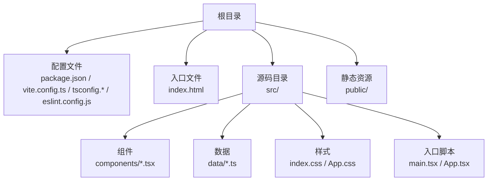
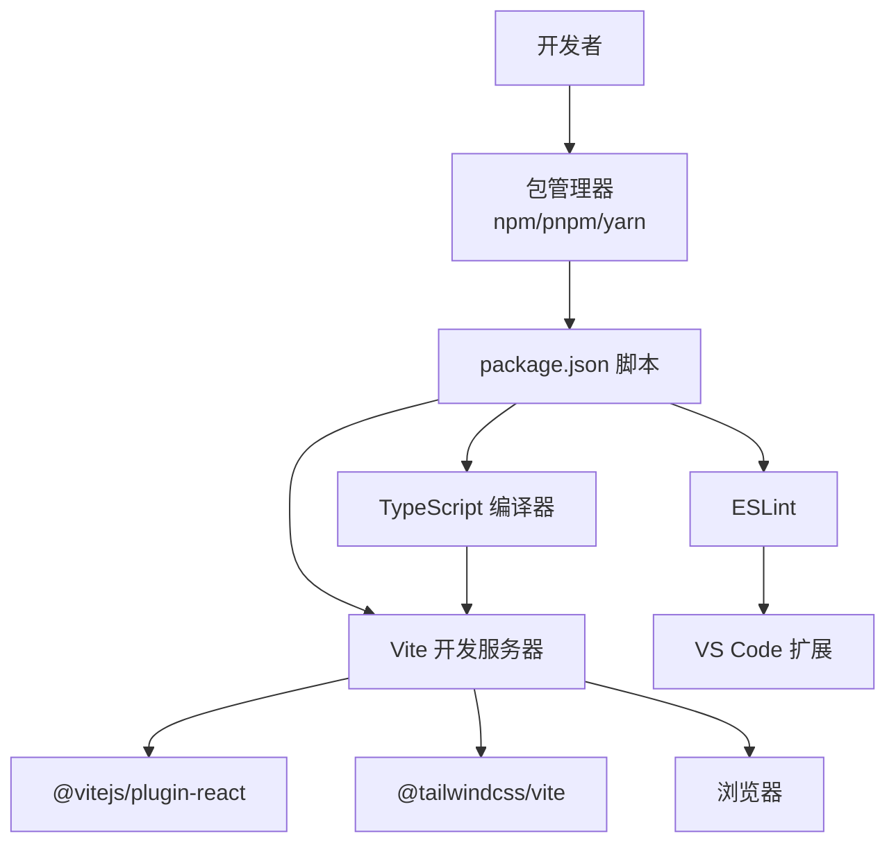
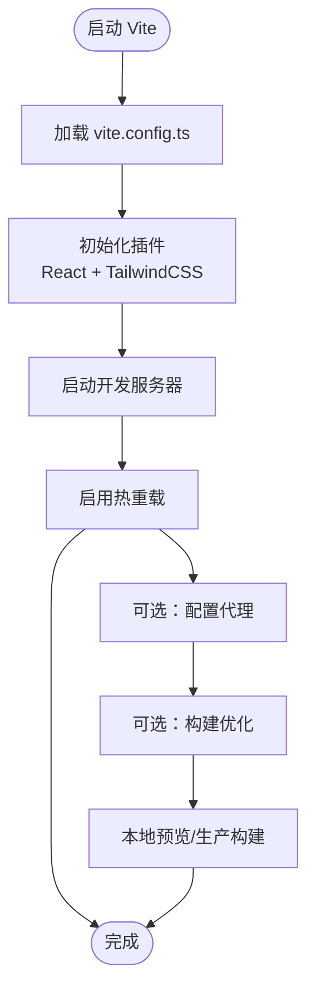
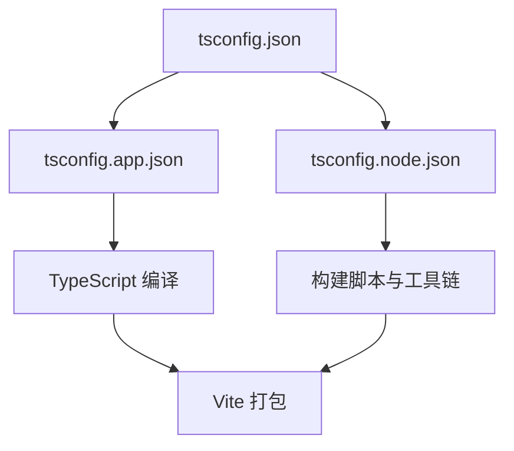
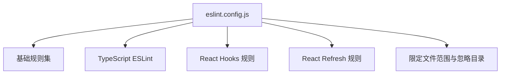
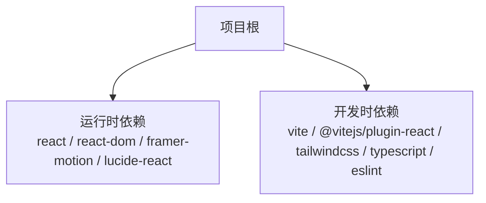

# 开发环境配置

<cite>
**本文引用的文件**
- [package.json](file://portfolio/package.json)
- [vite.config.ts](file://portfolio/vite.config.ts)
- [eslint.config.js](file://portfolio/eslint.config.js)
- [tsconfig.json](file://portfolio/tsconfig.json)
- [tsconfig.app.json](file://portfolio/tsconfig.app.json)
- [tsconfig.node.json](file://portfolio/tsconfig.node.json)
- [index.html](file://portfolio/index.html)
- [README.md](file://portfolio/README.md)
- [.gitignore](file://portfolio/.gitignore)
- [src/main.tsx](file://portfolio/src/main.tsx)
- [src/App.tsx](file://portfolio/src/App.tsx)
- [src/index.css](file://portfolio/src/index.css)
</cite>

## 目录
1. [简介](#简介)
2. [项目结构](#项目结构)
3. [核心组件](#核心组件)
4. [架构总览](#架构总览)
5. [详细组件分析](#详细组件分析)
6. [依赖分析](#依赖分析)
7. [性能考虑](#性能考虑)
8. [故障排查指南](#故障排查指南)
9. [结论](#结论)
10. [附录](#附录)

## 简介
本文件面向参与 AIWs 项目的开发者，提供从零到一的开发环境搭建与配置说明，覆盖以下主题：
- Node.js 版本要求与包管理器选择
- 依赖安装与脚本命令
- Vite 开发服务器配置（热重载、代理、构建优化）
- IDE 推荐配置（VS Code 扩展、插件设置、调试配置）
- 环境变量与配置文件结构
- 常见问题排查与多环境部署示例

## 项目结构
该仓库为一个基于 React + TypeScript + Vite 的前端项目，采用分层与功能模块化组织：
- 根目录包含构建与开发相关配置文件（package.json、vite.config.ts、tsconfig.*、eslint.config.js）以及入口 HTML 文件
- 源码位于 src 目录，按功能拆分为组件、数据与样式资源
- public 目录用于存放静态资源（如 favicon）

**章节来源**
- [package.json:1-37](file://portfolio/package.json#L1-L37)
- [vite.config.ts:1-9](file://portfolio/vite.config.ts#L1-L9)
- [tsconfig.json:1-8](file://portfolio/tsconfig.json#L1-L8)
- [tsconfig.app.json:1-26](file://portfolio/tsconfig.app.json#L1-L26)
- [tsconfig.node.json:1-25](file://portfolio/tsconfig.node.json#L1-L25)
- [index.html:1-14](file://portfolio/index.html#L1-L14)

## 核心组件
本节聚焦开发环境的关键配置与工具链，帮助快速建立一致的本地开发体验。

- Node.js 与包管理器
  - 项目使用 ES 模块与现代 TypeScript 配置，建议使用较新稳定版 Node.js（具体版本以项目依赖与 CI 要求为准）。推荐使用 npm 作为默认包管理器；若团队偏好 pnpm 或 yarn，可按需切换，但需确保锁文件与安装行为一致。
  - 安装依赖：执行包管理器的安装命令后，即可运行开发脚本。

- 构建与开发脚本
  - 开发：启动 Vite 开发服务器，支持热重载与类型检查提示
  - 预览：本地预览生产构建
  - 构建：先进行 TypeScript 编译，再由 Vite 打包
  - 代码质量：运行 ESLint 进行规则检查

- TypeScript 配置
  - 使用复合项目结构，分别针对应用与 Node 工具链配置编译目标、模块解析策略与语言特性
  - 通过 bundler 模式提升打包兼容性，并启用严格未使用项检查等规则

- ESLint 配置
  - 采用扁平化配置风格，集成 React Hooks、React Refresh 与 TypeScript ESLint 规则集
  - 支持忽略 dist 输出目录，限定对 TS/TSX 文件生效

- Vite 配置
  - 默认启用 React 插件与 TailwindCSS 插件，满足开发与样式需求
  - 可在现有基础上扩展代理、构建优化与环境变量注入等能力

**章节来源**
- [package.json:6-11](file://portfolio/package.json#L6-L11)
- [package.json:12-35](file://portfolio/package.json#L12-L35)
- [tsconfig.json:1-8](file://portfolio/tsconfig.json#L1-L8)
- [tsconfig.app.json:1-26](file://portfolio/tsconfig.app.json#L1-L26)
- [tsconfig.node.json:1-25](file://portfolio/tsconfig.node.json#L1-L25)
- [eslint.config.js:1-24](file://portfolio/eslint.config.js#L1-L24)
- [vite.config.ts:1-9](file://portfolio/vite.config.ts#L1-L9)

## 架构总览
下图展示了从开发到构建的关键流程与工具交互关系：

**图表来源**
- [package.json:6-11](file://portfolio/package.json#L6-L11)
- [vite.config.ts:6-8](file://portfolio/vite.config.ts#L6-L8)
- [eslint.config.js:8-23](file://portfolio/eslint.config.js#L8-L23)

**章节来源**
- [package.json:6-11](file://portfolio/package.json#L6-L11)
- [vite.config.ts:6-8](file://portfolio/vite.config.ts#L6-L8)
- [eslint.config.js:8-23](file://portfolio/eslint.config.js#L8-L23)

## 详细组件分析

### Vite 开发服务器配置
- 插件体系
  - React 插件：提供 JSX 转换与开发时优化
  - TailwindCSS 插件：集成样式扫描与按需生成
- 热重载
  - Vite 默认启用模块热替换，无需额外配置即可实现组件级刷新
- 代理设置
  - 如需代理后端接口，请在 Vite 配置中添加代理规则，指向开发阶段的服务地址
- 构建优化
  - 可通过 Vite 的 rollupOptions、build.sourcemap 等选项进行产物体积与调试信息控制
  - 结合 TypeScript 的严格模式与 ESLint 规则，减少运行时错误与冗余代码

**图表来源**
- [vite.config.ts:1-9](file://portfolio/vite.config.ts#L1-L9)

**章节来源**
- [vite.config.ts:1-9](file://portfolio/vite.config.ts#L1-L9)

### TypeScript 配置与类型检查
- 复合项目结构
  - app 配置面向浏览器端应用，启用 JSX、严格未使用项检查与 bundler 模式
  - node 配置面向构建脚本与工具链，启用 Node 类型与 bundler 模式
- 语言特性
  - 目标与库：ES2023 + DOM/Iteratable
  - 模块解析：bundler 模式，支持 TS 扩展名导入与显式模块语法
- 与 ESLint 协作
  - 通过 tsconfig 引用与 parserOptions，使 ESLint 能感知项目类型定义，启用类型感知规则

**图表来源**
- [tsconfig.json:1-8](file://portfolio/tsconfig.json#L1-L8)
- [tsconfig.app.json:1-26](file://portfolio/tsconfig.app.json#L1-L26)
- [tsconfig.node.json:1-25](file://portfolio/tsconfig.node.json#L1-L25)

**章节来源**
- [tsconfig.json:1-8](file://portfolio/tsconfig.json#L1-L8)
- [tsconfig.app.json:1-26](file://portfolio/tsconfig.app.json#L1-L26)
- [tsconfig.node.json:1-25](file://portfolio/tsconfig.node.json#L1-L25)

### ESLint 配置与代码质量
- 扁平化配置
  - 使用 defineConfig 与数组形式组合基础规则、TypeScript ESLint、React Hooks 与 React Refresh 规则
- 忽略与范围
  - 忽略 dist 输出目录，仅对 TS/TSX 文件生效
- 与编辑器联动
  - VS Code 中安装 ESLint 扩展，可实时显示问题并自动修复（在允许范围内）

**图表来源**
- [eslint.config.js:1-24](file://portfolio/eslint.config.js#L1-L24)

**章节来源**
- [eslint.config.js:1-24](file://portfolio/eslint.config.js#L1-L24)

### IDE 推荐配置（VS Code）
- 扩展推荐
  - ESLint：实时校验与修复
  - Tailwind CSS IntelliSense：智能补全与颜色预览
  - TypeScript Importer：自动导入与类型推断
  - Prettier：格式化统一
- 设置要点
  - 启用 ESLint 自动修复
  - 设置默认 formatter 为 Prettier
  - 在工作区设置中启用 TypeScript/JS 的严格模式与类型检查
- 调试配置
  - 可在 VS Code 中新增 Chrome/Edge 调试任务，连接 Vite 开发服务器进行断点调试

**章节来源**
- [eslint.config.js:8-23](file://portfolio/eslint.config.js#L8-L23)
- [README.md:14-44](file://portfolio/README.md#L14-L44)

### 环境变量与配置文件结构
- 配置文件
  - vite.config.ts：Vite 插件与开发服务器配置
  - tsconfig.*：TypeScript 编译目标与模块解析策略
  - eslint.config.js：代码质量规则与忽略列表
  - package.json：脚本命令、依赖与版本
- 环境变量
  - 开发阶段可在 .env.local 或 Vite 环境变量注入中定义
  - 生产构建可通过 Vite 的 define 或环境变量前缀进行注入

**章节来源**
- [vite.config.ts:1-9](file://portfolio/vite.config.ts#L1-L9)
- [tsconfig.json:1-8](file://portfolio/tsconfig.json#L1-L8)
- [eslint.config.js:1-24](file://portfolio/eslint.config.js#L1-L24)
- [package.json:1-37](file://portfolio/package.json#L1-L37)

## 依赖分析
- 运行时依赖
  - React 与 React DOM：UI 框架
  - Framer Motion：动画库
  - Lucide React：图标库
- 开发时依赖
  - Vite：开发服务器与打包工具
  - @vitejs/plugin-react：React 优化
  - TailwindCSS 与 @tailwindcss/vite：原子化样式
  - TypeScript 与相关类型声明：类型安全
  - ESLint 及生态插件：代码质量保障

**图表来源**
- [package.json:12-35](file://portfolio/package.json#L12-L35)

**章节来源**
- [package.json:12-35](file://portfolio/package.json#L12-L35)

## 性能考虑
- 构建性能
  - 使用 bundler 模式与 verbatimModuleSyntax，减少模块边界开销
  - 启用严格未使用项检查，降低产物体积
- 开发性能
  - Vite 默认热重载已具备良好性能；避免在开发时启用重型转换（如 React Compiler）
- 样式与资源
  - TailwindCSS 按需生成，结合 Purge/Tree-shaking 优化产物

**章节来源**
- [tsconfig.app.json:10-22](file://portfolio/tsconfig.app.json#L10-L22)
- [tsconfig.node.json:10-21](file://portfolio/tsconfig.node.json#L10-L21)
- [README.md:10-12](file://portfolio/README.md#L10-L12)

## 故障排查指南
- 依赖安装失败
  - 清理缓存并重新安装：使用包管理器清理缓存后重试
  - 锁文件不一致：删除对应锁文件后重新安装
- 端口占用
  - 更改 Vite 开发端口或释放占用端口
- 热重载无效
  - 检查浏览器网络面板与控制台错误
  - 确认未禁用 HMR 或存在跨域限制
- 类型检查报错
  - 对齐 tsconfig 目标与模块解析策略
  - 在 ESLint 中启用类型感知规则（参考 README 的类型检查建议）
- 样式未生效
  - 确认 TailwindCSS 插件已正确加载
  - 检查入口 CSS 是否被正确引入

**章节来源**
- [README.md:14-74](file://portfolio/README.md#L14-L74)
- [eslint.config.js:8-23](file://portfolio/eslint.config.js#L8-L23)
- [tsconfig.app.json:10-22](file://portfolio/tsconfig.app.json#L10-L22)
- [tsconfig.node.json:10-21](file://portfolio/tsconfig.node.json#L10-L21)

## 结论
本配置文档围绕 Node.js、Vite、TypeScript 与 ESLint 的协同工作流，提供了从安装到优化、从 IDE 到多环境部署的完整指引。遵循本文档可显著提升本地开发效率与一致性，并为后续规模化协作打下坚实基础。

## 附录
- 多环境部署示例思路
  - 开发环境：使用 Vite 默认配置与 .env.development 注入变量
  - 预发布环境：开启更严格的构建优化与 sourcemap
  - 生产环境：通过 Vite define 注入只读常量，结合 CDN 与缓存策略
- 入口与渲染
  - index.html 提供挂载点与基础 meta
  - src/main.tsx 负责创建根节点并渲染 App
  - src/App.tsx 组合页面组件，承载全局样式与布局

**章节来源**
- [index.html:1-14](file://portfolio/index.html#L1-L14)
- [src/main.tsx:1-12](file://portfolio/src/main.tsx#L1-L12)
- [src/App.tsx:1-28](file://portfolio/src/App.tsx#L1-L28)
- [src/index.css:1-46](file://portfolio/src/index.css#L1-L46)
- [package.json:6-11](file://portfolio/package.json#L6-L11)