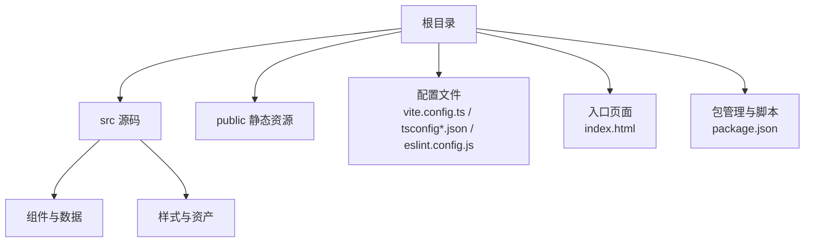
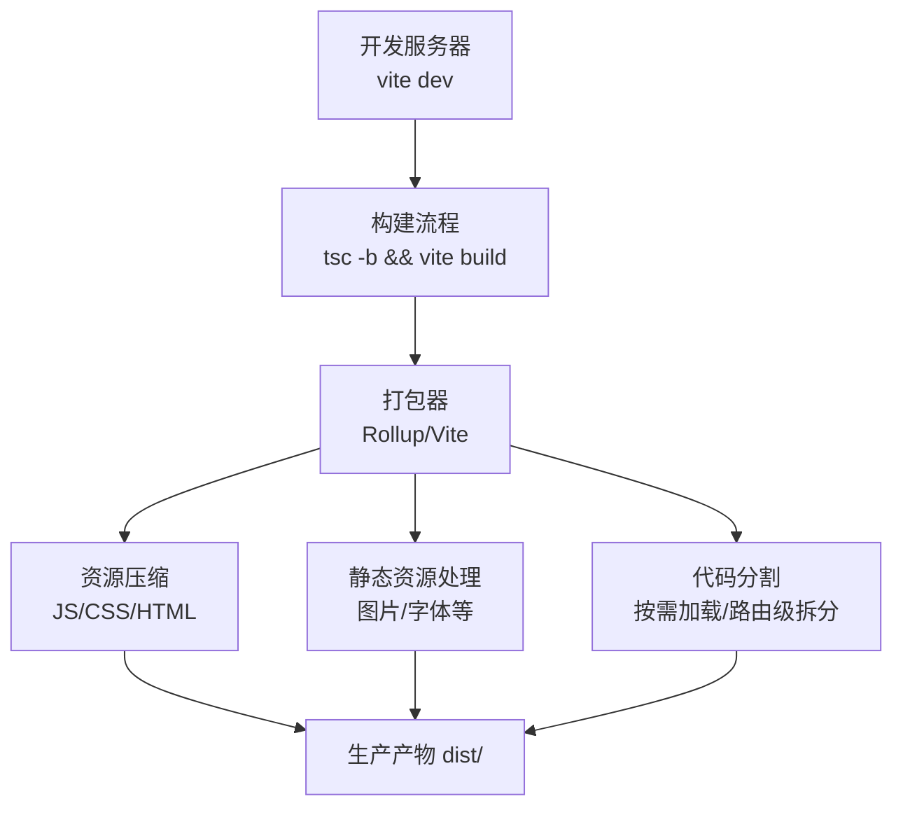
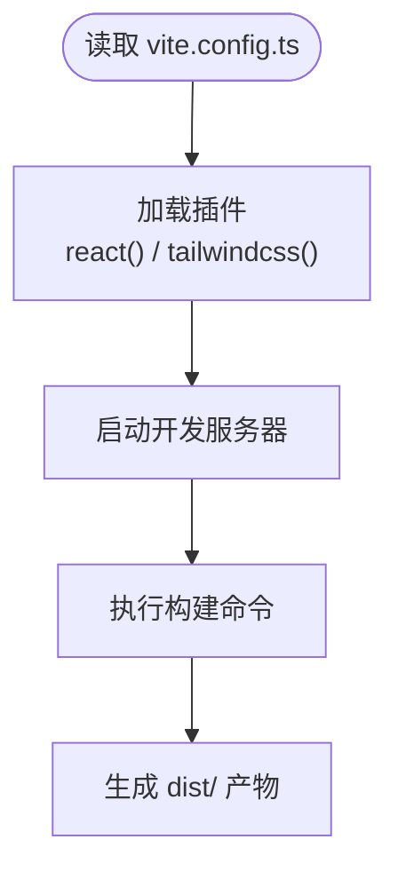
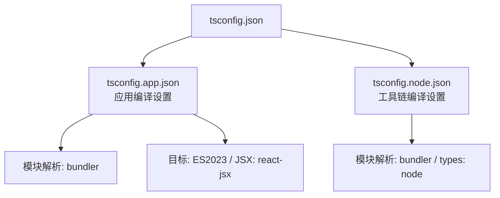
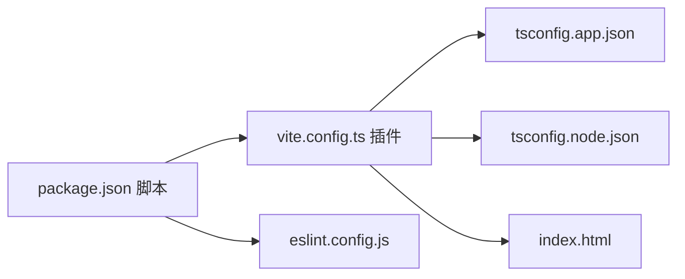

# 构建与部署

<cite>
**本文引用的文件**
- [vite.config.ts](file://portfolio/vite.config.ts)
- [package.json](file://portfolio/package.json)
- [index.html](file://portfolio/index.html)
- [tsconfig.json](file://portfolio/tsconfig.json)
- [tsconfig.app.json](file://portfolio/tsconfig.app.json)
- [tsconfig.node.json](file://portfolio/tsconfig.node.json)
- [eslint.config.js](file://portfolio/eslint.config.js)
- [README.md](file://portfolio/README.md)
</cite>

## 目录
1. [简介](#简介)
2. [项目结构](#项目结构)
3. [核心组件](#核心组件)
4. [架构总览](#架构总览)
5. [详细组件分析](#详细组件分析)
6. [依赖关系分析](#依赖关系分析)
7. [性能考量](#性能考量)
8. [故障排除指南](#故障排除指南)
9. [结论](#结论)
10. [附录](#附录)

## 简介
本文件面向AIWs项目的构建与部署，聚焦于Vite构建配置与生产环境优化（代码分割、资源压缩、缓存策略），并提供静态托管、CDN与域名绑定的通用配置思路。同时给出CI/CD流水线的可落地步骤、版本发布与回滚策略、部署后监控与维护建议、HTTPS与安全最佳实践，以及常见问题排查与性能优化建议。由于仓库中未包含CI/CD配置文件与生产构建产物，本文以现有配置为依据，提供可直接落地的工程化实践。

## 项目结构
项目采用React + TypeScript + Vite的现代前端技术栈，核心目录与文件如下：
- 配置层：vite.config.ts、tsconfig*.json、eslint.config.js
- 资源入口：index.html
- 包管理与脚本：package.json
- 模板说明与扩展建议：README.md

**章节来源**
- [vite.config.ts:1-9](file://portfolio/vite.config.ts#L1-L9)
- [package.json:1-37](file://portfolio/package.json#L1-L37)
- [index.html:1-14](file://portfolio/index.html#L1-L14)
- [tsconfig.json:1-8](file://portfolio/tsconfig.json#L1-L8)
- [tsconfig.app.json:1-26](file://portfolio/tsconfig.app.json#L1-L26)
- [tsconfig.node.json:1-25](file://portfolio/tsconfig.node.json#L1-L25)
- [eslint.config.js:1-24](file://portfolio/eslint.config.js#L1-L24)
- [README.md:1-74](file://portfolio/README.md#L1-L74)

## 核心组件
- Vite构建配置：定义插件（React、TailwindCSS）与基础开发服务器行为。
- TypeScript编译配置：分别针对应用与Node工具链，启用Bundler模式与类型检查。
- ESLint规则：推荐配置与React相关插件，保障代码质量。
- 入口HTML：定义应用挂载点与基础元信息。
- 包脚本：提供开发、构建、预览与代码检查命令。

**章节来源**
- [vite.config.ts:6-8](file://portfolio/vite.config.ts#L6-L8)
- [tsconfig.app.json:10-16](file://portfolio/tsconfig.app.json#L10-L16)
- [tsconfig.node.json:10-15](file://portfolio/tsconfig.node.json#L10-L15)
- [eslint.config.js:8-23](file://portfolio/eslint.config.js#L8-L23)
- [index.html:3-12](file://portfolio/index.html#L3-L12)
- [package.json:6-11](file://portfolio/package.json#L6-L11)

## 架构总览
下图展示从源码到构建产物的关键路径与优化要点（代码分割、压缩、缓存）：

说明
- 代码分割：通过动态导入与路由懒加载实现按需加载，减少首屏体积。
- 资源压缩：在生产构建中自动进行JS/CSS/HTML压缩与Tree Shaking。
- 缓存策略：通过文件名指纹（哈希）与HTTP缓存头实现长效缓存与失效控制。

[本图为概念性流程示意，不直接映射具体源码文件，故无“图表来源”标注]

## 详细组件分析

### Vite构建配置分析
- 插件体系：集成React与TailwindCSS插件，满足组件开发与样式需求。
- 开发体验：默认端口与热更新；如需自定义可扩展代理、别名与环境变量。
- 生产优化：可通过插件生态与Rollup选项实现更细粒度的优化（见后续章节）。

**图表来源**
- [vite.config.ts:6-8](file://portfolio/vite.config.ts#L6-L8)

**章节来源**
- [vite.config.ts:1-9](file://portfolio/vite.config.ts#L1-L9)

### TypeScript编译配置分析
- 应用编译配置（tsconfig.app.json）
  - 使用Bundler模式解析模块，支持TSX与React JSX。
  - 启用严格类型检查与未使用项告警，提升代码质量。
- Node工具链配置（tsconfig.node.json）
  - 限定Vite配置文件的类型环境，避免污染应用编译。

**图表来源**
- [tsconfig.json:3-6](file://portfolio/tsconfig.json#L3-L6)
- [tsconfig.app.json:10-16](file://portfolio/tsconfig.app.json#L10-L16)
- [tsconfig.node.json:10-15](file://portfolio/tsconfig.node.json#L10-L15)

**章节来源**
- [tsconfig.json:1-8](file://portfolio/tsconfig.json#L1-L8)
- [tsconfig.app.json:1-26](file://portfolio/tsconfig.app.json#L1-L26)
- [tsconfig.node.json:1-25](file://portfolio/tsconfig.node.json#L1-L25)

### ESLint规则与质量保障
- 推荐配置：启用JavaScript/TypeScript推荐规则与React Hooks、React Refresh插件。
- 工程化建议：在CI中运行lint任务，确保提交质量。

**章节来源**
- [eslint.config.js:8-23](file://portfolio/eslint.config.js#L8-L23)

### 入口HTML与静态资源
- 入口模板定义了应用挂载点与基础元信息，适合静态托管部署。
- 建议在生产环境通过CDN或静态托管服务提供资源，并配置合适的缓存头。

**章节来源**
- [index.html:3-12](file://portfolio/index.html#L3-L12)

### 包脚本与构建流程
- 开发：vite dev
- 构建：先执行tsc -b进行类型检查，再执行vite build生成dist/
- 预览：vite preview本地验证生产构建

**章节来源**
- [package.json:6-11](file://portfolio/package.json#L6-L11)

## 依赖关系分析
- 组件与样式：React组件与TailwindCSS类驱动UI，构建时由Vite与TailwindCSS插件处理。
- 类型系统：TypeScript在构建前进行类型检查，降低运行期风险。
- 规范与质量：ESLint在开发与CI阶段保障代码风格与潜在问题。

**图表来源**
- [package.json:6-11](file://portfolio/package.json#L6-L11)
- [vite.config.ts:6-8](file://portfolio/vite.config.ts#L6-L8)
- [tsconfig.app.json:10-16](file://portfolio/tsconfig.app.json#L10-L16)
- [tsconfig.node.json:10-15](file://portfolio/tsconfig.node.json#L10-L15)
- [eslint.config.js:8-23](file://portfolio/eslint.config.js#L8-L23)
- [index.html:3-12](file://portfolio/index.html#L3-L12)

**章节来源**
- [package.json:1-37](file://portfolio/package.json#L1-L37)
- [vite.config.ts:1-9](file://portfolio/vite.config.ts#L1-L9)
- [tsconfig.app.json:1-26](file://portfolio/tsconfig.app.json#L1-L26)
- [tsconfig.node.json:1-25](file://portfolio/tsconfig.node.json#L1-L25)
- [eslint.config.js:1-24](file://portfolio/eslint.config.js#L1-L24)
- [index.html:1-14](file://portfolio/index.html#L1-L14)

## 性能考量
- 代码分割
  - 动态导入：对非首屏组件使用动态导入，结合路由懒加载实现按需加载。
  - 外部依赖：将稳定不变的第三方库抽离为独立chunk，提升缓存命中率。
- 资源压缩
  - JS/CSS/HTML：在生产构建中自动启用压缩与Tree Shaking。
  - 图片与字体：建议使用现代格式（WebP/AVIF）与合适的尺寸，配合CDN缓存。
- 缓存策略
  - 文件指纹：通过Rollup输出带哈希的文件名，实现强缓存与失效控制。
  - HTTP缓存头：静态托管服务配置长期缓存（immutable）与短期缓存（index.html等）。
- 开发与生产差异
  - 开发：启用Source Map与HMR；生产：关闭Source Map或仅在CI生成，避免泄露源码。
  - 日志与错误上报：生产环境接入错误监控，保留最小必要日志。

[本节为通用性能建议，不直接分析具体源码文件，故无“章节来源”标注]

## 故障排除指南
- 构建失败
  - 类型错误：先修复类型检查问题，再执行构建脚本。
  - 依赖缺失：确认package.json中的依赖已安装且版本兼容。
- 预览异常
  - 端口占用：修改开发服务器端口或释放占用端口。
  - 路由问题：静态托管需配置回退至index.html，避免404。
- Lint错误
  - 在本地运行lint命令修复问题，或在CI中强制执行。
- HTTPS与安全
  - 使用HTTPS证书（Let’s Encrypt等）；配置安全响应头（HSTS、CSP等）。
  - 对外暴露的静态资源避免泄露源码与敏感信息。

**章节来源**
- [package.json:6-11](file://portfolio/package.json#L6-L11)
- [eslint.config.js:8-23](file://portfolio/eslint.config.js#L8-L23)
- [README.md:14-44](file://portfolio/README.md#L14-L44)

## 结论
本项目基于Vite + React + TypeScript搭建，具备清晰的构建与类型体系。生产部署建议围绕代码分割、资源压缩与缓存策略展开，并结合静态托管或CDN完成域名绑定与HTTPS配置。通过CI/CD流水线自动化测试、构建与部署，配合版本发布与回滚策略，可显著提升交付效率与稳定性。

[本节为总结性内容，不直接分析具体源码文件，故无“章节来源”标注]

## 附录

### 生产环境优化清单
- 代码分割：按路由/功能模块拆分chunk，减少首屏体积。
- 资源压缩：启用JS/CSS/HTML压缩与Tree Shaking。
- 缓存策略：文件指纹+强缓存；index.html短缓存。
- 安全加固：HTTPS、安全响应头、最小权限原则。
- 监控与日志：错误监控、性能指标、访问日志。

[本节为通用实践建议，不直接分析具体源码文件，故无“章节来源”标注]

### CI/CD流水线建议（步骤级）
- 触发条件：push到主分支或创建标签
- 步骤
  1) 安装依赖
  2) 类型检查与语法检查
  3) 单元/集成测试（如存在）
  4) 构建：执行构建脚本生成dist/
  5) 部署：将dist/上传至静态托管或CDN
  6) 回滚：保留最近N个版本，支持一键回滚
- 参考脚本位置
  - 构建命令：参见包脚本定义
  - 预览验证：参见预览脚本

**章节来源**
- [package.json:6-11](file://portfolio/package.json#L6-L11)

### 版本发布与回滚策略
- 发布
  - 打标签：使用语义化版本标签
  - 构建产物：生成带哈希的dist/产物
  - 上线：将新版本产物替换旧版本
- 回滚
  - 保留最近N个版本的产物
  - 通过CDN或托管服务切换到上一个版本
  - 记录变更与回滚原因，便于审计

[本节为通用工程实践建议，不直接分析具体源码文件，故无“章节来源”标注]

### 部署平台配置思路
- 静态托管（如GitHub Pages、Vercel、Netlify）
  - 将构建产物dist/作为发布目录
  - 配置自定义域名与HTTPS证书
  - 设置404回退至index.html（单页应用）
- CDN
  - 将静态资源指向CDN节点
  - 配置缓存头与压缩（Gzip/Brotli）
  - 使用全球加速与边缘缓存
- 域名绑定
  - DNS记录指向托管/CDN
  - 配置CNAME或A记录
  - 强制HTTPS与HSTS

[本节为通用部署建议，不直接分析具体源码文件，故无“章节来源”标注]

### HTTPS与安全最佳实践
- 证书：使用Let’s Encrypt或其他可信CA
- 安全头：Strict-Transport-Security、Content-Security-Policy、X-Frame-Options、X-Content-Type-Options
- 最小权限：仅暴露必要端口与路径
- 源码保护：生产构建关闭Source Map或仅在CI生成

[本节为通用安全建议，不直接分析具体源码文件，故无“章节来源”标注]