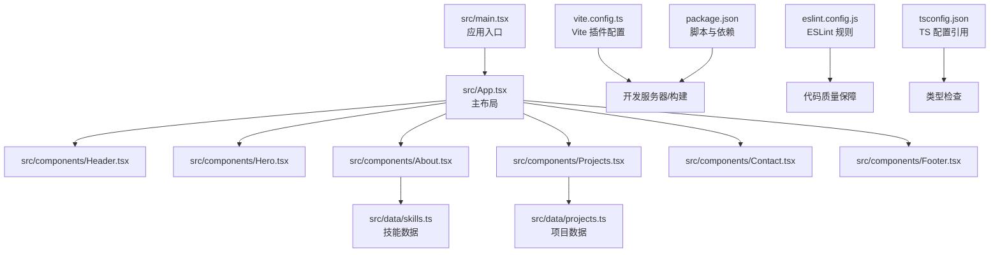
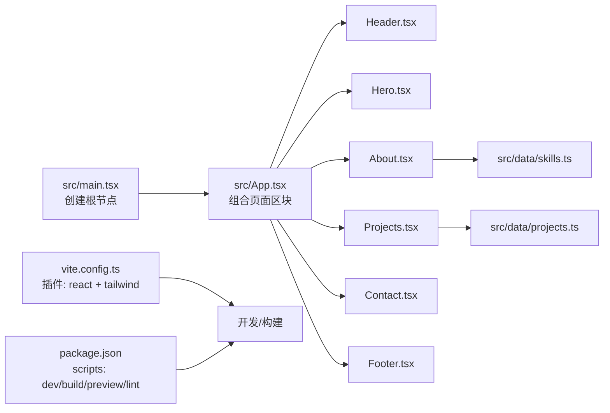
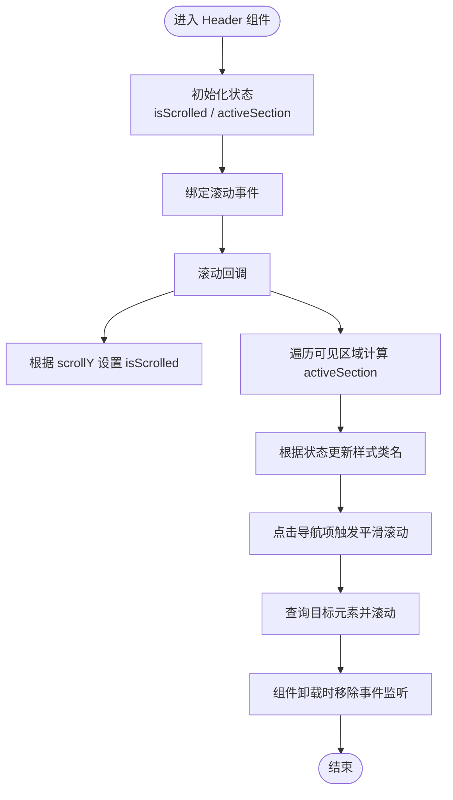
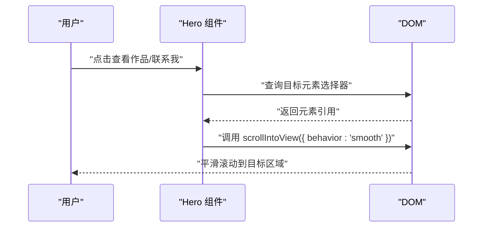
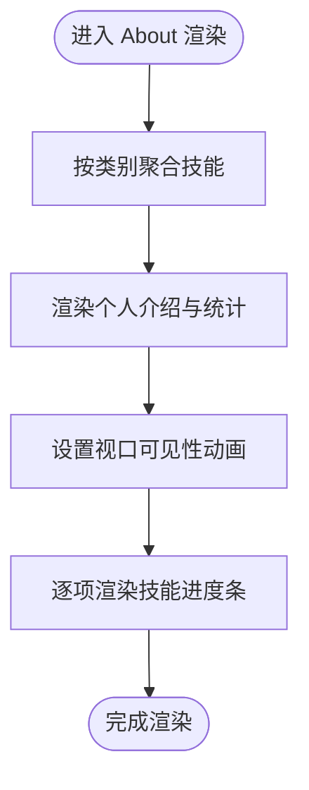
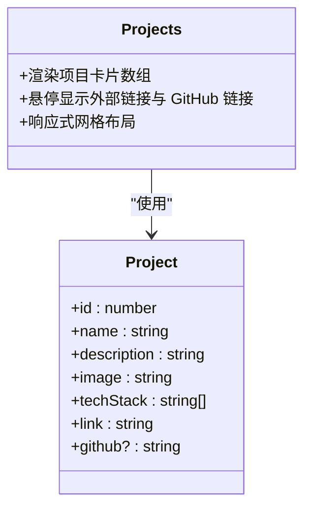
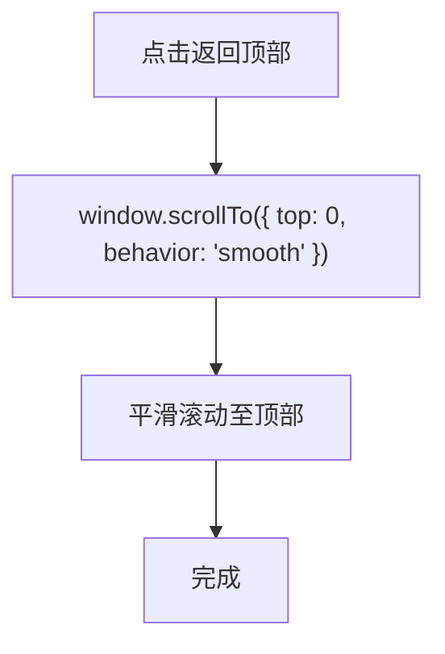
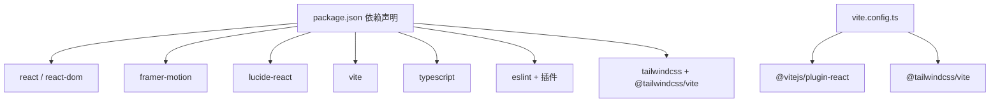

# 调试与测试

<cite>
**本文引用的文件**
- [package.json](file://portfolio/package.json)
- [vite.config.ts](file://portfolio/vite.config.ts)
- [README.md](file://portfolio/README.md)
- [src/main.tsx](file://portfolio/src/main.tsx)
- [src/App.tsx](file://portfolio/src/App.tsx)
- [src/index.css](file://portfolio/src/index.css)
- [src/components/Header.tsx](file://portfolio/src/components/Header.tsx)
- [src/components/Hero.tsx](file://portfolio/src/components/Hero.tsx)
- [src/components/About.tsx](file://portfolio/src/components/About.tsx)
- [src/components/Projects.tsx](file://portfolio/src/components/Projects.tsx)
- [src/components/Contact.tsx](file://portfolio/src/components/Contact.tsx)
- [src/components/Footer.tsx](file://portfolio/src/components/Footer.tsx)
- [src/data/projects.ts](file://portfolio/src/data/projects.ts)
- [src/data/skills.ts](file://portfolio/src/data/skills.ts)
- [tsconfig.json](file://portfolio/tsconfig.json)
- [eslint.config.js](file://portfolio/eslint.config.js)
</cite>

## 目录
1. [引言](#引言)
2. [项目结构](#项目结构)
3. [核心组件](#核心组件)
4. [架构总览](#架构总览)
5. [详细组件分析](#详细组件分析)
6. [依赖分析](#依赖分析)
7. [性能考虑](#性能考虑)
8. [故障排查指南](#故障排查指南)
9. [结论](#结论)
10. [附录](#附录)

## 引言
本文件面向 AIWs（Portfolio）项目的调试与测试工作，聚焦以下目标：
- 使用 React DevTools 进行组件层级与状态调试
- 浏览器开发者工具的网络、性能与内存分析
- 单元测试与集成/端到端测试策略（含 Jest 配置建议）
- 常见 Bug 定位与修复思路
- 性能监控与优化建议
- 日志记录与错误追踪最佳实践

说明：当前仓库未包含测试框架与配置文件，本文提供可直接落地的工程化建议与流程图示，便于后续快速接入。

## 项目结构
该仓库采用 Vite + React + TypeScript + TailwindCSS 的现代前端工程结构，源码位于 src 目录，组件按功能拆分，数据以独立模块导出，便于后续测试与复用。



**图表来源**
- [src/main.tsx:1-12](file://portfolio/src/main.tsx#L1-L12)
- [src/App.tsx:1-28](file://portfolio/src/App.tsx#L1-L28)
- [src/components/Header.tsx:1-129](file://portfolio/src/components/Header.tsx#L1-L129)
- [src/components/Hero.tsx:1-142](file://portfolio/src/components/Hero.tsx#L1-L142)
- [src/components/About.tsx:1-151](file://portfolio/src/components/About.tsx#L1-L151)
- [src/components/Projects.tsx:1-151](file://portfolio/src/components/Projects.tsx#L1-L151)
- [src/components/Contact.tsx:1-149](file://portfolio/src/components/Contact.tsx#L1-L149)
- [src/components/Footer.tsx:1-48](file://portfolio/src/components/Footer.tsx#L1-L48)
- [src/data/skills.ts:1-39](file://portfolio/src/data/skills.ts#L1-L39)
- [src/data/projects.ts:1-49](file://portfolio/src/data/projects.ts#L1-L49)
- [vite.config.ts:1-9](file://portfolio/vite.config.ts#L1-L9)
- [package.json:1-37](file://portfolio/package.json#L1-L37)
- [eslint.config.js:1-24](file://portfolio/eslint.config.js#L1-L24)
- [tsconfig.json:1-8](file://portfolio/tsconfig.json#L1-L8)

**章节来源**
- [package.json:1-37](file://portfolio/package.json#L1-L37)
- [vite.config.ts:1-9](file://portfolio/vite.config.ts#L1-L9)
- [src/main.tsx:1-12](file://portfolio/src/main.tsx#L1-L12)
- [src/App.tsx:1-28](file://portfolio/src/App.tsx#L1-L28)
- [tsconfig.json:1-8](file://portfolio/tsconfig.json#L1-L8)
- [eslint.config.js:1-24](file://portfolio/eslint.config.js#L1-L24)

## 核心组件
- 主应用容器：负责组织页面区块与全局样式注入
- 页面区块：Header、Hero、About、Projects、Contact、Footer
- 数据模块：skills、projects，用于组件渲染的数据源

这些组件普遍使用动画库与响应式布局，具备良好的交互体验，也意味着调试时需关注滚动监听、视口可见性与动画状态。

**章节来源**
- [src/App.tsx:1-28](file://portfolio/src/App.tsx#L1-L28)
- [src/components/Header.tsx:1-129](file://portfolio/src/components/Header.tsx#L1-L129)
- [src/components/Hero.tsx:1-142](file://portfolio/src/components/Hero.tsx#L1-L142)
- [src/components/About.tsx:1-151](file://portfolio/src/components/About.tsx#L1-L151)
- [src/components/Projects.tsx:1-151](file://portfolio/src/components/Projects.tsx#L1-L151)
- [src/components/Contact.tsx:1-149](file://portfolio/src/components/Contact.tsx#L1-L149)
- [src/components/Footer.tsx:1-48](file://portfolio/src/components/Footer.tsx#L1-L48)
- [src/data/skills.ts:1-39](file://portfolio/src/data/skills.ts#L1-L39)
- [src/data/projects.ts:1-49](file://portfolio/src/data/projects.ts#L1-L49)

## 架构总览
下图展示了从入口到组件渲染的关键路径，以及与数据模块的关系。



**图表来源**
- [src/main.tsx:1-12](file://portfolio/src/main.tsx#L1-L12)
- [src/App.tsx:1-28](file://portfolio/src/App.tsx#L1-L28)
- [src/components/Header.tsx:1-129](file://portfolio/src/components/Header.tsx#L1-L129)
- [src/components/Hero.tsx:1-142](file://portfolio/src/components/Hero.tsx#L1-L142)
- [src/components/About.tsx:1-151](file://portfolio/src/components/About.tsx#L1-L151)
- [src/components/Projects.tsx:1-151](file://portfolio/src/components/Projects.tsx#L1-L151)
- [src/components/Contact.tsx:1-149](file://portfolio/src/components/Contact.tsx#L1-L149)
- [src/components/Footer.tsx:1-48](file://portfolio/src/components/Footer.tsx#L1-L48)
- [src/data/skills.ts:1-39](file://portfolio/src/data/skills.ts#L1-L39)
- [src/data/projects.ts:1-49](file://portfolio/src/data/projects.ts#L1-L49)
- [vite.config.ts:1-9](file://portfolio/vite.config.ts#L1-L9)
- [package.json:6-11](file://portfolio/package.json#L6-L11)

## 详细组件分析

### Header 组件调试要点
- 滚动监听与激活态切换：关注滚动事件绑定与解绑，避免重复监听导致内存泄漏
- 平滑滚动：确认目标元素存在性与选择器正确性
- 动画与类名切换：验证条件渲染与过渡类名拼接



**图表来源**
- [src/components/Header.tsx:16-41](file://portfolio/src/components/Header.tsx#L16-L41)
- [src/components/Header.tsx:44-49](file://portfolio/src/components/Header.tsx#L44-L49)

**章节来源**
- [src/components/Header.tsx:1-129](file://portfolio/src/components/Header.tsx#L1-L129)

### Hero 组件调试要点
- 动画序列：检查初始状态、动画参数与延迟顺序
- 社交链接与 CTA：确认外链打开行为与无障碍属性



**图表来源**
- [src/components/Hero.tsx:68-91](file://portfolio/src/components/Hero.tsx#L68-L91)

**章节来源**
- [src/components/Hero.tsx:1-142](file://portfolio/src/components/Hero.tsx#L1-L142)

### About 组件调试要点
- 技能分组与渲染：确保按类别聚合与循环渲染无错
- 视口可见性动画：whileInView 与 viewport 配置是否生效
- 进度条动画：宽度动画与视口进入时机



**图表来源**
- [src/components/About.tsx:8-35](file://portfolio/src/components/About.tsx#L8-L35)
- [src/components/About.tsx:109-144](file://portfolio/src/components/About.tsx#L109-L144)

**章节来源**
- [src/components/About.tsx:1-151](file://portfolio/src/components/About.tsx#L1-L151)
- [src/data/skills.ts:1-39](file://portfolio/src/data/skills.ts#L1-L39)

### Projects 组件调试要点
- 项目卡片网格：确认响应式列数与悬停遮罩显隐
- 技术栈标签：渲染去重与样式一致性
- 外部链接与无障碍属性



**图表来源**
- [src/components/Projects.tsx:9-27](file://portfolio/src/components/Projects.tsx#L9-L27)
- [src/data/projects.ts:2-10](file://portfolio/src/data/projects.ts#L2-L10)

**章节来源**
- [src/components/Projects.tsx:1-151](file://portfolio/src/components/Projects.tsx#L1-L151)
- [src/data/projects.ts:1-49](file://portfolio/src/data/projects.ts#L1-L49)

### Contact 组件调试要点
- 联系方式卡片：图标、颜色渐变与悬停效果
- 外链打开行为：target 与 rel 属性正确性

```mermaid
sequenceDiagram
participant U as "用户"
participant Contact as "Contact 组件"
participant Link as "外部链接"
U->>Contact : "点击联系方式卡片"
Contact->>Link : "根据 href 打开新窗口/当前窗口"
Link-->>U : "跳转对应平台页面"
```

**图表来源**
- [src/components/Contact.tsx:8-38](file://portfolio/src/components/Contact.tsx#L8-L38)
- [src/components/Contact.tsx:93-129](file://portfolio/src/components/Contact.tsx#L93-L129)

**章节来源**
- [src/components/Contact.tsx:1-149](file://portfolio/src/components/Contact.tsx#L1-L149)

### Footer 组件调试要点
- 返回顶部按钮：确认平滑滚动 API 使用正确
- 动画与无障碍：hover/tap 动效与键盘可达性



**图表来源**
- [src/components/Footer.tsx:11-13](file://portfolio/src/components/Footer.tsx#L11-L13)

**章节来源**
- [src/components/Footer.tsx:1-48](file://portfolio/src/components/Footer.tsx#L1-L48)

## 依赖分析
- 运行时依赖：React、React DOM、Framer Motion、Lucide React
- 开发依赖：Vite、@vitejs/plugin-react、TailwindCSS、TypeScript、ESLint 及相关插件
- 构建与开发：Vite 提供 HMR 与快速构建；ESLint 保障类型感知规则



**图表来源**
- [package.json:12-35](file://portfolio/package.json#L12-L35)
- [vite.config.ts:1-9](file://portfolio/vite.config.ts#L1-L9)

**章节来源**
- [package.json:1-37](file://portfolio/package.json#L1-L37)
- [vite.config.ts:1-9](file://portfolio/vite.config.ts#L1-L9)
- [eslint.config.js:1-24](file://portfolio/eslint.config.js#L1-L24)

## 性能考虑
- 动画与滚动
  - 使用视口可见性动画时，注意 viewport 配置与 once 行为，避免重复触发
  - 滚动事件回调中尽量减少 DOM 查询与重排，必要时进行节流/防抖
- 资源加载
  - 图片占位符与懒加载策略，减少首屏阻塞
  - SVG 图标按需引入，避免不必要的包体增长
- 样式与主题
  - TailwindCSS 按需生成，避免未使用类名造成体积膨胀
  - 自定义 CSS 变量与深色主题，减少重复样式定义

[本节为通用指导，无需特定文件来源]

## 故障排查指南
- 组件不渲染或渲染异常
  - 检查组件导入与导出是否一致
  - 确认 App 组合关系与路由锚点 ID 对应
- 动画不生效
  - 核对动画库版本与组件包裹关系
  - 检查 whileInView、layoutId、transition 参数
- 滚动跳转无效
  - 确认目标元素 ID 存在且与选择器匹配
  - 验证 scrollIntoView 的兼容性与参数
- 样式异常
  - 检查 TailwindCSS 是否正确引入与编译
  - 确认自定义 CSS 变量与主题覆盖顺序

[本节为通用指导，无需特定文件来源]

## 结论
本项目采用清晰的组件化结构与现代化工具链，具备良好的可维护性与扩展性。结合本文提供的调试与测试策略，可在保证开发效率的同时提升应用稳定性与性能表现。

[本节为总结性内容，无需特定文件来源]

## 附录

### React DevTools 使用指南
- 安装与启用
  - 在浏览器扩展商店安装官方 React DevTools
  - 打开应用页面，切换到 Components 面板
- 组件树与状态
  - 展开组件树，查看 props 与 state
  - 切换到 Profiler 面板，录制交互过程，观察重渲染热点
- 快速定位
  - 使用“Highlight updates”高亮因状态变化而重渲染的组件
  - 使用“Search”快速定位特定组件

[本节为通用指导，无需特定文件来源]

### 浏览器开发者工具使用
- 网络请求监控
  - Network 面板：过滤 XHR/Fetch，查看响应时间与缓存命中
  - 预览静态资源：确认图片与字体加载状态
- 性能分析
  - Performance 面板：录制交互，分析主线程占用与长任务
  - Memory 面板：定期快照对比，识别内存泄漏
- 内存泄漏检测
  - 观察对象引用链，确认事件监听是否清理
  - 检查定时器与订阅是否在组件卸载时释放

[本节为通用指导，无需特定文件来源]

### 单元测试编写指南（策略与步骤）
- Jest 配置建议
  - 解析器：使用 ts-jest 与 @types/jest
  - 转换：对 .ts/.tsx 进行转换
  - 模拟：对动画库与第三方图标进行模拟
  - 断言：优先断言渲染结果与交互行为
- 测试用例编写
  - 组件渲染：断言关键元素存在与类名正确
  - 用户交互：模拟点击、滚动等事件，断言状态变化
  - 数据流：断言传入 props 与输出回调
- 模拟数据准备
  - 使用最小化数据集覆盖边界场景
  - 对外部依赖（如 fetch、localStorage）进行模拟

[本节为通用指导，无需特定文件来源]

### 集成测试与端到端测试策略
- 集成测试
  - 使用测试库（如 Testing Library）验证组件组合与数据传递
  - 关注滚动监听、视口可见性与动画触发
- 端到端测试
  - 使用 Playwright/Cypress 端到端框架
  - 场景：导航跳转、平滑滚动、外链打开、返回顶部
  - 注意：在 CI 中固定视口尺寸与设备模拟

[本节为通用指导，无需特定文件来源]

### 日志记录与错误追踪最佳实践
- 日志级别
  - 开发：info/warn；生产：error/warn
- 错误边界
  - 使用 React 错误边界捕获渲染异常
- 上报策略
  - 仅上报必要字段（组件名、props、堆栈）
  - 避免敏感信息（用户输入、URL 参数）

[本节为通用指导，无需特定文件来源]