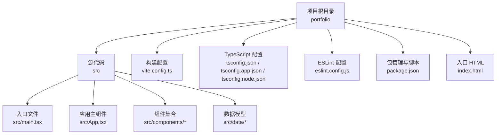
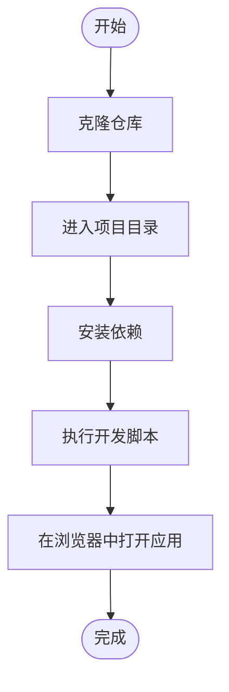
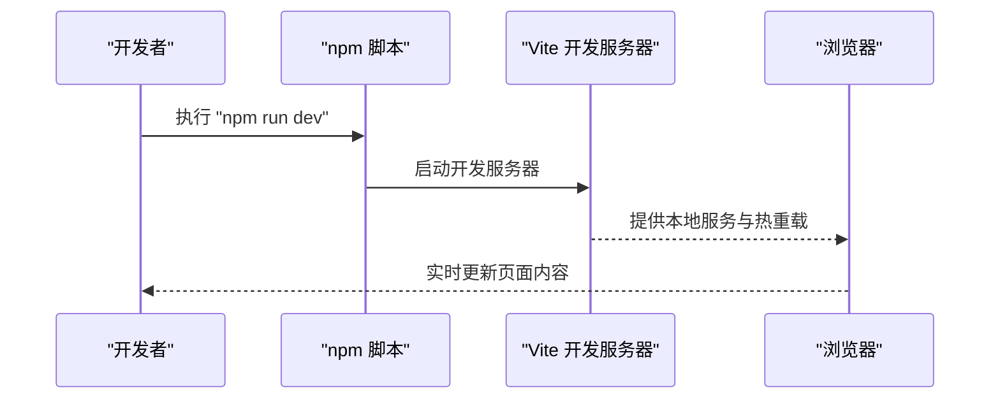
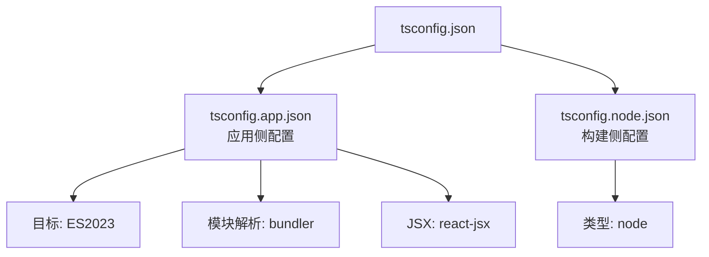
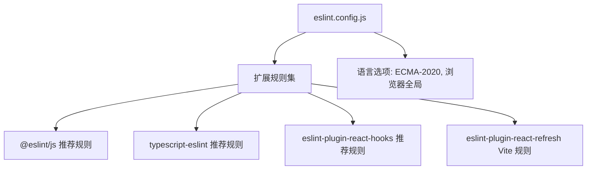
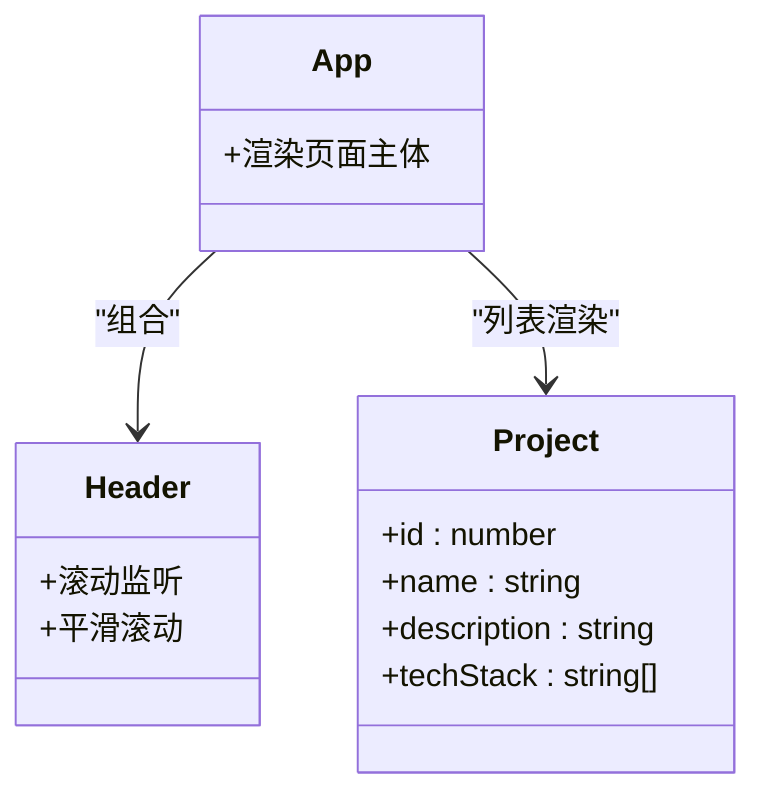

# 快速开始

<cite>
**本文引用的文件**
- [package.json](file://portfolio/package.json)
- [vite.config.ts](file://portfolio/vite.config.ts)
- [tsconfig.json](file://portfolio/tsconfig.json)
- [tsconfig.app.json](file://portfolio/tsconfig.app.json)
- [tsconfig.node.json](file://portfolio/tsconfig.node.json)
- [eslint.config.js](file://portfolio/eslint.config.js)
- [index.html](file://portfolio/index.html)
- [src/main.tsx](file://portfolio/src/main.tsx)
- [src/App.tsx](file://portfolio/src/App.tsx)
- [src/components/Header.tsx](file://portfolio/src/components/Header.tsx)
- [src/data/projects.ts](file://portfolio/src/data/projects.ts)
- [README.md](file://portfolio/README.md)
</cite>

## 目录
1. [简介](#简介)
2. [项目结构](#项目结构)
3. [环境要求](#环境要求)
4. [安装步骤](#安装步骤)
5. [开发服务器与常用命令](#开发服务器与常用命令)
6. [TypeScript 配置](#typescript-配置)
7. [ESLint 代码规范](#eslint-代码规范)
8. [本地开发最佳实践](#本地开发最佳实践)
9. [常见问题与故障排除](#常见问题与故障排除)
10. [结语](#结语)

## 简介
本指南面向首次接触 AIWs 项目的开发者，帮助你在最短时间内完成环境准备、安装依赖与启动开发服务器，并掌握 Vite 开发服务器的工作原理、TypeScript 与 ESLint 的配置要点，以及本地开发的最佳实践与常见问题排查方法。项目采用 React + TypeScript + Vite 技术栈，结合 Tailwind CSS 与 Framer Motion 提供现代化的开发体验。

## 项目结构
AIWs 项目遵循标准的前端工程化目录组织方式，核心目录与文件如下：
- 根目录 portfolio：项目根目录，包含构建配置、脚本与源码
- src：源代码目录，包含组件、样式与入口文件
- public：静态资源目录（如 favicon）
- 配置文件：package.json、vite.config.ts、tsconfig*.json、eslint.config.js 等

**图示来源**
- [package.json:1-37](file://portfolio/package.json#L1-L37)
- [vite.config.ts:1-9](file://portfolio/vite.config.ts#L1-L9)
- [tsconfig.json:1-8](file://portfolio/tsconfig.json#L1-L8)
- [tsconfig.app.json:1-26](file://portfolio/tsconfig.app.json#L1-L26)
- [tsconfig.node.json:1-25](file://portfolio/tsconfig.node.json#L1-L25)
- [eslint.config.js:1-24](file://portfolio/eslint.config.js#L1-L24)
- [index.html:1-14](file://portfolio/index.html#L1-L14)
- [src/main.tsx:1-12](file://portfolio/src/main.tsx#L1-L12)
- [src/App.tsx:1-28](file://portfolio/src/App.tsx#L1-L28)

**章节来源**
- [package.json:1-37](file://portfolio/package.json#L1-L37)
- [vite.config.ts:1-9](file://portfolio/vite.config.ts#L1-L9)
- [tsconfig.json:1-8](file://portfolio/tsconfig.json#L1-L8)
- [tsconfig.app.json:1-26](file://portfolio/tsconfig.app.json#L1-L26)
- [tsconfig.node.json:1-25](file://portfolio/tsconfig.node.json#L1-L25)
- [eslint.config.js:1-24](file://portfolio/eslint.config.js#L1-L24)
- [index.html:1-14](file://portfolio/index.html#L1-L14)
- [src/main.tsx:1-12](file://portfolio/src/main.tsx#L1-L12)
- [src/App.tsx:1-28](file://portfolio/src/App.tsx#L1-L28)

## 环境要求
为确保项目顺利运行，请满足以下最低环境要求：
- Node.js：建议使用 LTS 版本（如 18.x 或 20.x）
- npm：建议使用 8.x 及以上版本
- yarn：可选，如需使用 yarn 请确保版本较新
- Git：用于克隆仓库

提示：本项目使用 ES2023 语法与现代浏览器特性，建议在较新的浏览器中进行开发与调试。

## 安装步骤
按照以下步骤完成项目的克隆、安装与启动：
1. 克隆仓库
   - 使用 Git 将项目克隆到本地
2. 进入项目目录
   - 切换至 portfolio 目录
3. 安装依赖
   - 使用 npm 或 yarn 安装依赖（推荐使用 npm）
4. 启动开发服务器
   - 执行开发脚本启动本地服务
5. 访问应用
   - 在浏览器中打开默认地址（通常为 http://localhost:5173）

**章节来源**
- [package.json:6-11](file://portfolio/package.json#L6-L11)
- [index.html:1-14](file://portfolio/index.html#L1-L14)

## 开发服务器与常用命令
项目通过 Vite 提供开发服务器与构建能力。以下是常用命令及其作用：
- npm run dev：启动 Vite 开发服务器，启用热重载与源码映射
- npm run build：先执行 TypeScript 编译，再进行生产构建
- npm run preview：预览生产构建产物（本地静态服务）
- npm run lint：运行 ESLint 检查代码规范

**图示来源**
- [package.json:6-11](file://portfolio/package.json#L6-L11)
- [vite.config.ts:1-9](file://portfolio/vite.config.ts#L1-L9)

**章节来源**
- [package.json:6-11](file://portfolio/package.json#L6-L11)
- [vite.config.ts:1-9](file://portfolio/vite.config.ts#L1-L9)

## TypeScript 配置
项目采用分层 TypeScript 配置，分别针对应用代码与构建工具配置：
- 根配置文件 tsconfig.json：聚合多个子配置文件
- 应用配置 tsconfig.app.json：面向浏览器端应用代码
- 构建配置 tsconfig.node.json：面向 Vite 配置与 Node 环境

关键配置要点：
- 目标与库：ES2023 与 DOM/DOM.Iterable
- 模块解析：bundler 模式，支持 TS 扩展名导入
- JSX：使用 react-jsx
- 严格性：启用未使用局部变量、参数等检查
- 类型声明：应用侧引入 vite/client，构建侧引入 node

**图示来源**
- [tsconfig.json:1-8](file://portfolio/tsconfig.json#L1-L8)
- [tsconfig.app.json:1-26](file://portfolio/tsconfig.app.json#L1-L26)
- [tsconfig.node.json:1-25](file://portfolio/tsconfig.node.json#L1-L25)

**章节来源**
- [tsconfig.json:1-8](file://portfolio/tsconfig.json#L1-L8)
- [tsconfig.app.json:1-26](file://portfolio/tsconfig.app.json#L1-L26)
- [tsconfig.node.json:1-25](file://portfolio/tsconfig.node.json#L1-L25)

## ESLint 代码规范
项目使用 flat config 风格的 ESLint 配置，集成 TypeScript、React Hooks 与 React Refresh 规则，并对浏览器环境进行语言选项配置。主要特点：
- 推荐规则：基于 @eslint/js 与 typescript-eslint 的推荐配置
- React Hooks：启用 hooks 相关推荐规则
- React Refresh：启用 Vite 下的 React Refresh 规则
- 语言选项：ECMAScript 2020，浏览器全局变量

**图示来源**
- [eslint.config.js:1-24](file://portfolio/eslint.config.js#L1-L24)

**章节来源**
- [eslint.config.js:1-24](file://portfolio/eslint.config.js#L1-L24)
- [README.md:14-74](file://portfolio/README.md#L14-L74)

## 本地开发最佳实践
- 热重载与源码映射
  - Vite 默认启用热重载，修改源码后浏览器自动刷新
  - 开发服务器提供源码映射，便于断点调试
- 组件开发建议
  - 使用函数组件与 hooks，保持组件职责单一
  - 在组件中合理拆分逻辑，避免过度耦合
- 数据与状态
  - 使用 TypeScript 接口定义数据结构，提升类型安全
  - 示例：项目中的项目数据接口与数组定义
- 样式与动画
  - 结合 Tailwind CSS 与 Framer Motion，实现流畅的交互与过渡效果
- 调试技巧
  - 在浏览器开发者工具中启用“保留日志”与“断点”，定位问题
  - 使用 React DevTools 检查组件树与 props 状态

**图示来源**
- [src/App.tsx:1-28](file://portfolio/src/App.tsx#L1-L28)
- [src/components/Header.tsx:1-129](file://portfolio/src/components/Header.tsx#L1-L129)
- [src/data/projects.ts:1-49](file://portfolio/src/data/projects.ts#L1-L49)

**章节来源**
- [src/App.tsx:1-28](file://portfolio/src/App.tsx#L1-L28)
- [src/components/Header.tsx:1-129](file://portfolio/src/components/Header.tsx#L1-L129)
- [src/data/projects.ts:1-49](file://portfolio/src/data/projects.ts#L1-L49)

## 常见问题与故障排除
- 依赖安装失败
  - 确认网络环境稳定，必要时切换到国内镜像源
  - 清理缓存后重试：删除 node_modules 与锁定文件，重新安装
- 端口占用
  - 开发服务器默认端口为 5173，若被占用可在 Vite 配置中调整
- 浏览器兼容性
  - 项目目标为现代浏览器，如需兼容旧版浏览器请调整编译目标与 polyfill
- ESLint 报错
  - 使用 npm run lint 检查并修复问题；如需更严格的类型感知规则，可参考 README 中的扩展配置
- 构建失败
  - 确保 TypeScript 编译通过后再执行构建；检查 tsconfig 与插件配置是否正确

**章节来源**
- [package.json:6-11](file://portfolio/package.json#L6-L11)
- [eslint.config.js:1-24](file://portfolio/eslint.config.js#L1-L24)
- [README.md:14-74](file://portfolio/README.md#L14-L74)

## 结语
通过本指南，你已了解 AIWs 项目的环境要求、安装流程、开发服务器工作原理、TypeScript 与 ESLint 配置要点，以及本地开发的最佳实践与常见问题排查方法。建议在实际开发中结合项目现有组件与数据结构，逐步扩展页面与功能，持续优化开发体验与代码质量。