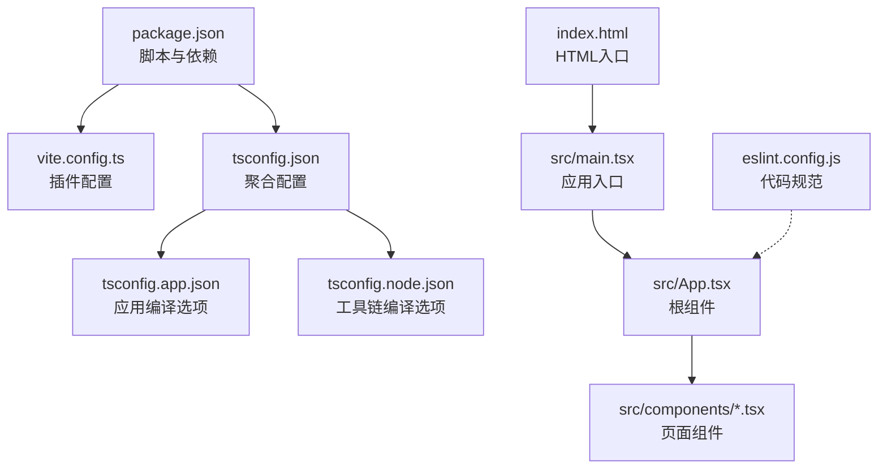
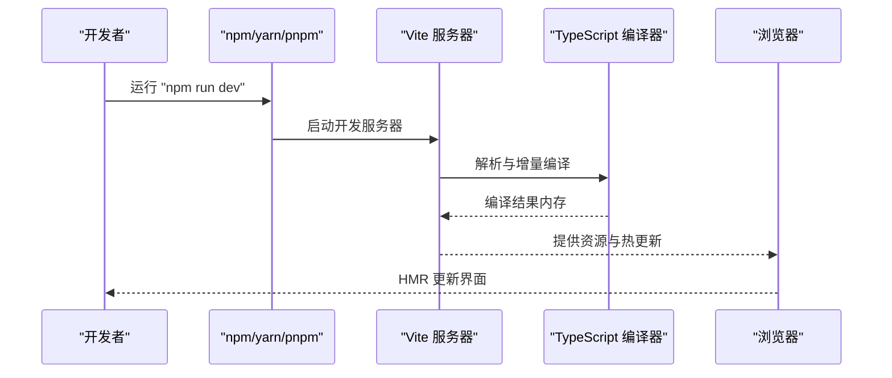
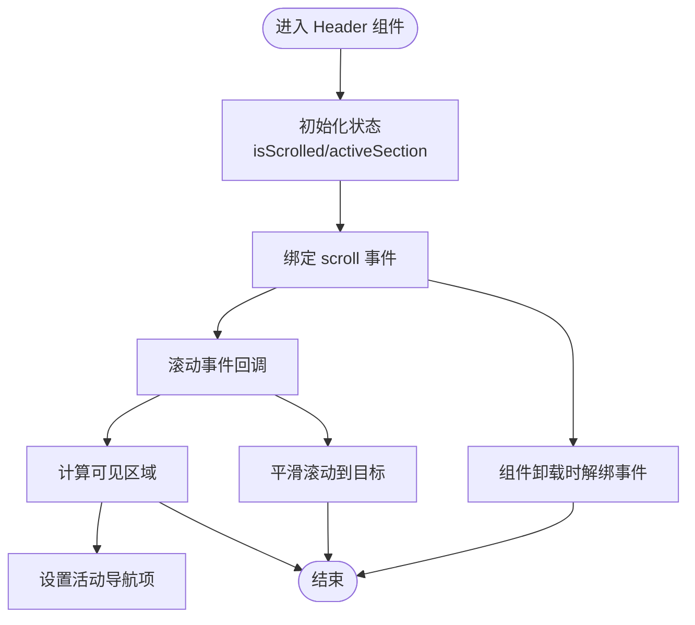

# 故障排除与FAQ

<cite>
**本文引用的文件**
- [package.json](file://portfolio/package.json)
- [vite.config.ts](file://portfolio/vite.config.ts)
- [tsconfig.json](file://portfolio/tsconfig.json)
- [tsconfig.app.json](file://portfolio/tsconfig.app.json)
- [tsconfig.node.json](file://portfolio/tsconfig.node.json)
- [eslint.config.js](file://portfolio/eslint.config.js)
- [README.md](file://portfolio/README.md)
- [index.html](file://portfolio/index.html)
- [src/main.tsx](file://portfolio/src/main.tsx)
- [src/App.tsx](file://portfolio/src/App.tsx)
- [src/components/Header.tsx](file://portfolio/src/components/Header.tsx)
- [src/components/Hero.tsx](file://portfolio/src/components/Hero.tsx)
- [src/components/Projects.tsx](file://portfolio/src/components/Projects.tsx)
- [src/data/projects.ts](file://portfolio/src/data/projects.ts)
- [src/data/skills.ts](file://portfolio/src/data/skills.ts)
</cite>

## 目录
1. [简介](#简介)
2. [项目结构](#项目结构)
3. [核心组件](#核心组件)
4. [架构总览](#架构总览)
5. [详细组件分析](#详细组件分析)
6. [依赖与版本兼容性](#依赖与版本兼容性)
7. [常见问题与排错指南](#常见问题与排错指南)
8. [性能诊断与优化建议](#性能诊断与优化建议)
9. [开发工具与快捷键](#开发工具与快捷键)
10. [备份与恢复策略](#备份与恢复策略)
11. [结论](#结论)
12. [附录：问题报告与社区支持](#附录问题报告与社区支持)

## 简介
本文件面向AIWs（Portfolio）项目的开发者与维护者，提供从依赖安装、TypeScript编译、Vite构建到浏览器兼容性的系统化故障排除与常见问题解答。内容涵盖错误信息解读、调试步骤、性能诊断、优化建议、开发工具技巧、版本兼容性与升级指南，以及备份与恢复策略，并提供问题报告与社区支持渠道。

## 项目结构
该仓库为一个基于 React + TypeScript + Vite 的静态站点模板，采用多配置 TypeScript 工作区（app 与 node），并集成 TailwindCSS 与 React 生态插件。关键文件与职责如下：
- 构建与运行脚本：通过 package.json 中的 scripts 字段定义开发、构建与预览命令。
- Vite 配置：在 vite.config.ts 中启用 @vitejs/plugin-react 与 @tailwindcss/vite 插件。
- TypeScript 配置：通过 tsconfig.json 聚合 app 与 node 两套配置；分别控制应用与工具链编译选项。
- 代码入口：index.html 提供挂载点，src/main.tsx 渲染根组件 App。
- ESLint 配置：eslint.config.js 定义推荐规则集与语言选项，支持类型感知与 React 特定规则扩展。

**图示来源**
- [package.json:1-37](file://portfolio/package.json#L1-L37)
- [vite.config.ts:1-9](file://portfolio/vite.config.ts#L1-L9)
- [tsconfig.json:1-8](file://portfolio/tsconfig.json#L1-L8)
- [tsconfig.app.json:1-26](file://portfolio/tsconfig.app.json#L1-L26)
- [tsconfig.node.json:1-25](file://portfolio/tsconfig.node.json#L1-L25)
- [index.html:1-14](file://portfolio/index.html#L1-L14)
- [src/main.tsx:1-12](file://portfolio/src/main.tsx#L1-L12)
- [src/App.tsx:1-28](file://portfolio/src/App.tsx#L1-L28)
- [eslint.config.js:1-24](file://portfolio/eslint.config.js#L1-L24)

**章节来源**
- [package.json:1-37](file://portfolio/package.json#L1-L37)
- [vite.config.ts:1-9](file://portfolio/vite.config.ts#L1-L9)
- [tsconfig.json:1-8](file://portfolio/tsconfig.json#L1-L8)
- [tsconfig.app.json:1-26](file://portfolio/tsconfig.app.json#L1-L26)
- [tsconfig.node.json:1-25](file://portfolio/tsconfig.node.json#L1-L25)
- [index.html:1-14](file://portfolio/index.html#L1-L14)
- [src/main.tsx:1-12](file://portfolio/src/main.tsx#L1-L12)
- [src/App.tsx:1-28](file://portfolio/src/App.tsx#L1-L28)
- [eslint.config.js:1-24](file://portfolio/eslint.config.js#L1-L24)

## 核心组件
- 应用入口与渲染：index.html 提供挂载容器，src/main.tsx 使用 createRoot 渲染 App。
- 根组件：src/App.tsx 组合 Header、Hero、About、Projects、Contact、Footer 等页面组件。
- 页面组件：Header 实现滚动检测与平滑滚动；Hero 提供首屏展示与交互；Projects 展示项目卡片与技术栈。
- 数据层：src/data/projects.ts 与 src/data/skills.ts 提供类型安全的数据模型与示例数据。

**章节来源**
- [index.html:1-14](file://portfolio/index.html#L1-L14)
- [src/main.tsx:1-12](file://portfolio/src/main.tsx#L1-L12)
- [src/App.tsx:1-28](file://portfolio/src/App.tsx#L1-L28)
- [src/components/Header.tsx:1-129](file://portfolio/src/components/Header.tsx#L1-L129)
- [src/components/Hero.tsx:1-142](file://portfolio/src/components/Hero.tsx#L1-L142)
- [src/components/Projects.tsx:1-151](file://portfolio/src/components/Projects.tsx#L1-L151)
- [src/data/projects.ts:1-49](file://portfolio/src/data/projects.ts#L1-L49)
- [src/data/skills.ts:1-39](file://portfolio/src/data/skills.ts#L1-L39)

## 架构总览
下图展示了从开发到构建的关键流程：开发服务器启动、热更新、TypeScript 编译、Vite 打包与预览。

**图示来源**
- [package.json:6-11](file://portfolio/package.json#L6-L11)
- [vite.config.ts:1-9](file://portfolio/vite.config.ts#L1-L9)
- [tsconfig.app.json:1-26](file://portfolio/tsconfig.app.json#L1-L26)

## 详细组件分析

### Header 组件（滚动检测与平滑滚动）
- 关键逻辑：监听滚动事件，计算可见区域并设置活动导航项；提供平滑滚动到目标区域的能力。
- 性能注意：滚动事件频繁触发，需确保事件解绑与最小化 DOM 查询。
- 可能问题：元素未就绪或选择器不匹配导致滚动无效；滚动阈值与视口偏移需按设计调整。

**图示来源**
- [src/components/Header.tsx:16-41](file://portfolio/src/components/Header.tsx#L16-L41)

**章节来源**
- [src/components/Header.tsx:1-129](file://portfolio/src/components/Header.tsx#L1-L129)

### Hero 组件（首屏动画与交互）
- 关键逻辑：使用 Framer Motion 实现多阶段入场动画；提供“查看作品”“联系我”按钮的平滑滚动。
- 注意事项：SVG 图标与外部链接需确保可访问性与安全性（rel noopener noreferrer）。

**章节来源**
- [src/components/Hero.tsx:1-142](file://portfolio/src/components/Hero.tsx#L1-L142)

### Projects 组件（项目卡片与技术栈）
- 关键逻辑：使用 Framer Motion 的 viewport 视口触发与 staggerChildren 实现列表入场动画；鼠标悬停显示操作按钮。
- 数据来源：从 src/data/projects.ts 获取项目列表，类型安全。

**章节来源**
- [src/components/Projects.tsx:1-151](file://portfolio/src/components/Projects.tsx#L1-L151)
- [src/data/projects.ts:1-49](file://portfolio/src/data/projects.ts#L1-L49)

### 根组件与入口
- 入口：index.html 提供挂载点；src/main.tsx 使用 createRoot 渲染 App。
- 根组件：src/App.tsx 组合各页面组件，设置全局背景色与布局。

**章节来源**
- [index.html:1-14](file://portfolio/index.html#L1-L14)
- [src/main.tsx:1-12](file://portfolio/src/main.tsx#L1-L12)
- [src/App.tsx:1-28](file://portfolio/src/App.tsx#L1-L28)

## 依赖与版本兼容性
- 核心依赖与版本范围
  - React 与 React-DOM：用于 UI 渲染与 DOM 操作。
  - TypeScript：用于类型检查与编译。
  - Vite：用于开发与构建。
  - TailwindCSS：用于样式工具类。
  - Framer Motion：用于动画。
  - Lucide React：用于图标。
- 版本兼容性要点
  - TypeScript 与 React/Vite/Tailwind 的组合需遵循官方兼容矩阵；若升级任一依赖，请同步检查其他相关插件版本。
  - 当前配置使用 bundler 模式与 verbatimModuleSyntax，升级时需验证模块解析行为是否受影响。
- 升级建议
  - 逐步升级：先升级 Vite，再升级 React 与 TypeScript，最后升级插件生态。
  - 在本地与 CI 中执行 lint、类型检查与构建测试，确保无破坏性变更。

**章节来源**
- [package.json:12-35](file://portfolio/package.json#L12-L35)
- [tsconfig.app.json:10-16](file://portfolio/tsconfig.app.json#L10-L16)
- [tsconfig.node.json:10-15](file://portfolio/tsconfig.node.json#L10-L15)
- [README.md:10-12](file://portfolio/README.md#L10-L12)

## 常见问题与排错指南

### 依赖安装失败
- 症状
  - npm/yarn/pnpm 报错，提示无法解析依赖或版本冲突。
- 排查步骤
  - 清理缓存与锁定文件：删除 node_modules、package-lock.json 或 yarn.lock/pnpm-lock.yaml，重新安装。
  - 校验网络与镜像源：切换至稳定镜像或使用代理。
  - 检查 Node 版本：确保满足依赖要求（可通过 package.json 的 engines 字段或 README 说明）。
  - 权限问题：避免使用 sudo 安装依赖，必要时修正目录权限。
- 建议
  - 使用 pnpm 以获得更严格的依赖隔离与更快的安装速度。
  - 若存在二进制依赖，确认平台与架构匹配。

**章节来源**
- [package.json:12-35](file://portfolio/package.json#L12-L35)

### TypeScript 编译错误
- 症状
  - 类型检查失败，如找不到模块、隐式 any、属性不存在等。
- 排查步骤
  - 检查 tsconfig.app.json 与 tsconfig.node.json 的 include 与 compilerOptions 是否覆盖到目标文件。
  - 确认 bundler 模式与 verbatimModuleSyntax 不会引入意外的模块解析行为。
  - 使用 --noEmit 仅进行类型检查，定位具体报错文件与行号。
- 建议
  - 在大型项目中启用严格模式（如 strict、noUnusedLocals 等），并在 CI 中强制执行。
  - 对于第三方库，补充缺失的类型声明或使用 skipLibCheck 临时规避（谨慎使用）。

**章节来源**
- [tsconfig.app.json:1-26](file://portfolio/tsconfig.app.json#L1-L26)
- [tsconfig.node.json:1-25](file://portfolio/tsconfig.node.json#L1-L25)

### Vite 构建问题
- 症状
  - 构建失败、资源加载 404、HMR 不生效、打包体积异常。
- 排查步骤
  - 确认 vite.config.ts 正确启用 @vitejs/plugin-react 与 @tailwindcss/vite。
  - 检查 index.html 的 script 类型与入口路径是否正确。
  - 清理 .vite 缓存与 node_modules/.vite 目录后重试。
  - 使用预览命令验证产物是否可正常加载。
- 建议
  - 在生产环境开启压缩与资源哈希，合理拆分代码与懒加载非关键资源。
  - 如需 SSR 或服务端渲染，评估迁移至 Next.js/VitePress 等方案。

**章节来源**
- [vite.config.ts:1-9](file://portfolio/vite.config.ts#L1-L9)
- [index.html:11](file://portfolio/index.html#L11)
- [package.json:8](file://portfolio/package.json#L8)

### 浏览器兼容性问题
- 症状
  - 某些浏览器不支持新语法（如 ES2023）、CSS Grid/Flexbox 行为差异、动画不流畅。
- 排查步骤
  - 检查 tsconfig.target 与 lib 设置是否满足目标浏览器。
  - 使用 autoprefixer 与 TailwindCSS 的浏览器前缀策略。
  - 在浏览器开发者工具中查看 Console 与 Network，确认 polyfill 与资源加载。
- 建议
  - 使用 browserslist 配置目标范围；在 CI 中添加跨浏览器测试。
  - 对动画与重排敏感区域使用 transform/opacity，减少强制同步布局。

**章节来源**
- [tsconfig.app.json:4-6](file://portfolio/tsconfig.app.json#L4-L6)
- [package.json:25-31](file://portfolio/package.json#L25-L31)

### ESLint 规则与类型感知
- 症状
  - Lint 报错与类型检查冲突、规则未生效。
- 排查步骤
  - 确认 eslint.config.js 的 extends 与 parserOptions.project 指向正确的 tsconfig 文件。
  - 在需要类型感知的场景使用 recommendedTypeChecked 或 strictTypeChecked。
- 建议
  - 在团队中统一 ESLint 配置，CI 中强制执行 lint 与类型检查。

**章节来源**
- [eslint.config.js:1-24](file://portfolio/eslint.config.js#L1-L24)
- [README.md:16-44](file://portfolio/README.md#L16-L44)

### 动画与交互问题（Framer Motion）
- 症状
  - 动画卡顿、视口触发不生效、滚动锚点跳转异常。
- 排查步骤
  - 检查 viewport 配置与 once 参数，确认元素可见性判断逻辑。
  - 平滑滚动时确保目标元素存在且 ID 与 href 匹配。
- 建议
  - 将动画封装为可复用组件，避免在滚动事件中做重型计算。

**章节来源**
- [src/components/Header.tsx:20-49](file://portfolio/src/components/Header.tsx#L20-L49)
- [src/components/Hero.tsx:68-92](file://portfolio/src/components/Hero.tsx#L68-L92)
- [src/components/Projects.tsx:36-58](file://portfolio/src/components/Projects.tsx#L36-L58)

## 性能诊断与优化建议
- 诊断手段
  - 使用浏览器性能面板记录帧率、重排与重绘热点。
  - 在 Network 面板检查资源大小与加载顺序，识别阻塞资源。
  - 在 Lighthouse 或类似工具中运行全面评测。
- 优化建议
  - 代码分割：将非首屏组件懒加载，减少初始包体。
  - 图片与媒体：使用现代格式（WebP/AVIF）与响应式尺寸，配合占位符与懒加载。
  - CSS：按需引入 Tailwind 工具类，避免未使用的样式。
  - 动画：优先使用 transform/opacity，减少布局抖动；限制同时动画元素数量。
  - 构建：启用压缩与资源哈希，利用 CDN 与缓存策略。

[本节为通用性能指导，无需特定文件引用]

## 开发工具与快捷键
- VS Code
  - 快捷键建议：Ctrl+Shift+P 打开命令面板；Ctrl+Shift+K 删除行；Ctrl+Shift+上下移动行；Ctrl+Shift+D 复制行。
  - 推荐插件：ESLint、TypeScript TSServer、Tailwind CSS IntelliSense、Prettier。
- 浏览器开发者工具
  - 使用 Elements 面板检查 DOM 结构与样式；Console 查看错误；Performance 分析渲染瓶颈；Coverage 识别未使用代码。
- 命令行
  - 使用 npm run dev 启动开发服务器；npm run build 执行类型检查与打包；npm run preview 预览产物。

[本节为通用开发工具建议，无需特定文件引用]

## 备份与恢复策略
- 代码与配置
  - 使用 Git 管理版本，提交前执行 lint 与类型检查；分支命名清晰，合并前审查。
- 依赖与缓存
  - 保留 package-lock.json/yarn.lock/pnpm-lock.yaml；定期清理 node_modules 并重建，确保可重现。
- 构建产物
  - 将 dist/ 或构建输出目录纳入版本控制（可选），或在 CI 中归档发布制品。
- 恢复步骤
  - 丢失 node_modules：删除后重新安装；若失败，清理缓存并重试。
  - 配置损坏：回退到最近一次有效提交；核对 tsconfig 与 vite.config 的关键字段。
  - 构建失败：切换到上一个成功构建的提交，逐步排查变更。

[本节为通用备份与恢复建议，无需特定文件引用]

## 结论
本指南围绕 AIWs 项目的开发、构建与运行全链路提供了系统化的故障排除与优化建议。通过规范依赖管理、严格类型与代码规范、合理的构建与性能策略，可显著提升开发效率与产品稳定性。遇到问题时，建议按“症状—排查—验证—预防”的闭环流程处理，并结合 CI 与监控体系持续改进。

[本节为总结性内容，无需特定文件引用]

## 附录：问题报告与社区支持
- 问题报告
  - 准备信息：操作系统、Node 与包管理器版本、浏览器版本、复现步骤、预期与实际结果、日志与截图。
  - 提交渠道：在项目仓库的 Issues 中新建 Issue，选择合适的模板并填写上述信息。
- 社区支持
  - 官方文档：React、TypeScript、Vite、TailwindCSS、ESLint 官方文档。
  - 社区论坛：Stack Overflow、掘金、知乎等平台搜索相关话题。
  - 讨论组：加入 React/TypeScript/Vite 相关 QQ/微信群或 Discord 服务器。

[本节为通用支持渠道说明，无需特定文件引用]