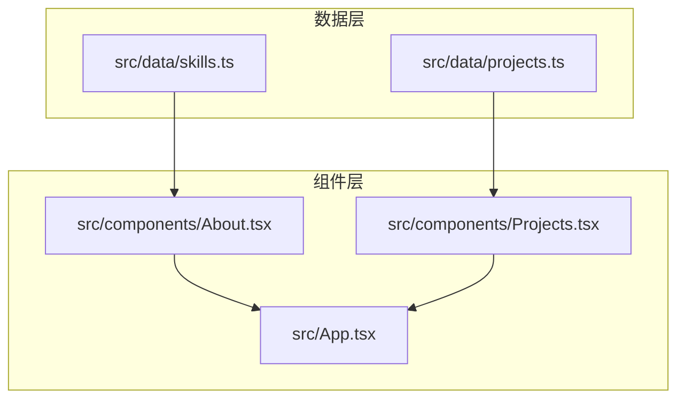
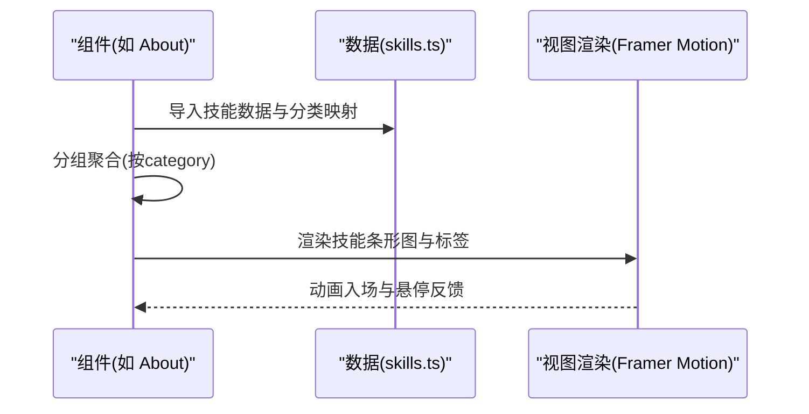
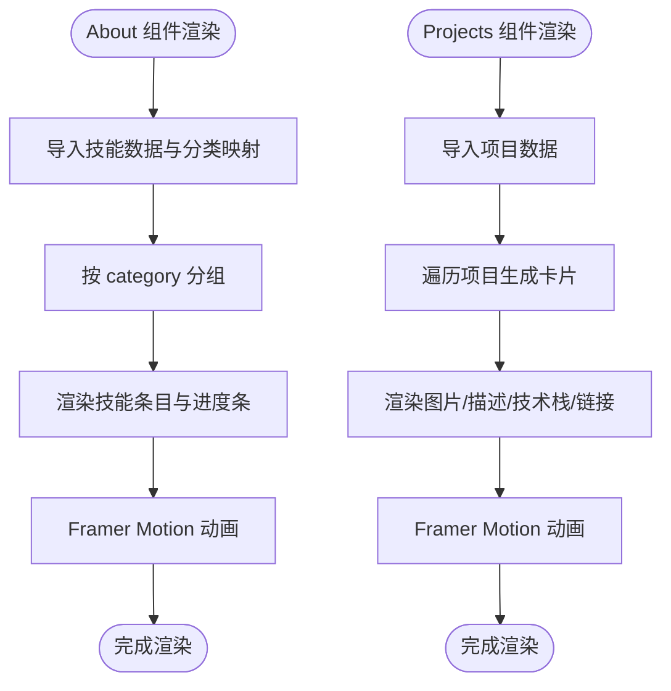
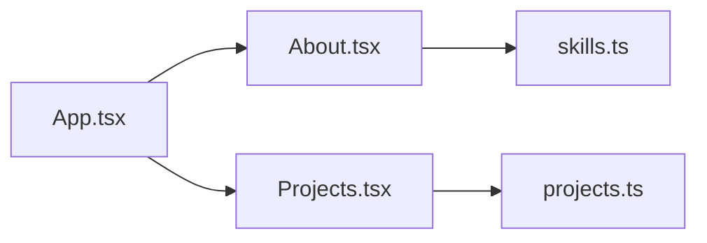

# 数据管理

<cite>
**本文引用的文件**
- [skills.ts](file://portfolio/src/data/skills.ts)
- [projects.ts](file://portfolio/src/data/projects.ts)
- [About.tsx](file://portfolio/src/components/About.tsx)
- [Projects.tsx](file://portfolio/src/components/Projects.tsx)
- [App.tsx](file://portfolio/src/App.tsx)
- [package.json](file://portfolio/package.json)
- [tsconfig.app.json](file://portfolio/tsconfig.app.json)
- [vite.config.ts](file://portfolio/vite.config.ts)
</cite>

## 目录
1. [简介](#简介)
2. [项目结构](#项目结构)
3. [核心数据模型](#核心数据模型)
4. [架构总览](#架构总览)
5. [组件与数据消费流程](#组件与数据消费流程)
6. [依赖关系分析](#依赖关系分析)
7. [性能考量](#性能考量)
8. [故障排查指南](#故障排查指南)
9. [结论](#结论)
10. [附录：扩展与最佳实践](#附录扩展与最佳实践)

## 简介
本文件面向AIWs项目的“数据管理”主题，聚焦于静态数据模型的设计与使用方式，涵盖TypeScript接口定义（Skill与Project）、字段语义与约束、数据组织结构、组件消费路径、以及扩展与最佳实践。文档以“数据驱动渲染”为核心视角，解释如何通过接口确保类型安全、如何组织静态数据文件、以及如何在组件中进行消费与响应式更新。

## 项目结构
项目采用“按功能域划分”的前端结构，数据集中在src/data目录下，组件位于src/components目录下，入口在src/App.tsx中组合各页面区块。Vite作为构建工具，配合TailwindCSS与React生态运行。

图示来源
- [skills.ts:1-39](file://portfolio/src/data/skills.ts#L1-L39)
- [projects.ts:1-49](file://portfolio/src/data/projects.ts#L1-L49)
- [About.tsx:1-151](file://portfolio/src/components/About.tsx#L1-L151)
- [Projects.tsx:1-151](file://portfolio/src/components/Projects.tsx#L1-L151)
- [App.tsx:1-28](file://portfolio/src/App.tsx#L1-L28)

章节来源
- [App.tsx:1-28](file://portfolio/src/App.tsx#L1-L28)
- [vite.config.ts:1-9](file://portfolio/vite.config.ts#L1-L9)

## 核心数据模型
本节详细说明两个核心接口及其字段、类型与约束，帮助读者理解数据模型的设计理念与类型安全保证。

- Skill 接口
  - 字段与类型
    - name: string
    - level: number（取值范围建议为1-100）
    - category: "frontend" | "backend" | "tools" | "other"
  - 设计要点
    - 使用字面量联合类型限定category，避免拼写错误与非法值。
    - level用于技能熟练度可视化，建议在组件层做边界校验与显示控制。
  - 验证规则
    - 类型层面：由TypeScript编译期保证字段存在性与类型匹配。
    - 业务层面：level应在[1,100]区间内；若超出范围，应在消费侧进行截断或提示。

- Project 接口
  - 字段与类型
    - id: number（唯一标识）
    - name: string
    - description: string
    - image: string（资源路径或占位符）
    - techStack: string[]（技术栈标签数组）
    - link: string（外部链接）
    - github?: string（可选GitHub仓库链接）
  - 设计要点
    - github为可选项，便于部分项目仅提供在线演示。
    - techStack以字符串数组形式存储，利于组件渲染为标签。
  - 验证规则
    - 类型层面：字段存在性与类型由TS保证。
    - 业务层面：id应唯一；image与link需为有效URL；github可为空但应为合法URL时再渲染。

章节来源
- [skills.ts:2-6](file://portfolio/src/data/skills.ts#L2-L6)
- [skills.ts:33-38](file://portfolio/src/data/skills.ts#L33-L38)
- [projects.ts:2-10](file://portfolio/src/data/projects.ts#L2-L10)

## 架构总览
数据驱动渲染模式在本项目中的体现：
- 数据层：src/data目录下的静态数据文件导出接口与数据数组。
- 组件层：各页面组件直接导入数据，进行渲染与交互。
- 渲染特性：使用Framer Motion实现进入动画与悬停效果，提升用户体验。
- 响应式更新：组件内部通过状态与动画库实现视图响应，数据变更会自然触发重新渲染。

图示来源
- [About.tsx:1-151](file://portfolio/src/components/About.tsx#L1-L151)
- [skills.ts:1-39](file://portfolio/src/data/skills.ts#L1-L39)

## 组件与数据消费流程
本节梳理组件如何消费数据，以及数据驱动的渲染与交互。

- About 组件
  - 数据来源：skills.ts导出的Skill[]与skillCategories映射。
  - 处理逻辑：使用reduce按category分组，再遍历渲染每个类别的技能条目。
  - 渲染细节：技能名称、百分比、条形进度条、分类标题均来自数据。
  - 动画：使用Framer Motion实现进入动画与悬停效果。

- Projects 组件
  - 数据来源：projects.ts导出的Project[]。
  - 处理逻辑：遍历项目数组生成卡片，支持外链与GitHub链接（可选）。
  - 渲染细节：项目图片占位、标题、描述、技术栈标签、链接按钮。
  - 动画：容器与子项使用staggerChildren实现有序入场。

- App 组件
  - 组合页面：Header、Hero、About、Projects、Contact、Footer。
  - 数据不在此处直接消费，而是由子组件各自导入数据。

图示来源
- [About.tsx:9-16](file://portfolio/src/components/About.tsx#L9-L16)
- [About.tsx:118-144](file://portfolio/src/components/About.tsx#L118-L144)
- [Projects.tsx:60-124](file://portfolio/src/components/Projects.tsx#L60-L124)

章节来源
- [About.tsx:1-151](file://portfolio/src/components/About.tsx#L1-L151)
- [Projects.tsx:1-151](file://portfolio/src/components/Projects.tsx#L1-L151)
- [App.tsx:1-28](file://portfolio/src/App.tsx#L1-L28)

## 依赖关系分析
- 组件对数据的依赖
  - About.tsx 依赖 skills.ts 的Skill[]与skillCategories。
  - Projects.tsx 依赖 projects.ts 的Project[]。
- 运行时依赖
  - package.json声明了React、React DOM、Framer Motion、Lucide React等运行时依赖。
- 构建与类型检查
  - tsconfig.app.json启用严格类型检查与JSX转换。
  - vite.config.ts集成React与TailwindCSS插件。

图示来源
- [About.tsx:1-2](file://portfolio/src/components/About.tsx#L1-L2)
- [Projects.tsx:1-3](file://portfolio/src/components/Projects.tsx#L1-L3)
- [App.tsx:1-6](file://portfolio/src/App.tsx#L1-L6)

章节来源
- [package.json:12-34](file://portfolio/package.json#L12-L34)
- [tsconfig.app.json:1-26](file://portfolio/tsconfig.app.json#L1-L26)
- [vite.config.ts:1-9](file://portfolio/vite.config.ts#L1-L9)

## 性能考量
- 静态数据导入
  - 数据以ES模块形式导入，打包器会在构建阶段内联，减少网络请求。
- 渲染优化
  - 使用Framer Motion的viewport与staggerChildren，仅在视口可见时触发动画，降低初始渲染压力。
- 数据规模
  - 当前数据量较小，无需分页或懒加载；若未来增长，可在组件层引入虚拟滚动或分页策略。
- 类型检查
  - 严格的TS配置有助于在开发期发现潜在问题，避免运行时错误。

## 故障排查指南
- 类型错误
  - 若修改接口字段或新增字段，请同步更新组件消费处，避免TS编译报错。
- 运行时错误
  - 若出现技能或项目渲染异常，检查数据数组是否正确导入，以及键名是否与接口一致。
- 动画不生效
  - 确认Framer Motion版本与配置正确，且组件处于视口范围内才会触发动画。
- 资源路径
  - image与link字段应为有效路径或URL，避免空白或无效链接导致的渲染问题。

## 结论
本项目通过清晰的TypeScript接口定义与静态数据文件，实现了强类型的“数据驱动渲染”。组件通过直接导入数据进行消费，结合动画库实现良好的交互体验。整体架构简单、可维护性强，适合快速迭代与扩展。

## 附录：扩展与最佳实践
- 扩展新技能
  - 在skills.ts中追加新的Skill对象，确保category为预定义字面量之一，level在合理区间内。
  - 如需新增分类，需同时更新接口与skillCategories映射，并在组件中处理新增分类的渲染。
  - 参考路径：[skills.ts:8-31](file://portfolio/src/data/skills.ts#L8-L31)，[skills.ts:33-38](file://portfolio/src/data/skills.ts#L33-L38)

- 扩展新项目
  - 在projects.ts中追加新的Project对象，注意id唯一性与可选字段的使用。
  - 若项目无GitHub仓库，可省略github字段；否则确保为有效URL。
  - 参考路径：[projects.ts:12-48](file://portfolio/src/data/projects.ts#L12-L48)

- 数据格式示例
  - 技能示例字段：name、level、category
  - 项目示例字段：id、name、description、image、techStack、link、github(可选)
  - 参考路径：[skills.ts:8-31](file://portfolio/src/data/skills.ts#L8-L31)，[projects.ts:12-48](file://portfolio/src/data/projects.ts#L12-L48)

- 最佳实践
  - 使用字面量联合类型限制枚举值，避免魔法字符串。
  - 对可能越界的数值（如level）在消费侧进行边界处理与提示。
  - 将可选字段明确标注为可选，避免空值判断遗漏。
  - 保持数据结构稳定，新增字段时提供默认值或兼容逻辑。
  - 在组件中使用动画库时，合理设置延迟与阈值，确保首屏性能。