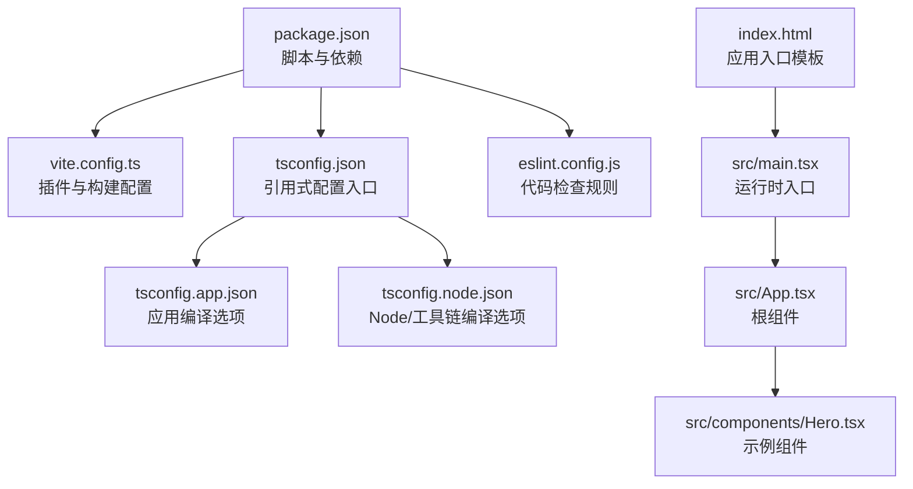
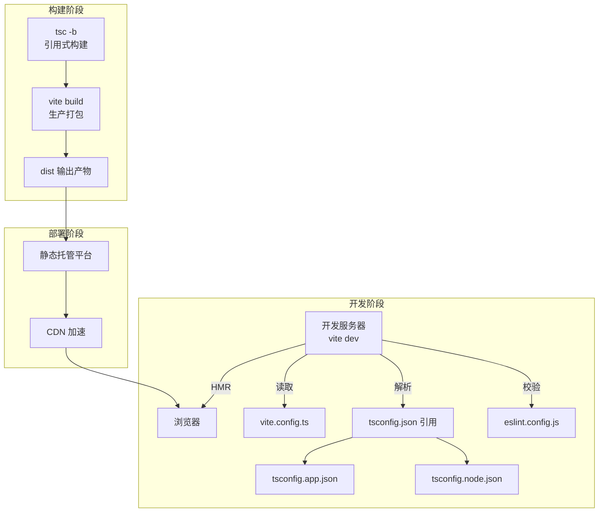
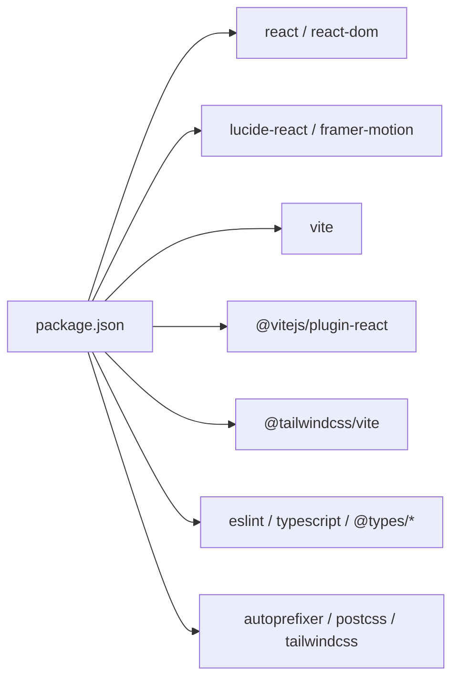

# 构建与部署

<cite>
**本文引用的文件**
- [package.json](file://portfolio/package.json)
- [vite.config.ts](file://portfolio/vite.config.ts)
- [tsconfig.json](file://portfolio/tsconfig.json)
- [tsconfig.app.json](file://portfolio/tsconfig.app.json)
- [tsconfig.node.json](file://portfolio/tsconfig.node.json)
- [eslint.config.js](file://portfolio/eslint.config.js)
- [index.html](file://portfolio/index.html)
- [README.md](file://portfolio/README.md)
- [src/main.tsx](file://portfolio/src/main.tsx)
- [src/App.tsx](file://portfolio/src/App.tsx)
- [src/components/Hero.tsx](file://portfolio/src/components/Hero.tsx)
</cite>

## 目录
1. [引言](#引言)
2. [项目结构](#项目结构)
3. [核心组件](#核心组件)
4. [架构总览](#架构总览)
5. [详细组件分析](#详细组件分析)
6. [依赖分析](#依赖分析)
7. [性能考虑](#性能考虑)
8. [故障排查指南](#故障排查指南)
9. [结论](#结论)
10. [附录](#附录)

## 引言
本指南面向使用 Vite + React + TypeScript 的前端项目，围绕构建与部署提供系统化说明。内容涵盖：
- Vite 构建工具的配置要点：开发服务器、生产构建、插件生态
- TypeScript 编译流程与类型检查策略
- ESLint 代码质量与风格规范
- 完整构建命令与本地预览流程
- 部署策略与静态托管平台建议
- 性能优化技巧（代码分割、资源压缩、缓存）
- CI/CD 集成与自动化部署思路
- 常见构建与部署问题的定位与修复

## 项目结构
该仓库采用“单包多配置”的组织方式，核心目录与文件如下：
- 根配置：package.json、vite.config.ts、tsconfig.json、eslint.config.js
- 类型配置：tsconfig.app.json、tsconfig.node.json
- 源码入口：index.html、src/main.tsx、src/App.tsx
- 示例组件：src/components/Hero.tsx 等
- 工程说明：README.md

图表来源
- [package.json:1-37](file://portfolio/package.json#L1-L37)
- [vite.config.ts:1-9](file://portfolio/vite.config.ts#L1-L9)
- [tsconfig.json:1-8](file://portfolio/tsconfig.json#L1-L8)
- [tsconfig.app.json:1-26](file://portfolio/tsconfig.app.json#L1-L26)
- [tsconfig.node.json:1-25](file://portfolio/tsconfig.node.json#L1-L25)
- [eslint.config.js:1-24](file://portfolio/eslint.config.js#L1-L24)
- [index.html:1-14](file://portfolio/index.html#L1-L14)
- [src/main.tsx:1-12](file://portfolio/src/main.tsx#L1-L12)
- [src/App.tsx:1-28](file://portfolio/src/App.tsx#L1-L28)
- [src/components/Hero.tsx:1-142](file://portfolio/src/components/Hero.tsx#L1-L142)

章节来源
- [package.json:1-37](file://portfolio/package.json#L1-L37)
- [vite.config.ts:1-9](file://portfolio/vite.config.ts#L1-L9)
- [tsconfig.json:1-8](file://portfolio/tsconfig.json#L1-L8)
- [tsconfig.app.json:1-26](file://portfolio/tsconfig.app.json#L1-L26)
- [tsconfig.node.json:1-25](file://portfolio/tsconfig.node.json#L1-L25)
- [eslint.config.js:1-24](file://portfolio/eslint.config.js#L1-L24)
- [index.html:1-14](file://portfolio/index.html#L1-L14)
- [README.md:1-74](file://portfolio/README.md#L1-L74)

## 核心组件
- 构建与脚本
  - 开发：通过 Vite 启动本地开发服务器
  - 构建：先执行 TypeScript 项目引用构建，再进行 Vite 生产打包
  - 预览：在本地启动静态预览服务器
  - 代码检查：基于 ESLint 的规则集
- 插件生态
  - @vitejs/plugin-react：React 快速开发与热更新支持
  - @tailwindcss/vite：Tailwind CSS 支持
- 类型系统
  - tsconfig.json 作为引用入口，分别指向应用与 Node 工具链配置
  - app 配置启用 bundler 模式、JSX 运行时等
  - node 配置限定工具链运行环境
- 代码质量
  - eslint.config.js 使用 flat config，扩展推荐规则与 React Hooks/Refresh 规则

章节来源
- [package.json:6-11](file://portfolio/package.json#L6-L11)
- [vite.config.ts:1-9](file://portfolio/vite.config.ts#L1-L9)
- [tsconfig.json:1-8](file://portfolio/tsconfig.json#L1-L8)
- [tsconfig.app.json:1-26](file://portfolio/tsconfig.app.json#L1-L26)
- [tsconfig.node.json:1-25](file://portfolio/tsconfig.node.json#L1-L25)
- [eslint.config.js:1-24](file://portfolio/eslint.config.js#L1-L24)

## 架构总览
下图展示从开发到生产的整体流程，以及关键配置文件之间的关系。

图表来源
- [package.json:6-11](file://portfolio/package.json#L6-L11)
- [vite.config.ts:1-9](file://portfolio/vite.config.ts#L1-L9)
- [tsconfig.json:1-8](file://portfolio/tsconfig.json#L1-L8)
- [tsconfig.app.json:1-26](file://portfolio/tsconfig.app.json#L1-L26)
- [tsconfig.node.json:1-25](file://portfolio/tsconfig.node.json#L1-L25)
- [eslint.config.js:1-24](file://portfolio/eslint.config.js#L1-L24)

## 详细组件分析

### Vite 构建配置与插件
- 插件清单
  - @vitejs/plugin-react：提供 React JSX 转换与 HMR
  - @tailwindcss/vite：集成 Tailwind CSS 工作流
- 默认行为
  - 开发服务器默认监听端口与热更新已由 Vite 提供
  - 生产构建自动进行代码压缩、资源内联与分块策略
- 可扩展点
  - 可按需引入路由插件、SVG/图片处理、HTML 注入等
  - 如需 SSR 或服务端渲染，可引入对应插件并调整入口与输出

章节来源
- [vite.config.ts:1-9](file://portfolio/vite.config.ts#L1-L9)

### TypeScript 编译流程
- 引用式配置
  - tsconfig.json 通过 references 指向 app 与 node 两套配置
- 应用配置（app）
  - 目标与模块：ES2023、esnext
  - 解析模式：bundler，启用 bundler 语义与模块检测
  - JSX：react-jsx 运行时
  - 无 emit（仅类型检查），配合 Vite 打包器
- 工具链配置（node）
  - 目标与模块：ES2023、esnext
  - 作用域：仅包含 vite.config.ts
- 构建顺序
  - 先执行 tsc -b（引用式增量构建），再执行 vite build（产物进入 dist）

章节来源
- [tsconfig.json:1-8](file://portfolio/tsconfig.json#L1-L8)
- [tsconfig.app.json:1-26](file://portfolio/tsconfig.app.json#L1-L26)
- [tsconfig.node.json:1-25](file://portfolio/tsconfig.node.json#L1-L25)
- [package.json:8](file://portfolio/package.json#L8)

### ESLint 代码检查流程
- 规则来源
  - 推荐规则集与 React Hooks/Refresh 规则已启用
  - 顶层忽略 dist 目录，避免对打包产物进行检查
- 类型感知
  - README 提供了启用类型感知规则的示例，可通过替换配置项实现更严格的类型检查
- 语言选项
  - 浏览器全局变量可用，ECMAScript 2020

章节来源
- [eslint.config.js:1-24](file://portfolio/eslint.config.js#L1-L24)
- [README.md:14-73](file://portfolio/README.md#L14-L73)

### 构建命令与本地预览
- 开发服务器
  - npm run dev 启动 Vite 开发服务器，支持热更新与快速错误反馈
- 生产构建
  - npm run build 先执行 tsc -b，再执行 vite build，生成 dist 目录
- 本地预览
  - npm run preview 在本地启动静态预览服务器，验证生产构建效果

章节来源
- [package.json:6-11](file://portfolio/package.json#L6-L11)

### 入口与运行时
- HTML 入口
  - index.html 中定义挂载点与基础 meta，加载 /src/main.tsx
- 运行时入口
  - src/main.tsx 创建根节点并渲染 App
- 根组件
  - src/App.tsx 组合 Header、Hero、About、Projects、Contact、Footer 等页面组件

章节来源
- [index.html:1-14](file://portfolio/index.html#L1-L14)
- [src/main.tsx:1-12](file://portfolio/src/main.tsx#L1-L12)
- [src/App.tsx:1-28](file://portfolio/src/App.tsx#L1-L28)

### 示例组件：Hero
- 功能概览
  - 展示头像、姓名、职位、简介、CTA 按钮与社交链接
  - 使用 framer-motion 实现动画过渡
- 结构说明
  - 以响应式布局与渐变色彩为主
  - 内嵌滚动提示与平滑滚动交互

章节来源
- [src/components/Hero.tsx:1-142](file://portfolio/src/components/Hero.tsx#L1-L142)

## 依赖分析
- 运行时依赖
  - react、react-dom：框架核心
  - lucide-react、framer-motion：UI 与动画
- 开发依赖
  - @vitejs/plugin-react、@tailwindcss/vite：构建与样式支持
  - eslint、typescript、typescript-eslint、@types/*：代码质量与类型安全
  - autoprefixer、postcss、tailwindcss：CSS 工具链
  - vite：构建与开发服务器

图表来源
- [package.json:12-35](file://portfolio/package.json#L12-L35)

章节来源
- [package.json:12-35](file://portfolio/package.json#L12-L35)

## 性能考虑
- 代码分割
  - 利用 Vite 的动态导入实现路由级或组件级懒加载，减少首屏体积
- 资源压缩
  - 生产构建自动启用 JS/CSS 压缩；可结合图片/字体优化进一步瘦身
- 缓存策略
  - 为静态资源设置强缓存（带内容指纹），HTML 设置较短缓存或不缓存
- Tree Shaking
  - 使用 ES Module 语法与打包器的死代码消除能力
- 构建优化
  - 关闭不必要的 React Compiler（参考 README），避免影响开发与构建性能
- Tailwind 优化
  - 仅引入所需工具类，避免未使用类导致的体积膨胀

章节来源
- [README.md:10-12](file://portfolio/README.md#L10-L12)
- [vite.config.ts:1-9](file://portfolio/vite.config.ts#L1-L9)

## 故障排查指南
- 构建失败（TypeScript）
  - 症状：tsc -b 报错或构建中断
  - 排查：确认 tsconfig.app.json 与 tsconfig.node.json 的路径正确，确保引用式配置未被破坏
- 构建失败（Vite）
  - 症状：vite build 报错或产物缺失
  - 排查：检查 vite.config.ts 插件是否正确安装与配置；确认入口 HTML 与 main.tsx 正常
- 预览异常
  - 症状：npm run preview 无法访问或空白页
  - 排查：确认 dist 目录存在且包含产物；检查静态服务器端口占用
- ESLint 报错
  - 症状：编辑器或命令行提示规则冲突
  - 排查：核对 eslint.config.js 的 extends 与语言选项；必要时启用类型感知规则
- 开发服务器卡顿
  - 症状：HMR 慢或频繁重载
  - 排查：关闭 React Compiler（参考 README）；检查插件数量与第三方库体积

章节来源
- [package.json:6-11](file://portfolio/package.json#L6-L11)
- [vite.config.ts:1-9](file://portfolio/vite.config.ts#L1-L9)
- [tsconfig.json:1-8](file://portfolio/tsconfig.json#L1-L8)
- [tsconfig.app.json:1-26](file://portfolio/tsconfig.app.json#L1-L26)
- [tsconfig.node.json:1-25](file://portfolio/tsconfig.node.json#L1-L25)
- [eslint.config.js:1-24](file://portfolio/eslint.config.js#L1-L24)
- [README.md:10-12](file://portfolio/README.md#L10-L12)

## 结论
本项目以 Vite 为核心，结合 React、TypeScript 与 Tailwind CSS，形成高效、可维护的前端工程化体系。通过引用式 TypeScript 配置与 ESLint 规范，保障了类型安全与代码质量；借助 Vite 的插件生态与生产构建优化，能够快速产出高性能的静态资源。建议在生产环境中启用代码分割、资源压缩与 CDN 缓存，并结合 CI/CD 自动化完成构建与部署。

## 附录

### 构建与预览命令
- 开发：npm run dev
- 构建：npm run build
- 预览：npm run preview

章节来源
- [package.json:6-11](file://portfolio/package.json#L6-L11)

### 部署策略与静态托管平台
- 平台选择
  - GitHub Pages、Netlify、Vercel、Cloudflare Pages 等均支持静态站点托管
- 配置要点
  - 将构建产物 dist 作为发布目录
  - 配置 404 回退至 index.html（单页应用）
  - 设置缓存与压缩策略，启用 CDN
- 自动化
  - 在 CI 中执行构建与预览校验，成功后触发部署

[本节为通用实践说明，无需特定文件引用]