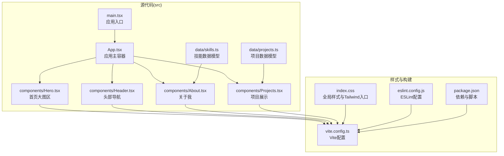
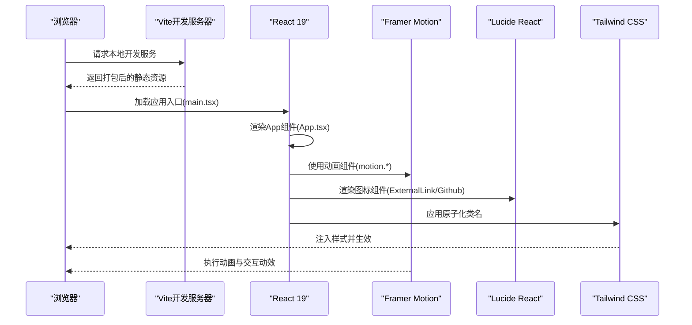
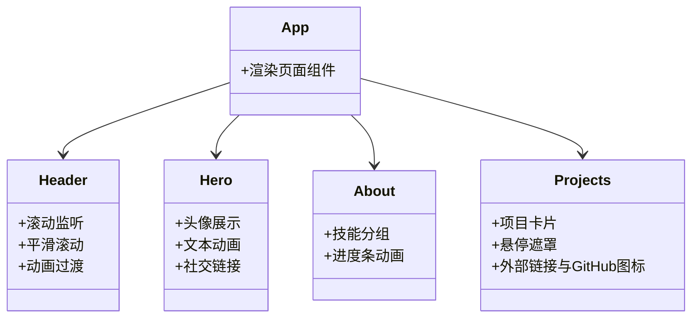
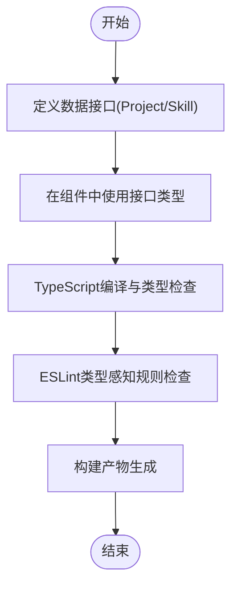
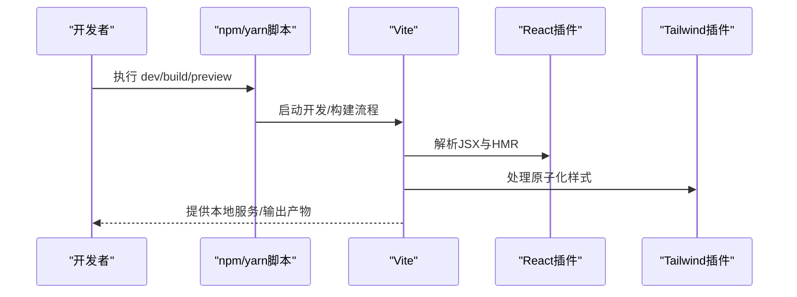
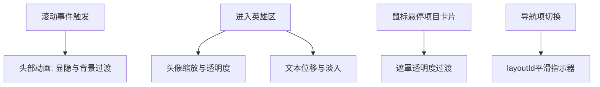
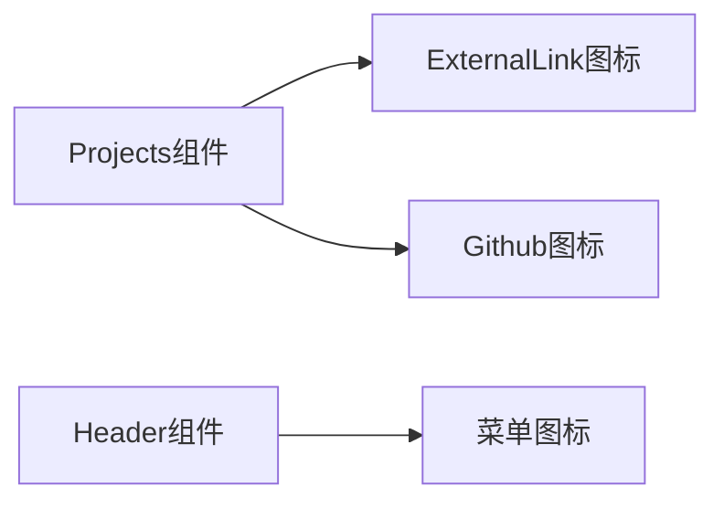
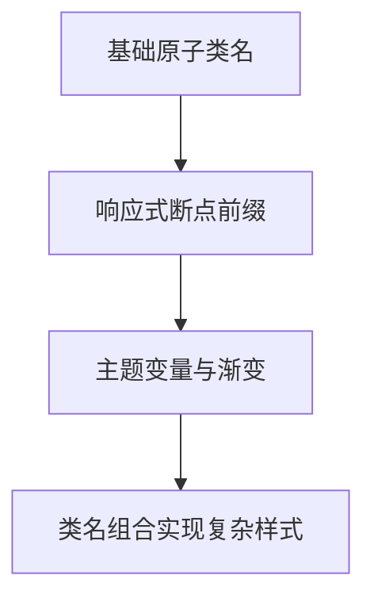
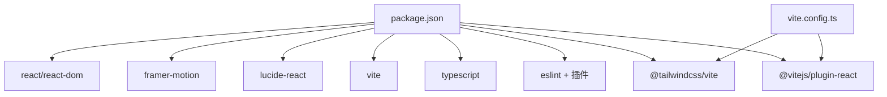

# 技术栈选择

<cite>
**本文引用的文件**
- [package.json](file://portfolio/package.json)
- [vite.config.ts](file://portfolio/vite.config.ts)
- [tsconfig.json](file://portfolio/tsconfig.json)
- [src/index.css](file://portfolio/src/index.css)
- [src/App.tsx](file://portfolio/src/App.tsx)
- [src/main.tsx](file://portfolio/src/main.tsx)
- [src/components/Header.tsx](file://portfolio/src/components/Header.tsx)
- [src/components/Hero.tsx](file://portfolio/src/components/Hero.tsx)
- [src/components/Projects.tsx](file://portfolio/src/components/Projects.tsx)
- [src/components/About.tsx](file://portfolio/src/components/About.tsx)
- [src/data/projects.ts](file://portfolio/src/data/projects.ts)
- [src/data/skills.ts](file://portfolio/src/data/skills.ts)
- [eslint.config.js](file://portfolio/eslint.config.js)
- [README.md](file://portfolio/README.md)
</cite>

## 目录
1. [引言](#引言)
2. [项目结构](#项目结构)
3. [核心组件](#核心组件)
4. [架构总览](#架构总览)
5. [详细组件分析](#详细组件分析)
6. [依赖分析](#依赖分析)
7. [性能考量](#性能考量)
8. [故障排查指南](#故障排查指南)
9. [结论](#结论)
10. [附录：技术选型对比与替代方案](#附录技术选型对比与替代方案)

## 引言
本技术栈选择文档围绕 AIWs 项目的前端技术栈展开，重点解释 React 19 的选择与新特性应用、TypeScript 的类型安全保障、Vite 的构建与开发体验、Framer Motion 动画库与 Lucide React 图标库的技术价值，以及 Tailwind CSS 的原子化 CSS 优势与响应式设计实现。同时，文档提供技术间的协同作用与集成方案，并给出替代方案对比，帮助读者全面理解该技术组合的设计意图与落地实践。

## 项目结构
该项目采用以功能模块为中心的组织方式，核心入口位于 src/main.tsx，应用主体由多个页面组件组合而成，样式通过 Tailwind CSS 提供原子化类名，动画与交互使用 Framer Motion 实现，图标使用 Lucide React，构建与开发体验由 Vite 提供，类型安全与代码质量由 TypeScript 与 ESLint 共同保障。

**图表来源**
- [src/main.tsx:1-12](file://portfolio/src/main.tsx#L1-L12)
- [src/App.tsx:1-28](file://portfolio/src/App.tsx#L1-L28)
- [src/components/Header.tsx:1-129](file://portfolio/src/components/Header.tsx#L1-L129)
- [src/components/Hero.tsx:1-142](file://portfolio/src/components/Hero.tsx#L1-L142)
- [src/components/About.tsx:1-151](file://portfolio/src/components/About.tsx#L1-L151)
- [src/components/Projects.tsx:1-151](file://portfolio/src/components/Projects.tsx#L1-L151)
- [src/data/projects.ts:1-49](file://portfolio/src/data/projects.ts#L1-L49)
- [src/data/skills.ts:1-39](file://portfolio/src/data/skills.ts#L1-L39)
- [src/index.css:1-46](file://portfolio/src/index.css#L1-L46)
- [vite.config.ts:1-9](file://portfolio/vite.config.ts#L1-L9)
- [package.json:1-37](file://portfolio/package.json#L1-L37)
- [eslint.config.js:1-24](file://portfolio/eslint.config.js#L1-L24)

**章节来源**
- [src/main.tsx:1-12](file://portfolio/src/main.tsx#L1-L12)
- [src/App.tsx:1-28](file://portfolio/src/App.tsx#L1-L28)
- [vite.config.ts:1-9](file://portfolio/vite.config.ts#L1-L9)
- [package.json:1-37](file://portfolio/package.json#L1-L37)

## 核心组件
- React 19：作为应用框架，提供组件化 UI 构建能力；项目中已声明依赖版本并配合 Vite 的 React 插件进行开发与构建。
- TypeScript：提供强类型系统，结合 ESLint 类型感知规则，提升代码健壮性与可维护性；配置采用多 tsconfig 引用模式。
- Vite：提供快速的开发服务器与优化的构建流程，集成 React 插件与 Tailwind CSS 插件，显著提升开发体验。
- Framer Motion：用于实现流畅的动画与交互动效，广泛应用于头部导航、英雄区、项目卡片等组件。
- Lucide React：提供简洁一致的图标体系，统一视觉语言，降低资源体积与维护成本。
- Tailwind CSS：采用原子化 CSS 方法，通过类名组合实现样式定制，配合响应式断点实现跨设备适配。

**章节来源**
- [package.json:12-17](file://portfolio/package.json#L12-L17)
- [tsconfig.json:1-8](file://portfolio/tsconfig.json#L1-L8)
- [vite.config.ts:1-9](file://portfolio/vite.config.ts#L1-L9)
- [src/components/Header.tsx:1-129](file://portfolio/src/components/Header.tsx#L1-L129)
- [src/components/Hero.tsx:1-142](file://portfolio/src/components/Hero.tsx#L1-L142)
- [src/components/Projects.tsx:1-151](file://portfolio/src/components/Projects.tsx#L1-L151)
- [src/index.css:1-46](file://portfolio/src/index.css#L1-L46)

## 架构总览
下图展示了从浏览器加载到组件渲染、样式应用与动画执行的整体流程，体现各技术栈的协作关系。

**图表来源**
- [src/main.tsx:1-12](file://portfolio/src/main.tsx#L1-L12)
- [src/App.tsx:1-28](file://portfolio/src/App.tsx#L1-L28)
- [src/components/Header.tsx:1-129](file://portfolio/src/components/Header.tsx#L1-L129)
- [src/components/Hero.tsx:1-142](file://portfolio/src/components/Hero.tsx#L1-L142)
- [src/components/Projects.tsx:1-151](file://portfolio/src/components/Projects.tsx#L1-L151)
- [vite.config.ts:1-9](file://portfolio/vite.config.ts#L1-L9)
- [src/index.css:1-46](file://portfolio/src/index.css#L1-L46)

## 详细组件分析

### React 19 与组件化架构
- 组件职责清晰：头部导航、首页大图区、关于我、项目展示、底部等模块化组织，便于维护与复用。
- 新特性应用：项目未启用 React Compiler（参考模板说明），保持默认编译路径；在组件中广泛使用 Framer Motion 进行动画与交互增强。
- 类型安全：通过 TypeScript 接口约束数据模型（如项目与技能），确保组件间数据传递的正确性。

**图表来源**
- [src/App.tsx:1-28](file://portfolio/src/App.tsx#L1-L28)
- [src/components/Header.tsx:1-129](file://portfolio/src/components/Header.tsx#L1-L129)
- [src/components/Hero.tsx:1-142](file://portfolio/src/components/Hero.tsx#L1-L142)
- [src/components/About.tsx:1-151](file://portfolio/src/components/About.tsx#L1-L151)
- [src/components/Projects.tsx:1-151](file://portfolio/src/components/Projects.tsx#L1-L151)

**章节来源**
- [src/App.tsx:1-28](file://portfolio/src/App.tsx#L1-L28)
- [src/components/Header.tsx:1-129](file://portfolio/src/components/Header.tsx#L1-L129)
- [src/components/Hero.tsx:1-142](file://portfolio/src/components/Hero.tsx#L1-L142)
- [src/components/About.tsx:1-151](file://portfolio/src/components/About.tsx#L1-L151)
- [src/components/Projects.tsx:1-151](file://portfolio/src/components/Projects.tsx#L1-L151)

### TypeScript 类型安全保障
- 数据模型接口：项目与技能数据均通过 TypeScript 接口定义，确保组件消费数据时的类型一致性。
- 配置结构：采用多 tsconfig 引用，分别指向应用与 Node 环境配置，便于类型检查与项目拆分。
- ESLint 类型感知：配置中启用推荐的类型感知规则集，结合 React Hooks 与 React Refresh 规则，提升开发期反馈质量。

**图表来源**
- [src/data/projects.ts:1-49](file://portfolio/src/data/projects.ts#L1-L49)
- [src/data/skills.ts:1-39](file://portfolio/src/data/skills.ts#L1-L39)
- [tsconfig.json:1-8](file://portfolio/tsconfig.json#L1-L8)
- [eslint.config.js:1-24](file://portfolio/eslint.config.js#L1-L24)

**章节来源**
- [src/data/projects.ts:1-49](file://portfolio/src/data/projects.ts#L1-L49)
- [src/data/skills.ts:1-39](file://portfolio/src/data/skills.ts#L1-L39)
- [tsconfig.json:1-8](file://portfolio/tsconfig.json#L1-L8)
- [eslint.config.js:1-24](file://portfolio/eslint.config.js#L1-L24)

### Vite 构建与开发体验
- 快速启动：开发脚本直接调用 Vite，提供即时热更新与模块联邦般的开发体验。
- 插件集成：内置 React 插件与 Tailwind CSS 插件，开箱即用地支持 JSX 语法与原子化样式。
- 构建流程：先执行 TypeScript 编译，再进行 Vite 构建，保证类型安全与产物优化。

**图表来源**
- [package.json:6-11](file://portfolio/package.json#L6-L11)
- [vite.config.ts:1-9](file://portfolio/vite.config.ts#L1-L9)

**章节来源**
- [package.json:6-11](file://portfolio/package.json#L6-L11)
- [vite.config.ts:1-9](file://portfolio/vite.config.ts#L1-L9)

### Framer Motion 动画库
- 场景应用：头部导航在滚动时的显隐与背景过渡、英雄区的渐进式入场动画、项目卡片的悬停交互与遮罩过渡、关于我区域的分组动画等。
- 动画模式：使用基础动画属性与布局动画（layoutId）实现平滑的导航指示器切换，提升交互一致性。
- 性能考虑：在组件中按需使用动画，避免过度动画影响首屏性能。

**图表来源**
- [src/components/Header.tsx:52-104](file://portfolio/src/components/Header.tsx#L52-L104)
- [src/components/Hero.tsx:15-137](file://portfolio/src/components/Hero.tsx#L15-L137)
- [src/components/Projects.tsx:72-99](file://portfolio/src/components/Projects.tsx#L72-L99)
- [src/components/About.tsx:111-144](file://portfolio/src/components/About.tsx#L111-L144)

**章节来源**
- [src/components/Header.tsx:1-129](file://portfolio/src/components/Header.tsx#L1-L129)
- [src/components/Hero.tsx:1-142](file://portfolio/src/components/Hero.tsx#L1-L142)
- [src/components/Projects.tsx:1-151](file://portfolio/src/components/Projects.tsx#L1-L151)
- [src/components/About.tsx:1-151](file://portfolio/src/components/About.tsx#L1-L151)

### Lucide React 图标库
- 统一风格：图标风格一致，尺寸与颜色可通过类名控制，便于与整体设计保持一致。
- 按需引入：仅引入所需图标组件，减少打包体积。
- 无障碍友好：图标具备语义化结构，利于屏幕阅读器识别。

**图表来源**
- [src/components/Projects.tsx:1-151](file://portfolio/src/components/Projects.tsx#L1-L151)
- [src/components/Header.tsx:109-123](file://portfolio/src/components/Header.tsx#L109-L123)

**章节来源**
- [src/components/Projects.tsx:1-151](file://portfolio/src/components/Projects.tsx#L1-L151)
- [src/components/Header.tsx:109-123](file://portfolio/src/components/Header.tsx#L109-L123)

### Tailwind CSS 原子化 CSS
- 原子化方法：通过组合类名实现样式定制，减少手写 CSS 的重复工作量。
- 响应式设计：利用断点前缀实现移动端优先的自适应布局，如在头部导航与项目网格中广泛应用。
- 主题变量：通过 CSS 变量与渐变类名统一视觉风格，提升一致性与可维护性。

**图表来源**
- [src/index.css:1-46](file://portfolio/src/index.css#L1-L46)
- [src/App.tsx:14-24](file://portfolio/src/App.tsx#L14-L24)
- [src/components/Header.tsx:62-106](file://portfolio/src/components/Header.tsx#L62-L106)
- [src/components/Projects.tsx:58-125](file://portfolio/src/components/Projects.tsx#L58-L125)

**章节来源**
- [src/index.css:1-46](file://portfolio/src/index.css#L1-L46)
- [src/App.tsx:1-28](file://portfolio/src/App.tsx#L1-L28)
- [src/components/Header.tsx:1-129](file://portfolio/src/components/Header.tsx#L1-L129)
- [src/components/Projects.tsx:1-151](file://portfolio/src/components/Projects.tsx#L1-L151)

## 依赖分析
- 运行时依赖：React 19 与 React DOM 提供 UI 渲染；Framer Motion 提供动画能力；Lucide React 提供图标。
- 开发依赖：Vite 提供开发与构建；@vitejs/plugin-react 与 @tailwindcss/vite 支持 JSX 与原子化样式；TypeScript 提供类型系统；ESLint 与相关插件保障代码质量。
- 脚本命令：dev 启动开发服务器，build 先编译 TS 再构建，preview 预览生产包。

**图表来源**
- [package.json:12-35](file://portfolio/package.json#L12-L35)
- [vite.config.ts:1-9](file://portfolio/vite.config.ts#L1-L9)

**章节来源**
- [package.json:1-37](file://portfolio/package.json#L1-L37)
- [vite.config.ts:1-9](file://portfolio/vite.config.ts#L1-L9)

## 性能考量
- 开发体验：Vite 的快速冷启与热更新显著缩短迭代周期；React 插件与 React Refresh 提升调试效率。
- 构建优化：先 TS 编译再 Vite 构建，有助于提前发现类型错误；Tailwind 原子化类名减少冗余样式。
- 动画策略：在关键区域使用动画，避免在大量元素上同时触发复杂动画；合理设置动画持续时间与缓动曲线。
- 样式体积：通过按需引入图标与精简类名组合，控制最终 CSS 体积。

[本节为通用性能建议，无需特定文件引用]

## 故障排查指南
- 开发服务器无法启动：检查 Vite 配置与端口占用情况；确认 React 插件与 Tailwind 插件均已正确安装与注册。
- 类型错误：查看 TypeScript 编译输出，核对数据接口与组件传参是否匹配；必要时调整 ESLint 类型规则。
- 动画异常：检查 Framer Motion 的版本兼容性与组件使用方式；确认动画参数与视口可见性条件。
- 样式不生效：确认 Tailwind CSS 的入口与类名拼写；检查响应式断点前缀与主题变量使用。

**章节来源**
- [vite.config.ts:1-9](file://portfolio/vite.config.ts#L1-L9)
- [eslint.config.js:1-24](file://portfolio/eslint.config.js#L1-L24)
- [src/index.css:1-46](file://portfolio/src/index.css#L1-L46)

## 结论
本项目的技术栈以 React 19 为核心，结合 TypeScript 提供类型安全保障，借助 Vite 实现高效的开发与构建体验，辅以 Framer Motion 与 Lucide React 提升交互与视觉一致性，Tailwind CSS 则通过原子化方法实现灵活且可维护的样式体系。整体组合强调开发效率、运行性能与可维护性的平衡，适合中小型到中型规模的前端项目。

[本节为总结性内容，无需特定文件引用]

## 附录：技术选型对比与替代方案
- React 19 vs 其他框架
  - 优势：组件生态成熟、开发工具链完善、与 Vite 集成良好；项目未启用 React Compiler，保持默认编译路径。
  - 替代：Vue 3、Solid 等，各有生态与性能取舍，需结合团队熟悉度与项目需求评估。
- TypeScript vs JavaScript
  - 优势：类型系统降低运行时错误、提升重构安全性、改善团队协作效率。
  - 替代：纯 JS 或 Flow/ReasonML 等，但类型安全与 IDE 支持不及 TypeScript 成熟。
- Vite vs Webpack
  - 优势：更快的冷启与热更新、原生 ESM 支持、插件生态活跃。
  - 替代：Rollup、Parcel 等，但在开发体验与生态广度上不及 Vite。
- Framer Motion vs 其他动画库
  - 优势：与 React 协作紧密、API 简洁、性能表现良好。
  - 替代：GSAP、React Spring 等，根据复杂度与性能要求选择。
- Lucide React vs Ant Design Icons/Iconify
  - 优势：轻量、按需引入、风格统一。
  - 替代：根据品牌风格与图标丰富度需求选择。

**章节来源**
- [README.md:10-12](file://portfolio/README.md#L10-L12)
- [package.json:12-35](file://portfolio/package.json#L12-L35)