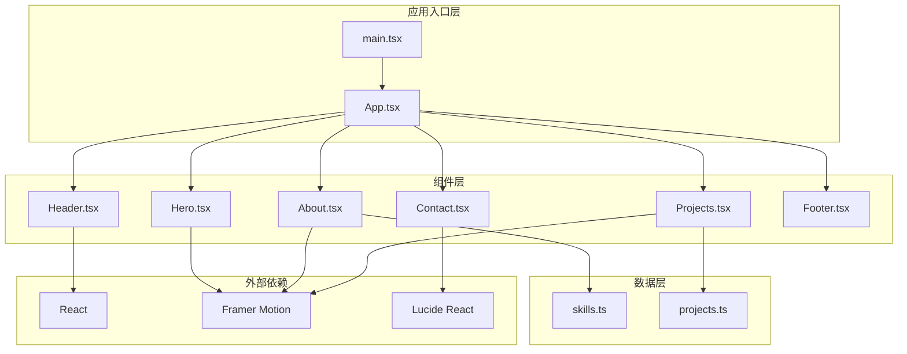
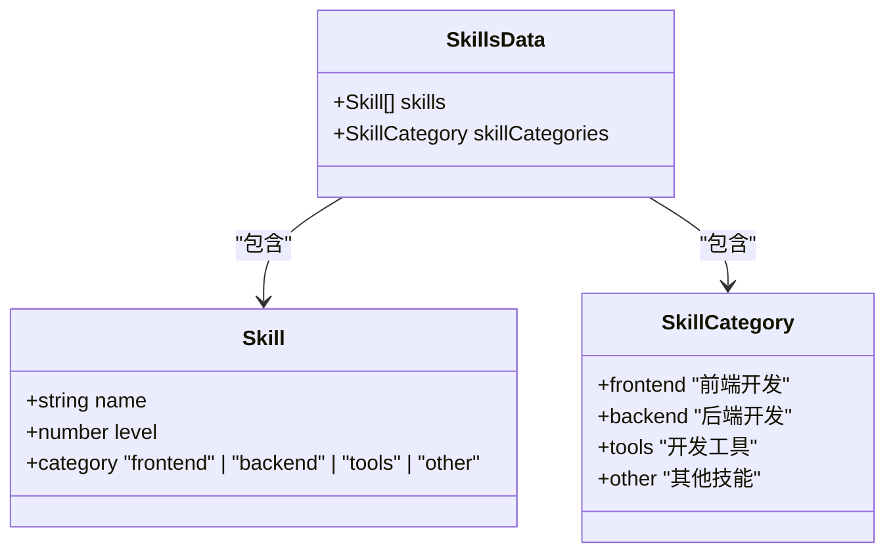
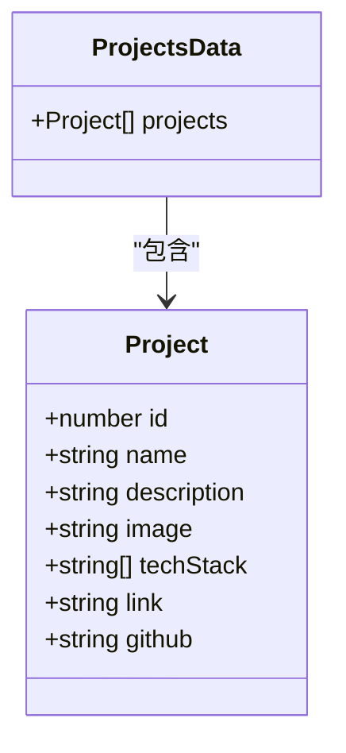
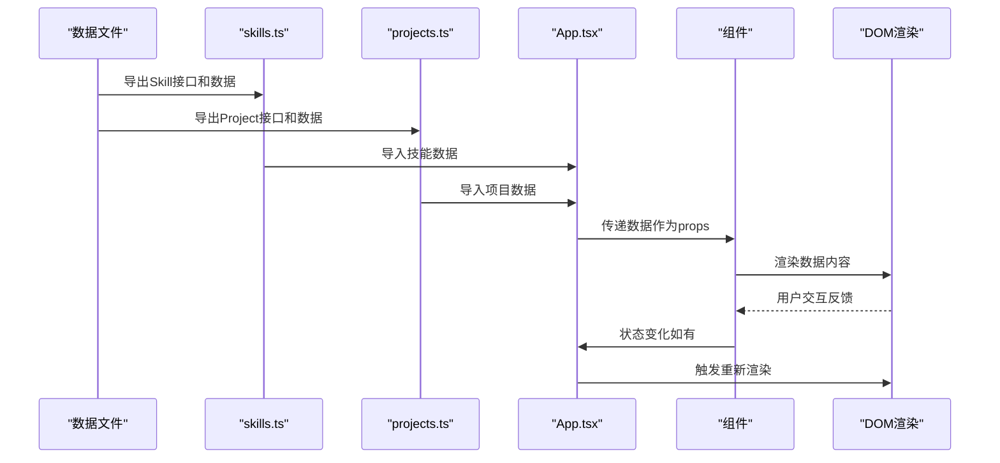
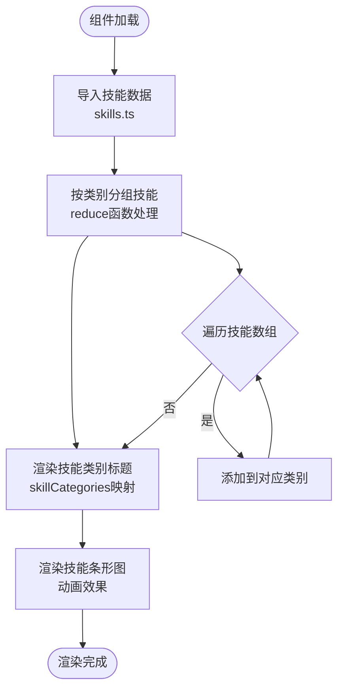
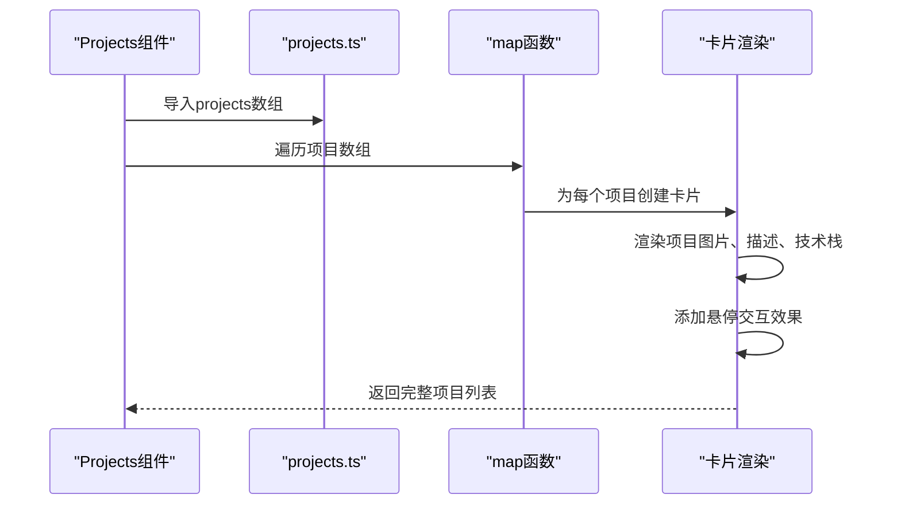
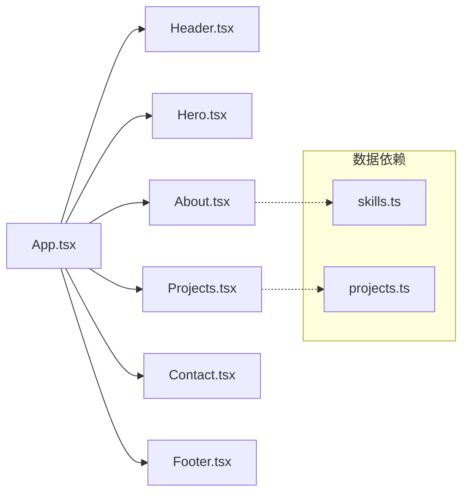
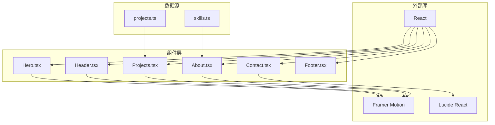
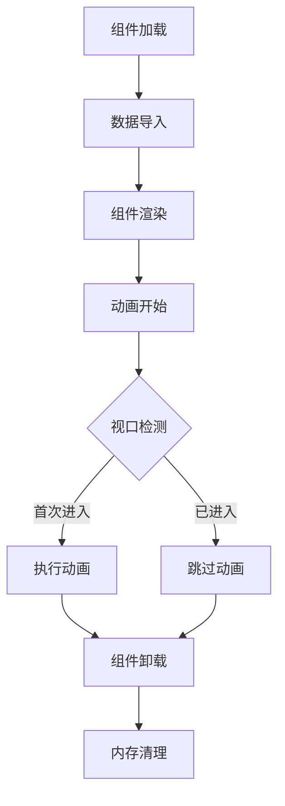

# 数据流设计

<cite>
**本文档引用的文件**
- [skills.ts](file://portfolio/src/data/skills.ts)
- [projects.ts](file://portfolio/src/data/projects.ts)
- [App.tsx](file://portfolio/src/App.tsx)
- [Projects.tsx](file://portfolio/src/components/Projects.tsx)
- [About.tsx](file://portfolio/src/components/About.tsx)
- [Hero.tsx](file://portfolio/src/components/Hero.tsx)
- [Header.tsx](file://portfolio/src/components/Header.tsx)
- [Contact.tsx](file://portfolio/src/components/Contact.tsx)
- [Footer.tsx](file://portfolio/src/components/Footer.tsx)
- [main.tsx](file://portfolio/src/main.tsx)
- [package.json](file://portfolio/package.json)
- [tsconfig.json](file://portfolio/tsconfig.json)
</cite>

## 目录
1. [引言](#引言)
2. [项目结构](#项目结构)
3. [核心数据组件](#核心数据组件)
4. [架构概览](#架构概览)
5. [详细组件分析](#详细组件分析)
6. [依赖关系分析](#依赖关系分析)
7. [性能考虑](#性能考虑)
8. [故障排除指南](#故障排除指南)
9. [结论](#结论)

## 引言

AIWs项目是一个基于React和TypeScript构建的个人作品集网站。本项目采用声明式数据驱动的设计理念，通过清晰的数据流架构实现从数据定义到组件渲染的完整流程。本文档深入分析了项目的数据流设计，重点阐述TypeScript接口在数据模型中的作用、数据文件的设计模式、组件消费数据的方式以及响应式渲染机制。

## 项目结构

项目采用模块化组织结构，主要分为以下几个层次：

**图表来源**
- [main.tsx:1-12](file://portfolio/src/main.tsx#L1-L12)
- [App.tsx:1-28](file://portfolio/src/App.tsx#L1-L28)
- [skills.ts:1-39](file://portfolio/src/data/skills.ts#L1-L39)
- [projects.ts:1-49](file://portfolio/src/data/projects.ts#L1-L49)

**章节来源**
- [main.tsx:1-12](file://portfolio/src/main.tsx#L1-L12)
- [App.tsx:1-28](file://portfolio/src/App.tsx#L1-L28)

## 核心数据组件

### TypeScript接口设计

项目使用TypeScript接口严格定义数据结构，确保类型安全和开发体验。

#### 技能数据接口

**图表来源**
- [skills.ts:2-6](file://portfolio/src/data/skills.ts#L2-L6)
- [skills.ts:33-38](file://portfolio/src/data/skills.ts#L33-L38)

#### 项目数据接口

**图表来源**
- [projects.ts:2-10](file://portfolio/src/data/projects.ts#L2-L10)

**章节来源**
- [skills.ts:1-39](file://portfolio/src/data/skills.ts#L1-L39)
- [projects.ts:1-49](file://portfolio/src/data/projects.ts#L1-L49)

## 架构概览

项目采用单向数据流架构，数据从数据文件流向组件，组件通过props接收数据并进行渲染。

**图表来源**
- [skills.ts:8-31](file://portfolio/src/data/skills.ts#L8-L31)
- [projects.ts:12-48](file://portfolio/src/data/projects.ts#L12-L48)
- [App.tsx:12-25](file://portfolio/src/App.tsx#L12-L25)

## 详细组件分析

### 技能展示组件（About.tsx）

About组件负责展示技能数据，采用按类别分组的展示方式。

#### 数据消费模式

**图表来源**
- [About.tsx:9-16](file://portfolio/src/components/About.tsx#L9-L16)
- [About.tsx:118-144](file://portfolio/src/components/About.tsx#L118-L144)

#### 技能条形图渲染逻辑

组件使用Framer Motion实现技能水平的动画展示：

1. **数据准备阶段**：通过`reduce`函数将技能数组按类别分组
2. **渲染阶段**：使用`whileInView`触发器实现视口检测
3. **动画阶段**：通过`width`属性的动画实现技能水平的增长效果

**章节来源**
- [About.tsx:1-151](file://portfolio/src/components/About.tsx#L1-L151)

### 项目展示组件（Projects.tsx）

Projects组件展示项目数据，采用卡片布局和悬停效果。

#### 数据消费模式

**图表来源**
- [Projects.tsx:60-125](file://portfolio/src/components/Projects.tsx#L60-L125)

#### 项目卡片交互设计

组件实现了多层次的用户交互：

1. **基础渲染**：显示项目基本信息和图片占位符
2. **悬停效果**：显示链接按钮和GitHub按钮
3. **动画过渡**：使用Framer Motion实现平滑的视觉效果

**章节来源**
- [Projects.tsx:1-151](file://portfolio/src/components/Projects.tsx#L1-L151)

### 应用主组件（App.tsx）

App组件作为应用的容器，组合各个页面组件。

#### 组件组合模式

**图表来源**
- [App.tsx:1-6](file://portfolio/src/App.tsx#L1-L6)

**章节来源**
- [App.tsx:1-28](file://portfolio/src/App.tsx#L1-L28)

## 依赖关系分析

### 数据依赖链

项目的数据流遵循严格的依赖关系：

**图表来源**
- [skills.ts:1-39](file://portfolio/src/data/skills.ts#L1-L39)
- [projects.ts:1-49](file://portfolio/src/data/projects.ts#L1-L49)
- [package.json:12-16](file://portfolio/package.json#L12-L16)

### 类型安全保证

项目通过TypeScript接口确保数据的类型安全：

1. **编译时检查**：所有数据访问在编译时进行类型验证
2. **IDE支持**：提供智能提示和自动补全
3. **重构安全**：修改数据结构时能够快速发现潜在问题

**章节来源**
- [package.json:1-37](file://portfolio/package.json#L1-L37)
- [tsconfig.json:1-8](file://portfolio/tsconfig.json#L1-L8)

## 性能考虑

### 数据访问优化

项目采用直接导入的方式访问数据，具有以下优势：

1. **Tree Shaking支持**：未使用的数据不会被打包
2. **运行时开销小**：数据在编译时内联到组件中
3. **缓存友好**：数据作为静态资源被浏览器缓存

### 渲染性能优化

组件层面采用了多种性能优化策略：

1. **视口检测**：使用`whileInView`只在元素进入视口时执行动画
2. **条件渲染**：GitHub链接根据数据存在性动态显示
3. **动画优化**：使用`viewport={{ once: true }}`避免重复动画

### 内存管理

**图表来源**
- [About.tsx:133-135](file://portfolio/src/components/About.tsx#L133-L135)
- [Projects.tsx:56-58](file://portfolio/src/components/Projects.tsx#L56-L58)

## 故障排除指南

### 常见数据问题

1. **数据类型不匹配**
   - 症状：TypeScript编译错误
   - 解决方案：检查接口定义与实际数据结构的一致性

2. **数据缺失**
   - 症状：组件渲染异常或空白
   - 解决方案：添加数据默认值或条件渲染检查

3. **循环依赖**
   - 症状：模块导入失败
   - 解决方案：重构数据结构，避免双向导入

### 性能问题诊断

1. **渲染卡顿**
   - 检查：动画数量和复杂度
   - 优化：减少同时执行的动画数量

2. **内存泄漏**
   - 检查：事件监听器是否正确清理
   - 解决：在组件卸载时移除监听器

### 调试技巧

1. **数据流追踪**：使用浏览器开发者工具监控组件渲染
2. **类型检查**：利用TypeScript的类型推断功能
3. **性能分析**：使用React DevTools Profiler分析渲染性能

**章节来源**
- [Header.tsx:20-41](file://portfolio/src/components/Header.tsx#L20-L41)

## 结论

AIWs项目展现了现代React应用的数据流设计最佳实践。通过TypeScript接口定义严格的数据模型，采用模块化的数据文件组织，结合组件化的渲染架构，实现了清晰、可维护且高性能的数据驱动应用。

项目的核心优势包括：

1. **类型安全**：完整的TypeScript类型系统确保数据完整性
2. **模块化设计**：清晰的数据和组件分离，便于维护和扩展
3. **性能优化**：合理的渲染策略和动画控制
4. **用户体验**：流畅的动画效果和响应式交互

这种数据流设计模式可以作为类似项目的参考模板，在保持代码质量的同时实现高效的开发和部署。