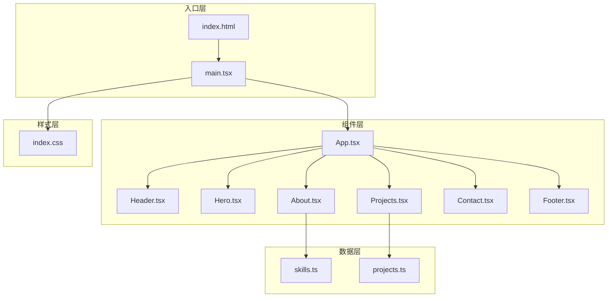
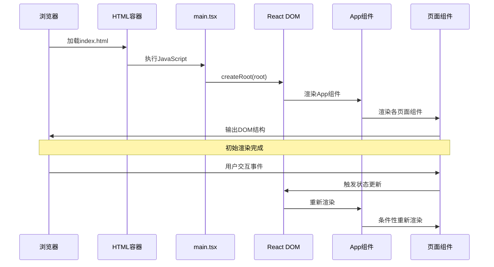
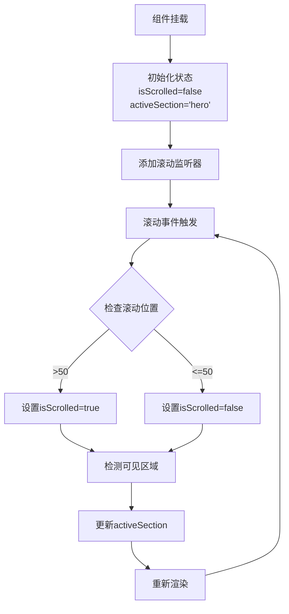
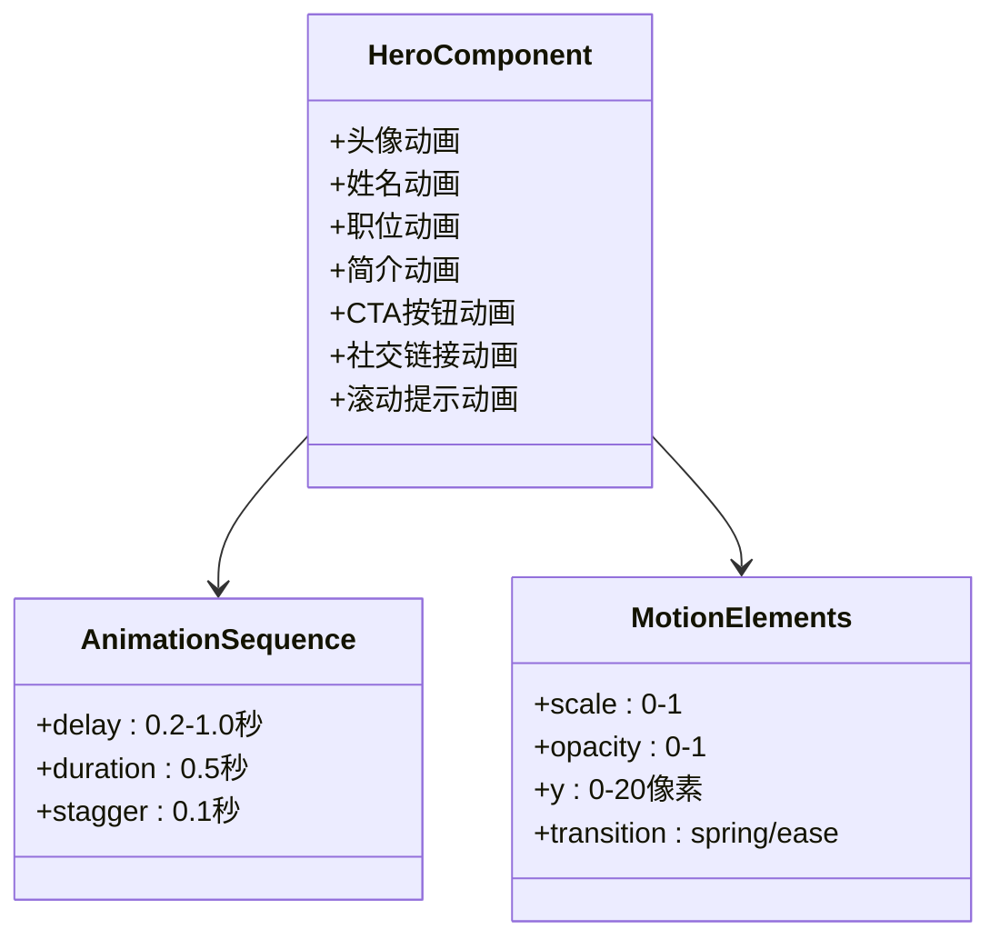

# 整体架构

<cite>
**本文档引用的文件**
- [main.tsx](file://portfolio/src/main.tsx)
- [App.tsx](file://portfolio/src/App.tsx)
- [Header.tsx](file://portfolio/src/components/Header.tsx)
- [Hero.tsx](file://portfolio/src/components/Hero.tsx)
- [About.tsx](file://portfolio/src/components/About.tsx)
- [Projects.tsx](file://portfolio/src/components/Projects.tsx)
- [Contact.tsx](file://portfolio/src/components/Contact.tsx)
- [Footer.tsx](file://portfolio/src/components/Footer.tsx)
- [skills.ts](file://portfolio/src/data/skills.ts)
- [projects.ts](file://portfolio/src/data/projects.ts)
- [index.css](file://portfolio/src/index.css)
- [index.html](file://portfolio/index.html)
- [package.json](file://portfolio/package.json)
- [vite.config.ts](file://portfolio/vite.config.ts)
</cite>

## 目录
1. [引言](#引言)
2. [项目结构](#项目结构)
3. [核心组件](#核心组件)
4. [架构总览](#架构总览)
5. [详细组件分析](#详细组件分析)
6. [依赖关系分析](#依赖关系分析)
7. [性能考量](#性能考量)
8. [故障排除指南](#故障排除指南)
9. [结论](#结论)

## 引言
本项目是一个基于 React 19 的单页应用（SPA），采用现代前端技术栈构建，包括 Vite 构建工具、TypeScript 类型系统、Tailwind CSS 样式框架以及 Framer Motion 动画库。应用采用组件化架构设计，通过单一入口点启动，使用 React 19 的严格模式进行渲染，形成清晰的组件树结构。

## 项目结构
项目采用按功能模块组织的目录结构，主要分为以下层次：
- **入口层**：包含应用启动入口和 HTML 容器
- **组件层**：包含页面级组件和基础 UI 组件
- **数据层**：包含静态数据和类型定义
- **样式层**：包含全局样式和 Tailwind 配置



**图表来源**
- [main.tsx:1-12](file://portfolio/src/main.tsx#L1-L12)
- [App.tsx:1-28](file://portfolio/src/App.tsx#L1-L28)
- [skills.ts:1-39](file://portfolio/src/data/skills.ts#L1-L39)
- [projects.ts:1-49](file://portfolio/src/data/projects.ts#L1-L49)

**章节来源**
- [main.tsx:1-12](file://portfolio/src/main.tsx#L1-L12)
- [index.html:1-14](file://portfolio/index.html#L1-L14)
- [package.json:1-37](file://portfolio/package.json#L1-L37)

## 核心组件
应用的核心由五个主要页面组件构成，每个组件负责特定的功能区域：

### 主容器组件 App
App.tsx 作为应用的根组件，采用函数式组件设计，负责协调各个页面组件的布局和渲染。该组件实现了以下关键特性：
- 使用深色主题背景，提供良好的视觉体验
- 有序排列页面组件，确保内容的逻辑流
- 通过 props 传递实现组件间的数据共享

### 页面组件职责
- **Header**：提供导航栏功能，包含滚动检测和活动状态管理
- **Hero**：展示个人主页的主要信息和引导用户操作
- **About**：展示个人信息和技能详情
- **Projects**：展示项目作品集
- **Contact**：提供联系方式和社交链接
- **Footer**：包含版权信息和返回顶部功能

**章节来源**
- [App.tsx:1-28](file://portfolio/src/App.tsx#L1-L28)
- [Header.tsx:1-129](file://portfolio/src/components/Header.tsx#L1-L129)
- [Hero.tsx:1-142](file://portfolio/src/components/Hero.tsx#L1-L142)
- [About.tsx:1-151](file://portfolio/src/components/About.tsx#L1-L151)
- [Projects.tsx:1-151](file://portfolio/src/components/Projects.tsx#L1-L151)
- [Contact.tsx:1-149](file://portfolio/src/components/Contact.tsx#L1-L149)
- [Footer.tsx:1-48](file://portfolio/src/components/Footer.tsx#L1-L48)

## 架构总览
应用采用自上而下的组件树架构，从入口点开始逐层向下渲染：

```mermaid
graph TD
ROOT[HTML Root Element<br/>id="root"] --> STRICT[React Strict Mode]
STRICT --> APP[App Component]
APP --> CONTAINER[Layout Container<br/>Dark Background]
CONTAINER --> HEADER[Header Component<br/>Navigation & Scroll Detection]
CONTAINER --> MAIN[Main Content Area]
MAIN --> HERO[Hero Section<br/>Personal Introduction]
MAIN --> ABOUT[About Section<br/>Personal Info & Skills]
MAIN --> PROJECTS[Projects Section<br/>Portfolio Showcase]
MAIN --> CONTACT[Contact Section<br/>Communication Channels]
CONTAINER --> FOOTER[Footer Component<br/>Copyright & Back to Top]
subgraph "数据层"
SKILLS[Skills Data<br/>Category & Level]
PROJECTS_DATA[Projects Data<br/>Tech Stack & Links]
end
ABOUT -.-> SKILLS
PROJECTS -.-> PROJECTS_DATA
```

**图表来源**
- [main.tsx:6-11](file://portfolio/src/main.tsx#L6-L11)
- [App.tsx:12-25](file://portfolio/src/App.tsx#L12-L25)
- [Header.tsx:16-41](file://portfolio/src/components/Header.tsx#L16-L41)
- [skills.ts:8-31](file://portfolio/src/data/skills.ts#L8-L31)
- [projects.ts:12-48](file://portfolio/src/data/projects.ts#L12-L48)

### 渲染流程序列
应用的渲染流程遵循标准的 React 生命周期：



**图表来源**
- [main.tsx:7-11](file://portfolio/src/main.tsx#L7-L11)
- [App.tsx:12-25](file://portfolio/src/App.tsx#L12-L25)

## 详细组件分析

### Header 组件分析
Header 组件实现了复杂的交互功能，包括滚动检测、活动状态管理和平滑滚动：



**图表来源**
- [Header.tsx:17-41](file://portfolio/src/components/Header.tsx#L17-L41)
- [Header.tsx:44-49](file://portfolio/src/components/Header.tsx#L44-L49)

### Hero 组件分析
Hero 组件采用渐进式动画策略，通过延迟和交错的动画效果提升用户体验：



**图表来源**
- [Hero.tsx:7-142](file://portfolio/src/components/Hero.tsx#L7-L142)

### About 组件分析
About 组件展示了复杂的数据处理和动画组合：

```mermaid
flowchart LR
DATA[原始技能数据] --> GROUP[按类别分组]
GROUP --> CONTAINER[容器变体配置]
CONTAINER --> ITEM[项目变体配置]
ITEM --> ANIMATION[交错动画]
ANIMATION --> RENDER[最终渲染]
subgraph "数据结构"
RAW[Skill[]]
GROUPED[Record<string, Skill[]>]
CATEGORIES[skillCategories]
end
DATA -.-> RAW
GROUP -.-> GROUPED
CATEGORIES -.-> GROUPED
```

**图表来源**
- [About.tsx:9-16](file://portfolio/src/components/About.tsx#L9-L16)
- [About.tsx:18-35](file://portfolio/src/components/About.tsx#L18-L35)
- [skills.ts:33-38](file://portfolio/src/data/skills.ts#L33-L38)

**章节来源**
- [Header.tsx:1-129](file://portfolio/src/components/Header.tsx#L1-L129)
- [Hero.tsx:1-142](file://portfolio/src/components/Hero.tsx#L1-L142)
- [About.tsx:1-151](file://portfolio/src/components/About.tsx#L1-L151)
- [Projects.tsx:1-151](file://portfolio/src/components/Projects.tsx#L1-L151)
- [Contact.tsx:1-149](file://portfolio/src/components/Contact.tsx#L1-L149)
- [Footer.tsx:1-48](file://portfolio/src/components/Footer.tsx#L1-L48)

## 依赖关系分析
应用的依赖关系呈现清晰的单向依赖结构：

```mermaid
graph TB
subgraph "运行时依赖"
REACT[react ^19.2.4]
REACTDOM[react-dom ^19.2.4]
FRAMER[framer-motion ^12.38.0]
LUCIDE[lucide-react ^0.487.0]
end
subgraph "开发时依赖"
VITE[vite ^8.0.4]
TYPESCRIPT[typescript ~6.0.2]
TAILWIND[tailwindcss ^4.2.2]
ESLINT[eslint ^9.39.4]
PREACT[@vitejs/plugin-react ^6.0.1]
end
subgraph "应用代码"
MAIN[main.tsx]
APP[App.tsx]
COMPONENTS[components/*]
DATA[data/*]
STYLES[index.css]
end
MAIN --> REACT
MAIN --> REACTDOM
APP --> REACT
COMPONENTS --> REACT
COMPONENTS --> FRAMER
COMPONENTS --> LUCIDE
DATA --> TYPESCRIPT
STYLES --> TAILWIND
MAIN -.-> VITE
MAIN -.-> PREACT
MAIN -.-> ESLINT
```

**图表来源**
- [package.json:12-35](file://portfolio/package.json#L12-L35)
- [vite.config.ts:1-9](file://portfolio/vite.config.ts#L1-L9)

**章节来源**
- [package.json:1-37](file://portfolio/package.json#L1-L37)
- [vite.config.ts:1-9](file://portfolio/vite.config.ts#L1-L9)

## 性能考量
应用在多个层面考虑了性能优化：

### 渲染性能
- **组件拆分**：将页面拆分为独立组件，支持条件渲染和懒加载
- **动画优化**：使用 GPU 加速的 CSS 变换而非昂贵的布局重排
- **事件节流**：滚动事件使用防抖处理，避免频繁重渲染

### 数据流优化
- **本地数据**：使用静态数据减少网络请求开销
- **状态管理**：采用 React 内置的状态管理，避免额外的依赖
- **内存管理**：组件卸载时自动清理事件监听器

### 构建优化
- **Tree Shaking**：按需导入动画和图标组件
- **代码分割**：Vite 支持自动代码分割
- **CSS 优化**：Tailwind CSS 提供原子化样式，减少 CSS 文件大小

## 故障排除指南
常见问题及解决方案：

### 组件渲染问题
- **症状**：组件不显示或显示异常
- **原因**：可能的样式冲突或依赖未正确安装
- **解决**：检查 Tailwind CSS 配置和依赖版本

### 动画异常
- **症状**：动画不流畅或不触发
- **原因**：Framer Motion 版本兼容性问题
- **解决**：确认 React 19 兼容性并检查动画配置

### 样式问题
- **症状**：颜色不正确或布局错乱
- **原因**：CSS 变量未正确设置
- **解决**：检查 `index.css` 中的主题变量定义

**章节来源**
- [index.css:3-21](file://portfolio/src/index.css#L3-L21)
- [main.tsx:1-12](file://portfolio/src/main.tsx#L1-L12)

## 结论
AIWs 项目展现了现代 React SPA 应用的最佳实践。通过清晰的组件层次结构、合理的数据流设计和优秀的性能优化，该项目为个人作品集展示提供了完整的解决方案。架构设计具有良好的可维护性和可扩展性，能够适应未来功能的扩展和演进。

项目成功地结合了：
- **现代化技术栈**：React 19、TypeScript、Vite
- **优秀的用户体验**：流畅的动画和响应式设计
- **清晰的架构**：模块化的组件设计和明确的职责分离
- **性能优化**：多层面的性能考量和优化策略

这种架构为类似的应用开发提供了良好的参考模板，特别是在组件化设计、状态管理和性能优化方面。