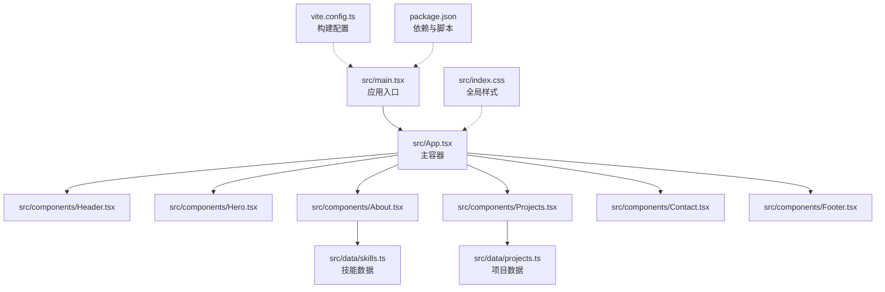
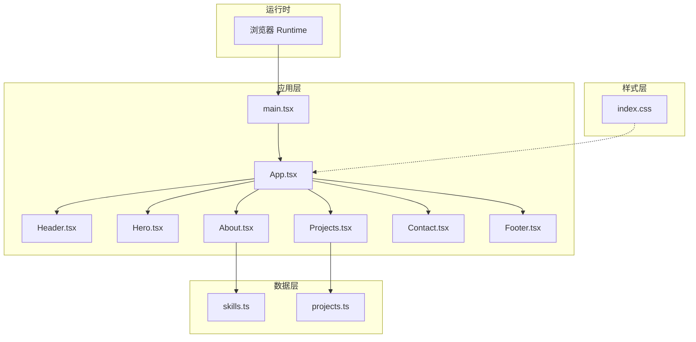
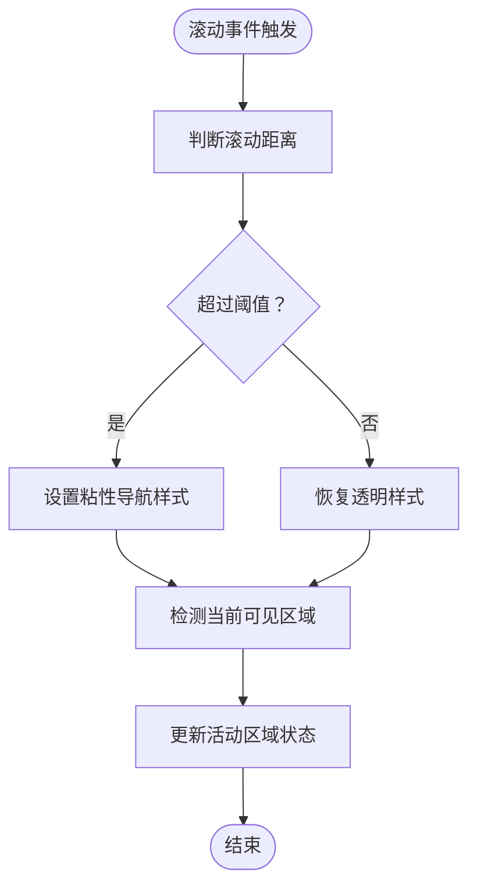
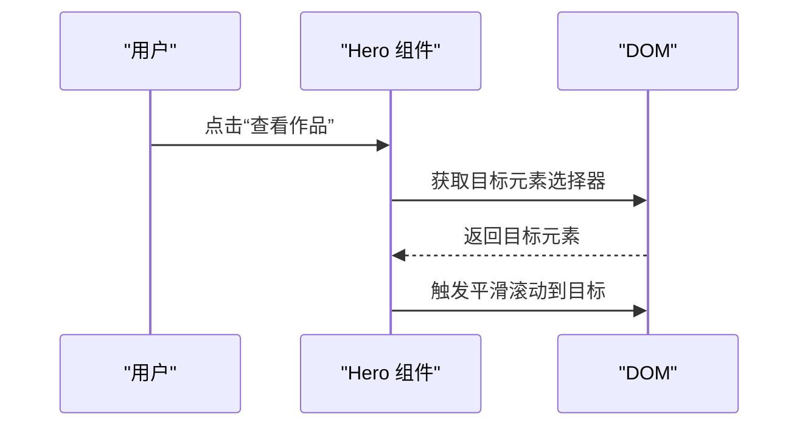
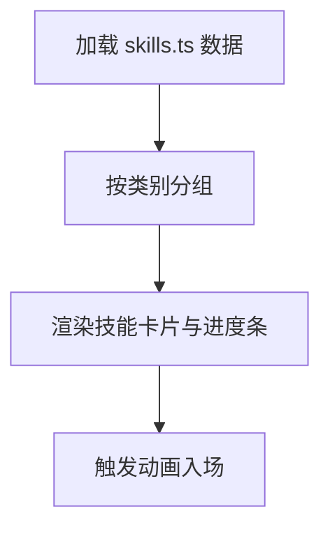
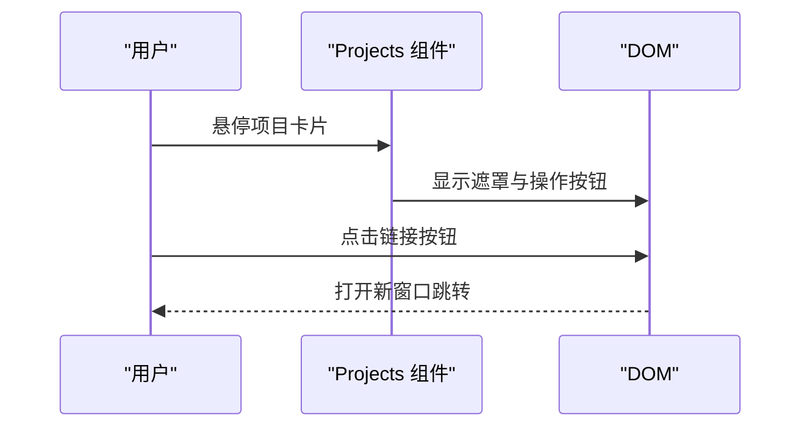
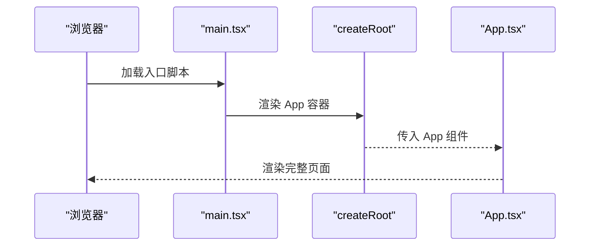
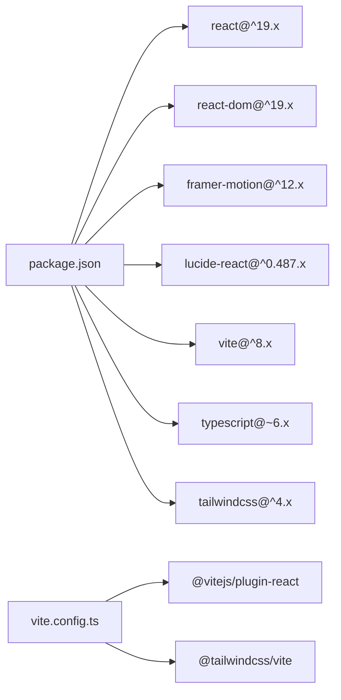
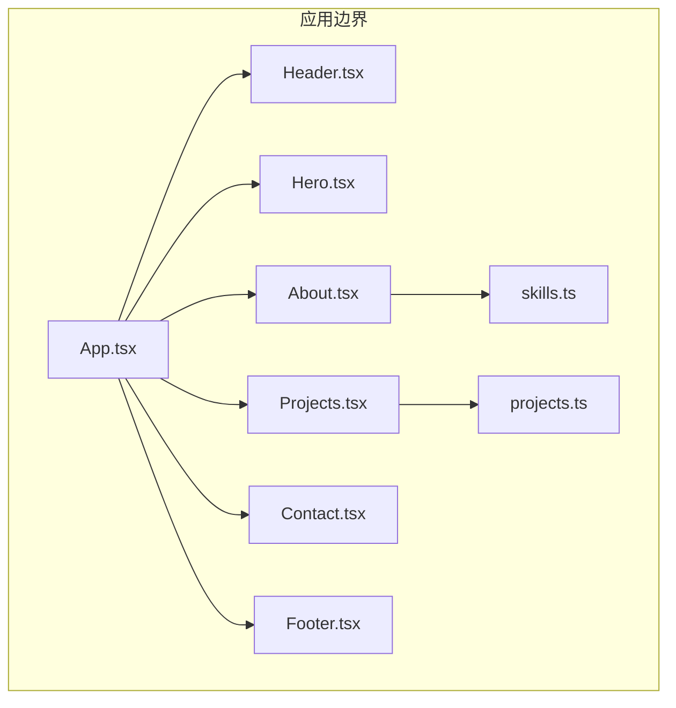

# 架构设计

<cite>
**本文引用的文件**
- [main.tsx](file://portfolio/src/main.tsx)
- [App.tsx](file://portfolio/src/App.tsx)
- [Header.tsx](file://portfolio/src/components/Header.tsx)
- [Hero.tsx](file://portfolio/src/components/Hero.tsx)
- [About.tsx](file://portfolio/src/components/About.tsx)
- [Projects.tsx](file://portfolio/src/components/Projects.tsx)
- [Contact.tsx](file://portfolio/src/components/Contact.tsx)
- [Footer.tsx](file://portfolio/src/components/Footer.tsx)
- [projects.ts](file://portfolio/src/data/projects.ts)
- [skills.ts](file://portfolio/src/data/skills.ts)
- [index.css](file://portfolio/src/index.css)
- [package.json](file://portfolio/package.json)
- [vite.config.ts](file://portfolio/vite.config.ts)
- [tsconfig.json](file://portfolio/tsconfig.json)
- [README.md](file://portfolio/README.md)
</cite>

## 目录
1. [引言](#引言)
2. [项目结构](#项目结构)
3. [核心组件](#核心组件)
4. [架构总览](#架构总览)
5. [详细组件分析](#详细组件分析)
6. [依赖分析](#依赖分析)
7. [性能考量](#性能考量)
8. [故障排查指南](#故障排查指南)
9. [结论](#结论)
10. [附录](#附录)

## 引言
本项目是一个基于 React 的静态作品集网站，采用组件化架构，遵循单一职责原则，将页面划分为多个独立的功能模块（Header、Hero、About、Projects、Contact、Footer）。应用以 main.tsx 为入口，App.tsx 作为主容器组合各页面组件；数据通过独立的数据模块提供；样式使用 Tailwind CSS 与自定义深色主题；构建工具采用 Vite，开发体验与性能兼顾；类型安全由 TypeScript 提供保障。

## 项目结构
项目采用“按功能域组织”的目录结构，核心入口与主容器位于 src 目录，组件与数据分离，便于维护与扩展。

**图表来源**
- [main.tsx:1-12](file://portfolio/src/main.tsx#L1-L12)
- [App.tsx:1-28](file://portfolio/src/App.tsx#L1-L28)
- [Header.tsx:1-129](file://portfolio/src/components/Header.tsx#L1-L129)
- [Hero.tsx:1-142](file://portfolio/src/components/Hero.tsx#L1-L142)
- [About.tsx:1-151](file://portfolio/src/components/About.tsx#L1-L151)
- [Projects.tsx:1-151](file://portfolio/src/components/Projects.tsx#L1-L151)
- [Contact.tsx:1-149](file://portfolio/src/components/Contact.tsx#L1-L149)
- [Footer.tsx:1-48](file://portfolio/src/components/Footer.tsx#L1-L48)
- [skills.ts:1-39](file://portfolio/src/data/skills.ts#L1-L39)
- [projects.ts:1-49](file://portfolio/src/data/projects.ts#L1-L49)
- [index.css:1-46](file://portfolio/src/index.css#L1-L46)
- [vite.config.ts:1-9](file://portfolio/vite.config.ts#L1-L9)
- [package.json:1-37](file://portfolio/package.json#L1-L37)

**章节来源**
- [main.tsx:1-12](file://portfolio/src/main.tsx#L1-L12)
- [App.tsx:1-28](file://portfolio/src/App.tsx#L1-L28)
- [package.json:1-37](file://portfolio/package.json#L1-L37)
- [vite.config.ts:1-9](file://portfolio/vite.config.ts#L1-L9)
- [tsconfig.json:1-8](file://portfolio/tsconfig.json#L1-L8)

## 核心组件
- 入口层：main.tsx 负责挂载根节点并渲染 App 容器，启用严格模式。
- 主容器：App.tsx 组合 Header、Hero、About、Projects、Contact、Footer，形成页面骨架。
- 页面组件：每个页面组件负责单一区域的渲染与交互，如导航、英雄区、关于我、项目展示、联系方式、页脚。
- 数据模块：skills.ts 与 projects.ts 提供类型化的静态数据，供对应组件消费。
- 样式层：index.css 引入 Tailwind 并定义深色主题变量与全局样式。

这些组件共同实现“单一职责”：每个组件只负责一个页面区域或功能，避免职责耦合，提升可测试性与可维护性。

**章节来源**
- [main.tsx:1-12](file://portfolio/src/main.tsx#L1-L12)
- [App.tsx:1-28](file://portfolio/src/App.tsx#L1-L28)
- [skills.ts:1-39](file://portfolio/src/data/skills.ts#L1-L39)
- [projects.ts:1-49](file://portfolio/src/data/projects.ts#L1-L49)
- [index.css:1-46](file://portfolio/src/index.css#L1-L46)

## 架构总览
整体架构采用“入口 -> 容器 -> 页面组件 -> 数据/样式”的分层设计，组件间通过 props 传递数据，内部通过状态管理（如滚动监听）实现局部行为控制。

**图表来源**
- [main.tsx:1-12](file://portfolio/src/main.tsx#L1-L12)
- [App.tsx:1-28](file://portfolio/src/App.tsx#L1-L28)
- [Header.tsx:1-129](file://portfolio/src/components/Header.tsx#L1-L129)
- [Hero.tsx:1-142](file://portfolio/src/components/Hero.tsx#L1-L142)
- [About.tsx:1-151](file://portfolio/src/components/About.tsx#L1-L151)
- [Projects.tsx:1-151](file://portfolio/src/components/Projects.tsx#L1-L151)
- [Contact.tsx:1-149](file://portfolio/src/components/Contact.tsx#L1-L149)
- [Footer.tsx:1-48](file://portfolio/src/components/Footer.tsx#L1-L48)
- [skills.ts:1-39](file://portfolio/src/data/skills.ts#L1-L39)
- [projects.ts:1-49](file://portfolio/src/data/projects.ts#L1-L49)
- [index.css:1-46](file://portfolio/src/index.css#L1-L46)

## 详细组件分析

### Header 组件分析
- 职责：顶部导航栏，包含品牌标识、导航链接、移动端菜单、滚动时的视觉反馈与活动区域指示。
- 状态与逻辑：使用滚动事件计算是否需要显示“粘性”导航与当前可见区域，用于高亮活动导航项。
- 交互：平滑滚动到目标区域，使用动画库增强交互体验。
- 可扩展性：导航链接配置集中管理，便于新增/修改导航项。

**图表来源**
- [Header.tsx:17-41](file://portfolio/src/components/Header.tsx#L17-L41)

**章节来源**
- [Header.tsx:1-129](file://portfolio/src/components/Header.tsx#L1-L129)

### Hero 组件分析
- 职责：首页大标题区域，包含头像、姓名、职位、简介、CTA 按钮与社交链接。
- 动画：使用动画库对元素进行入场动画，提升视觉体验。
- 交互：点击按钮平滑滚动到项目或联系区域。

**图表来源**
- [Hero.tsx:68-92](file://portfolio/src/components/Hero.tsx#L68-L92)

**章节来源**
- [Hero.tsx:1-142](file://portfolio/src/components/Hero.tsx#L1-L142)

### About 组件分析
- 职责：关于我区域，包含个人介绍与技能展示。
- 数据：从 skills.ts 读取技能数据，按类别聚合并渲染。
- 动画：使用容器/子项变体实现交错入场动画，提升加载体验。
- 可扩展性：技能类别与映射集中管理，便于新增类别。

**图表来源**
- [About.tsx:9-16](file://portfolio/src/components/About.tsx#L9-L16)
- [skills.ts:1-39](file://portfolio/src/data/skills.ts#L1-L39)

**章节来源**
- [About.tsx:1-151](file://portfolio/src/components/About.tsx#L1-L151)
- [skills.ts:1-39](file://portfolio/src/data/skills.ts#L1-L39)

### Projects 组件分析
- 职责：项目展示区域，渲染项目卡片列表。
- 数据：从 projects.ts 读取项目数据，渲染技术栈标签与链接。
- 交互：悬停显示外部链接与 GitHub 链接按钮，增强可访问性。
- 可扩展性：项目数据结构清晰，便于新增项目与技术栈。

**图表来源**
- [Projects.tsx:72-99](file://portfolio/src/components/Projects.tsx#L72-L99)
- [projects.ts:1-49](file://portfolio/src/data/projects.ts#L1-L49)

**章节来源**
- [Projects.tsx:1-151](file://portfolio/src/components/Projects.tsx#L1-L151)
- [projects.ts:1-49](file://portfolio/src/data/projects.ts#L1-L49)

### Contact 组件分析
- 职责：联系方式区域，展示邮箱、GitHub、LinkedIn、Twitter 等链接。
- 设计：使用卡片布局与图标，悬停效果增强交互反馈。
- 可扩展性：联系项配置集中管理，便于新增/修改渠道。

**章节来源**
- [Contact.tsx:1-149](file://portfolio/src/components/Contact.tsx#L1-L149)

### Footer 组件分析
- 职责：页脚区域，包含版权信息与返回顶部按钮。
- 交互：点击按钮平滑滚动到页面顶部。

**章节来源**
- [Footer.tsx:1-48](file://portfolio/src/components/Footer.tsx#L1-L48)

### App 与 main.tsx 分析
- main.tsx：创建根节点并渲染应用，启用严格模式。
- App.tsx：组合所有页面组件，统一背景与布局。

**图表来源**
- [main.tsx:7-11](file://portfolio/src/main.tsx#L7-L11)
- [App.tsx:12-25](file://portfolio/src/App.tsx#L12-L25)

**章节来源**
- [main.tsx:1-12](file://portfolio/src/main.tsx#L1-L12)
- [App.tsx:1-28](file://portfolio/src/App.tsx#L1-L28)

## 依赖分析
- 运行时依赖：React 19、React DOM 19、framer-motion（动画）、lucide-react（图标）。
- 开发依赖：Vite（构建与开发服务器）、@vitejs/plugin-react（React 支持）、Tailwind CSS（原子化样式）、TypeScript（类型检查）。
- 构建配置：vite.config.ts 启用 React 与 Tailwind 插件；package.json 定义 dev/build/preview/lint 脚本。

**图表来源**
- [package.json:12-34](file://portfolio/package.json#L12-L34)
- [vite.config.ts:1-9](file://portfolio/vite.config.ts#L1-L9)

**章节来源**
- [package.json:1-37](file://portfolio/package.json#L1-L37)
- [vite.config.ts:1-9](file://portfolio/vite.config.ts#L1-L9)
- [tsconfig.json:1-8](file://portfolio/tsconfig.json#L1-L8)

## 性能考量
- 构建性能：Vite 提供快速冷启动与热更新，开发体验优秀；生产构建优化打包体积。
- 运行时性能：组件按需渲染，动画使用轻量级库；滚动监听在组件卸载时清理事件，避免内存泄漏。
- 样式性能：Tailwind 原子类减少重复样式，全局深色主题变量统一颜色体系。
- 类型安全：TypeScript 提供编译期类型检查，降低运行时错误风险。

## 故障排查指南
- 构建失败：检查 package.json 中依赖版本与脚本命令；确认 Vite 与插件安装正确。
- 样式异常：确认 index.css 已引入 Tailwind；检查深色主题变量是否被覆盖。
- 动画不生效：确认 framer-motion 已安装并在组件中正确使用；检查浏览器兼容性。
- 滚动监听无效：确认组件卸载时移除事件监听；检查目标元素 ID 是否存在。

**章节来源**
- [README.md:1-74](file://portfolio/README.md#L1-L74)
- [index.css:1-46](file://portfolio/src/index.css#L1-L46)

## 结论
本项目采用清晰的组件化架构，入口与容器职责明确，页面组件各司其职，数据与样式分离，结合 Vite、TypeScript 与 Tailwind 的现代化技术栈，实现了良好的可维护性与可扩展性。未来可在以下方面进一步演进：引入状态管理库以承载跨组件共享的状态；增加路由以支持多页面场景；完善测试策略覆盖关键交互流程。

## 附录
- 系统边界图：应用边界由 main.tsx 与 App.tsx 定义，页面组件位于应用边界内，数据模块与样式模块为应用提供输入与外观。
- 组件关系图：App.tsx 作为主容器聚合各页面组件；页面组件之间无直接依赖，仅通过 props 与数据模块交互。

**图表来源**
- [App.tsx:1-28](file://portfolio/src/App.tsx#L1-L28)
- [Header.tsx:1-129](file://portfolio/src/components/Header.tsx#L1-L129)
- [Hero.tsx:1-142](file://portfolio/src/components/Hero.tsx#L1-L142)
- [About.tsx:1-151](file://portfolio/src/components/About.tsx#L1-L151)
- [Projects.tsx:1-151](file://portfolio/src/components/Projects.tsx#L1-L151)
- [Contact.tsx:1-149](file://portfolio/src/components/Contact.tsx#L1-L149)
- [Footer.tsx:1-48](file://portfolio/src/components/Footer.tsx#L1-L48)
- [skills.ts:1-39](file://portfolio/src/data/skills.ts#L1-L39)
- [projects.ts:1-49](file://portfolio/src/data/projects.ts#L1-L49)