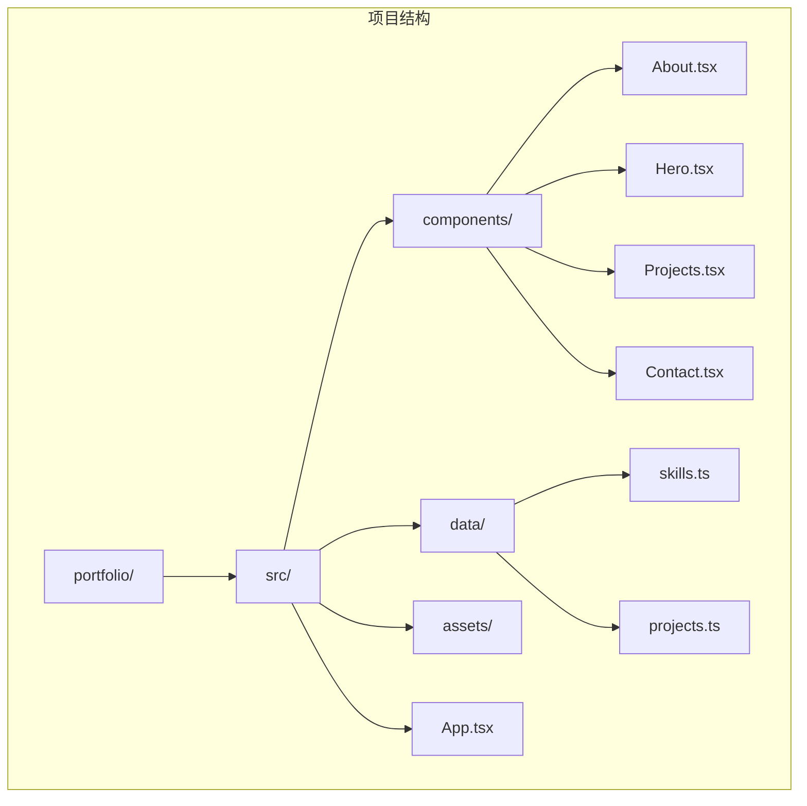
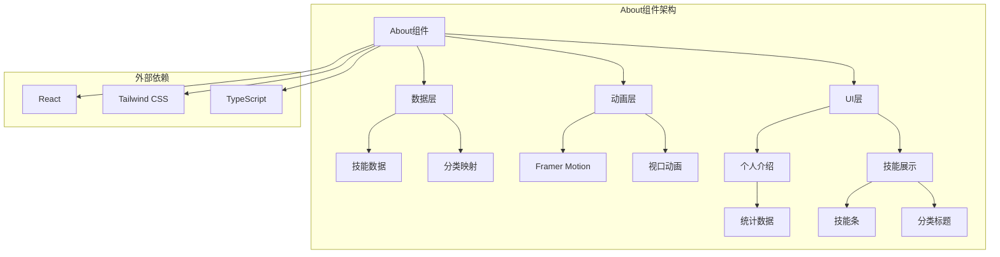
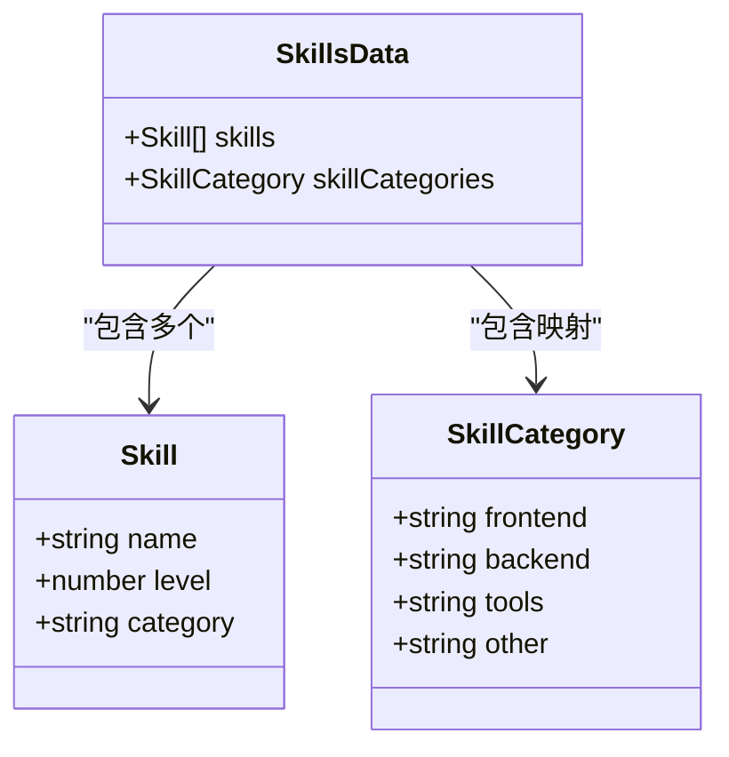
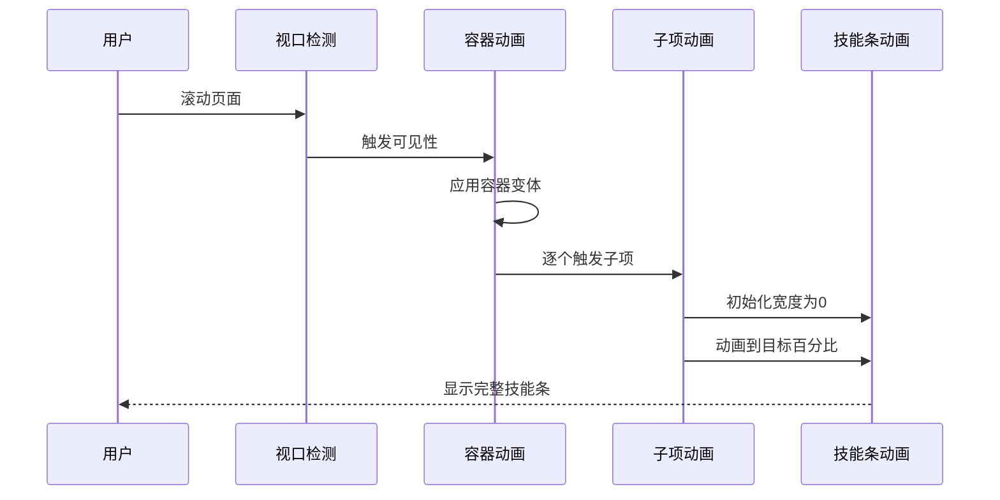
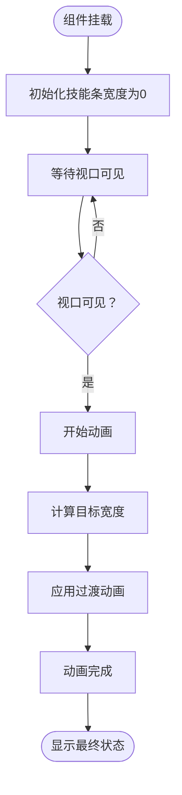
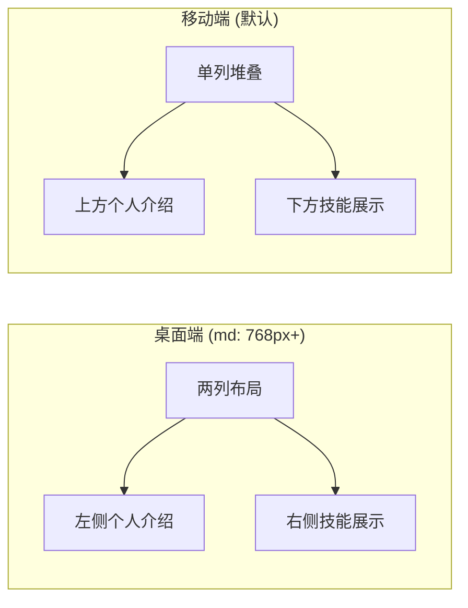
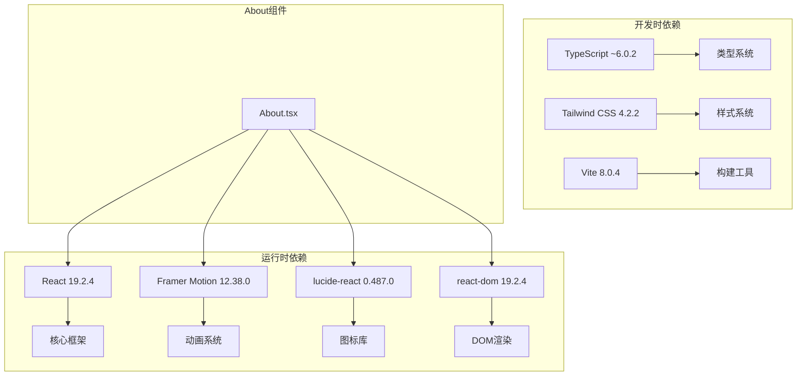

# About 关于我组件

<cite>
**本文档引用的文件**
- [About.tsx](file://portfolio/src/components/About.tsx)
- [skills.ts](file://portfolio/src/data/skills.ts)
- [App.tsx](file://portfolio/src/App.tsx)
- [package.json](file://portfolio/package.json)
- [index.css](file://portfolio/src/index.css)
- [vite.config.ts](file://portfolio/vite.config.ts)
</cite>

## 目录
1. [简介](#简介)
2. [项目结构](#项目结构)
3. [核心组件](#核心组件)
4. [架构概览](#架构概览)
5. [详细组件分析](#详细组件分析)
6. [依赖分析](#依赖分析)
7. [性能考虑](#性能考虑)
8. [故障排除指南](#故障排除指南)
9. [结论](#结论)
10. [附录](#附录)

## 简介

About组件是个人作品集网站的核心展示模块，专门用于展示开发者的技术技能和个人信息。该组件采用现代化的React + TypeScript + Framer Motion技术栈构建，实现了流畅的动画效果和响应式设计。组件通过数据驱动的方式展示技能水平，使用渐变色彩和流畅动画为用户带来优质的视觉体验。

## 项目结构

该项目采用基于功能的模块化组织方式，About组件位于components目录下，与其它页面组件并列存放。数据层独立管理，技能数据存储在专门的数据文件中，便于维护和扩展。

**图表来源**
- [About.tsx:1-151](file://portfolio/src/components/About.tsx#L1-L151)
- [skills.ts:1-39](file://portfolio/src/data/skills.ts#L1-L39)

**章节来源**
- [About.tsx:1-151](file://portfolio/src/components/About.tsx#L1-L151)
- [skills.ts:1-39](file://portfolio/src/data/skills.ts#L1-L39)

## 核心组件

### About组件概述

About组件是一个无状态函数组件，负责渲染个人介绍和技能展示两个主要部分。组件采用两列布局，在桌面端并排显示，移动端自动调整为单列堆叠。

### 主要特性

1. **数据驱动渲染**：通过外部数据源动态生成技能列表
2. **渐进式动画**：使用Framer Motion实现层次化的进入动画
3. **响应式设计**：适配不同屏幕尺寸的显示需求
4. **分类组织**：按技能类型对技能进行逻辑分组

**章节来源**
- [About.tsx:8-151](file://portfolio/src/components/About.tsx#L8-L151)

## 架构概览

About组件采用清晰的分层架构，实现了关注点分离和高内聚低耦合的设计原则。

**图表来源**
- [About.tsx:1-151](file://portfolio/src/components/About.tsx#L1-L151)
- [skills.ts:1-39](file://portfolio/src/data/skills.ts#L1-L39)

## 详细组件分析

### 数据结构设计

#### 技能接口定义

技能数据采用强类型接口定义，确保数据结构的一致性和类型安全。

**图表来源**
- [skills.ts:2-6](file://portfolio/src/data/skills.ts#L2-L6)
- [skills.ts:33-38](file://portfolio/src/data/skills.ts#L33-L38)

#### 技能数据组织

技能数据按照功能领域进行分类，支持四种主要类别：
- 前端开发：React、TypeScript、Vue.js等
- 后端开发：Node.js、Python、数据库等
- 开发工具：Git、Docker、VS Code等
- 其他技能：UI/UX设计、敏捷开发等

**章节来源**
- [skills.ts:8-31](file://portfolio/src/data/skills.ts#L8-L31)
- [skills.ts:33-38](file://portfolio/src/data/skills.ts#L33-L38)

### 动画系统实现

#### Framer Motion集成

About组件深度集成了Framer Motion动画库，实现了多层次的动画效果。

**图表来源**
- [About.tsx:18-35](file://portfolio/src/components/About.tsx#L18-L35)
- [About.tsx:131-138](file://portfolio/src/components/About.tsx#L131-L138)

#### 动画变体配置

组件定义了两种主要的动画变体：

1. **容器变体（Container Variants）**：控制整体动画的延迟和顺序
2. **子项变体（Item Variants）**：控制每个技能条的进入动画

**章节来源**
- [About.tsx:18-35](file://portfolio/src/components/About.tsx#L18-L35)

### 技能展示模块

#### 技能条动画机制

技能条采用渐进式动画展示，从0%平滑过渡到目标百分比。

**图表来源**
- [About.tsx:131-138](file://portfolio/src/components/About.tsx#L131-L138)

#### 分类组织策略

技能数据通过reduce方法按类别进行分组，实现逻辑清晰的组织结构。

**章节来源**
- [About.tsx:9-16](file://portfolio/src/components/About.tsx#L9-L16)
- [About.tsx:118-144](file://portfolio/src/components/About.tsx#L118-L144)

### 响应式布局设计

#### 移动优先策略

组件采用移动优先的设计理念，通过Tailwind CSS的响应式断点实现自适应布局。

**图表来源**
- [About.tsx:57-147](file://portfolio/src/components/About.tsx#L57-L147)

**章节来源**
- [About.tsx:57-147](file://portfolio/src/components/About.tsx#L57-L147)

## 依赖分析

### 外部依赖关系

About组件依赖于多个关键库来实现其功能特性。

**图表来源**
- [package.json:12-17](file://portfolio/package.json#L12-L17)
- [package.json:18-35](file://portfolio/package.json#L18-L35)

### 内部依赖关系

组件之间的依赖关系相对简单，主要体现在数据导入和组件组合上。

**章节来源**
- [About.tsx:1-2](file://portfolio/src/components/About.tsx#L1-L2)
- [App.tsx:1-6](file://portfolio/src/App.tsx#L1-L6)

## 性能考虑

### 动画性能优化

组件在动画性能方面采用了多项优化措施：

1. **视口一次性触发**：使用`viewport={{ once: true }}`确保动画只执行一次
2. **延迟优化**：合理设置动画延迟避免同时触发大量动画
3. **硬件加速**：利用transform属性实现GPU加速的动画效果

### 渲染性能

1. **分组渲染**：通过reduce方法预处理数据，减少渲染时的计算开销
2. **条件渲染**：仅在视口可见时才执行动画，避免不必要的计算
3. **CSS过渡**：使用CSS transition而非JavaScript动画实现更好的性能

## 故障排除指南

### 常见问题及解决方案

#### 动画不生效

**问题描述**：技能条动画没有正常显示

**可能原因**：
1. Framer Motion未正确安装或导入
2. 视口检测配置错误
3. 样式冲突导致动画被覆盖

**解决方案**：
1. 确认framer-motion版本兼容性
2. 检查whileInView配置是否正确
3. 验证CSS类名冲突

#### 数据显示异常

**问题描述**：技能数据没有正确显示

**可能原因**：
1. 数据导入路径错误
2. 接口定义不匹配
3. 类型转换问题

**解决方案**：
1. 验证数据文件路径
2. 检查Skill接口定义
3. 确保类型安全

**章节来源**
- [About.tsx:131-138](file://portfolio/src/components/About.tsx#L131-L138)
- [skills.ts:2-6](file://portfolio/src/data/skills.ts#L2-L6)

## 结论

About组件成功实现了数据驱动的技能展示功能，结合Framer Motion动画系统提供了优秀的用户体验。组件采用现代化的技术栈和最佳实践，具有良好的可维护性和扩展性。通过合理的架构设计和性能优化，组件能够在不同设备上提供一致的用户体验。

## 附录

### 技能数据操作指南

#### 添加新技能

1. 打开`src/data/skills.ts`文件
2. 在`skills`数组中添加新的技能对象
3. 确保`level`值在1-100范围内
4. 选择合适的`category`类型
5. 保存文件并重新加载页面

#### 修改现有技能

1. 定位到`skills`数组中的目标技能
2. 调整`level`数值更新技能熟练度
3. 如需更改分类，修改`category`字段
4. 保存文件并验证显示效果

#### 删除技能

1. 在`skills`数组中找到目标技能对象
2. 使用数组方法移除该对象
3. 确保删除后数组索引不会影响其他功能
4. 保存文件并测试界面显示

### 组件扩展建议

#### 功能扩展

1. **交互式技能编辑**：添加技能编辑功能，允许用户动态修改技能水平
2. **技能排序**：支持按熟练度或类别对技能进行排序
3. **技能标签**：为技能添加标签，便于分类筛选
4. **技能统计**：添加技能分布统计图表

#### 样式定制

1. **主题切换**：支持浅色/深色主题切换
2. **动画定制**：允许用户自定义动画速度和效果
3. **颜色方案**：提供多种渐变色彩方案
4. **布局选项**：支持不同的布局模式

#### 性能优化

1. **懒加载**：实现技能列表的懒加载
2. **虚拟滚动**：对于大量技能数据使用虚拟滚动
3. **缓存机制**：缓存已渲染的技能条以提高性能
4. **代码分割**：将动画逻辑拆分为独立模块

### 与其他组件的数据交互

About组件通过以下方式与其他组件进行数据交互：

1. **数据共享**：技能数据通过独立的数据文件供多个组件使用
2. **状态管理**：可以集成全局状态管理库如Redux或Context API
3. **事件通信**：通过事件系统实现组件间的消息传递
4. **路由集成**：与路由系统集成，支持页面导航和状态同步

**章节来源**
- [skills.ts:1-39](file://portfolio/src/data/skills.ts#L1-L39)
- [App.tsx:12-25](file://portfolio/src/App.tsx#L12-L25)