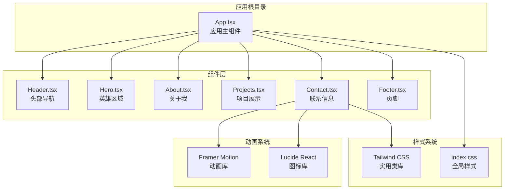
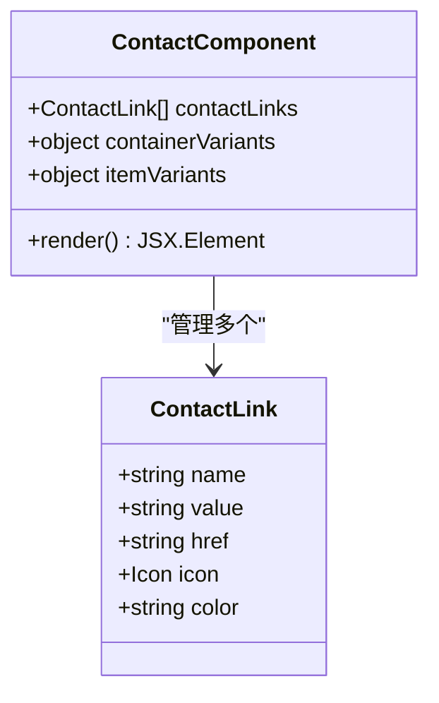
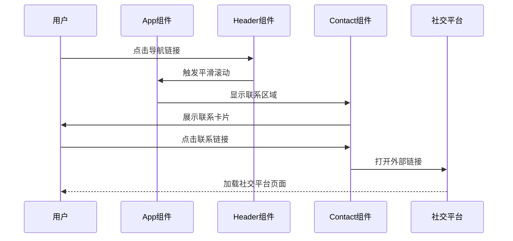
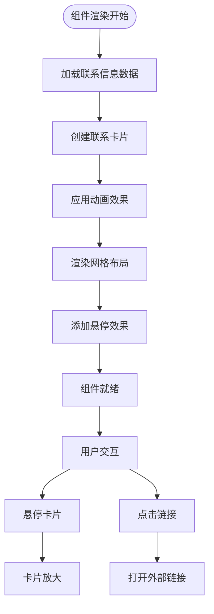
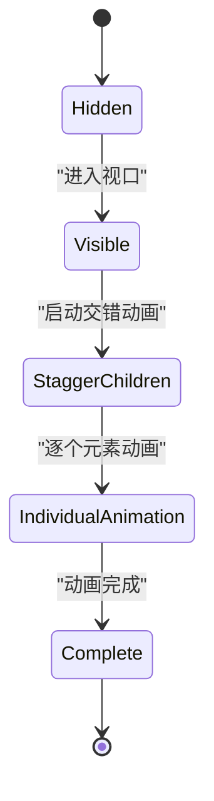
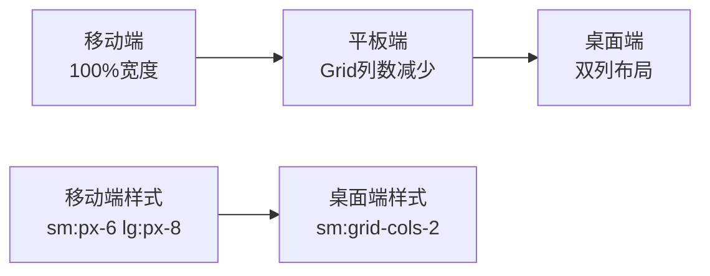
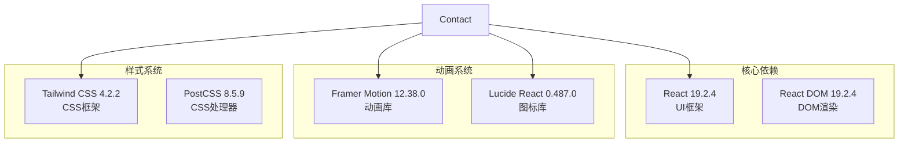
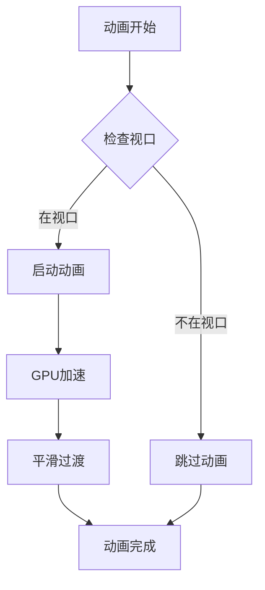

# Contact 联系信息组件

<cite>
**本文档引用的文件**
- [Contact.tsx](file://portfolio/src/components/Contact.tsx)
- [App.tsx](file://portfolio/src/App.tsx)
- [index.css](file://portfolio/src/index.css)
- [package.json](file://portfolio/package.json)
- [Header.tsx](file://portfolio/src/components/Header.tsx)
- [Footer.tsx](file://portfolio/src/components/Footer.tsx)
- [README.md](file://portfolio/README.md)
</cite>

## 目录
1. [简介](#简介)
2. [项目结构](#项目结构)
3. [核心组件](#核心组件)
4. [架构概览](#架构概览)
5. [详细组件分析](#详细组件分析)
6. [依赖关系分析](#依赖关系分析)
7. [性能考虑](#性能考虑)
8. [故障排除指南](#故障排除指南)
9. [结论](#结论)
10. [附录](#附录)

## 简介

Contact 组件是个人作品集网站中的联系信息展示模块，负责向访客提供多种联系方式和社交平台链接。该组件采用现代化的 React + TypeScript 架构，结合 Framer Motion 实现流畅的动画效果，并使用 Tailwind CSS 进行响应式布局设计。

组件的核心功能包括：
- 多渠道联系方式展示（邮箱、GitHub、LinkedIn、Twitter）
- 响应式卡片布局设计
- 流畅的交互动画效果
- 深色主题界面适配
- 无障碍访问支持

## 项目结构

Portfolio 项目采用模块化的组件架构，Contact 组件作为独立的功能模块集成在整体应用中：

**图表来源**
- [App.tsx:12-25](file://portfolio/src/App.tsx#L12-L25)
- [Contact.tsx:8-38](file://portfolio/src/components/Contact.tsx#L8-L38)

**章节来源**
- [App.tsx:1-28](file://portfolio/src/App.tsx#L1-L28)
- [package.json:12-17](file://portfolio/package.json#L12-L17)

## 核心组件

Contact 组件是一个纯函数式组件，采用 TypeScript 类型安全编程。组件内部定义了联系信息数据结构和动画配置，实现了完整的用户交互体验。

### 数据结构设计

组件使用结构化的数据数组来管理联系信息：

**图表来源**
- [Contact.tsx:9-38](file://portfolio/src/components/Contact.tsx#L9-L38)

### 动画系统

组件集成了 Framer Motion 提供的高级动画功能：

- **容器级动画**：控制子元素的交错出现效果
- **元素级动画**：每个联系卡片的独立动画状态
- **交互动画**：悬停、点击等用户交互反馈

**章节来源**
- [Contact.tsx:40-57](file://portfolio/src/components/Contact.tsx#L40-L57)
- [Contact.tsx:83-131](file://portfolio/src/components/Contact.tsx#L83-L131)

## 架构概览

Contact 组件在整个应用架构中的位置和职责：

**图表来源**
- [App.tsx:12-25](file://portfolio/src/App.tsx#L12-L25)
- [Header.tsx:44-49](file://portfolio/src/components/Header.tsx#L44-L49)
- [Contact.tsx:90-130](file://portfolio/src/components/Contact.tsx#L90-L130)

### 组件间通信

Contact 组件通过以下方式与其他组件协作：

1. **路由集成**：通过 Header 组件的导航系统进行页面跳转
2. **样式共享**：继承全局样式系统和主题配置
3. **动画协调**：与 Header 和 Footer 组件保持一致的动画风格

**章节来源**
- [Header.tsx:5-10](file://portfolio/src/components/Header.tsx#L5-L10)
- [Contact.tsx:60-80](file://portfolio/src/components/Contact.tsx#L60-L80)

## 详细组件分析

### 联系信息展示系统

Contact 组件的核心是联系信息卡片系统，每张卡片都包含完整的联系信息和视觉标识：

**图表来源**
- [Contact.tsx:83-131](file://portfolio/src/components/Contact.tsx#L83-L131)
- [Contact.tsx:90-130](file://portfolio/src/components/Contact.tsx#L90-L130)

#### 卡片设计规范

每个联系卡片都遵循统一的设计模式：

- **图标区域**：使用渐变背景色标识不同平台
- **信息区域**：清晰展示联系详情
- **交互指示**：箭头图标提示可点击性
- **响应式布局**：支持移动端和桌面端适配

**章节来源**
- [Contact.tsx:104-116](file://portfolio/src/components/Contact.tsx#L104-L116)

### 动画实现机制

组件使用 Framer Motion 实现多层次的动画效果：

#### 容器动画配置

**图表来源**
- [Contact.tsx:40-57](file://portfolio/src/components/Contact.tsx#L40-L57)

#### 交互动画效果

组件实现了丰富的用户交互反馈：

- **悬停缩放**：卡片轻微放大效果
- **位移动画**：卡片向上浮动
- **颜色过渡**：文字颜色的平滑变化
- **箭头移动**：指示箭头的水平位移

**章节来源**
- [Contact.tsx:98-101](file://portfolio/src/components/Contact.tsx#L98-L101)
- [Contact.tsx:119-127](file://portfolio/src/components/Contact.tsx#L119-L127)

### 响应式设计实现

Contact 组件采用移动优先的设计策略：

**图表来源**
- [Contact.tsx:88](file://portfolio/src/components/Contact.tsx#L88)
- [Contact.tsx:62](file://portfolio/src/components/Contact.tsx#L62)

#### 断点策略

- **移动端**：单列布局，适合触摸操作
- **平板端**：保持单列，但增加内边距
- **桌面端**：双列布局，充分利用空间

**章节来源**
- [Contact.tsx:88](file://portfolio/src/components/Contact.tsx#L88)
- [Contact.tsx:62](file://portfolio/src/components/Contact.tsx#L62)

## 依赖关系分析

### 外部依赖库

Contact 组件依赖于以下关键库：

**图表来源**
- [package.json:12-17](file://portfolio/package.json#L12-L17)

### 内部依赖关系

组件之间的依赖关系相对简单，主要体现在样式和布局的协同：

- **样式依赖**：继承全局 CSS 变量和主题配置
- **布局依赖**：与 Header 和 Footer 组件共享相同的布局系统
- **动画依赖**：与 Header 组件保持一致的动画风格

**章节来源**
- [package.json:12-17](file://portfolio/package.json#L12-L17)
- [index.css:4-8](file://portfolio/src/index.css#L4-L8)

## 性能考虑

### 渲染优化

Contact 组件采用了多项性能优化策略：

1. **条件渲染**：仅在视口可见时触发动画
2. **懒加载**：外部链接在点击时才加载
3. **CSS 动画**：优先使用 GPU 加速的 CSS 动画
4. **内存管理**：组件卸载时自动清理事件监听器

### 动画性能

**图表来源**
- [Contact.tsx:86](file://portfolio/src/components/Contact.tsx#L86)
- [Contact.tsx:136](file://portfolio/src/components/Contact.tsx#L136)

## 故障排除指南

### 常见问题及解决方案

#### 动画不生效

**症状**：卡片动画没有按预期显示
**原因**：
- 视口检测未触发
- Framer Motion 依赖未正确安装
- 样式冲突

**解决方案**：
1. 检查组件是否在可视区域内
2. 验证 Framer Motion 版本兼容性
3. 确认 CSS 样式未覆盖动画属性

#### 外部链接无法打开

**症状**：点击社交链接无响应
**原因**：
- 链接格式不正确
- 浏览器阻止弹窗
- 安全策略限制

**解决方案**：
1. 验证链接 URL 格式
2. 检查浏览器弹窗设置
3. 使用适当的 `rel` 属性

#### 响应式布局异常

**症状**：在某些设备上布局错乱
**原因**：
- 断点设置不当
- 样式优先级冲突
- 设备像素比问题

**解决方案**：
1. 调整 Tailwind 断点配置
2. 检查自定义样式的优先级
3. 测试不同设备的显示效果

**章节来源**
- [Contact.tsx:96](file://portfolio/src/components/Contact.tsx#L96)
- [Contact.tsx:136](file://portfolio/src/components/Contact.tsx#L136)

## 结论

Contact 组件成功实现了现代化的联系信息展示功能，具备以下特点：

### 技术优势
- **类型安全**：完整的 TypeScript 类型定义
- **动画流畅**：基于 Framer Motion 的高性能动画
- **响应式设计**：适配各种设备尺寸
- **可维护性**：模块化设计便于扩展和维护

### 设计亮点
- **视觉层次**：清晰的信息层级和视觉引导
- **交互反馈**：丰富的用户交互状态
- **品牌一致性**：与整体设计系统的协调统一

### 改进建议
1. **可访问性增强**：添加更多 ARIA 属性支持
2. **国际化支持**：实现多语言文本切换
3. **性能监控**：集成性能指标收集
4. **测试覆盖**：添加单元测试和集成测试

## 附录

### 组件定制指南

#### 样式修改
- **主题颜色**：通过 CSS 变量调整渐变色彩
- **间距调整**：修改内边距和外边距参数
- **字体配置**：调整字体大小和字重设置

#### 字段添加
1. 在 `contactLinks` 数组中添加新对象
2. 定义图标组件和颜色方案
3. 更新动画配置以适应新布局

#### 功能扩展
- **表单集成**：添加联系表单组件
- **实时状态**：集成在线状态显示
- **地理位置**：添加地图集成功能

### 安全性最佳实践

#### 输入验证
- **URL 校验**：验证外部链接的有效性
- **格式检查**：确保联系信息格式正确
- **XSS 防护**：对用户输入进行适当的转义处理

#### 隐私保护
- **数据最小化**：仅收集必要的联系信息
- **传输安全**：使用 HTTPS 协议传输数据
- **存储安全**：避免在客户端存储敏感信息

#### 性能安全
- **资源加载**：优化外部资源的加载策略
- **内存管理**：及时清理不再使用的资源
- **错误处理**：实现健壮的错误处理机制

**章节来源**
- [Contact.tsx:9-38](file://portfolio/src/components/Contact.tsx#L9-L38)
- [README.md:1-74](file://portfolio/README.md#L1-L74)