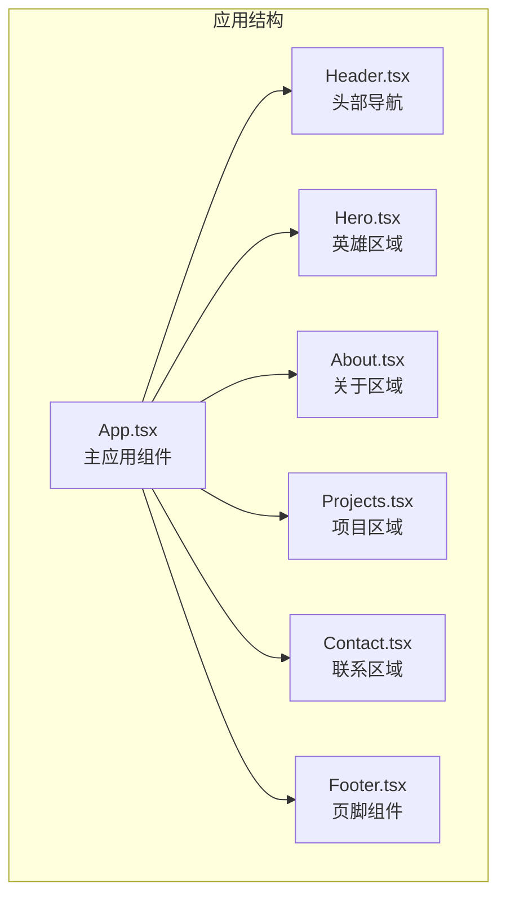
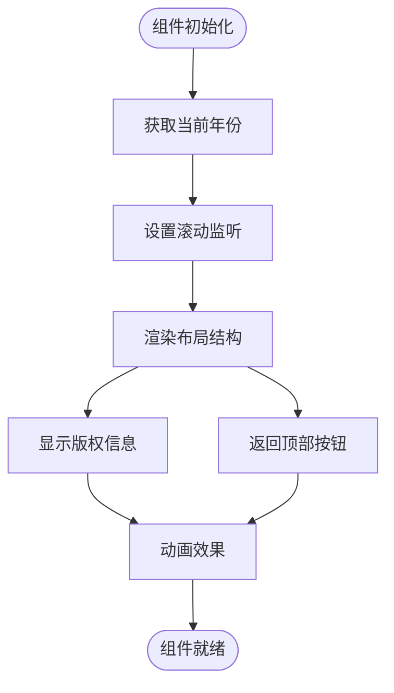
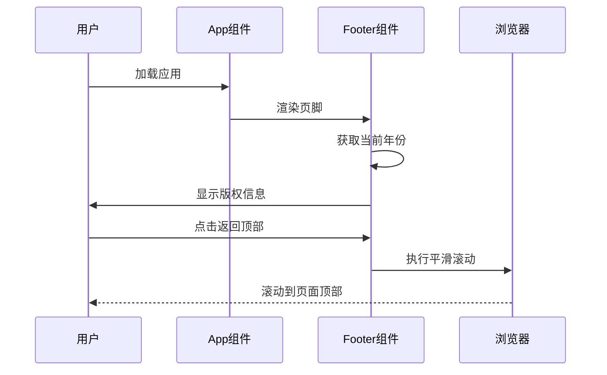
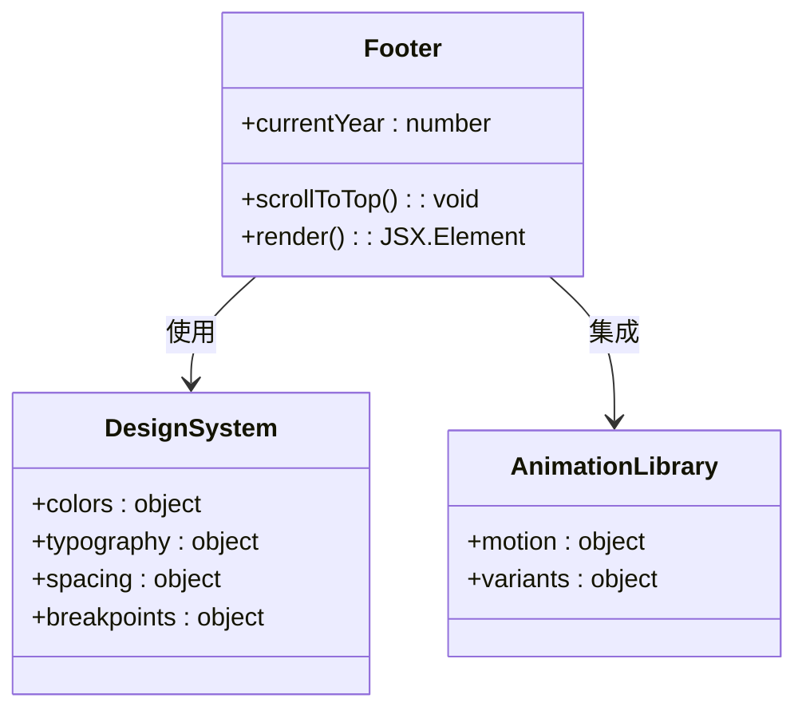
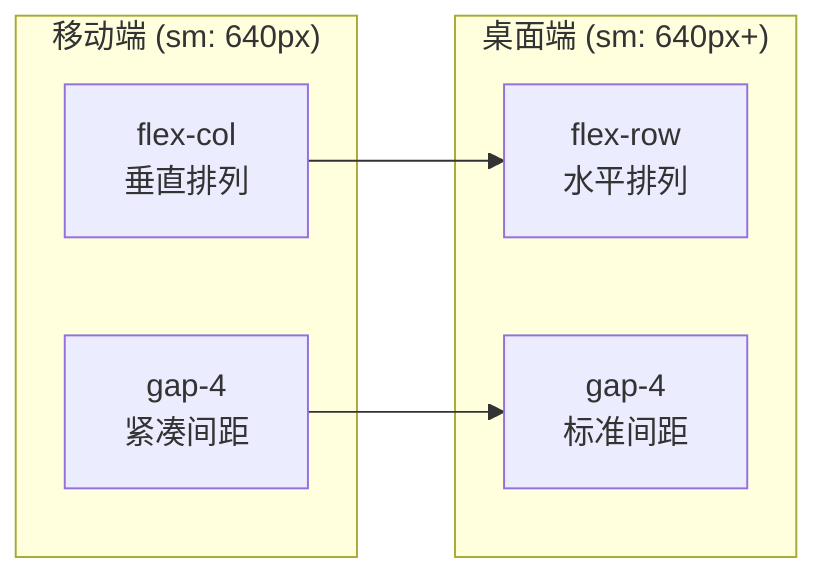
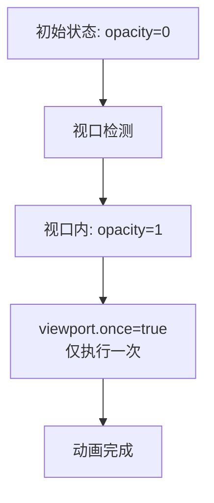
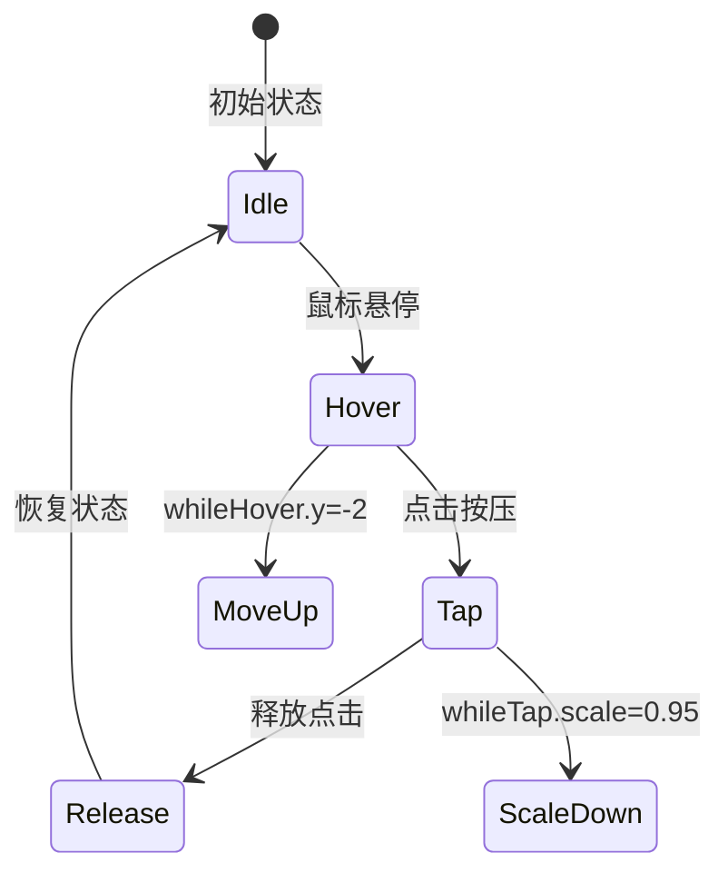
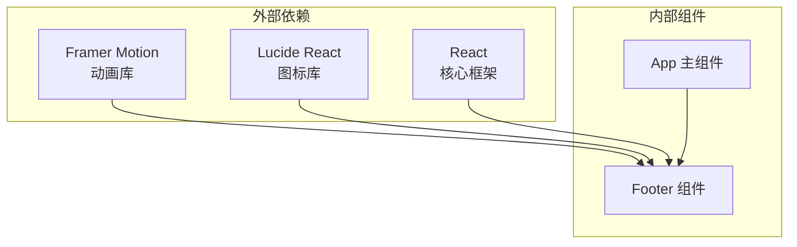

# Footer 页脚组件

<cite>
**本文档引用的文件**
- [Footer.tsx](file://portfolio/src/components/Footer.tsx)
- [App.tsx](file://portfolio/src/App.tsx)
- [Header.tsx](file://portfolio/src/components/Header.tsx)
- [Hero.tsx](file://portfolio/src/components/Hero.tsx)
- [Contact.tsx](file://portfolio/src/components/Contact.tsx)
- [index.css](file://portfolio/src/index.css)
- [App.css](file://portfolio/src/App.css)
- [package.json](file://portfolio/package.json)
- [vite.config.ts](file://portfolio/vite.config.ts)
- [main.tsx](file://portfolio/src/main.tsx)
</cite>

## 目录
1. [简介](#简介)
2. [项目结构](#项目结构)
3. [核心组件](#核心组件)
4. [架构概览](#架构概览)
5. [详细组件分析](#详细组件分析)
6. [依赖关系分析](#依赖关系分析)
7. [性能考虑](#性能考虑)
8. [故障排除指南](#故障排除指南)
9. [结论](#结论)
10. [附录](#附录)

## 简介

Footer 页脚组件是个人作品集网站的重要组成部分，负责展示版权信息、品牌标识和返回顶部功能。该组件采用现代化的设计理念，结合动画效果和响应式布局，为用户提供一致的品牌体验。

## 项目结构

该项目采用基于组件的架构模式，每个页面区域都封装在独立的组件中。Footer 组件位于组件目录下，与其他核心组件协同工作。



**图表来源**
- [App.tsx:12-25](file://portfolio/src/App.tsx#L12-L25)
- [Footer.tsx:8-47](file://portfolio/src/components/Footer.tsx#L8-L47)

**章节来源**
- [App.tsx:1-28](file://portfolio/src/App.tsx#L1-L28)
- [Footer.tsx:1-48](file://portfolio/src/components/Footer.tsx#L1-L48)

## 核心组件

### Footer 组件概述

Footer 组件是一个轻量级但功能完整的页脚解决方案，主要包含以下特性：

- **动态版权信息**：自动显示当前年份
- **品牌元素**：使用爱心图标和品牌色彩
- **交互功能**：平滑滚动到页面顶部
- **响应式设计**：适配不同屏幕尺寸
- **动画效果**：使用 Framer Motion 提供流畅的用户体验

### 主要功能模块



**图表来源**
- [Footer.tsx:9-13](file://portfolio/src/components/Footer.tsx#L9-L13)
- [Footer.tsx:15-46](file://portfolio/src/components/Footer.tsx#L15-L46)

**章节来源**
- [Footer.tsx:8-47](file://portfolio/src/components/Footer.tsx#L8-L47)

## 架构概览

### 组件集成关系

Footer 组件在整个应用架构中扮演着重要的收尾角色，确保用户能够轻松回到页面顶部，并清晰地看到版权信息。



**图表来源**
- [App.tsx:22](file://portfolio/src/App.tsx#L22)
- [Footer.tsx:11-13](file://portfolio/src/components/Footer.tsx#L11-L13)

### 设计系统集成

Footer 组件严格遵循项目的设计系统规范，确保视觉一致性。



**图表来源**
- [Footer.tsx:16](file://portfolio/src/components/Footer.tsx#L16)
- [index.css:4-8](file://portfolio/src/index.css#L4-L8)

**章节来源**
- [index.css:1-46](file://portfolio/src/index.css#L1-L46)
- [Footer.tsx:1-48](file://portfolio/src/components/Footer.tsx#L1-L48)

## 详细组件分析

### 响应式布局实现

Footer 组件采用了先进的响应式设计策略，确保在各种设备上都能提供优秀的用户体验。

#### 移动优先设计



**图表来源**
- [Footer.tsx:18](file://portfolio/src/components/Footer.tsx#L18)

#### 边距和内边距系统

组件使用了 Tailwind CSS 的实用类来实现灵活的间距控制：

- **内边距**：`py-8 px-4 sm:px-6 lg:px-8`
- **最大宽度**：`max-w-6xl mx-auto`
- **边框**：`border-t border-white/10`

**章节来源**
- [Footer.tsx:16-18](file://portfolio/src/components/Footer.tsx#L16-L18)

### 动画和交互设计

#### 版权信息动画

Footer 组件使用 Framer Motion 为版权信息提供了优雅的进入动画：



**图表来源**
- [Footer.tsx:20-29](file://portfolio/src/components/Footer.tsx#L20-L29)

#### 交互反馈机制

返回顶部按钮提供了多层次的交互反馈：



**图表来源**
- [Footer.tsx:32-42](file://portfolio/src/components/Footer.tsx#L32-L42)

**章节来源**
- [Footer.tsx:20-42](file://portfolio/src/components/Footer.tsx#L20-L42)

### 视觉设计和品牌一致性

#### 色彩系统

Footer 组件严格遵循项目深色主题设计：

- **背景透明度**：`border-white/10` (10% 不透明度)
- **文本颜色**：`text-gray-500` (浅灰色)
- **品牌强调色**：爱心图标使用 `text-red-500 fill-red-500`

#### 字体和排版

- **字体大小**：`text-sm` (小号字体)
- **行高**：通过 `flex` 布局自动调整
- **字重**：使用 `font-medium` 保持视觉平衡

**章节来源**
- [Footer.tsx:24-28](file://portfolio/src/components/Footer.tsx#L24-L28)
- [index.css:4-8](file://portfolio/src/index.css#L4-L8)

## 依赖关系分析

### 外部依赖

Footer 组件依赖于几个关键的外部库：



**图表来源**
- [Footer.tsx:1-2](file://portfolio/src/components/Footer.tsx#L1-L2)
- [package.json:12-16](file://portfolio/package.json#L12-L16)

### 内部依赖关系

```mermaid
graph TD
App[App.tsx] --> Footer[Footer.tsx]
Footer --> Motion[motion 组件]
Footer --> Heart[Heart 图标]
Footer --> Date[new Date()]
```

**图表来源**
- [App.tsx:6](file://portfolio/src/App.tsx#L6)
- [Footer.tsx:1-2](file://portfolio/src/components/Footer.tsx#L1-L2)

**章节来源**
- [package.json:12-16](file://portfolio/package.json#L12-L16)
- [Footer.tsx:1-48](file://portfolio/src/components/Footer.tsx#L1-L48)

## 性能考虑

### 代码分割和懒加载

Footer 组件采用函数式组件设计，避免了不必要的状态管理开销。组件只在应用启动时渲染一次，具有极低的内存占用。

### 动画性能优化

- **viewport.once**：确保动画只执行一次，避免重复计算
- **硬件加速**：使用 CSS 变换属性触发 GPU 加速
- **最小化重绘**：通过合理的样式组合减少浏览器重绘

### 响应式性能

- **媒体查询优化**：使用 Tailwind CSS 的预设断点
- **条件渲染**：根据屏幕尺寸动态调整布局
- **CSS 优先**：优先使用 CSS 而非 JavaScript 进行样式调整

## 故障排除指南

### 常见问题和解决方案

#### 动画不生效

**问题描述**：版权信息动画没有出现

**可能原因**：
- Framer Motion 未正确安装
- viewport 配置错误
- 组件未在视口中

**解决方案**：
1. 确认 `framer-motion` 已安装
2. 检查 `viewport={{ once: true }}` 配置
3. 确保组件在可视区域内

#### 滚动功能异常

**问题描述**：返回顶部按钮无法正常工作

**可能原因**：
- `window.scrollTo` 方法不支持
- 滚动行为被浏览器阻止

**解决方案**：
1. 检查浏览器兼容性
2. 确认 `behavior: 'smooth'` 支持情况
3. 考虑降级方案（无动画滚动）

#### 响应式布局问题

**问题描述**：在移动设备上布局错乱

**可能原因**：
- Tailwind CSS 类名拼写错误
- 断点配置不当
- 容器宽度限制

**解决方案**：
1. 验证 Tailwind CSS 类名
2. 检查 `max-w-6xl` 是否影响移动端显示
3. 调整 `px` 值以适应移动设备

**章节来源**
- [Footer.tsx:20-29](file://portfolio/src/components/Footer.tsx#L20-L29)
- [Footer.tsx:32-42](file://portfolio/src/components/Footer.tsx#L32-L42)

## 结论

Footer 页脚组件是一个精心设计的轻量级组件，它成功地将功能性、美观性和性能优化结合在一起。通过使用现代的动画库、响应式设计和严格的代码规范，该组件为整个应用提供了统一且专业的结尾体验。

组件的主要优势包括：
- **简洁高效**：代码量少，维护成本低
- **响应式友好**：完美适配各种设备
- **动画流畅**：提供愉悦的用户体验
- **品牌一致**：严格遵循设计系统

## 附录

### SEO 优化建议

虽然当前的 Footer 组件相对简单，但仍有一些 SEO 优化可以考虑：

1. **语义化标记**：确保使用正确的 HTML 语义
2. **可访问性**：为屏幕阅读器提供适当的标签
3. **结构化数据**：考虑添加品牌相关的结构化数据

### 可访问性最佳实践

1. **键盘导航**：确保按钮可以通过键盘操作
2. **焦点管理**：提供清晰的焦点指示器
3. **对比度**：确保文本与背景有足够的对比度
4. **ARIA 标签**：为交互元素添加适当的 ARIA 属性

### 国际化支持

如果需要支持多语言，可以考虑：

1. **文本提取**：将静态文本提取到国际化文件
2. **动态年份**：使用本地化格式显示年份
3. **RTL 支持**：考虑从右到左语言的布局需求

### 扩展指南

如需扩展 Footer 组件功能，可以考虑：

1. **法律链接**：添加隐私政策、服务条款等链接
2. **社交媒体图标**：集成更多社交平台链接
3. **订阅表单**：添加邮件订阅功能
4. **多语言切换**：支持不同语言版本

**章节来源**
- [Footer.tsx:26-28](file://portfolio/src/components/Footer.tsx#L26-L28)
- [Footer.tsx:38-41](file://portfolio/src/components/Footer.tsx#L38-L41)