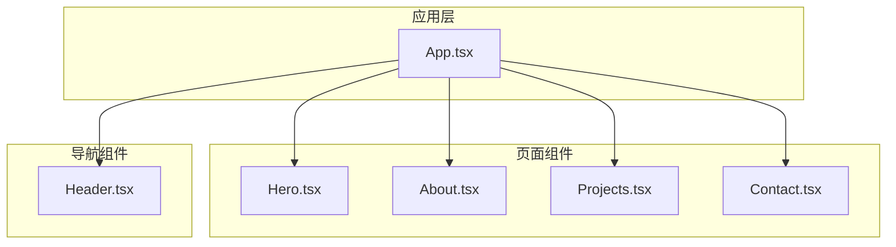
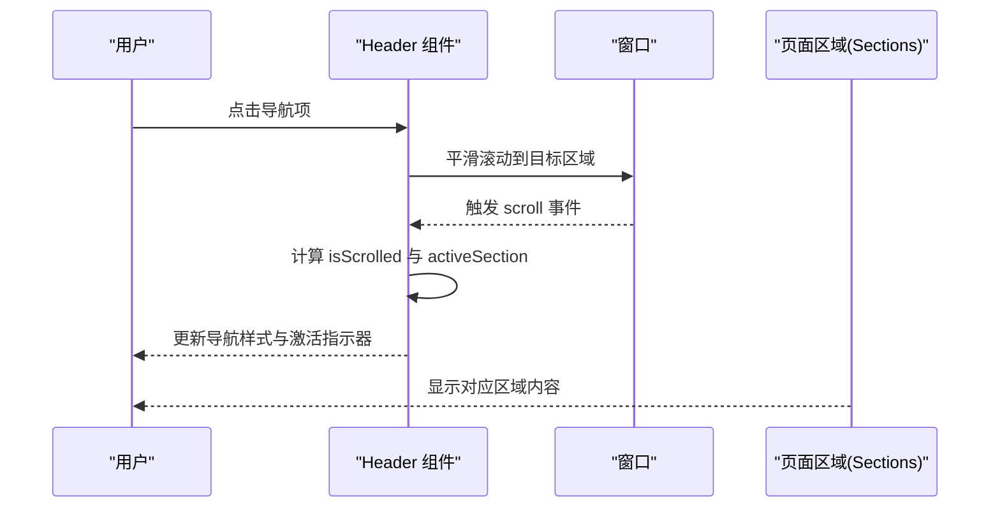
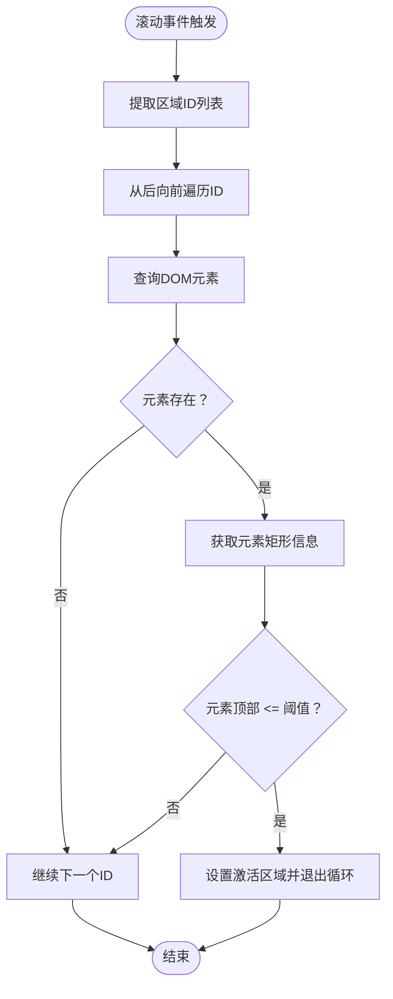
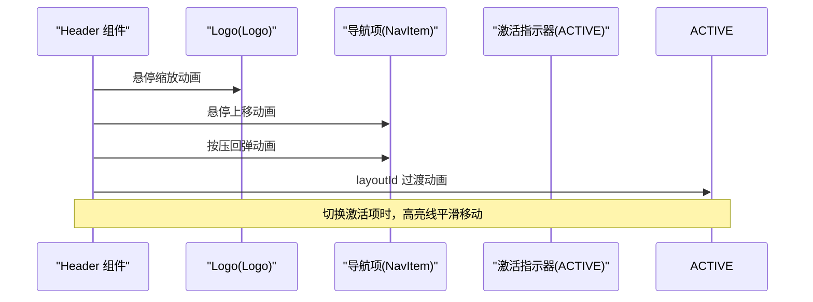
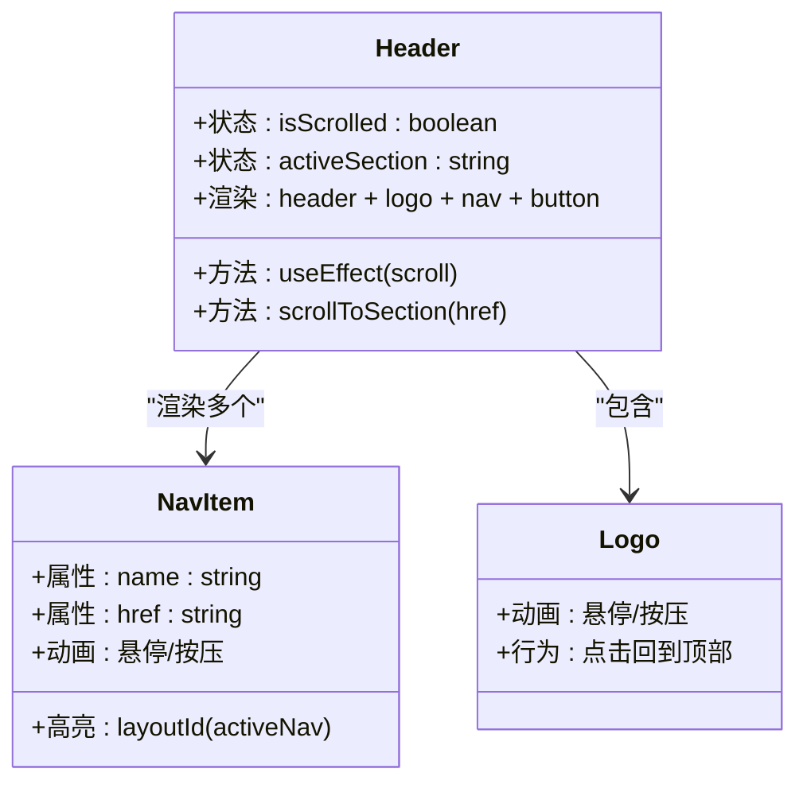
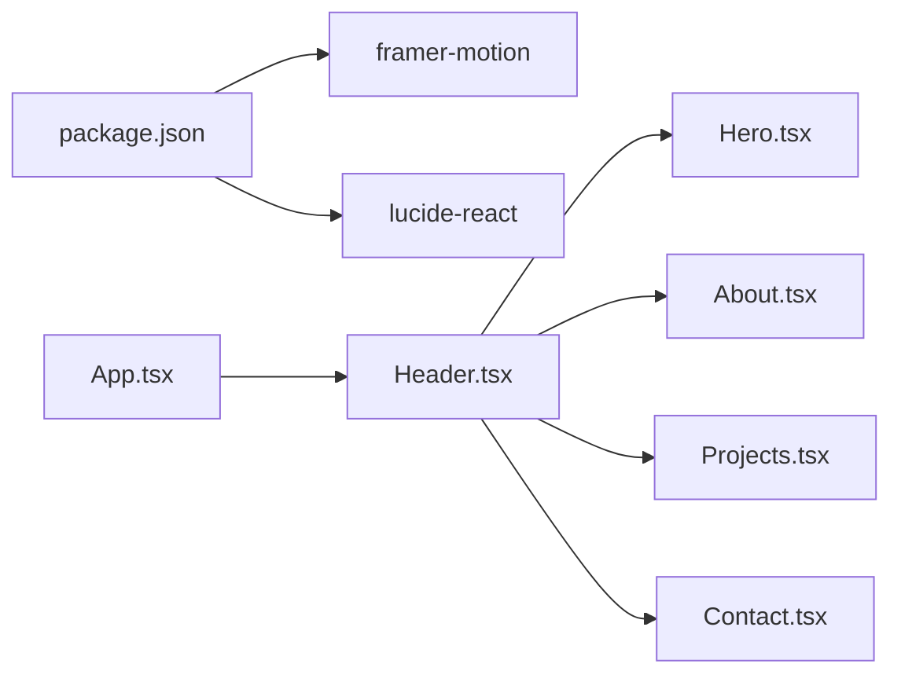

# Header 导航组件

<cite>
**本文引用的文件**
- [Header.tsx](file://portfolio/src/components/Header.tsx)
- [App.tsx](file://portfolio/src/App.tsx)
- [index.css](file://portfolio/src/index.css)
- [package.json](file://portfolio/package.json)
- [Hero.tsx](file://portfolio/src/components/Hero.tsx)
- [About.tsx](file://portfolio/src/components/About.tsx)
- [Projects.tsx](file://portfolio/src/components/Projects.tsx)
- [Contact.tsx](file://portfolio/src/components/Contact.tsx)
- [projects.ts](file://portfolio/src/data/projects.ts)
- [skills.ts](file://portfolio/src/data/skills.ts)
</cite>

## 目录
1. [引言](#引言)
2. [项目结构](#项目结构)
3. [核心组件](#核心组件)
4. [架构总览](#架构总览)
5. [详细组件分析](#详细组件分析)
6. [依赖关系分析](#依赖关系分析)
7. [性能考量](#性能考量)
8. [故障排查指南](#故障排查指南)
9. [结论](#结论)
10. [附录](#附录)

## 引言
本文件为 Portfolio 项目的 Header 导航组件提供完整技术文档。内容涵盖：
- 滚动检测机制与活动区域高亮逻辑
- Framer Motion 动画实现（进入动画、悬停效果、激活状态切换）
- 响应式设计与移动端菜单按钮的交互
- 组件状态管理（滚动状态与活动导航项追踪）
- 使用示例与可定制配置
- 性能优化建议与常见问题解决方案

## 项目结构
Header 组件位于 src/components/ 目录下，作为应用顶层导航，配合各页面区域（Hero、About、Projects、Contact）共同构成单页应用的导航体验。全局样式通过 TailwindCSS 与自定义 CSS 变量统一风格；Framer Motion 提供流畅的动画能力。

图示来源
- [App.tsx:12-25](file://portfolio/src/App.tsx#L12-L25)
- [Header.tsx:16-128](file://portfolio/src/components/Header.tsx#L16-L128)

章节来源
- [App.tsx:12-25](file://portfolio/src/App.tsx#L12-L25)
- [Header.tsx:16-128](file://portfolio/src/components/Header.tsx#L16-L128)

## 核心组件
Header 组件负责：
- 固定定位的顶部导航栏，支持滚动时背景与边框变化
- Logo 与导航链接，点击平滑滚动至对应区域
- 活动区域高亮：根据可视区域动态更新当前激活的导航项
- 移动端菜单按钮（占位，未实现展开逻辑）

关键特性与实现要点：
- 状态管理：滚动状态 isScrolled、活动区域 activeSection
- 滚动监听：在组件挂载时注册 scroll 事件，卸载时清理
- 活动区域检测：遍历可见区域，依据元素相对视口位置判断
- 动画：Framer Motion 的进入动画、悬停缩放与按压效果、激活指示器的布局过渡
- 响应式：桌面端显示导航，移动端显示汉堡菜单占位

章节来源
- [Header.tsx:16-128](file://portfolio/src/components/Header.tsx#L16-L128)

## 架构总览
Header 与页面区域通过 ID 与滚动行为协作，形成“锚点导航 + 活动高亮”的导航体系。整体流程如下：

图示来源
- [Header.tsx:21-49](file://portfolio/src/components/Header.tsx#L21-L49)
- [Hero.tsx:9-12](file://portfolio/src/components/Hero.tsx#L9-L12)
- [About.tsx:38-41](file://portfolio/src/components/About.tsx#L38-L41)
- [Projects.tsx:29-32](file://portfolio/src/components/Projects.tsx#L29-L32)
- [Contact.tsx:59-62](file://portfolio/src/components/Contact.tsx#L59-L62)

## 详细组件分析

### 组件结构与状态管理
- 状态
  - isScrolled：布尔值，控制导航栏背景与边框样式
  - activeSection：字符串，记录当前可视区域的标识符
- 事件与副作用
  - useEffect 注册 scroll 事件监听，计算 isScrolled 与 activeSection
  - 卸载时移除监听，避免内存泄漏
- 滚动检测算法
  - 将导航链接映射为区域 ID 列表
  - 从后向前遍历，使用 getBoundingClientRect 获取元素相对视口的位置
  - 当元素顶部小于等于阈值（例如 100）时，设置为当前激活区域并停止遍历

图示来源
- [Header.tsx:25-37](file://portfolio/src/components/Header.tsx#L25-L37)

章节来源
- [Header.tsx:16-49](file://portfolio/src/components/Header.tsx#L16-L49)

### Framer Motion 动画实现
- 进入动画
  - header 使用初始位移与动画过渡，实现从上方滑入的效果
- 悬停与按压
  - Logo 与导航项均配置了悬停与按压的缩放动画
  - 导航项激活指示器使用 layoutId 实现布局过渡，确保高亮线在不同项之间平滑移动
- 动画参数
  - 进入动画时长与缓动
  - 激活指示器使用弹性类型与刚度/阻尼参数，提供顺滑的弹簧效果

图示来源
- [Header.tsx:52-60](file://portfolio/src/components/Header.tsx#L52-L60)
- [Header.tsx:65-76](file://portfolio/src/components/Header.tsx#L65-L76)
- [Header.tsx:81-105](file://portfolio/src/components/Header.tsx#L81-L105)
- [Header.tsx:98-103](file://portfolio/src/components/Header.tsx#L98-L103)

章节来源
- [Header.tsx:52-105](file://portfolio/src/components/Header.tsx#L52-L105)

### 响应式设计与移动端菜单
- 桌面端
  - 导航栏以固定定位显示，包含 Logo 与导航链接
  - 导航链接在桌面端默认显示
- 移动端
  - 导航栏右侧显示汉堡菜单图标占位
  - 当前未实现菜单展开逻辑，建议后续添加展开/收起状态与动画

章节来源
- [Header.tsx:79-123](file://portfolio/src/components/Header.tsx#L79-L123)

### 平滑滚动与锚点导航
- 点击导航项时阻止默认跳转，调用 querySelector 定位目标区域
- 使用 scrollIntoView 并开启 behavior: 'smooth' 实现平滑滚动
- 全局 CSS 设置了平滑滚动行为，提升整体滚动体验

章节来源
- [Header.tsx:44-49](file://portfolio/src/components/Header.tsx#L44-L49)
- [index.css:12-13](file://portfolio/src/index.css#L12-L13)

### 活动区域高亮逻辑
- 高亮条件：当某区域顶部进入视口阈值以内时，该导航项被标记为激活
- 高亮指示器：使用绝对定位的横线，结合 layoutId 在不同项之间进行平滑过渡
- 样式切换：激活项与非激活项的颜色与透明度差异明显，增强可读性

章节来源
- [Header.tsx:88-103](file://portfolio/src/components/Header.tsx#L88-L103)

### 组件类图（代码级）

图示来源
- [Header.tsx:16-128](file://portfolio/src/components/Header.tsx#L16-L128)

## 依赖关系分析
- 外部库
  - Framer Motion：提供动画与手势交互能力
  - Lucide React：用于图标（如 GitHub、外部链接等，用于其他组件）
- 内部依赖
  - App.tsx 引入 Header 并组合页面组件
  - 页面组件通过 id 与 Header 的锚点导航配合

图示来源
- [package.json:12-16](file://portfolio/package.json#L12-L16)
- [App.tsx:1-6](file://portfolio/src/App.tsx#L1-L6)
- [Header.tsx:16-128](file://portfolio/src/components/Header.tsx#L16-L128)

章节来源
- [package.json:12-16](file://portfolio/package.json#L12-L16)
- [App.tsx:1-6](file://portfolio/src/App.tsx#L1-L6)

## 性能考量
- 滚动事件节流
  - 当前实现直接绑定 scroll 事件，频繁触发可能导致性能问题
  - 建议对滚动回调进行节流或防抖，减少重排与重绘
- DOM 查询优化
  - 活动区域检测中多次查询元素，建议缓存元素引用或使用 IntersectionObserver 替代
- 布局过渡
  - 使用 layoutId 的高亮指示器会触发布局测量，建议控制动画频率与复杂度
- 渲染范围
  - 导航项数量较多时，考虑虚拟化或延迟渲染部分项
- CSS 优化
  - 使用 backdrop-blur 与半透明背景可能影响低端设备性能，可根据需要调整

## 故障排查指南
- 滚动不触发或高亮不更新
  - 检查页面区域是否正确设置 id，且与导航链接 href 对应
  - 确认 getBoundingClientRect 返回值是否异常（如容器滚动容器）
- 激活指示器不出现
  - 确保激活项的条件满足（元素顶部阈值）
  - 检查 layoutId 是否一致且唯一
- 平滑滚动无效
  - 确认目标元素存在且可见
  - 检查全局滚动行为设置是否生效
- 移动端菜单无响应
  - 当前仅显示占位图标，需补充展开/收起逻辑与动画
- 性能卡顿
  - 对滚动回调进行节流/防抖
  - 减少每次滚动中的 DOM 查询次数

章节来源
- [Header.tsx:25-37](file://portfolio/src/components/Header.tsx#L25-L37)
- [Header.tsx:44-49](file://portfolio/src/components/Header.tsx#L44-L49)
- [index.css:12-13](file://portfolio/src/index.css#L12-L13)

## 结论
Header 组件通过滚动检测与活动区域高亮，结合 Framer Motion 的流畅动画，提供了良好的导航体验。建议后续完善移动端菜单交互、优化滚动性能与 DOM 查询，并考虑使用 IntersectionObserver 提升检测效率。整体架构清晰，易于扩展与定制。

## 附录

### 使用示例与自定义配置
- 基本使用
  - 在 App 中引入 Header，并确保页面组件具有对应的 id
- 自定义导航项
  - 修改导航链接数组，添加或删除导航项
- 自定义滚动阈值
  - 调整滚动检测中的阈值，以适配不同页面高度
- 自定义高亮样式
  - 修改激活指示器的颜色、厚度与过渡参数
- 自定义动画参数
  - 调整进入动画时长、缓动曲线与悬停/按压缩放比例
- 移动端菜单
  - 补充展开/收起状态与动画，实现汉堡菜单的交互逻辑

章节来源
- [Header.tsx:5-10](file://portfolio/src/components/Header.tsx#L5-L10)
- [Header.tsx:22-37](file://portfolio/src/components/Header.tsx#L22-L37)
- [Header.tsx:98-103](file://portfolio/src/components/Header.tsx#L98-L103)
- [Header.tsx:52-60](file://portfolio/src/components/Header.tsx#L52-L60)