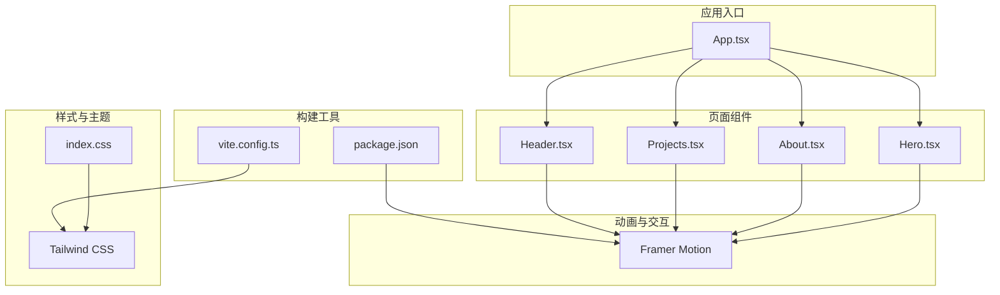
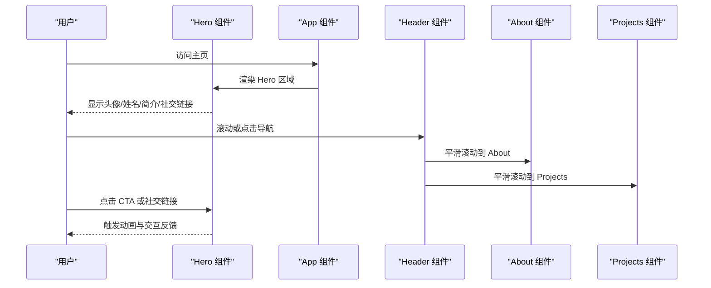
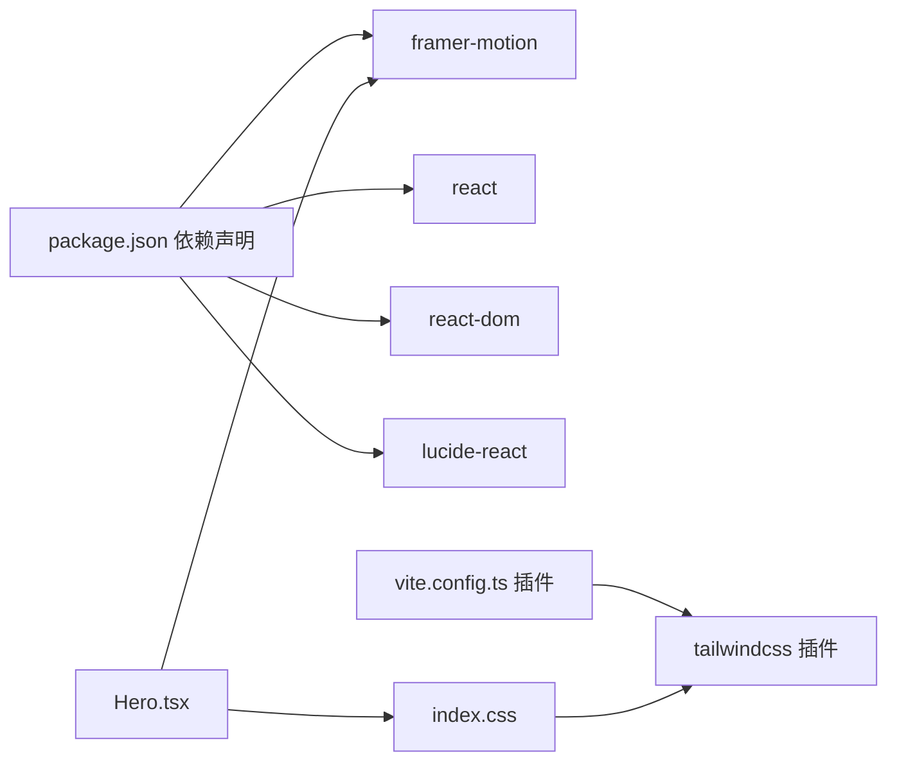

# Hero 首屏展示组件

<cite>
**本文引用的文件**
- [Hero.tsx](file://portfolio/src/components/Hero.tsx)
- [skills.ts](file://portfolio/src/data/skills.ts)
- [App.tsx](file://portfolio/src/App.tsx)
- [index.css](file://portfolio/src/index.css)
- [package.json](file://portfolio/package.json)
- [vite.config.ts](file://portfolio/vite.config.ts)
- [Header.tsx](file://portfolio/src/components/Header.tsx)
- [About.tsx](file://portfolio/src/components/About.tsx)
- [Projects.tsx](file://portfolio/src/components/Projects.tsx)
</cite>

## 目录
1. [引言](#引言)
2. [项目结构](#项目结构)
3. [核心组件](#核心组件)
4. [架构总览](#架构总览)
5. [详细组件分析](#详细组件分析)
6. [依赖关系分析](#依赖关系分析)
7. [性能考量](#性能考量)
8. [故障排查指南](#故障排查指南)
9. [结论](#结论)
10. [附录](#附录)

## 引言
Hero 组件是网站首屏的核心展示区域，承担着“第一印象”的职责：通过头像、姓名、职位、简介与社交链接等关键信息，快速建立访客对个人品牌与专业能力的认知。该组件采用 Framer Motion 实现细腻的入场动画与交互反馈，结合 Tailwind CSS 的响应式断点，确保在桌面与移动设备上均具备优秀的视觉表现与可用性。同时，组件与全局主题、导航与页面结构紧密协作，形成统一的视觉与交互语言。

## 项目结构
Hero 组件位于组件目录中，作为应用主页面的第一个区块出现。其样式与主题由全局 CSS 定义，动画系统依赖 Framer Motion，构建工具链使用 Vite 与 Tailwind CSS 插件。

图表来源
- [App.tsx:12-25](file://portfolio/src/App.tsx#L12-L25)
- [Hero.tsx:1-142](file://portfolio/src/components/Hero.tsx#L1-L142)
- [index.css:1-46](file://portfolio/src/index.css#L1-L46)
- [vite.config.ts:1-9](file://portfolio/vite.config.ts#L1-L9)
- [package.json:12-16](file://portfolio/package.json#L12-L16)

章节来源
- [App.tsx:12-25](file://portfolio/src/App.tsx#L12-L25)
- [Hero.tsx:1-142](file://portfolio/src/components/Hero.tsx#L1-L142)
- [index.css:1-46](file://portfolio/src/index.css#L1-L46)
- [vite.config.ts:1-9](file://portfolio/vite.config.ts#L1-L9)
- [package.json:12-16](file://portfolio/package.json#L12-L16)

## 核心组件
Hero 组件负责首屏信息的呈现与交互，包含以下关键区域：
- 头像区域：圆形头像容器，内嵌占位图标，配合渐变边框与背景。
- 姓名与职位：渐变文字标题与副标题，营造层次感。
- 简介段落：简明扼要的个人定位与技术方向。
- CTA 按钮：导航到项目或联系区域的平滑滚动按钮。
- 社交链接：GitHub、LinkedIn 等外部链接，带悬停缩放与位移动效。
- 滚动提示：底部循环动画的向下指示器，引导用户继续浏览。

章节来源
- [Hero.tsx:14-139](file://portfolio/src/components/Hero.tsx#L14-L139)

## 架构总览
Hero 组件在应用中的位置与交互关系如下：
- 作为 App 的第一个子节点，占据全屏高度，保证首屏加载即见。
- 与 Header 协同：Header 提供导航与滚动检测，Hero 通过锚点与平滑滚动连接各区域。
- 与 About/Projects 形成页面序列：Hero 引导用户进入 About 与 Projects 区域，形成完整的浏览路径。

图表来源
- [App.tsx:12-25](file://portfolio/src/App.tsx#L12-L25)
- [Hero.tsx:62-92](file://portfolio/src/components/Hero.tsx#L62-L92)
- [Header.tsx:44-49](file://portfolio/src/components/Header.tsx#L44-L49)
- [About.tsx:59-80](file://portfolio/src/components/About.tsx#L59-L80)
- [Projects.tsx:128-146](file://portfolio/src/components/Projects.tsx#L128-L146)

## 详细组件分析

### 设计理念与信息层次
- 信息密度控制：首屏仅保留最核心的信息（头像、姓名、职位、简介），避免信息过载。
- 渐变色彩体系：使用一致的渐变色（从浅蓝到紫）贯穿标题与装饰元素，强化品牌识别。
- 对齐与留白：采用居中布局与充足的上下留白，确保视觉平衡与呼吸感。
- 功能性优先：CTA 与社交链接直接关联后续页面区域，提升导航效率。

章节来源
- [Hero.tsx:14-59](file://portfolio/src/components/Hero.tsx#L14-L59)

### Framer Motion 动画系统应用
- 元素入场动画：头像、标题、段落、按钮与社交链接分别设置不同的初始状态与延迟，形成有序的“瀑布式”入场。
- 悬停交互：按钮与社交链接在 hover/tap 时进行缩放与位移，增强触控反馈与可点击性感知。
- 循环动画：底部滚动提示使用 y 轴位移数组实现无限循环，引导用户向下滚动。
- 动画参数：统一的持续时间与延迟策略，保证动效节奏一致且不打断阅读。

```mermaid
flowchart TD
Start(["开始渲染 Hero"]) --> Avatar["头像<br/>scale/opacity 初始值"]
Start --> Title["姓名<br/>y/opacity 初始值"]
Start --> Subtitle["职位<br/>y/opacity 初始值"]
Start --> Intro["简介<br/>y/opacity 初始值"]
Start --> Buttons["CTA 按钮<br/>y/opacity 初始值"]
Start --> Social["社交链接<br/>y/opacity 初始值"]
Start --> ScrollTip["滚动提示<br/>opacity 初始值"]
Avatar --> AnimateAvatar["animate: scale=1, opacity=1<br/>transition: duration=0.5, delay=0.2"]
Title --> AnimateTitle["animate: y=0, opacity=1<br/>transition: duration=0.5, delay=0.3"]
Subtitle --> AnimateSubtitle["animate: y=0, opacity=1<br/>transition: duration=0.5, delay=0.4"]
Intro --> AnimateIntro["animate: y=0, opacity=1<br/>transition: duration=0.5, delay=0.5"]
Buttons --> AnimateButtons["animate: y=0, opacity=1<br/>transition: duration=0.5, delay=0.6"]
Social --> AnimateSocial["animate: y=0, opacity=1<br/>transition: duration=0.5, delay=0.7"]
ScrollTip --> AnimateScrollTip["animate: opacity=1<br/>transition: duration=0.5, delay=1"]
Buttons --> HoverScale["whileHover: scale=1.05<br/>whileTap: scale=0.95"]
Social --> HoverScale2["whileHover: scale=1.2, y=-2<br/>whileTap: scale=0.9"]
ScrollTip --> LoopAnim["animate: y=[0,10,0]<br/>transition: duration=1.5, repeat=Infinity"]
```

图表来源
- [Hero.tsx:15-26](file://portfolio/src/components/Hero.tsx#L15-L26)
- [Hero.tsx:29-38](file://portfolio/src/components/Hero.tsx#L29-L38)
- [Hero.tsx:41-48](file://portfolio/src/components/Hero.tsx#L41-L48)
- [Hero.tsx:51-59](file://portfolio/src/components/Hero.tsx#L51-L59)
- [Hero.tsx:62-92](file://portfolio/src/components/Hero.tsx#L62-L92)
- [Hero.tsx:95-119](file://portfolio/src/components/Hero.tsx#L95-L119)
- [Hero.tsx:122-137](file://portfolio/src/components/Hero.tsx#L122-L137)

章节来源
- [Hero.tsx:15-137](file://portfolio/src/components/Hero.tsx#L15-L137)

### 响应式布局实现
- 断点策略：使用 Tailwind 的 sm/sm:text/lg 等断点，针对小屏与中屏调整字号、间距与布局方向。
- 容器宽度：最大宽度约束与居中布局，确保在大屏下不过度拉伸。
- 按钮布局：在小屏时纵向堆叠，在中屏及以上横向排列，提升交互效率。
- 头像尺寸：根据断点调整头像尺寸，保持视觉比例一致。

章节来源
- [Hero.tsx:11-13](file://portfolio/src/components/Hero.tsx#L11-L13)
- [Hero.tsx:33-37](file://portfolio/src/components/Hero.tsx#L33-L37)
- [Hero.tsx:66-74](file://portfolio/src/components/Hero.tsx#L66-L74)

### 可访问性与 SEO 考虑
- 可访问性：使用语义化的标题层级与段落；为外部链接添加适当的 rel 属性；保持足够的对比度与可点击区域大小。
- SEO：页面结构清晰，首屏信息明确；CTA 与社交链接指向具体区域或外部资源，便于搜索引擎理解页面意图。

章节来源
- [Hero.tsx:68-92](file://portfolio/src/components/Hero.tsx#L68-L92)
- [Hero.tsx:104-118](file://portfolio/src/components/Hero.tsx#L104-L118)

### 组件定制指南
- 颜色主题：通过 CSS 变量与 Tailwind 渐变类统一管理主色调；可在全局 CSS 中调整背景与渐变色。
- 字体配置：在全局 CSS 中修改字体族与字体平滑选项，影响 Hero 内文本的全局外观。
- 内容修改：直接在 Hero 组件中替换姓名、职位、简介与社交链接的文案与图标路径；如需新增社交平台，参考现有映射结构添加新项。
- 动画参数：根据品牌节奏调整入场动画的持续时间与延迟，保持整体动效一致性。

章节来源
- [index.css:4-8](file://portfolio/src/index.css#L4-L8)
- [Hero.tsx:35-37](file://portfolio/src/components/Hero.tsx#L35-L37)
- [Hero.tsx:101-118](file://portfolio/src/components/Hero.tsx#L101-L118)

### 性能优化技巧
- 动画性能：使用 Framer Motion 的默认硬件加速；避免在首屏渲染中引入重型计算或大量重排。
- 图片与图标：当前使用占位符图标，建议在生产环境替换为矢量图标或懒加载的图片资源。
- 构建优化：Vite 与 Tailwind CSS 插件已启用，确保按需生成样式，减少无关 CSS。
- 交互节流：平滑滚动与导航切换已内置，避免额外的事件监听开销。

章节来源
- [Hero.tsx:70-73](file://portfolio/src/components/Hero.tsx#L70-L73)
- [Hero.tsx:82-85](file://portfolio/src/components/Hero.tsx#L82-L85)
- [vite.config.ts:1-9](file://portfolio/vite.config.ts#L1-L9)
- [package.json:12-16](file://portfolio/package.json#L12-L16)

### 调试方法
- 动画调试：利用浏览器开发者工具检查 Framer Motion 的初始与动画状态；确认 transition 参数是否生效。
- 响应式调试：在不同断点下测试布局变化，确保按钮与社交链接在小屏与中屏的可点击性。
- 交互验证：点击 CTA 与社交链接，验证平滑滚动与外部链接跳转行为。
- 主题一致性：核对渐变色与背景色在不同设备上的显示效果，确保对比度满足可访问性要求。

章节来源
- [Hero.tsx:68-92](file://portfolio/src/components/Hero.tsx#L68-L92)
- [Hero.tsx:104-118](file://portfolio/src/components/Hero.tsx#L104-L118)
- [index.css:15-21](file://portfolio/src/index.css#L15-L21)

## 依赖关系分析
Hero 组件的运行依赖于以下外部库与工具：
- Framer Motion：提供动画与交互能力。
- Tailwind CSS：提供响应式断点与样式工具类。
- Vite：开发与构建工具链。
- Lucide React：用于项目卡片中的图标（与 Hero 组件无直接耦合，但体现项目生态的一致性）。

图表来源
- [package.json:12-16](file://portfolio/package.json#L12-L16)
- [vite.config.ts:1-9](file://portfolio/vite.config.ts#L1-L9)
- [index.css:1-1](file://portfolio/src/index.css#L1-L1)
- [Hero.tsx:1-1](file://portfolio/src/components/Hero.tsx#L1-L1)

章节来源
- [package.json:12-16](file://portfolio/package.json#L12-L16)
- [vite.config.ts:1-9](file://portfolio/vite.config.ts#L1-L9)
- [Hero.tsx:1-1](file://portfolio/src/components/Hero.tsx#L1-L1)

## 性能考量
- 首屏渲染：Hero 采用最小化结构与渐进动画，确保首屏加载流畅。
- 动画开销：合理设置动画持续时间与延迟，避免同时触发过多动画造成卡顿。
- 样式体积：Tailwind CSS 按需生成，建议在生产构建中启用 Tree Shaking 以进一步减小体积。
- 交互成本：平滑滚动与导航切换已内置，避免重复绑定事件监听器。

## 故障排查指南
- 动画不生效：检查 Framer Motion 是否正确安装与导入；确认组件包裹在 motion 元素中。
- 响应式异常：在不同断点下测试布局，核对 Tailwind 断点类名与容器宽度设置。
- 链接无法打开：检查外部链接的 target 与 rel 属性；确认锚点是否存在对应区域。
- 滚动行为异常：确认全局滚动行为设置与组件内的平滑滚动逻辑未冲突。

章节来源
- [Hero.tsx:68-92](file://portfolio/src/components/Hero.tsx#L68-L92)
- [Hero.tsx:104-118](file://portfolio/src/components/Hero.tsx#L104-L118)
- [index.css:11-13](file://portfolio/src/index.css#L11-L13)

## 结论
Hero 组件通过精心设计的信息层次、一致的品牌色彩与细腻的动效体验，成功地在首屏建立了清晰而富有吸引力的个人展示界面。借助 Framer Motion 的动画能力与 Tailwind CSS 的响应式体系，组件在多设备环境下均能提供良好的可用性与视觉体验。通过合理的定制指南与性能优化策略，开发者可以在此基础上快速迭代，满足不同项目需求。

## 附录
- 与其他组件的协作：Hero 与 Header、About、Projects 形成完整的页面序列，共同构成个人作品集的整体体验。
- 数据与内容：技能数据与社交链接等可通过相应文件进行扩展与维护，保持内容与组件的解耦。

章节来源
- [Hero.tsx:14-139](file://portfolio/src/components/Hero.tsx#L14-L139)
- [skills.ts:1-39](file://portfolio/src/data/skills.ts#L1-L39)
- [Header.tsx:5-10](file://portfolio/src/components/Header.tsx#L5-L10)
- [About.tsx:8-16](file://portfolio/src/components/About.tsx#L8-L16)
- [Projects.tsx:9-28](file://portfolio/src/components/Projects.tsx#L9-L28)