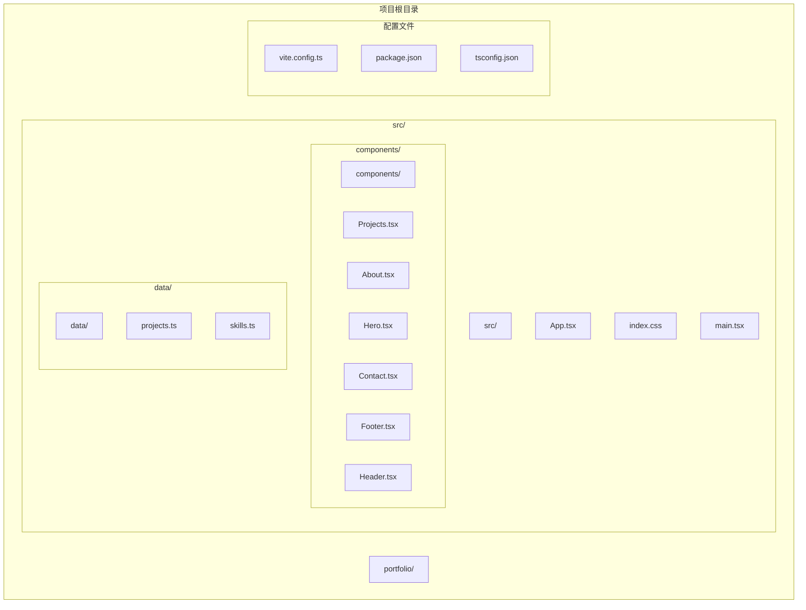
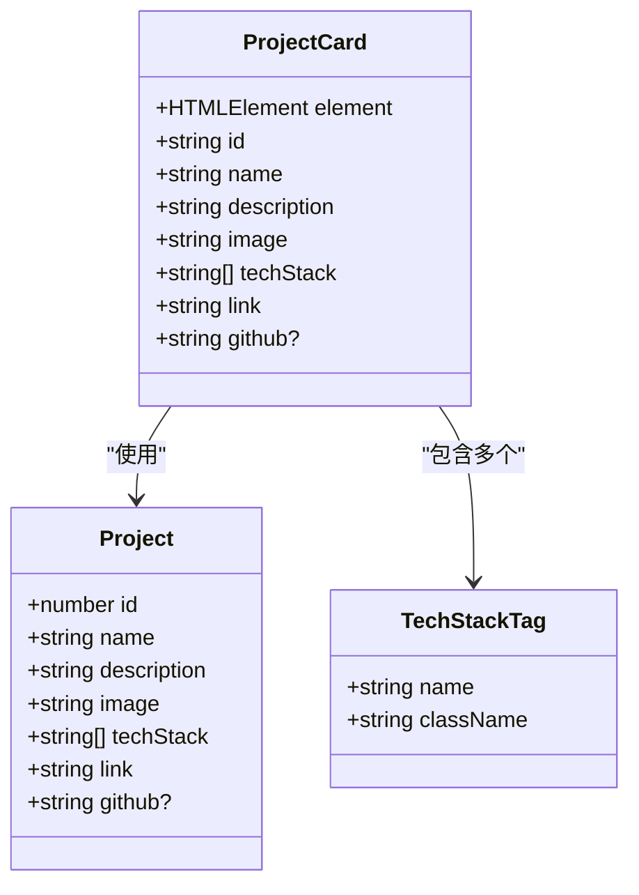
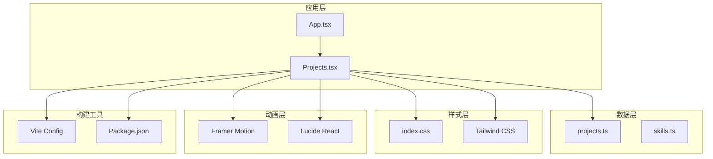
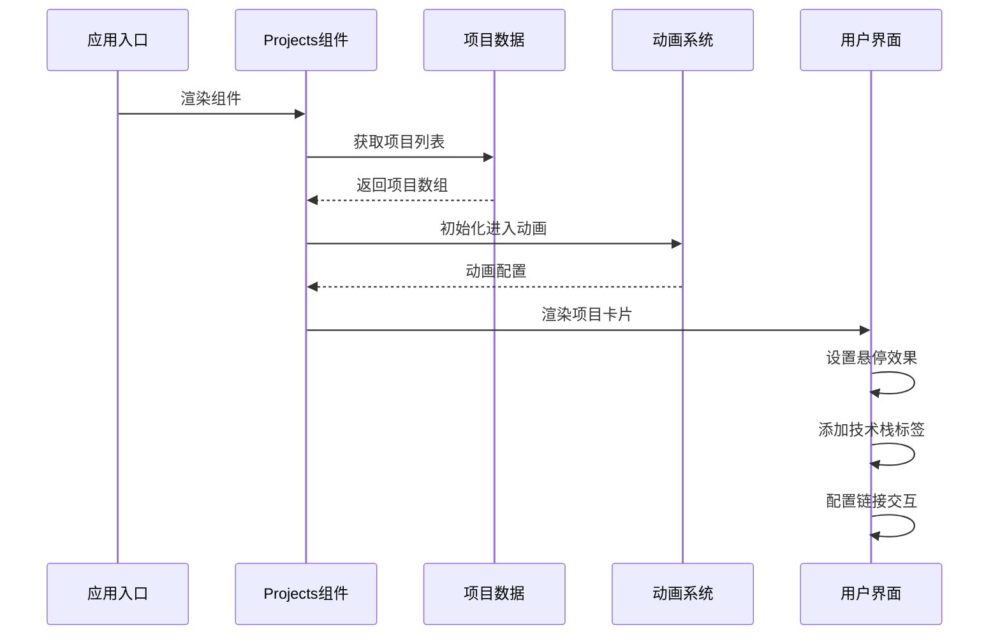
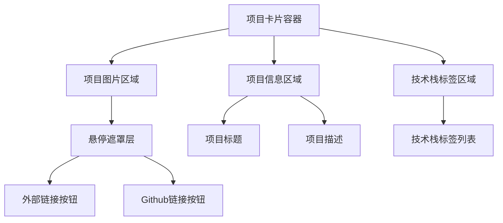
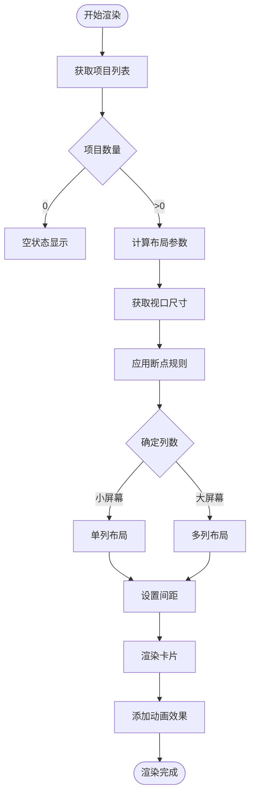
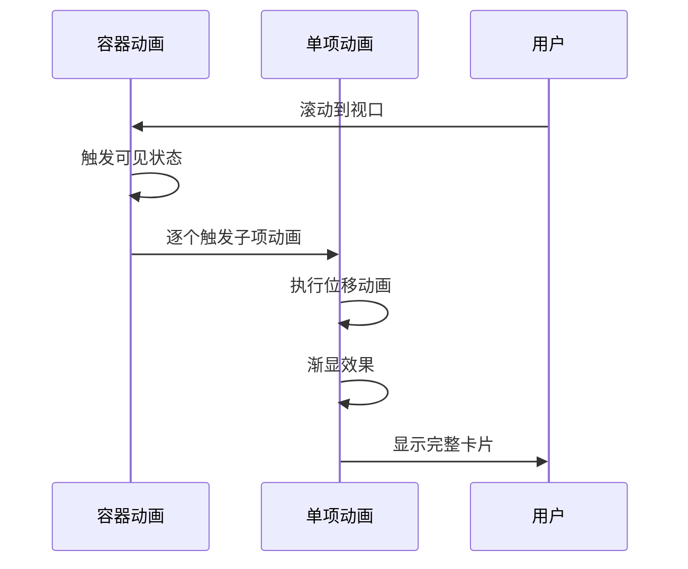
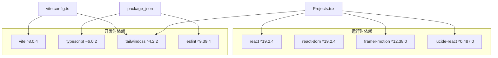
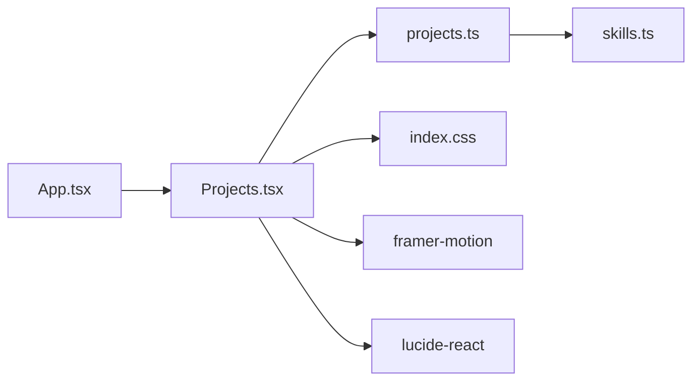
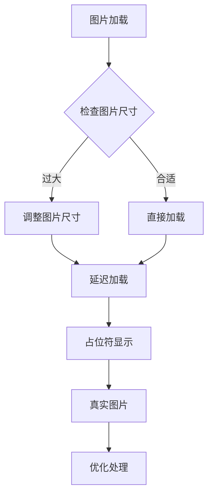

# Projects 项目展示组件

<cite>
**本文档引用的文件**
- [Projects.tsx](file://src/components/Projects.tsx)
- [projects.ts](file://src/data/projects.ts)
- [skills.ts](file://src/data/skills.ts)
- [App.tsx](file://src/App.tsx)
- [index.css](file://src/index.css)
- [vite.config.ts](file://vite.config.ts)
- [package.json](file://package.json)
</cite>

## 目录
1. [简介](#简介)
2. [项目结构](#项目结构)
3. [核心组件](#核心组件)
4. [架构概览](#架构概览)
5. [详细组件分析](#详细组件分析)
6. [依赖关系分析](#依赖关系分析)
7. [性能考虑](#性能考虑)
8. [故障排除指南](#故障排除指南)
9. [结论](#结论)

## 简介

Projects 组件是 Portfolio 项目中的核心展示模块，负责以美观的卡片形式展示开发者的作品集。该组件采用现代化的 React + TypeScript 架构，结合 Framer Motion 实现流畅的动画效果，使用 Tailwind CSS 提供响应式布局，并通过 Lucide React 图标库增强用户体验。

组件的主要功能包括：
- 展示项目作品集卡片
- 实现响应式网格布局
- 提供悬停交互效果
- 集成技术栈标签显示
- 支持项目链接和 GitHub 仓库访问
- 实现平滑的进入视口动画

## 项目结构

Portfolio 项目采用模块化的文件组织方式，主要目录结构如下：



**图表来源**
- [Projects.tsx:1-151](file://src/components/Projects.tsx#L1-L151)
- [projects.ts:1-49](file://src/data/projects.ts#L1-L49)
- [App.tsx:1-28](file://src/App.tsx#L1-L28)

**章节来源**
- [Projects.tsx:1-151](file://src/components/Projects.tsx#L1-L151)
- [projects.ts:1-49](file://src/data/projects.ts#L1-L49)
- [App.tsx:1-28](file://src/App.tsx#L1-L28)

## 核心组件

### 项目数据模型

Projects 组件的核心数据结构基于清晰的 TypeScript 接口定义：



**图表来源**
- [projects.ts:2-10](file://src/data/projects.ts#L2-L10)

### 组件架构设计

Projects 组件采用了分层架构模式：

1. **容器层**: 负责整体布局和动画控制
2. **项目卡片层**: 单个项目的展示单元
3. **交互层**: 处理用户交互和状态变化
4. **数据层**: 管理项目数据和配置

**章节来源**
- [projects.ts:1-49](file://src/data/projects.ts#L1-L49)
- [Projects.tsx:1-151](file://src/components/Projects.tsx#L1-L151)

## 架构概览

### 整体架构图



**图表来源**
- [App.tsx:1-28](file://src/App.tsx#L1-L28)
- [Projects.tsx:1-151](file://src/components/Projects.tsx#L1-L151)
- [projects.ts:1-49](file://src/data/projects.ts#L1-L49)
- [package.json:1-37](file://package.json#L1-L37)

### 数据流架构



**图表来源**
- [Projects.tsx:29-125](file://src/components/Projects.tsx#L29-L125)
- [projects.ts:12-48](file://src/data/projects.ts#L12-L48)

## 详细组件分析

### 项目卡片设计

#### 卡片布局结构

每个项目卡片都遵循统一的设计规范：



**图表来源**
- [Projects.tsx:60-125](file://src/components/Projects.tsx#L60-L125)

#### 悬停交互设计

组件实现了多层次的悬停交互效果：

1. **卡片边框变化**: 从半透明到更明显的边框
2. **标题颜色过渡**: 从白色到渐变色
3. **遮罩层显示**: 淡入淡出的覆盖层
4. **按钮缩放效果**: 按钮的微缩放动画

**章节来源**
- [Projects.tsx:64-99](file://src/components/Projects.tsx#L64-L99)

### 响应式网格布局

#### 断点适配策略

组件采用 Tailwind CSS 的响应式断点系统：

| 断点 | 屏幕宽度 | 列数 | 卡片间距 |
|------|----------|------|----------|
| 默认 | 0px+ | 1列 | 32px |
| sm+ | 640px+ | 1列 | 24px |
| md+ | 768px+ | 2列 | 32px |
| lg+ | 1024px+ | 2列 | 32px |

#### 排列算法



**图表来源**
- [Projects.tsx:58-125](file://src/components/Projects.tsx#L58-L125)

**章节来源**
- [Projects.tsx:58-59](file://src/components/Projects.tsx#L58-L59)

### 技术栈标签系统

#### 标签渲染机制

技术栈标签采用动态渲染方式：

1. **遍历项目技术栈数组**
2. **为每个技术生成独立标签元素**
3. **应用统一的样式类名**
4. **支持任意数量的技术标签**

#### 标签样式设计

标签采用圆角矩形设计，具有以下特性：
- 小号字体 (text-xs)
- 内边距 (px-3 py-1)
- 圆角边框 (rounded-full)
- 半透明背景 (bg-white/10)
- 灰色文字 (text-gray-300)

**章节来源**
- [Projects.tsx:112-121](file://src/components/Projects.tsx#L112-L121)
- [projects.ts:18-47](file://src/data/projects.ts#L18-L47)

### 链接管理机制

#### 外部链接处理

组件支持两种类型的链接：
1. **项目演示链接** (`link`): 访问在线演示
2. **GitHub 仓库链接** (`github`): 访问源代码

#### 安全性考虑

所有外部链接都应用了安全属性：
- `target="_blank"`: 在新窗口打开
- `rel="noopener noreferrer"`: 防止安全漏洞

**章节来源**
- [Projects.tsx:77-98](file://src/components/Projects.tsx#L77-L98)
- [projects.ts:18-47](file://src/data/projects.ts#L18-L47)

### 动画系统集成

#### 进入视口动画

组件使用 Framer Motion 实现了多层次的进入动画：



**图表来源**
- [Projects.tsx:53-67](file://src/components/Projects.tsx#L53-L67)

#### 悬停动画效果

```mermaid
stateDiagram-v2
[*] --> Normal : 初始状态
Normal --> Hover : 鼠标悬停
Hover --> ScaleUp : 按钮缩放
ScaleUp --> Normal : 移出悬停
state Hover {
[*] --> FadeIn : 显示遮罩
FadeIn --> ButtonHover : 显示按钮
}
state ScaleUp {
[*] --> ScaleDown : 按钮点击
ScaleDown --> ScaleUp : 松开鼠标
}
```

**图表来源**
- [Projects.tsx:72-99](file://src/components/Projects.tsx#L72-L99)

**章节来源**
- [Projects.tsx:10-27](file://src/components/Projects.tsx#L10-L27)

## 依赖关系分析

### 外部依赖关系



**图表来源**
- [package.json:12-35](file://package.json#L12-L35)
- [vite.config.ts:1-9](file://vite.config.ts#L1-L9)

### 内部依赖关系



**图表来源**
- [App.tsx:1-28](file://src/App.tsx#L1-L28)
- [Projects.tsx:1-4](file://src/components/Projects.tsx#L1-L4)

**章节来源**
- [package.json:1-37](file://package.json#L1-L37)
- [vite.config.ts:1-9](file://vite.config.ts#L1-L9)

## 性能考虑

### 渲染优化策略

#### 虚拟化考虑

由于项目数量相对较少（当前数据集中包含4个项目），组件采用直接渲染的方式。对于大量项目数据，建议考虑虚拟化技术：

1. **React Window**: 实现列表虚拟化
2. **React Virtualized**: 提供高性能列表渲染
3. **自定义虚拟化**: 基于 Intersection Observer

#### 图片优化



#### 动画性能

组件使用 Framer Motion 实现硬件加速的动画：
- 使用 transform 和 opacity 属性
- 避免强制重排操作
- 合理设置动画持续时间

### 内存管理

1. **事件监听器清理**: 组件卸载时自动清理
2. **定时器管理**: 确保动画完成后清理
3. **缓存策略**: 避免重复计算和渲染

## 故障排除指南

### 常见问题及解决方案

#### 项目数据加载失败

**问题症状**:
- 页面空白或显示错误
- 控制台出现数据相关错误

**解决步骤**:
1. 检查 `projects.ts` 文件格式是否正确
2. 验证项目 ID 是否唯一
3. 确认必需字段是否存在

**章节来源**
- [projects.ts:12-48](file://src/data/projects.ts#L12-L48)

#### 动画不生效

**问题症状**:
- 卡片直接显示而非动画出现
- 悬停效果异常

**解决步骤**:
1. 确认 Framer Motion 版本兼容性
2. 检查浏览器对 CSS 变换的支持
3. 验证容器的 `viewport` 配置

#### 响应式布局异常

**问题症状**:
- 卡片在小屏幕上重叠
- 栅格系统失效

**解决步骤**:
1. 检查 Tailwind CSS 配置
2. 验证断点类名使用
3. 确认容器宽度设置

### 错误处理机制

组件内置了基础的错误处理：
- 缺失的 GitHub 链接会自动隐藏对应按钮
- 外部链接的安全属性确保页面安全
- 动画系统的回退机制保证基本功能

**章节来源**
- [Projects.tsx:87-98](file://src/components/Projects.tsx#L87-L98)

## 结论

Projects 组件是一个设计精良的项目展示模块，具有以下特点：

### 技术优势
- **现代化架构**: 基于 React 19 和 TypeScript 6
- **流畅动画**: 使用 Framer Motion 实现专业级动画效果
- **响应式设计**: 完整的移动端适配方案
- **可维护性**: 清晰的代码结构和类型定义

### 设计亮点
- **视觉层次**: 通过渐变色彩和阴影营造深度感
- **交互反馈**: 多层次的悬停和点击反馈
- **内容组织**: 清晰的信息架构和标签系统
- **性能优化**: 合理的动画和渲染策略

### 扩展建议
1. **数据持久化**: 集成数据库或 CMS 系统
2. **搜索过滤**: 添加项目筛选和搜索功能
3. **图片优化**: 实现懒加载和格式转换
4. **国际化**: 支持多语言内容
5. **SEO 优化**: 添加 meta 标签和结构化数据

该组件为 Portfolio 项目提供了坚实的基础，能够有效展示开发者的作品集，同时保持良好的用户体验和技术可维护性。