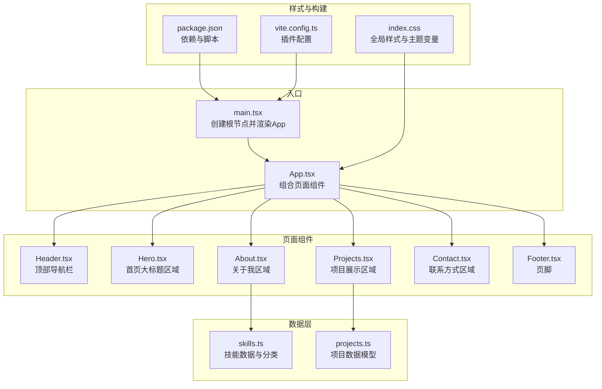
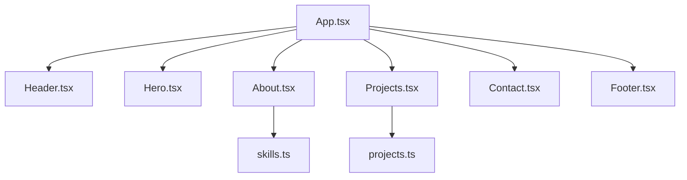
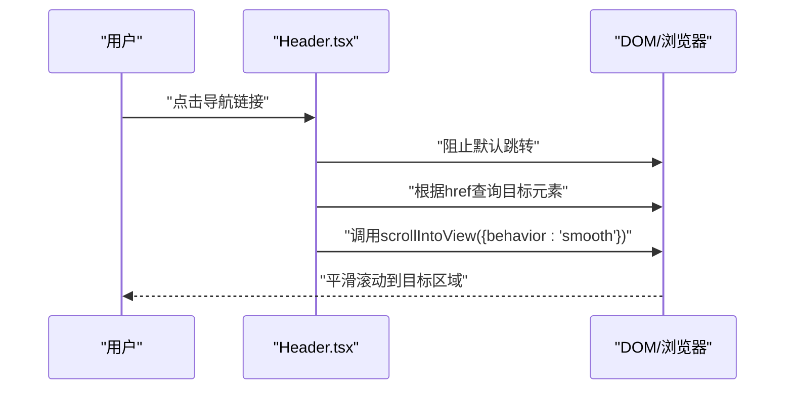
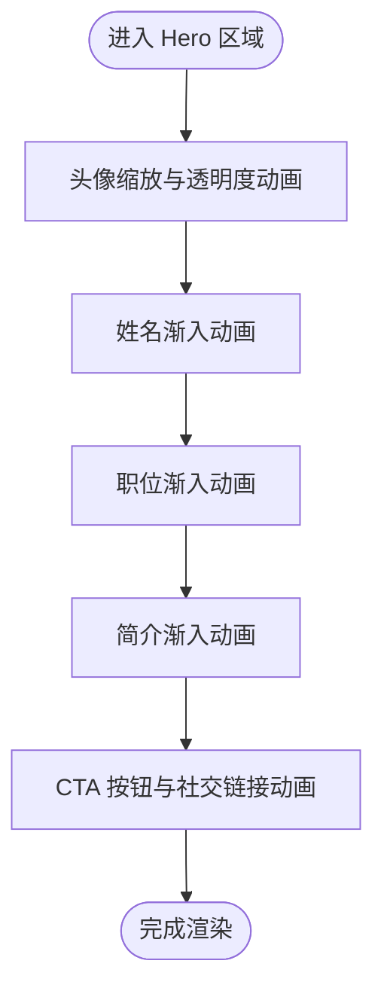
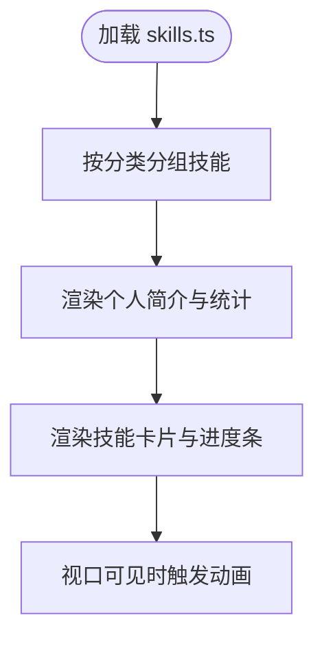
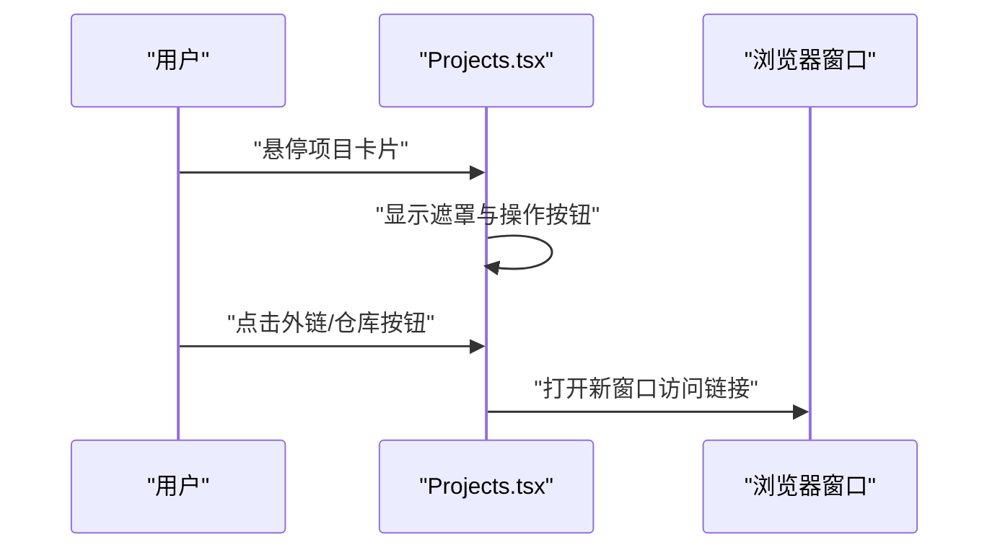
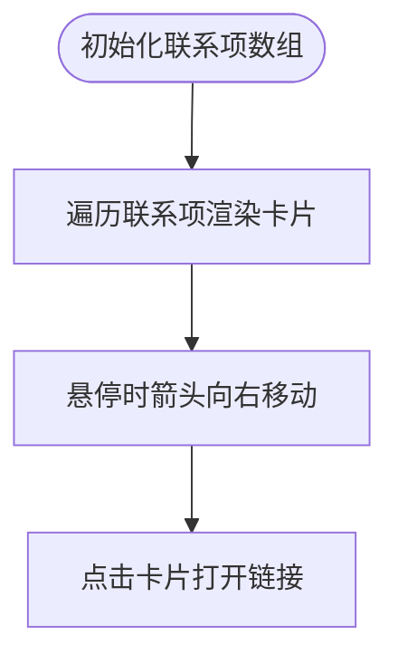
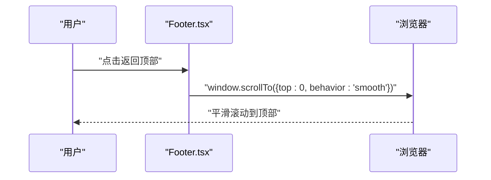
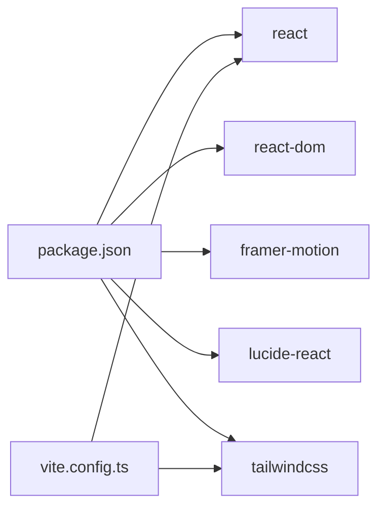

# 组件架构

<cite>
**本文引用的文件**
- [App.tsx](file://portfolio/src/App.tsx)
- [main.tsx](file://portfolio/src/main.tsx)
- [Header.tsx](file://portfolio/src/components/Header.tsx)
- [Hero.tsx](file://portfolio/src/components/Hero.tsx)
- [About.tsx](file://portfolio/src/components/About.tsx)
- [Projects.tsx](file://portfolio/src/components/Projects.tsx)
- [Contact.tsx](file://portfolio/src/components/Contact.tsx)
- [Footer.tsx](file://portfolio/src/components/Footer.tsx)
- [projects.ts](file://portfolio/src/data/projects.ts)
- [skills.ts](file://portfolio/src/data/skills.ts)
- [index.css](file://portfolio/src/index.css)
- [package.json](file://portfolio/package.json)
- [vite.config.ts](file://portfolio/vite.config.ts)
</cite>

## 目录
1. [引言](#引言)
2. [项目结构](#项目结构)
3. [核心组件](#核心组件)
4. [架构总览](#架构总览)
5. [组件详细分析](#组件详细分析)
6. [依赖关系分析](#依赖关系分析)
7. [性能考量](#性能考量)
8. [故障排查指南](#故障排查指南)
9. [结论](#结论)
10. [附录](#附录)

## 引言
本文件面向AIWs项目的组件架构，围绕单一职责原则（SRP）对页面组件进行系统化拆分与设计说明。重点阐述Header、Hero、About、Projects、Contact、Footer等核心组件的功能定位与职责边界；解释组件间通信方式（props传递、事件处理、状态共享）、复用性与可扩展性设计；提供组件关系图与交互流程图；并给出组件测试策略与调试方法建议。

## 项目结构
项目采用以“功能域”为主的组织方式：顶层App组合各页面组件，数据层独立于组件之外，样式通过Tailwind与全局CSS统一管理，构建由Vite驱动，运行时使用React与TypeScript。

**图表来源**
- [main.tsx:1-12](file://portfolio/src/main.tsx#L1-L12)
- [App.tsx:1-28](file://portfolio/src/App.tsx#L1-L28)
- [Header.tsx:1-129](file://portfolio/src/components/Header.tsx#L1-L129)
- [Hero.tsx:1-142](file://portfolio/src/components/Hero.tsx#L1-L142)
- [About.tsx:1-151](file://portfolio/src/components/About.tsx#L1-L151)
- [Projects.tsx:1-151](file://portfolio/src/components/Projects.tsx#L1-L151)
- [Contact.tsx:1-149](file://portfolio/src/components/Contact.tsx#L1-L149)
- [Footer.tsx:1-48](file://portfolio/src/components/Footer.tsx#L1-L48)
- [skills.ts:1-39](file://portfolio/src/data/skills.ts#L1-L39)
- [projects.ts:1-49](file://portfolio/src/data/projects.ts#L1-L49)
- [index.css:1-46](file://portfolio/src/index.css#L1-L46)
- [package.json:1-37](file://portfolio/package.json#L1-L37)
- [vite.config.ts:1-9](file://portfolio/vite.config.ts#L1-L9)

**章节来源**
- [main.tsx:1-12](file://portfolio/src/main.tsx#L1-L12)
- [App.tsx:1-28](file://portfolio/src/App.tsx#L1-L28)
- [index.css:1-46](file://portfolio/src/index.css#L1-L46)
- [package.json:1-37](file://portfolio/package.json#L1-L37)
- [vite.config.ts:1-9](file://portfolio/vite.config.ts#L1-L9)

## 核心组件
- App：应用主容器，负责页面组件的组合与布局，不承载业务逻辑。
- Header：顶部导航栏，负责滚动态样式、活动区检测与平滑跳转。
- Hero：首页大标题区域，负责首屏视觉呈现与引导交互。
- About：关于我区域，负责个人介绍与技能可视化展示。
- Projects：项目展示区域，负责项目卡片列表与技术栈标签展示。
- Contact：联系方式区域，负责多渠道联系方式卡片。
- Footer：页脚，负责版权信息与返回顶部交互。

这些组件均遵循单一职责：仅关注自身渲染与交互，避免跨组件状态共享，保持高内聚低耦合。

**章节来源**
- [App.tsx:8-28](file://portfolio/src/App.tsx#L8-L28)
- [Header.tsx:12-129](file://portfolio/src/components/Header.tsx#L12-L129)
- [Hero.tsx:3-142](file://portfolio/src/components/Hero.tsx#L3-L142)
- [About.tsx:4-151](file://portfolio/src/components/About.tsx#L4-L151)
- [Projects.tsx:5-151](file://portfolio/src/components/Projects.tsx#L5-L151)
- [Contact.tsx:4-149](file://portfolio/src/components/Contact.tsx#L4-L149)
- [Footer.tsx:4-48](file://portfolio/src/components/Footer.tsx#L4-L48)

## 架构总览
组件间采用自上而下的组合关系：App作为根容器，依次包含Header、Hero、About、Projects、Contact与Footer。数据通过导入方式注入到需要的组件中，如About与Projects分别从skills与projects数据模块读取信息。样式通过全局CSS与Tailwind类名统一管理，构建由Vite与React插件链路完成。

**图表来源**
- [App.tsx:12-25](file://portfolio/src/App.tsx#L12-L25)
- [About.tsx:1-3](file://portfolio/src/components/About.tsx#L1-L3)
- [Projects.tsx:1-3](file://portfolio/src/components/Projects.tsx#L1-L3)
- [skills.ts:1-39](file://portfolio/src/data/skills.ts#L1-L39)
- [projects.ts:1-49](file://portfolio/src/data/projects.ts#L1-L49)

## 组件详细分析

### Header 组件
- 职责边界：顶部导航栏，包含Logo、导航链接、移动端菜单、滚动态样式切换与活动区检测。
- 关键实现：
  - 使用滚动监听计算是否进入滚动态，动态切换样式。
  - 通过元素可见性检测确定当前活动区，用于高亮对应导航项。
  - 提供平滑滚动到指定区域的能力。
- 通信方式：无外部props输入；通过DOM查询与滚动事件处理实现交互。
- 可扩展性：导航链接配置集中管理，便于新增/删除导航项；活动区检测逻辑可抽象为通用Hook。

**图表来源**
- [Header.tsx:44-49](file://portfolio/src/components/Header.tsx#L44-L49)
- [Header.tsx:21-41](file://portfolio/src/components/Header.tsx#L21-L41)

**章节来源**
- [Header.tsx:12-129](file://portfolio/src/components/Header.tsx#L12-L129)

### Hero 组件
- 职责边界：首屏大标题区域，包含头像、姓名、职位、简介、CTA按钮与社交链接。
- 关键实现：
  - 使用动画库实现入场动画与悬停效果。
  - 内联SVG图标与渐变样式，提升视觉层次。
  - 提供平滑滚动到“项目/联系”区域的交互。
- 通信方式：无外部props；通过事件处理器触发滚动行为。
- 可扩展性：内容通过数据驱动（可在后续版本引入i18n或外部配置），动画参数可抽离为配置。

**图表来源**
- [Hero.tsx:15-139](file://portfolio/src/components/Hero.tsx#L15-L139)

**章节来源**
- [Hero.tsx:3-142](file://portfolio/src/components/Hero.tsx#L3-L142)

### About 组件
- 职责边界：关于我区域，包含个人简介与技能可视化展示。
- 关键实现：
  - 将技能按类别分组，使用容器-子项变体模式实现交错动画。
  - 技能条目使用视口可见性触发宽度动画，增强交互体验。
  - 数据来源于skills模块，包含技能名称、等级与分类映射。
- 通信方式：无外部props；内部聚合数据并渲染。
- 可扩展性：技能分类与条目渲染逻辑可抽象为通用组件；动画变体可参数化。

**图表来源**
- [About.tsx:9-35](file://portfolio/src/components/About.tsx#L9-L35)
- [skills.ts:1-39](file://portfolio/src/data/skills.ts#L1-L39)

**章节来源**
- [About.tsx:4-151](file://portfolio/src/components/About.tsx#L4-L151)
- [skills.ts:1-39](file://portfolio/src/data/skills.ts#L1-L39)

### Projects 组件
- 职责边界：项目展示区域，负责项目卡片列表与技术栈标签展示。
- 关键实现：
  - 使用容器-子项变体模式实现网格动画。
  - 项目卡片悬停时显示外链与GitHub按钮遮罩。
  - 技术栈标签使用循环渲染，支持空值保护。
- 通信方式：无外部props；通过事件处理器打开新窗口。
- 可扩展性：项目数据模型清晰，便于扩展字段；卡片交互可抽取为可复用卡片组件。

**图表来源**
- [Projects.tsx:72-99](file://portfolio/src/components/Projects.tsx#L72-L99)
- [Projects.tsx:1-3](file://portfolio/src/components/Projects.tsx#L1-L3)
- [projects.ts:1-49](file://portfolio/src/data/projects.ts#L1-L49)

**章节来源**
- [Projects.tsx:5-151](file://portfolio/src/components/Projects.tsx#L5-L151)
- [projects.ts:1-49](file://portfolio/src/data/projects.ts#L1-L49)

### Contact 组件
- 职责边界：联系方式区域，负责多渠道联系方式卡片。
- 关键实现：
  - 使用容器-子项变体模式实现卡片交错动画。
  - 每个联系卡片包含图标、名称、值与箭头指示器。
  - 支持外部链接与邮件链接的安全属性设置。
- 通信方式：无外部props；通过事件处理器打开链接。
- 可扩展性：联系项配置集中管理，便于新增/修改渠道；颜色与图标可参数化。

**图表来源**
- [Contact.tsx:9-38](file://portfolio/src/components/Contact.tsx#L9-L38)
- [Contact.tsx:83-131](file://portfolio/src/components/Contact.tsx#L83-L131)

**章节来源**
- [Contact.tsx:4-149](file://portfolio/src/components/Contact.tsx#L4-L149)

### Footer 组件
- 职责边界：页脚，包含版权信息与返回顶部按钮。
- 关键实现：
  - 动态生成当前年份。
  - 提供平滑滚动到页面顶部的交互。
- 通信方式：无外部props；通过事件处理器触发滚动。
- 可扩展性：版权文案与按钮可配置化；可增加回到顶部的可见性判断。

**图表来源**
- [Footer.tsx:11-13](file://portfolio/src/components/Footer.tsx#L11-L13)

**章节来源**
- [Footer.tsx:4-48](file://portfolio/src/components/Footer.tsx#L4-L48)

## 依赖关系分析
- 运行时依赖：React、React DOM、Framer Motion（动画）、Lucide React（图标）、Tailwind CSS（样式）。
- 构建依赖：Vite、@vitejs/plugin-react、@tailwindcss/vite、TypeScript。
- 组件间依赖：App组合所有页面组件；About与Projects分别依赖skills与projects数据模块；Header、Hero、Footer通过事件处理与DOM交互，不依赖外部状态。

**图表来源**
- [package.json:12-35](file://portfolio/package.json#L12-L35)
- [vite.config.ts:6-8](file://portfolio/vite.config.ts#L6-L8)

**章节来源**
- [package.json:12-35](file://portfolio/package.json#L12-L35)
- [vite.config.ts:1-9](file://portfolio/vite.config.ts#L1-L9)

## 性能考量
- 渲染性能
  - 使用视口可见性触发的动画（如About、Projects、Contact）减少初始渲染压力。
  - Header滚动态样式切换与活动区检测在滚动事件中执行，建议结合节流/防抖优化（当前实现未显式节流，可评估）。
- 交互性能
  - 所有组件均采用轻量事件处理，避免不必要的重渲染。
- 样式性能
  - Tailwind类名与渐变背景在CSS中集中管理，减少内联样式的重复计算。
- 构建性能
  - Vite快速冷启动与热更新；React插件与Tailwind插件配合良好。

[本节为通用性能指导，无需特定文件引用]

## 故障排查指南
- 滚动跳转无效
  - 检查目标区域ID与导航链接href是否一致。
  - 确认事件处理器是否正确阻止默认跳转并调用滚动API。
  - 参考路径：[Header.tsx:44-49](file://portfolio/src/components/Header.tsx#L44-L49)
- 活动区高亮不生效
  - 确认目标元素存在且可见区域判定逻辑符合预期。
  - 参考路径：[Header.tsx:25-36](file://portfolio/src/components/Header.tsx#L25-L36)
- 技能条目动画不触发
  - 确认视口可见性触发条件与容器变体配置正确。
  - 参考路径：[About.tsx:111-135](file://portfolio/src/components/About.tsx#L111-L135)
- 项目卡片悬停遮罩不显示
  - 检查悬停遮罩的初始透明度与hover状态切换逻辑。
  - 参考路径：[Projects.tsx:72-99](file://portfolio/src/components/Projects.tsx#L72-L99)
- 联系卡片无法打开链接
  - 确认链接地址与安全属性设置（外部链接需noopener noreferrer）。
  - 参考路径：[Contact.tsx:96-97](file://portfolio/src/components/Contact.tsx#L96-L97)
- 返回顶部无效
  - 确认滚动API调用与事件绑定。
  - 参考路径：[Footer.tsx:11-13](file://portfolio/src/components/Footer.tsx#L11-L13)

**章节来源**
- [Header.tsx:25-49](file://portfolio/src/components/Header.tsx#L25-L49)
- [About.tsx:111-135](file://portfolio/src/components/About.tsx#L111-L135)
- [Projects.tsx:72-99](file://portfolio/src/components/Projects.tsx#L72-L99)
- [Contact.tsx:96-97](file://portfolio/src/components/Contact.tsx#L96-L97)
- [Footer.tsx:11-13](file://portfolio/src/components/Footer.tsx#L11-L13)

## 结论
本项目严格遵循单一职责原则，将页面功能拆分为独立组件，职责清晰、边界明确。组件间通过组合与数据导入实现协作，避免了跨组件状态共享带来的复杂性。动画与交互均在组件内部实现，保持了良好的可维护性与可扩展性。建议后续在Header滚动检测与About/Projects动画中引入节流与更细粒度的可配置化，进一步提升性能与复用性。

[本节为总结性内容，无需特定文件引用]

## 附录
- 组件测试策略建议
  - 单元测试：针对组件渲染与交互逻辑（如点击、悬停、滚动）编写测试用例，验证关键分支与边界条件。
  - 集成测试：验证组件组合后的整体行为（如Header与各区域的滚动联动）。
  - 端到端测试：覆盖真实用户路径（如导航到不同区域、打开外部链接）。
- 调试方法
  - 使用浏览器开发者工具检查事件绑定与DOM结构。
  - 利用React DevTools检查组件树与渲染次数。
  - 对动画与滚动行为进行逐步断点调试，确认触发时机与参数。

[本节为通用指导，无需特定文件引用]