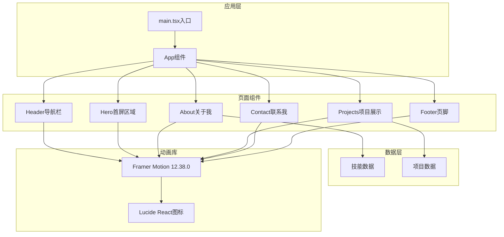
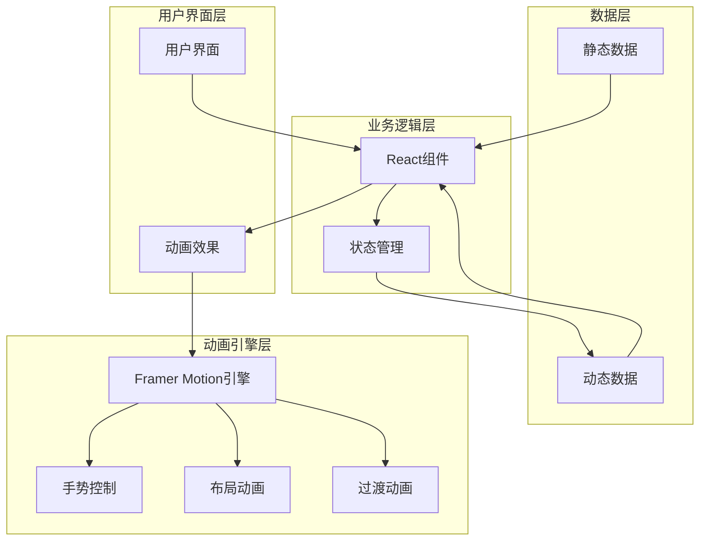
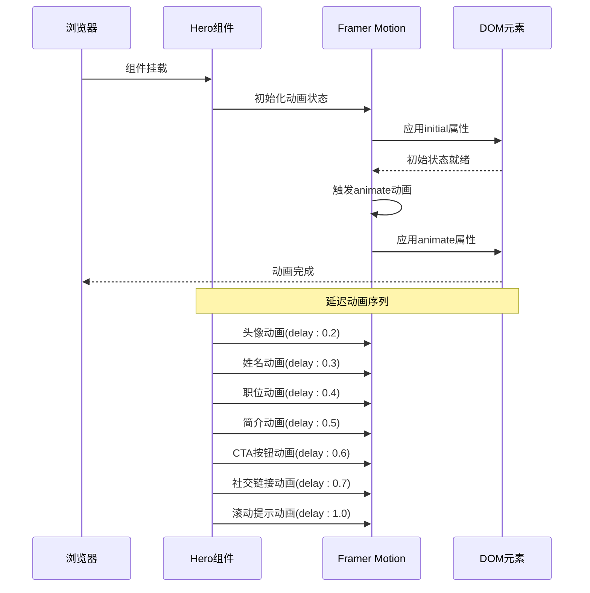
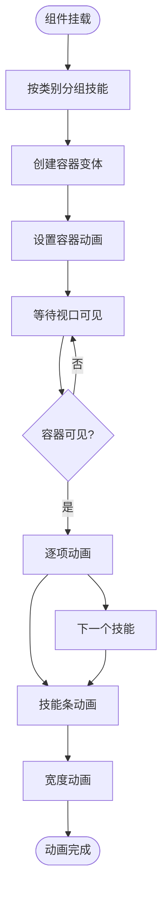
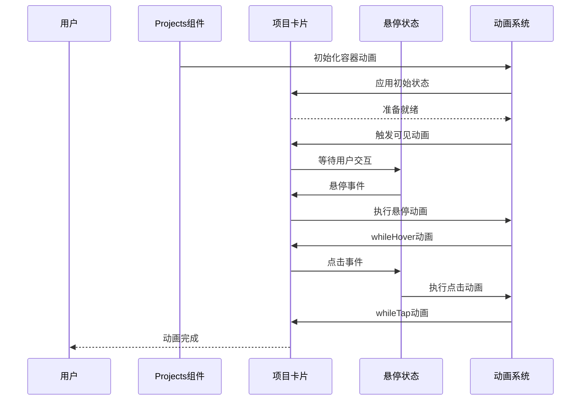
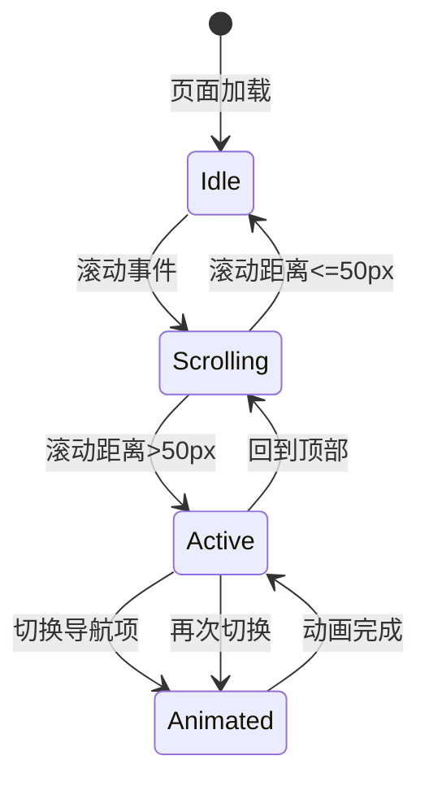
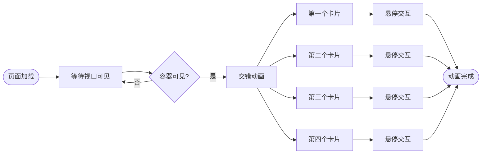
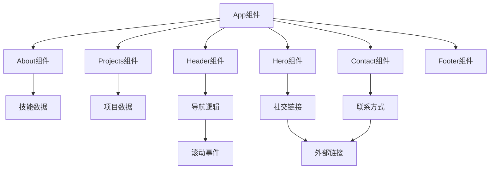

# Framer Motion动画系统

<cite>
**本文档引用的文件**
- [package.json](file://portfolio/package.json)
- [vite.config.ts](file://portfolio/vite.config.ts)
- [src/main.tsx](file://portfolio/src/main.tsx)
- [src/App.tsx](file://portfolio/src/App.tsx)
- [src/App.css](file://portfolio/src/App.css)
- [src/components/Hero.tsx](file://portfolio/src/components/Hero.tsx)
- [src/components/About.tsx](file://portfolio/src/components/About.tsx)
- [src/components/Projects.tsx](file://portfolio/src/components/Projects.tsx)
- [src/components/Header.tsx](file://portfolio/src/components/Header.tsx)
- [src/components/Contact.tsx](file://portfolio/src/components/Contact.tsx)
- [src/components/Footer.tsx](file://portfolio/src/components/Footer.tsx)
- [src/data/skills.ts](file://portfolio/src/data/skills.ts)
- [src/data/projects.ts](file://portfolio/src/data/projects.ts)
</cite>

## 目录
1. [简介](#简介)
2. [项目架构](#项目架构)
3. [核心组件](#核心组件)
4. [架构概览](#架构概览)
5. [详细组件分析](#详细组件分析)
6. [依赖关系分析](#依赖关系分析)
7. [性能考虑](#性能考虑)
8. [故障排除指南](#故障排除指南)
9. [结论](#结论)

## 简介

本项目是一个使用Framer Motion动画库构建的现代个人作品集网站。该系统集成了多个动画组件，实现了从页面过渡到元素进入再到交互反馈的完整动画体验。项目采用React 19和TypeScript构建，使用Vite作为开发服务器，Tailwind CSS进行样式设计。

Framer Motion版本为12.38.0，提供了强大的动画控制能力，包括基础动画、布局动画、手势动画和视口动画等多种动画模式。

## 项目架构

项目采用模块化的组件架构，每个页面区域都是独立的组件，通过Framer Motion实现各自的动画效果。



**图表来源**
- [src/main.tsx:1-12](file://portfolio/src/main.tsx#L1-L12)
- [src/App.tsx:1-28](file://portfolio/src/App.tsx#L1-L28)
- [package.json:12-17](file://portfolio/package.json#L12-L17)

**章节来源**
- [src/main.tsx:1-12](file://portfolio/src/main.tsx#L1-L12)
- [src/App.tsx:1-28](file://portfolio/src/App.tsx#L1-L28)
- [package.json:12-17](file://portfolio/package.json#L12-L17)

## 核心组件

### 动画库集成

项目通过npm安装Framer Motion动画库，版本为12.38.0。该版本提供了最新的动画特性和性能优化。

**依赖配置：**
- framer-motion: ^12.38.0 - 主要动画库
- lucide-react: ^0.487.0 - 图标库
- react: ^19.2.4 - React框架
- react-dom: ^19.2.4 - DOM渲染

### 开发环境配置

项目使用Vite作为构建工具，配置了React和Tailwind CSS插件，确保开发体验和生产性能。

**开发配置特点：**
- React插件启用快速刷新
- Tailwind CSS集成支持原子化样式
- TypeScript类型检查
- 生产环境优化

**章节来源**
- [package.json:12-17](file://portfolio/package.json#L12-L17)
- [vite.config.ts:1-9](file://portfolio/vite.config.ts#L1-L9)

## 架构概览

系统采用分层架构，每个组件都有明确的职责分工：



**图表来源**
- [src/components/Hero.tsx:1-142](file://portfolio/src/components/Hero.tsx#L1-L142)
- [src/components/About.tsx:1-151](file://portfolio/src/components/About.tsx#L1-L151)
- [src/components/Projects.tsx:1-151](file://portfolio/src/components/Projects.tsx#L1-L151)

## 详细组件分析

### Hero组件 - 首屏动画系统

Hero组件实现了完整的首屏动画体验，包括渐入动画、延迟动画和循环动画。

#### 动画触发机制



**图表来源**
- [src/components/Hero.tsx:15-26](file://portfolio/src/components/Hero.tsx#L15-L26)
- [src/components/Hero.tsx:29-38](file://portfolio/src/components/Hero.tsx#L29-L38)
- [src/components/Hero.tsx:62-92](file://portfolio/src/components/Hero.tsx#L62-L92)

#### 动画配置详解

**头像缩放动画：**
- 初始状态：scale: 0, opacity: 0
- 结束状态：scale: 1, opacity: 1
- 持续时间：0.5秒
- 延迟：0.2秒

**文本元素动画：**
- 初始状态：y: 20, opacity: 0
- 结束状态：y: 0, opacity: 1
- 持续时间：0.5秒
- 递增延迟：0.1秒

**交互反馈动画：**
- whileHover：scale: 1.05
- whileTap：scale: 0.95

**章节来源**
- [src/components/Hero.tsx:15-142](file://portfolio/src/components/Hero.tsx#L15-L142)

### About组件 - 技能条动画系统

About组件实现了复杂的技能条动画，包括分组动画、交错动画和视口触发动画。

#### 技能条动画流程



**图表来源**
- [src/components/About.tsx:18-35](file://portfolio/src/components/About.tsx#L18-L35)
- [src/components/About.tsx:111-144](file://portfolio/src/components/About.tsx#L111-L144)

#### 动画配置策略

**容器动画配置：**
- 变体类型：staggerChildren: 0.1
- 触发条件：whileInView + viewport.once
- 动画类型：opacity, y坐标

**技能条动画：**
- 初始状态：width: 0
- 结束状态：width: {skill.level}%
- 持续时间：1秒
- 延迟：0.2秒
- 触发条件：视口可见

**章节来源**
- [src/components/About.tsx:18-151](file://portfolio/src/components/About.tsx#L18-L151)
- [src/data/skills.ts:1-39](file://portfolio/src/data/skills.ts#L1-L39)

### Projects组件 - 项目卡片动画系统

Projects组件实现了网格布局的项目卡片动画，包括交错动画和悬停交互。

#### 项目卡片动画序列



**图表来源**
- [src/components/Projects.tsx:53-125](file://portfolio/src/components/Projects.tsx#L53-L125)

#### 动画特性配置

**网格容器动画：**
- 变体类型：staggerChildren: 0.15
- 动画类型：y坐标, opacity
- 持续时间：0.5秒

**单个卡片动画：**
- 初始状态：y: 30, opacity: 0
- 结束状态：y: 0, opacity: 1
- 动画类型：hover, tap

**悬停遮罩动画：**
- 初始状态：opacity: 0
- 结束状态：opacity: 1
- 动画类型：opacity过渡

**章节来源**
- [src/components/Projects.tsx:10-151](file://portfolio/src/components/Projects.tsx#L10-L151)

### Header组件 - 导航栏动画系统

Header组件实现了响应式导航栏的动画效果，包括滚动动画和导航激活指示器。

#### 导航激活指示器动画



**图表来源**
- [src/components/Header.tsx:17-41](file://portfolio/src/components/Header.tsx#L17-L41)
- [src/components/Header.tsx:98-103](file://portfolio/src/components/Header.tsx#L98-L103)

#### 动画配置要点

**导航栏滚动动画：**
- 初始状态：y: -100
- 结束状态：y: 0
- 持续时间：0.5秒

**激活指示器动画：**
- 动画类型：layoutId动画
- 缓动函数：spring
- 参数：stiffness: 380, damping: 30

**章节来源**
- [src/components/Header.tsx:16-129](file://portfolio/src/components/Header.tsx#L16-L129)

### Contact组件 - 联系方式动画系统

Contact组件实现了联系卡片的交错动画和悬停交互。

#### 卡片动画序列



**图表来源**
- [src/components/Contact.tsx:40-57](file://portfolio/src/components/Contact.tsx#L40-L57)
- [src/components/Contact.tsx:90-131](file://portfolio/src/components/Contact.tsx#L90-L131)

**章节来源**
- [src/components/Contact.tsx:8-149](file://portfolio/src/components/Contact.tsx#L8-L149)

### Footer组件 - 页脚动画系统

Footer组件实现了简单的视口动画和交互反馈。

**动画配置：**
- 视口动画：opacity从0到1
- 交互动画：whileHover, whileTap
- 触发条件：viewport.once

**章节来源**
- [src/components/Footer.tsx:8-48](file://portfolio/src/components/Footer.tsx#L8-L48)

## 依赖关系分析

### 动画库依赖关系

```mermaid
graph TB
subgraph "外部依赖"
FramerMotion[framer-motion@12.38.0]
LucideReact[lucide-react@0.487.0]
React[react@19.2.4]
ReactDOM[react-dom@19.2.4]
end
subgraph "内部组件"
Hero[Hero组件]
About[About组件]
Projects[Projects组件]
Header[Header组件]
Contact[Contact组件]
Footer[Footer组件]
end
subgraph "数据层"
SkillsData[skills.ts]
ProjectsData[projects.ts]
end
FramerMotion --> Hero
FramerMotion --> About
FramerMotion --> Projects
FramerMotion --> Header
FramerMotion --> Contact
FramerMotion --> Footer
LucideReact --> Header
LucideReact --> Contact
LucideReact --> Footer
SkillsData --> About
ProjectsData --> Projects
React --> Hero
React --> About
React --> Projects
React --> Header
React --> Contact
React --> Footer
ReactDOM --> Hero
ReactDOM --> About
ReactDOM --> Projects
ReactDOM --> Header
ReactDOM --> Contact
ReactDOM --> Footer
```

**图表来源**
- [package.json:12-17](file://portfolio/package.json#L12-L17)
- [src/components/Hero.tsx:1](file://portfolio/src/components/Hero.tsx#L1)
- [src/components/About.tsx:1](file://portfolio/src/components/About.tsx#L1)
- [src/components/Projects.tsx:1](file://portfolio/src/components/Projects.tsx#L1)

### 组件间依赖关系



**图表来源**
- [src/App.tsx:1-28](file://portfolio/src/App.tsx#L1-L28)
- [src/components/About.tsx:2-3](file://portfolio/src/components/About.tsx#L2-L3)
- [src/components/Projects.tsx:2-3](file://portfolio/src/components/Projects.tsx#L2-L3)

**章节来源**
- [src/App.tsx:1-28](file://portfolio/src/App.tsx#L1-L28)
- [package.json:12-17](file://portfolio/package.json#L12-L17)

## 性能考虑

### 硬件加速优化

项目充分利用了浏览器的硬件加速能力，通过CSS变换属性实现流畅动画：

**硬件加速属性：**
- transform: translate3d(0,0,0) - 启用GPU加速
- will-change: transform - 提前告知浏览器变化
- perspective: 2000px - 创建3D上下文

### 动画性能最佳实践

**性能优化策略：**
1. 使用transform替代position属性
2. 避免频繁重排重绘
3. 合理使用opacity而非height/width
4. 控制动画数量和频率
5. 使用viewport触发减少不必要的动画

**内存管理：**
- viewport.once避免重复触发
- useEffect清理监听器
- 合理的动画持续时间

### 动画流畅度提升

**帧率优化：**
- 保持60fps目标
- 避免复杂的阴影和模糊效果
- 使用CSS变量减少计算
- 合理的动画缓动函数

**章节来源**
- [src/components/Hero.tsx:45-55](file://portfolio/src/components/Hero.tsx#L45-L55)
- [src/components/About.tsx:132-136](file://portfolio/src/components/About.tsx#L132-L136)

## 故障排除指南

### 常见动画问题

**问题1：动画不触发**
- 检查viewport配置是否正确
- 确认元素是否在视口内
- 验证whileInView属性设置

**问题2：动画卡顿**
- 检查是否有过多同时运行的动画
- 避免使用复杂的阴影效果
- 确保使用transform属性

**问题3：交互无响应**
- 验证whileHover和whileTap配置
- 检查CSS z-index层级
- 确认事件处理器正确绑定

### 调试技巧

**开发工具使用：**
- Chrome DevTools动画面板
- Framer Motion调试工具
- 性能面板监控帧率

**日志记录：**
- 添加console.log跟踪动画状态
- 监控滚动事件触发
- 检查视口交集观察器

**章节来源**
- [src/components/About.tsx:46-48](file://portfolio/src/components/About.tsx#L46-L48)
- [src/components/Projects.tsx:56-58](file://portfolio/src/components/Projects.tsx#L56-L58)

## 结论

本项目成功展示了Framer Motion动画库的强大功能和灵活性。通过精心设计的动画系统，实现了从页面加载到用户交互的完整动画体验。

**主要成就：**
- 完整的首屏动画体验
- 精确的技能条动画
- 流畅的项目卡片网格
- 响应式的导航栏动画
- 优雅的交互反馈

**技术亮点：**
- 合理的动画层次结构
- 有效的性能优化策略
- 完善的状态管理
- 清晰的代码组织

该系统为类似项目提供了优秀的参考模板，展示了如何在实际开发中有效利用Framer Motion的各项功能。