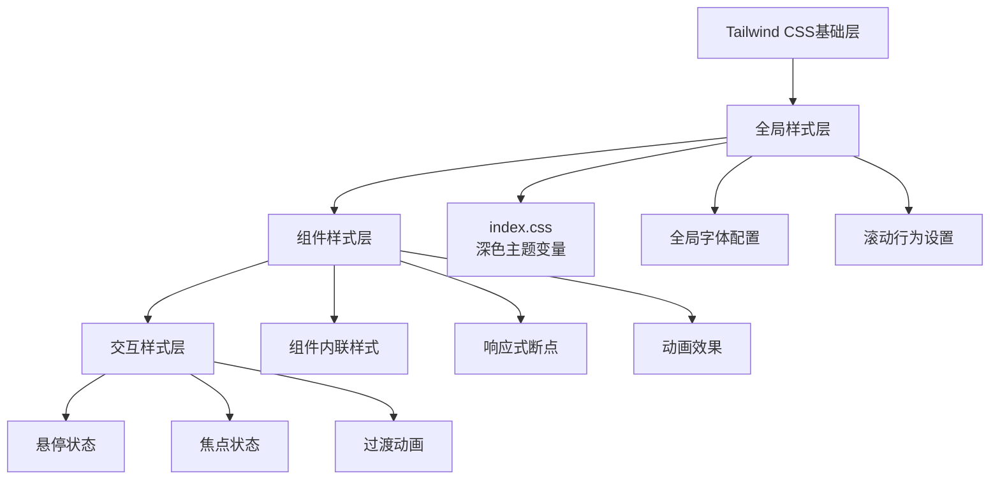
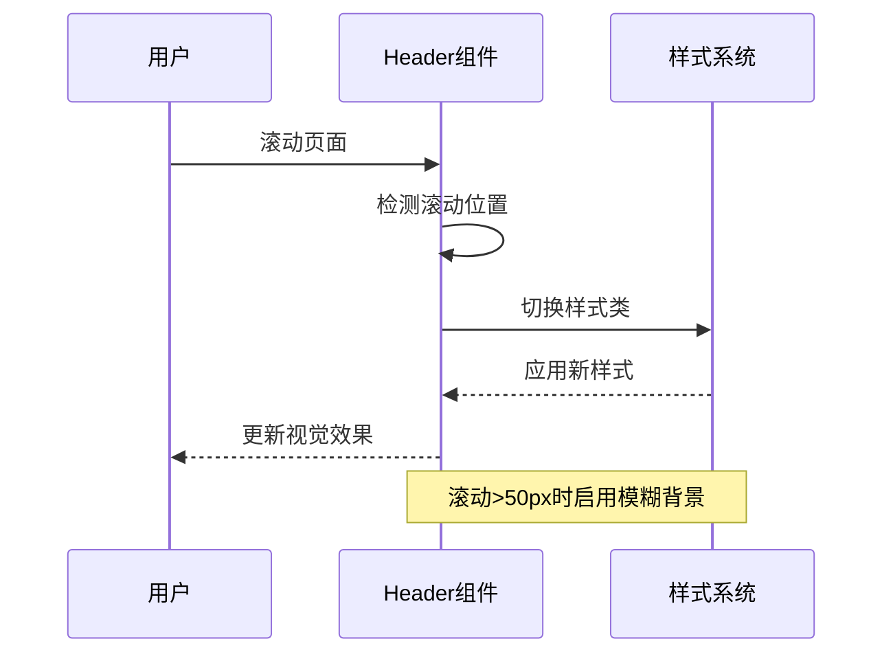

# Tailwind CSS样式系统

<cite>
**本文档引用的文件**
- [package.json](file://portfolio/package.json)
- [vite.config.ts](file://portfolio/vite.config.ts)
- [index.css](file://portfolio/src/index.css)
- [App.css](file://portfolio/src/App.css)
- [main.tsx](file://portfolio/src/main.tsx)
- [App.tsx](file://portfolio/src/App.tsx)
- [Header.tsx](file://portfolio/src/components/Header.tsx)
- [Hero.tsx](file://portfolio/src/components/Hero.tsx)
- [About.tsx](file://portfolio/src/components/About.tsx)
- [Projects.tsx](file://portfolio/src/components/Projects.tsx)
- [Footer.tsx](file://portfolio/src/components/Footer.tsx)
- [skills.ts](file://portfolio/src/data/skills.ts)
- [projects.ts](file://portfolio/src/data/projects.ts)
</cite>

## 目录
1. [简介](#简介)
2. [项目结构](#项目结构)
3. [核心组件](#核心组件)
4. [架构概览](#架构概览)
5. [详细组件分析](#详细组件分析)
6. [依赖关系分析](#依赖关系分析)
7. [性能考虑](#性能考虑)
8. [故障排除指南](#故障排除指南)
9. [结论](#结论)

## 简介

本项目采用Tailwind CSS作为主要的样式框架，结合原子化CSS设计理念，实现了现代化的响应式网站开发。Tailwind CSS通过提供大量预定义的实用类，让开发者能够快速构建一致且可维护的用户界面。

该项目使用了最新的Tailwind CSS v4.2.2版本，配合Vite构建工具和React框架，实现了高效的开发体验和优秀的运行性能。整个样式系统围绕深色主题设计，提供了完整的组件化样式解决方案。

## 项目结构

项目采用模块化的文件组织方式，样式相关的核心文件分布如下：

```mermaid
graph TB
subgraph "样式系统架构"
A[index.css<br/>全局样式定义] --> B[Tailwind CSS<br/>原子化样式框架]
C[App.css<br/>组件特定样式] --> B
D[组件样式<br/>各组件内联样式] --> B
end
subgraph "构建配置"
E[vite.config.ts<br/>Vite构建配置] --> F[@tailwindcss/vite<br/>Tailwind插件]
G[package.json<br/>依赖管理] --> F
end
B --> G
F --> G
```

**图表来源**
- [index.css:1-46](file://portfolio/src/index.css#L1-L46)
- [vite.config.ts:1-9](file://portfolio/vite.config.ts#L1-L9)
- [package.json:18-35](file://portfolio/package.json#L18-L35)

**章节来源**
- [package.json:1-37](file://portfolio/package.json#L1-L37)
- [vite.config.ts:1-9](file://portfolio/vite.config.ts#L1-L9)
- [index.css:1-46](file://portfolio/src/index.css#L1-L46)

## 核心组件

### Tailwind CSS配置与集成

项目通过Vite插件系统集成了Tailwind CSS，实现了自动化的样式编译和优化。

**配置特点：**
- 使用`@tailwindcss/vite`插件进行构建时处理
- 支持原生CSS导入语法
- 自动扫描组件中的类名使用情况
- 提供开发时的热重载支持

### 全局样式系统

项目建立了完整的深色主题样式系统，通过CSS变量实现主题定制：

**深色主题变量定义：**
- `--background`: #0a0a0a (深色背景)
- `--foreground`: #ffffff (前景色/白色文字)
- `--accent-gradient`: 渐变色定义

**字体系统配置：**
- 主字体: 'Inter', -apple-system, BlinkMacSystemFont, 'Segoe UI', Roboto, sans-serif
- 字体平滑: -webkit-font-smoothing: antialiased
- OSX字体平滑: -moz-osx-font-smoothing: grayscale

**章节来源**
- [index.css:3-21](file://portfolio/src/index.css#L3-L21)
- [package.json:20-31](file://portfolio/package.json#L20-L31)
- [vite.config.ts:1-9](file://portfolio/vite.config.ts#L1-L9)

## 架构概览

项目采用分层的样式架构，从基础到组件的层次清晰：



**图表来源**
- [index.css:1-46](file://portfolio/src/index.css#L1-L46)
- [Header.tsx:52-61](file://portfolio/src/components/Header.tsx#L52-L61)
- [Hero.tsx:13-38](file://portfolio/src/components/Hero.tsx#L13-L38)

## 详细组件分析

### 头部导航组件样式

头部组件采用了动态样式切换机制，根据滚动状态调整视觉效果：

**样式特性：**
- 固定定位和z-index管理
- 滚动时的背景模糊效果
- 动态边框颜色变化
- 渐变色Logo和导航链接

**响应式设计：**
- 桌面端: 水平导航布局
- 移动端: 菜单按钮显示



**图表来源**
- [Header.tsx:17-41](file://portfolio/src/components/Header.tsx#L17-L41)
- [Header.tsx:56-60](file://portfolio/src/components/Header.tsx#L56-L60)

**章节来源**
- [Header.tsx:1-129](file://portfolio/src/components/Header.tsx#L1-L129)

### 英雄区域样式系统

英雄区域展示了完整的响应式设计实现：

**设计元素：**
- 渐变色背景和文字效果
- 圆形头像边框渐变
- 流畅的动画过渡
- 响应式布局网格

**样式实现：**
- 使用`min-h-screen`确保全屏高度
- `max-w-4xl`限制内容宽度
- `text-center`居中布局
- `leading-relaxed`改善文字可读性

**章节来源**
- [Hero.tsx:1-142](file://portfolio/src/components/Hero.tsx#L1-L142)

### 关于我区域样式

该区域展现了复杂的数据展示和动画效果：

**技能展示系统：**
- 按类别分组的技能列表
- 动态进度条动画
- 卡片式布局设计
- 渐变色强调效果

**动画实现：**
- `staggerChildren`实现子元素交错出现
- `whileInView`触发视口内动画
- 流畅的过渡效果

**章节来源**
- [About.tsx:1-151](file://portfolio/src/components/About.tsx#L1-L151)

### 项目展示区域样式

项目区域采用了现代卡片式设计：

**设计特色：**
- 网格布局响应式排列
- 悬停时的遮罩效果
- 技术栈标签系统
- 渐变色装饰元素

**交互效果：**
- 悬停时的边框加粗
- 图标按钮的平滑过渡
- 视差滚动效果

**章节来源**
- [Projects.tsx:1-151](file://portfolio/src/components/Projects.tsx#L1-L151)

### 页脚组件样式

页脚组件提供了简洁的功能设计：

**功能特性：**
- 版权信息展示
- 返回顶部按钮
- 心形图标动画
- 响应式布局

**章节来源**
- [Footer.tsx:1-48](file://portfolio/src/components/Footer.tsx#L1-L48)

## 依赖关系分析

项目样式系统的依赖关系清晰明确：

```mermaid
graph LR
A[package.json] --> B[@tailwindcss/vite]
A --> C[tailwindcss]
A --> D[autoprefixer]
E[vite.config.ts] --> B
F[index.css] --> G[Tailwind指令]
H[组件tsx文件] --> I[内联Tailwind类]
B --> J[构建时处理]
J --> K[生成CSS输出]
style K fill:#e1f5fe
```

**图表来源**
- [package.json:18-35](file://portfolio/package.json#L18-L35)
- [vite.config.ts:3](file://portfolio/vite.config.ts#L3)

**章节来源**
- [package.json:18-35](file://portfolio/package.json#L18-L35)
- [vite.config.ts:1-9](file://portfolio/vite.config.ts#L1-L9)

## 性能考虑

### 样式优化策略

项目采用了多项性能优化措施：

**原子化CSS优势：**
- 减少重复样式定义
- 提高样式复用率
- 降低CSS文件大小
- 支持Tree Shaking

**构建优化：**
- 开发时热重载
- 生产环境CSS压缩
- 自动清理未使用样式
- 按需加载样式

**响应式性能：**
- 使用媒体查询优化
- 避免过度复杂的嵌套
- 合理使用CSS变量
- 优化动画性能

## 故障排除指南

### 常见问题解决

**样式不生效问题：**
1. 检查Tailwind插件是否正确配置
2. 确认CSS文件导入顺序
3. 验证类名拼写和语法
4. 检查构建配置是否正确

**响应式问题：**
1. 确认断点值设置合理
2. 检查容器宽度限制
3. 验证媒体查询语法
4. 测试不同设备尺寸

**性能问题：**
1. 分析CSS文件大小
2. 检查未使用的样式类
3. 优化动画性能
4. 考虑懒加载策略

**章节来源**
- [index.css:1-46](file://portfolio/src/index.css#L1-L46)
- [App.css:1-185](file://portfolio/src/App.css#L1-L185)

## 结论

本项目成功实现了基于Tailwind CSS的现代化样式系统，展现了原子化CSS的最佳实践。通过合理的架构设计和组件化实现，项目不仅提供了优秀的用户体验，还具备了良好的可维护性和扩展性。

**主要成就：**
- 完整的深色主题实现
- 响应式设计覆盖所有断点
- 流畅的动画和交互效果
- 高效的构建和优化流程

**未来改进方向：**
- 添加更多主题变体支持
- 实现动态主题切换
- 优化移动端触摸体验
- 扩展动画库和效果