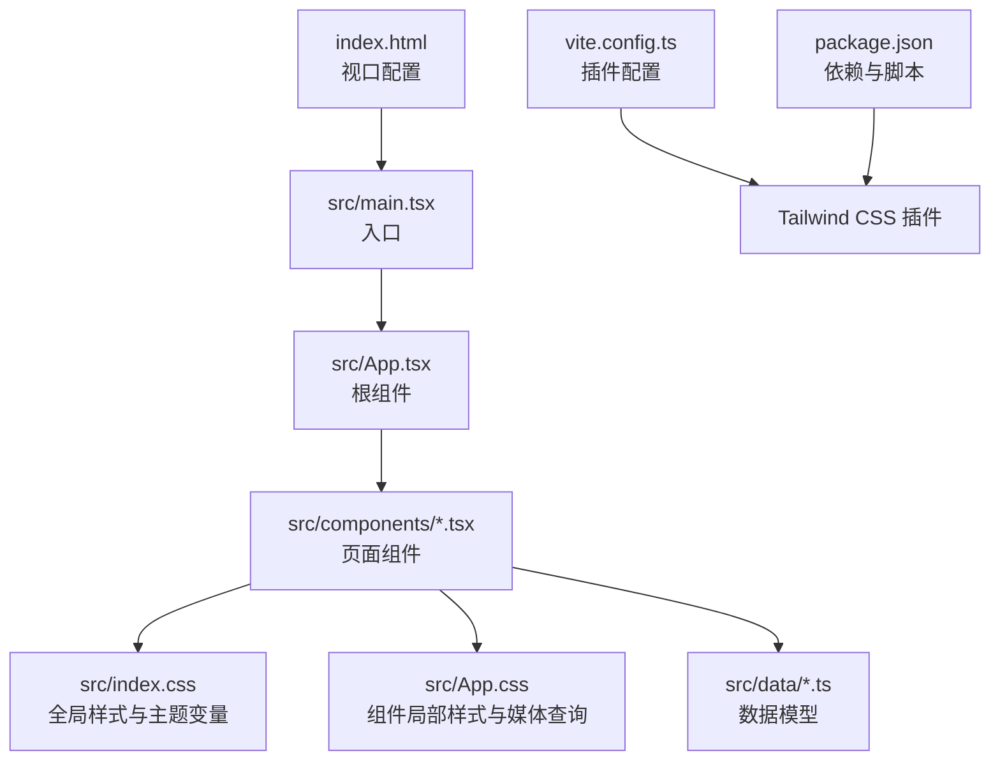
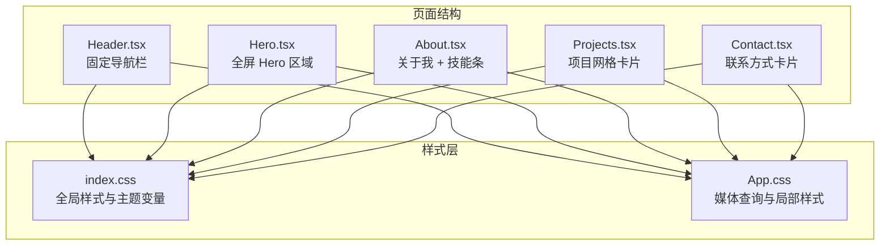
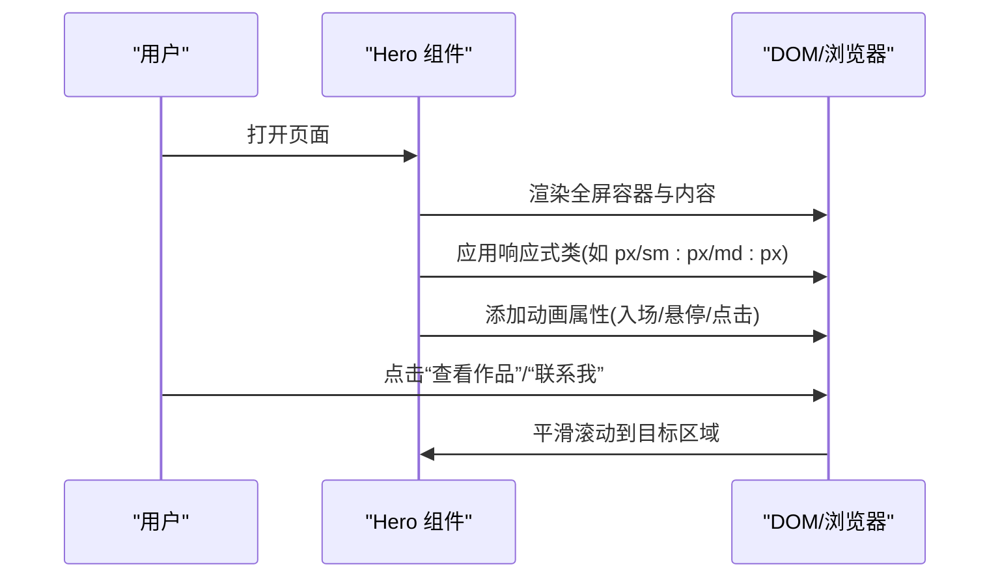
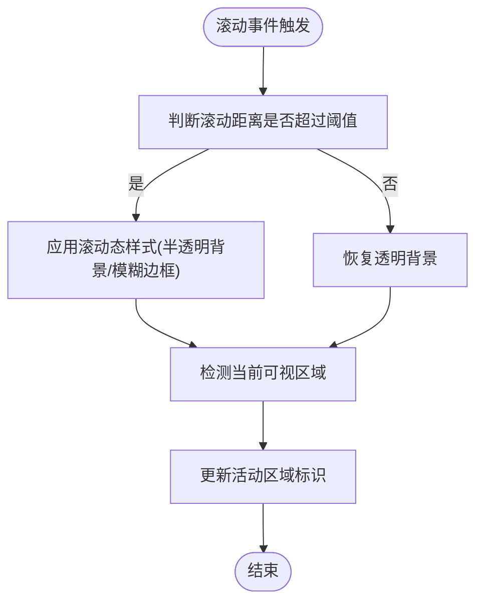
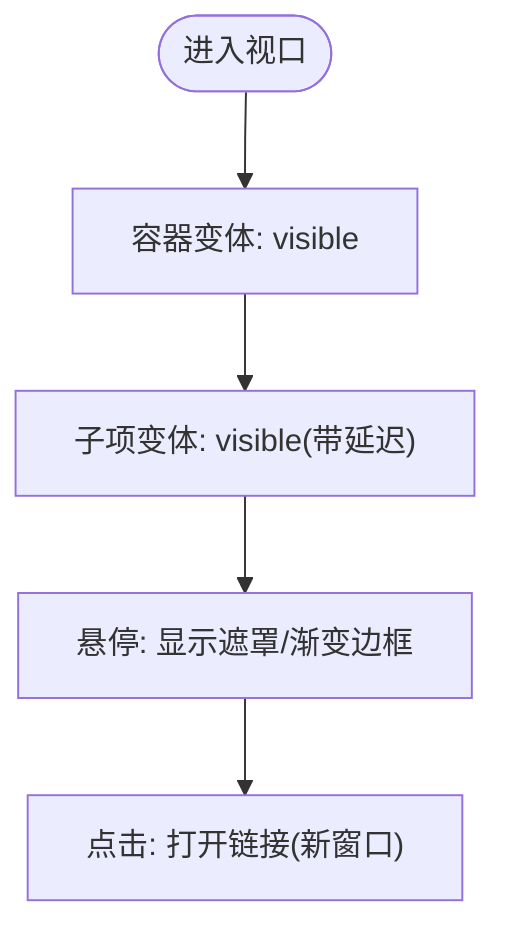
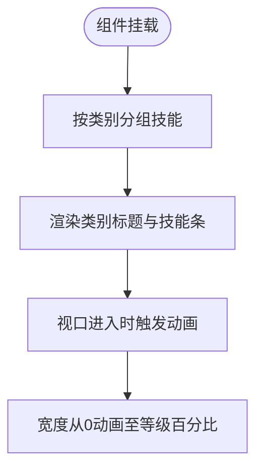
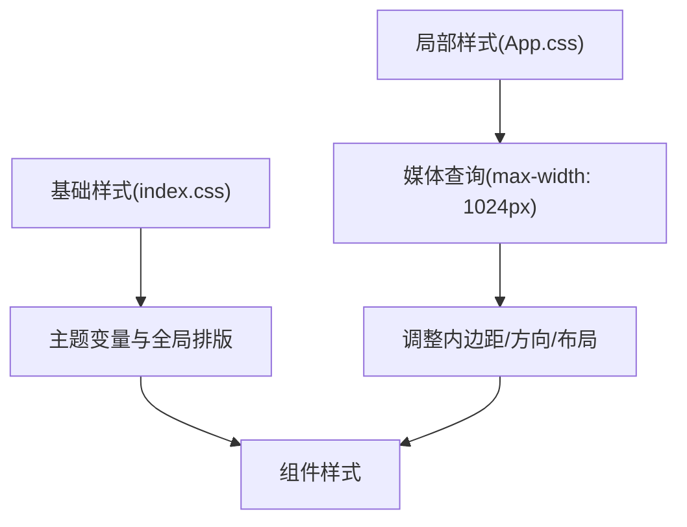
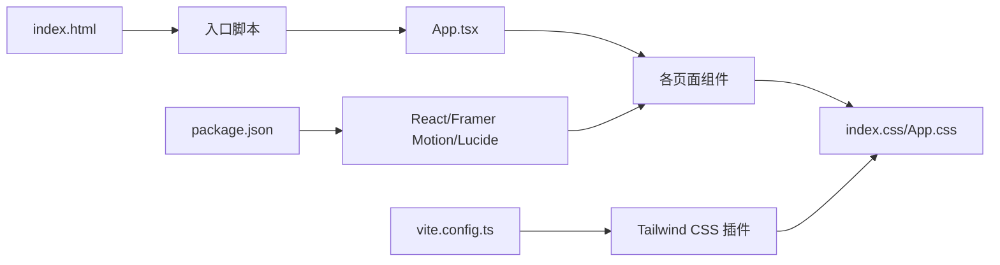

# 响应式设计与布局

<cite>
**本文引用的文件**
- [index.html](file://portfolio/index.html)
- [package.json](file://portfolio/package.json)
- [vite.config.ts](file://portfolio/vite.config.ts)
- [src/index.css](file://portfolio/src/index.css)
- [src/App.css](file://portfolio/src/App.css)
- [src/components/Hero.tsx](file://portfolio/src/components/Hero.tsx)
- [src/components/Header.tsx](file://portfolio/src/components/Header.tsx)
- [src/components/Projects.tsx](file://portfolio/src/components/Projects.tsx)
- [src/components/About.tsx](file://portfolio/src/components/About.tsx)
- [src/components/Contact.tsx](file://portfolio/src/components/Contact.tsx)
- [src/data/projects.ts](file://portfolio/src/data/projects.ts)
- [src/data/skills.ts](file://portfolio/src/data/skills.ts)
</cite>

## 目录
1. [引言](#引言)
2. [项目结构](#项目结构)
3. [核心组件](#核心组件)
4. [架构总览](#架构总览)
5. [详细组件分析](#详细组件分析)
6. [依赖关系分析](#依赖关系分析)
7. [性能考量](#性能考量)
8. [故障排查指南](#故障排查指南)
9. [结论](#结论)
10. [附录](#附录)

## 引言
本文件围绕该作品集项目的响应式设计与布局系统进行系统化说明，重点涵盖：
- 移动优先理念与断点策略
- 不同屏幕尺寸下的布局适配方案
- 网格系统、弹性布局与 Flexbox 的使用
- 导航栏在移动端的折叠展开机制与触摸交互优化
- 具体响应式组件示例：Hero 全屏适配、项目卡片网格布局、技能条自适应显示
- 视口配置与缩放控制最佳实践
- 跨设备兼容性测试与调试方法

## 项目结构
该项目采用 React + Vite + Tailwind CSS 构建，使用 Framer Motion 实现流畅动画。CSS 采用原生 CSS 与 Tailwind 类名组合的方式，配合媒体查询实现响应式布局。

**图示来源**
- [index.html:1-14](file://portfolio/index.html#L1-L14)
- [vite.config.ts:1-9](file://portfolio/vite.config.ts#L1-L9)
- [package.json:1-37](file://portfolio/package.json#L1-L37)

**章节来源**
- [index.html:1-14](file://portfolio/index.html#L1-L14)
- [vite.config.ts:1-9](file://portfolio/vite.config.ts#L1-L9)
- [package.json:1-37](file://portfolio/package.json#L1-L37)

## 核心组件
- 视口与基础样式
  - 视口配置位于 HTML 中，确保初始缩放与设备宽度一致，满足移动优先原则。
  - 全局样式中定义深色主题变量与字体、滚动条等通用样式。
- 响应式断点策略
  - 使用 Tailwind 默认断点（sm: 640px、md: 768px、lg: 1024px）作为主要参考，结合自定义媒体查询进行微调。
- 样式组织
  - 全局样式集中于 index.css；组件局部样式集中在 App.css 与各组件文件内，便于维护与复用。

**章节来源**
- [index.html:1-14](file://portfolio/index.html#L1-L14)
- [src/index.css:1-46](file://portfolio/src/index.css#L1-L46)
- [src/App.css:1-185](file://portfolio/src/App.css#L1-L185)

## 架构总览
下图展示了页面组件与样式层之间的关系，以及媒体查询在不同断点下的作用范围。

**图示来源**
- [src/components/Header.tsx:1-129](file://portfolio/src/components/Header.tsx#L1-L129)
- [src/components/Hero.tsx:1-142](file://portfolio/src/components/Hero.tsx#L1-L142)
- [src/components/About.tsx:1-151](file://portfolio/src/components/About.tsx#L1-L151)
- [src/components/Projects.tsx:1-151](file://portfolio/src/components/Projects.tsx#L1-L151)
- [src/components/Contact.tsx:1-149](file://portfolio/src/components/Contact.tsx#L1-L149)
- [src/index.css:1-46](file://portfolio/src/index.css#L1-L46)
- [src/App.css:1-185](file://portfolio/src/App.css#L1-L185)

## 详细组件分析

### Hero 区域：全屏适配与内容排布
- 全屏适配
  - 使用最小高度类使区域占满视口高度，并通过居中类实现水平垂直居中。
  - 内容容器设置最大宽度与自动外边距，保证在大屏下不铺满全宽。
- 移动优先排布
  - 使用响应式间距类在小屏下减少内边距，在中屏及以上增大内边距。
  - 文字大小随断点递增，头像尺寸也按断点调整，确保在不同设备上保持合适的视觉比例。
- 动画与交互
  - 使用动画库为头像、标题、段落、按钮与社交图标分别添加进入动画，增强体验。
  - 按钮支持悬停与点击反馈，滚动提示使用循环动画引导用户向下滚动。

**图示来源**
- [src/components/Hero.tsx:1-142](file://portfolio/src/components/Hero.tsx#L1-L142)

**章节来源**
- [src/components/Hero.tsx:1-142](file://portfolio/src/components/Hero.tsx#L1-L142)

### 导航栏：固定定位、滚动行为与移动端交互
- 固定定位与滚动态样式
  - 导航栏固定在页面顶部，滚动超过阈值时切换背景与边框，提升可读性。
- 活动状态指示
  - 通过监听滚动计算当前可视区域，动态更新活动链接的指示线。
- 移动端交互
  - 在桌面端显示完整导航链接；在移动端仅显示三条杠菜单按钮，用于后续展开逻辑（当前未实现展开交互，建议补充）。
- 触摸交互优化
  - 按钮与链接使用较大的触控目标尺寸，提供悬停与按压反馈，改善移动端体验。

**图示来源**
- [src/components/Header.tsx:17-41](file://portfolio/src/components/Header.tsx#L17-L41)

**章节来源**
- [src/components/Header.tsx:1-129](file://portfolio/src/components/Header.tsx#L1-L129)

### 项目网格：响应式卡片布局
- 网格系统
  - 使用网格容器与列类在中屏及以上显示两列，小屏下自动堆叠，保证内容可读性。
- 卡片设计
  - 卡片包含图片区、悬停遮罩与技术标签，悬停时遮罩渐显，提供外部链接与源码链接入口。
- 动画与交互
  - 使用容器与子项变体实现进入动画的交错效果，提升加载体验。

**图示来源**
- [src/components/Projects.tsx:52-125](file://portfolio/src/components/Projects.tsx#L52-L125)

**章节来源**
- [src/components/Projects.tsx:1-151](file://portfolio/src/components/Projects.tsx#L1-L151)
- [src/data/projects.ts:1-49](file://portfolio/src/data/projects.ts#L1-L49)

### 技能条：自适应显示与分组
- 分组与渲染
  - 技能按类别分组，每个类别包含若干技能条，条形宽度根据技能等级动态计算。
- 自适应显示
  - 小屏下保持紧凑排版，中屏及以上通过网格或列布局优化阅读体验。
- 动画与过渡
  - 技能条宽度在视口进入时以动画形式呈现，增强数据可视化效果。

**图示来源**
- [src/components/About.tsx:8-144](file://portfolio/src/components/About.tsx#L8-L144)
- [src/data/skills.ts:1-39](file://portfolio/src/data/skills.ts#L1-L39)

**章节来源**
- [src/components/About.tsx:1-151](file://portfolio/src/components/About.tsx#L1-L151)
- [src/data/skills.ts:1-39](file://portfolio/src/data/skills.ts#L1-L39)

### 关联样式与媒体查询
- 全局样式
  - 定义深色主题变量、字体平滑、滚动条与选择样式，统一视觉风格。
- 局部样式与媒体查询
  - 使用媒体查询在不同断点下调整内边距、方向与布局，例如在较小宽度下将横向布局改为纵向堆叠。
  - 针对特定区域（如下一步区域、列表项）在小屏下启用换行与自适应宽度。

**图示来源**
- [src/index.css:1-46](file://portfolio/src/index.css#L1-L46)
- [src/App.css:67-96](file://portfolio/src/App.css#L67-L96)

**章节来源**
- [src/index.css:1-46](file://portfolio/src/index.css#L1-L46)
- [src/App.css:1-185](file://portfolio/src/App.css#L1-L185)

## 依赖关系分析
- 构建与样式
  - Vite 配置启用 React 与 Tailwind CSS 插件，确保 CSS 预处理与热更新。
  - package.json 声明 React、Framer Motion、Lucide React 等依赖，支撑动画与图标。
- 运行时样式链路
  - index.html 提供视口配置；index.css 与 App.css 形成样式层；组件通过 Tailwind 类与局部样式共同实现响应式。

**图示来源**
- [vite.config.ts:1-9](file://portfolio/vite.config.ts#L1-L9)
- [package.json:1-37](file://portfolio/package.json#L1-L37)
- [index.html:1-14](file://portfolio/index.html#L1-L14)

**章节来源**
- [vite.config.ts:1-9](file://portfolio/vite.config.ts#L1-L9)
- [package.json:1-37](file://portfolio/package.json#L1-L37)
- [index.html:1-14](file://portfolio/index.html#L1-L14)

## 性能考量
- 渲染性能
  - 使用视口进入触发的动画，避免不必要的全局重绘；容器变体的交错动画可减少首屏压力。
- 样式体积
  - Tailwind CSS 按需生成类名，建议在生产环境启用摇树优化与压缩。
- 交互反馈
  - 按钮与链接的悬停/按压反馈使用 CSS 过渡，避免 JavaScript 动画带来的卡顿。

## 故障排查指南
- 视口与缩放异常
  - 确认 HTML 中存在正确的视口元标签，避免手动缩放导致布局错乱。
- 断点不生效
  - 检查 Tailwind 配置与构建插件是否正确加载；确认媒体查询断点与组件类名匹配。
- 导航栏滚动态样式未出现
  - 检查滚动事件绑定与阈值设置；确保容器具备足够的高度以触发滚动。
- 移动端菜单未展开
  - 当前导航栏在移动端仅显示菜单按钮但未实现展开逻辑，建议补充状态管理与动画展开。
- 动画卡顿
  - 减少复杂变换与重绘层；优先使用 transform 与 opacity；在低端设备上考虑禁用动画。

**章节来源**
- [index.html:1-14](file://portfolio/index.html#L1-L14)
- [src/components/Header.tsx:17-41](file://portfolio/src/components/Header.tsx#L17-L41)

## 结论
该作品集项目遵循移动优先的设计理念，结合 Tailwind CSS 的响应式断点与 Flex/Grid 排版能力，实现了在多设备上的良好适配。通过局部媒体查询与组件级动画，进一步提升了交互体验。建议后续完善移动端菜单展开机制与更细粒度的断点调试流程，以覆盖更多设备场景。

## 附录
- 断点速查
  - sm: 640px、md: 768px、lg: 1024px（默认 Tailwind）
  - 自定义媒体查询在小于等于 1024px 时进行布局调整
- 最佳实践清单
  - 使用语义化 HTML 与可访问性属性
  - 为触摸目标提供足够空间（建议 ≥ 44px）
  - 在小屏下优先使用纵向堆叠与自适应宽度
  - 使用 CSS 变量统一主题颜色与间距
  - 对动画使用硬件加速属性，避免频繁重排