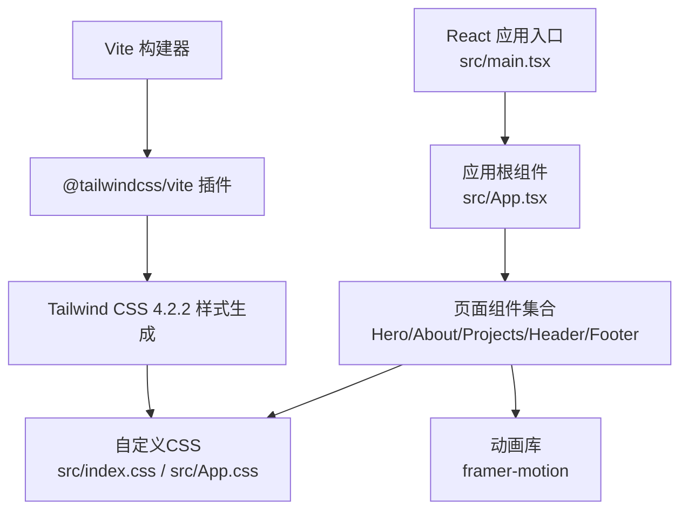
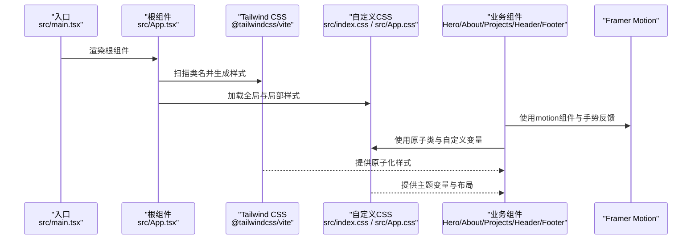
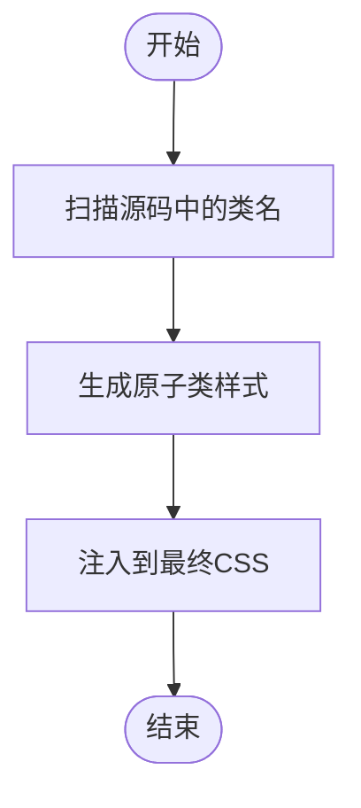
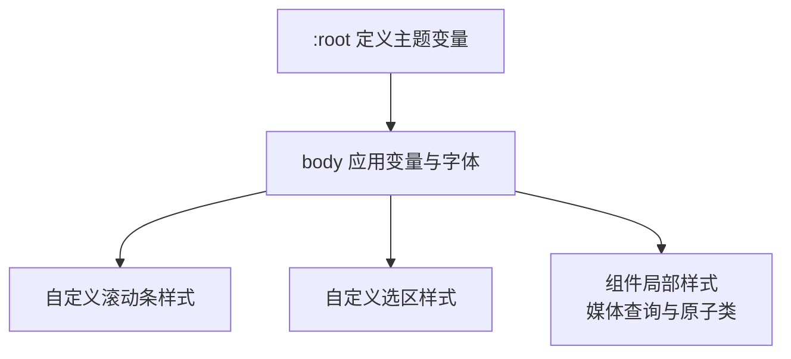
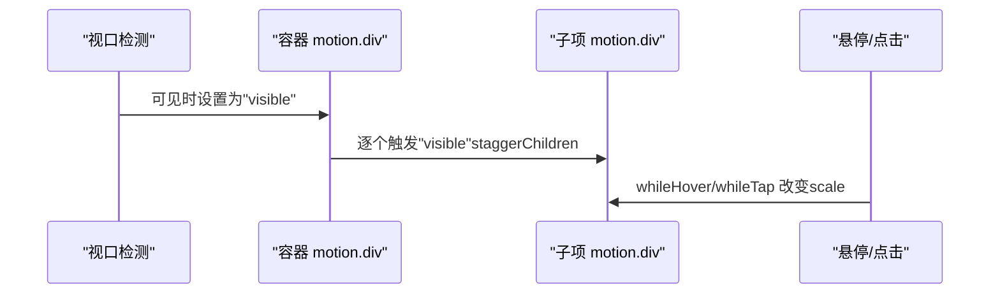
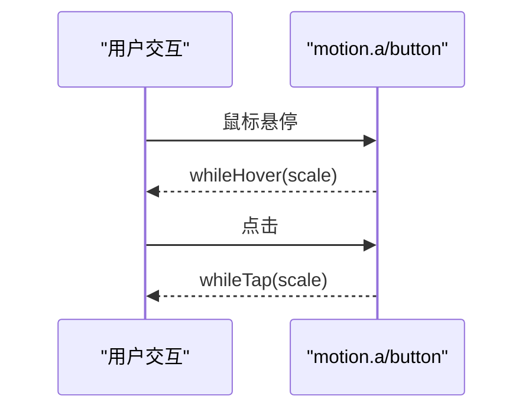
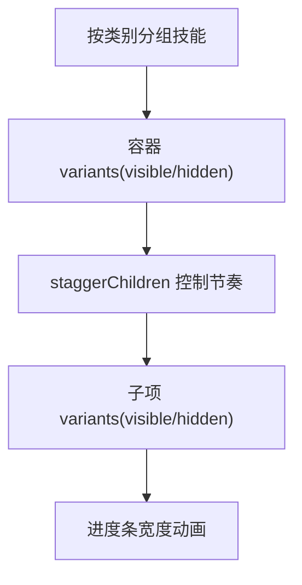
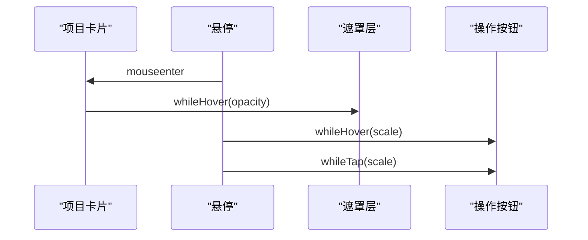
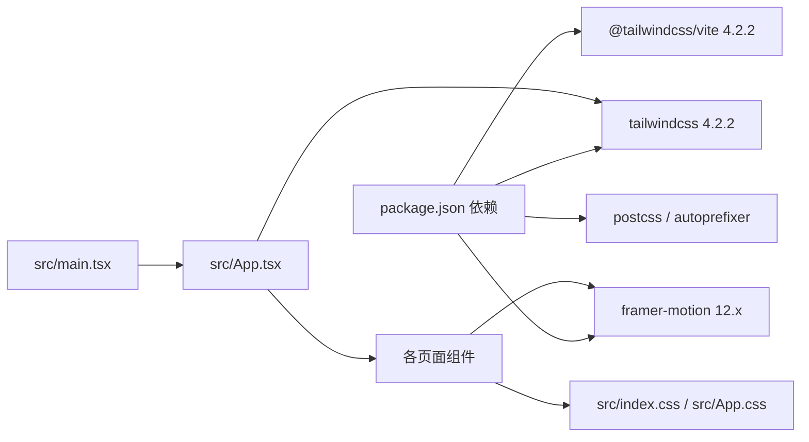

# 样式与动画

<cite>
**本文引用的文件**
- [package.json](file://portfolio/package.json)
- [vite.config.ts](file://portfolio/vite.config.ts)
- [src/index.css](file://portfolio/src/index.css)
- [src/App.css](file://portfolio/src/App.css)
- [src/main.tsx](file://portfolio/src/main.tsx)
- [src/App.tsx](file://portfolio/src/App.tsx)
- [src/components/Hero.tsx](file://portfolio/src/components/Hero.tsx)
- [src/components/About.tsx](file://portfolio/src/components/About.tsx)
- [src/components/Projects.tsx](file://portfolio/src/components/Projects.tsx)
- [src/components/Header.tsx](file://portfolio/src/components/Header.tsx)
- [src/components/Footer.tsx](file://portfolio/src/components/Footer.tsx)
- [src/data/projects.ts](file://portfolio/src/data/projects.ts)
- [src/data/skills.ts](file://portfolio/src/data/skills.ts)
</cite>

## 目录
1. [引言](#引言)
2. [项目结构](#项目结构)
3. [核心组件](#核心组件)
4. [架构总览](#架构总览)
5. [详细组件分析](#详细组件分析)
6. [依赖关系分析](#依赖关系分析)
7. [性能考量](#性能考量)
8. [故障排查指南](#故障排查指南)
9. [结论](#结论)
10. [附录](#附录)

## 引言
本文件面向AIWs项目的样式系统与动画效果，围绕以下目标展开：  
- Tailwind CSS 4.2.2的原子化理念与配置要点（通过Vite插件集成）。  
- 自定义样式实现：全局样式、CSS变量主题、响应式断点与主题定制。  
- Framer Motion动画库的集成与使用：页面过渡、元素进入与交互反馈。  
- 样式定制指南：颜色、字体、间距与主题切换策略。  
- 动画配置示例与性能优化建议。  
- CSS-in-JS与样式隔离机制的说明。

## 项目结构
项目采用Vite + React + TypeScript的现代前端架构，样式系统由Tailwind CSS 4.2.2与自定义CSS共同构成；动画系统由Framer Motion提供。  
- Vite通过插件集成Tailwind CSS，自动扫描源码中的类名生成样式。  
- 自定义CSS集中于全局入口与组件局部样式，配合CSS变量实现主题化。  
- 动画集中在各业务组件中，以声明式方式组合进入、悬停与点击反馈。

**图示来源**
- [vite.config.ts:1-9](file://portfolio/vite.config.ts#L1-L9)
- [package.json:12-35](file://portfolio/package.json#L12-L35)
- [src/main.tsx:1-12](file://portfolio/src/main.tsx#L1-L12)
- [src/App.tsx:1-28](file://portfolio/src/App.tsx#L1-L28)

**章节来源**
- [vite.config.ts:1-9](file://portfolio/vite.config.ts#L1-L9)
- [package.json:12-35](file://portfolio/package.json#L12-L35)
- [src/main.tsx:1-12](file://portfolio/src/main.tsx#L1-L12)
- [src/App.tsx:1-28](file://portfolio/src/App.tsx#L1-L28)

## 核心组件
- 样式系统
  - Tailwind CSS 4.2.2：通过Vite插件启用，按需生成原子类，提升样式复用性与开发效率。  
  - 自定义CSS：全局变量与主题、滚动条与选区样式、组件局部样式与媒体查询。  
- 动画系统
  - Framer Motion：提供motion组件与手势反馈（hover/tap），结合视口可见性触发与交错动画。

**章节来源**
- [package.json:12-35](file://portfolio/package.json#L12-L35)
- [vite.config.ts:1-9](file://portfolio/vite.config.ts#L1-L9)
- [src/index.css:1-46](file://portfolio/src/index.css#L1-L46)
- [src/App.css:1-185](file://portfolio/src/App.css#L1-L185)

## 架构总览
下图展示了从入口到组件的样式与动画链路：

**图示来源**
- [src/main.tsx:1-12](file://portfolio/src/main.tsx#L1-L12)
- [src/App.tsx:1-28](file://portfolio/src/App.tsx#L1-L28)
- [vite.config.ts:1-9](file://portfolio/vite.config.ts#L1-L9)
- [src/index.css:1-46](file://portfolio/src/index.css#L1-L46)
- [src/App.css:1-185](file://portfolio/src/App.css#L1-L185)
- [src/components/Hero.tsx:1-142](file://portfolio/src/components/Hero.tsx#L1-L142)

## 详细组件分析

### Tailwind CSS 4.2.2与Vite集成
- 集成方式：在Vite配置中引入Tailwind CSS插件，使构建时扫描源码并生成所需原子类，避免全量样式体积。  
- 依赖版本：Tailwind CSS 4.2.2与@tailwindcss/vite 4.2.2。  
- 原子化理念：通过短小、语义化的类名组合实现布局、排版、颜色与间距，减少重复样式与命名成本。

**图示来源**
- [vite.config.ts:1-9](file://portfolio/vite.config.ts#L1-L9)
- [package.json:18-31](file://portfolio/package.json#L18-L31)

**章节来源**
- [vite.config.ts:1-9](file://portfolio/vite.config.ts#L1-L9)
- [package.json:18-31](file://portfolio/package.json#L18-L31)

### 全局样式与主题定制
- 全局变量：通过:root定义背景、前景、渐变等主题变量，统一颜色体系。  
- 字体与滚动条：全局字体族与自定义滚动条样式，提升阅读体验与一致性。  
- 选区样式：自定义文本选区配色，增强可用性。  
- 局部样式：组件内使用媒体查询与原子类实现响应式布局。

**图示来源**
- [src/index.css:1-46](file://portfolio/src/index.css#L1-L46)
- [src/App.css:1-185](file://portfolio/src/App.css#L1-L185)

**章节来源**
- [src/index.css:1-46](file://portfolio/src/index.css#L1-L46)
- [src/App.css:1-185](file://portfolio/src/App.css#L1-L185)

### 页面过渡与元素进入动画（Framer Motion）
- 进入动画：通过initial/animate/transition控制初始状态、目标状态与缓动时间，实现层次递进的出场效果。  
- 视口可见触发：whileInView与viewport配置实现“滚动到可视区域再触发动画”，降低首屏压力。  
- 交互反馈：whileHover与whileTap提供悬停与点击缩放反馈，增强交互感知。  
- 交错动画：容器variants与staggerChildren实现子元素依次入场，营造节奏感。

**图示来源**
- [src/components/Hero.tsx:15-26](file://portfolio/src/components/Hero.tsx#L15-L26)
- [src/components/About.tsx:18-35](file://portfolio/src/components/About.tsx#L18-L35)
- [src/components/Projects.tsx:10-27](file://portfolio/src/components/Projects.tsx#L10-L27)
- [src/components/Header.tsx:52-61](file://portfolio/src/components/Header.tsx#L52-L61)

**章节来源**
- [src/components/Hero.tsx:1-142](file://portfolio/src/components/Hero.tsx#L1-L142)
- [src/components/About.tsx:1-151](file://portfolio/src/components/About.tsx#L1-L151)
- [src/components/Projects.tsx:1-151](file://portfolio/src/components/Projects.tsx#L1-L151)
- [src/components/Header.tsx:1-129](file://portfolio/src/components/Header.tsx#L1-L129)

### 交互反馈动画（悬停与点击）
- 按钮与图标：通过whileHover与whileTap实现微缩放，提供即时反馈。  
- 导航指示：使用layoutId在导航项之间平滑过渡底部指示线，提升导航连贯性。  
- 滚动提示：使用animate与repeat实现无限循环的下拉提示动画。

**图示来源**
- [src/components/Hero.tsx:68-92](file://portfolio/src/components/Hero.tsx#L68-L92)
- [src/components/Projects.tsx:77-99](file://portfolio/src/components/Projects.tsx#L77-L99)
- [src/components/Header.tsx:98-103](file://portfolio/src/components/Header.tsx#L98-L103)
- [src/components/Footer.tsx:32-42](file://portfolio/src/components/Footer.tsx#L32-L42)

**章节来源**
- [src/components/Hero.tsx:1-142](file://portfolio/src/components/Hero.tsx#L1-L142)
- [src/components/Projects.tsx:1-151](file://portfolio/src/components/Projects.tsx#L1-L151)
- [src/components/Header.tsx:1-129](file://portfolio/src/components/Header.tsx#L1-L129)
- [src/components/Footer.tsx:1-47](file://portfolio/src/components/Footer.tsx#L1-L47)

### 数据驱动的技能展示动画
- 分组与交错：按类别分组技能，容器使用variants与staggerChildren实现子项依次出现。  
- 进度条动画：使用whileInView与viewport.once仅在首次可见时执行宽度动画，避免重复计算。  
- 响应式布局：在不同屏幕尺寸下保持良好的可读性与视觉节奏。

**图示来源**
- [src/components/About.tsx:8-35](file://portfolio/src/components/About.tsx#L8-L35)
- [src/components/About.tsx:111-144](file://portfolio/src/components/About.tsx#L111-L144)
- [src/data/skills.ts:1-39](file://portfolio/src/data/skills.ts#L1-L39)

**章节来源**
- [src/components/About.tsx:1-151](file://portfolio/src/components/About.tsx#L1-L151)
- [src/data/skills.ts:1-39](file://portfolio/src/data/skills.ts#L1-L39)

### 项目卡片与悬停遮罩动画
- 遮罩层：使用whileHover控制透明度，实现悬停时显示操作按钮。  
- 按钮反馈：每个操作按钮均配置whileHover与whileTap，确保一致的交互体验。  
- 渐变背景：卡片图片区域使用渐变背景，提升视觉层次。

**图示来源**
- [src/components/Projects.tsx:72-99](file://portfolio/src/components/Projects.tsx#L72-L99)
- [src/components/Projects.tsx:135-146](file://portfolio/src/components/Projects.tsx#L135-L146)
- [src/data/projects.ts:1-49](file://portfolio/src/data/projects.ts#L1-L49)

**章节来源**
- [src/components/Projects.tsx:1-151](file://portfolio/src/components/Projects.tsx#L1-L151)
- [src/data/projects.ts:1-49](file://portfolio/src/data/projects.ts#L1-L49)

## 依赖关系分析
- 样式依赖
  - Tailwind CSS 4.2.2：提供原子类与工具集。  
  - @tailwindcss/vite：在Vite中启用Tailwind CSS插件。  
  - PostCSS与Autoprefixer：辅助后处理器与浏览器兼容。  
- 动画依赖
  - framer-motion：提供motion组件与手势反馈。  
- 入口与渲染
  - src/main.tsx负责挂载根组件，src/App.tsx组织页面组件。

**图示来源**
- [package.json:12-35](file://portfolio/package.json#L12-L35)
- [src/main.tsx:1-12](file://portfolio/src/main.tsx#L1-L12)
- [src/App.tsx:1-28](file://portfolio/src/App.tsx#L1-L28)

**章节来源**
- [package.json:12-35](file://portfolio/package.json#L12-L35)
- [src/main.tsx:1-12](file://portfolio/src/main.tsx#L1-L12)
- [src/App.tsx:1-28](file://portfolio/src/App.tsx#L1-L28)

## 性能考量
- 原子化样式
  - Tailwind CSS按需生成，避免未使用类导致的体积膨胀；建议保持类名简洁、语义化，减少嵌套与重复。  
- 动画性能
  - 使用transform与opacity等GPU加速属性；避免频繁重排（如直接改变width/height）。  
  - 使用viewport.once避免重复触发动画，降低计算开销。  
- 交互反馈
  - whileHover/whileTap仅在必要时使用，避免在大量元素上同时启用，可通过节流或条件渲染优化。  
- 构建优化
  - 保持Tailwind插件开启，确保仅生成实际使用的类；合理拆分组件，避免单文件过大。  

[本节为通用指导，无需特定文件引用]

## 故障排查指南
- Tailwind类不生效
  - 确认Vite已正确加载@tailwindcss/vite插件。  
  - 检查类名是否被正确书写且存在于源码中（插件按需生成）。  
- 动画不触发
  - 确认whileInView与viewport配置正确，且目标元素在视口范围内。  
  - 检查staggerChildren与子项variants是否匹配。  
- 主题变量未生效
  - 确认:root变量定义完整，组件中使用var(--variable)引用。  
  - 检查CSS加载顺序，确保全局样式在组件样式之前。  
- 滚动行为异常
  - 检查全局scroll-behavior设置与组件内滚动逻辑是否冲突。  

**章节来源**
- [vite.config.ts:1-9](file://portfolio/vite.config.ts#L1-L9)
- [package.json:12-35](file://portfolio/package.json#L12-L35)
- [src/index.css:1-46](file://portfolio/src/index.css#L1-L46)
- [src/components/About.tsx:111-144](file://portfolio/src/components/About.tsx#L111-L144)

## 结论
AIWs项目通过Tailwind CSS 4.2.2与Framer Motion实现了现代化、高性能的样式与动画体系：  
- Tailwind提供原子化、可维护的样式基础；  
- 自定义CSS与CSS变量支撑主题化与一致性；  
- Framer Motion带来自然的进入、视口触发与交互反馈动画；  
- 通过合理的配置与最佳实践，兼顾开发效率与运行性能。

[本节为总结，无需特定文件引用]

## 附录

### 样式定制指南
- 颜色主题
  - 修改:root中的--background、--foreground与渐变变量，即可统一调整整体色调。  
  - 组件中优先使用原子类与主题变量，避免硬编码颜色。  
- 字体设置
  - 在body中调整font-family与字号体系，确保在不同设备上的一致阅读体验。  
- 间距规范
  - 使用Tailwind的spacing工具类（如p/m、gap、space）统一间距，避免魔法数。  
- 响应式断点
  - 借助Tailwind断点（sm/md/lg）与媒体查询，适配移动端与桌面端布局。  

**章节来源**
- [src/index.css:1-46](file://portfolio/src/index.css#L1-L46)
- [src/App.css:67-71](file://portfolio/src/App.css#L67-L71)
- [src/components/Hero.tsx:11](file://portfolio/src/components/Hero.tsx#L11)

### 动画配置示例与建议
- 页面进入动画
  - 使用initial/animate/transition控制入场时序与缓动；对重要元素适当增加delay形成层次。  
- 视口触发
  - whileInView与viewport={{ once: true }}避免重复触发动画；容器使用staggerChildren实现节奏。  
- 交互反馈
  - whileHover/whileTap仅用于关键元素（按钮、导航、卡片）；保持scale范围在合理区间（±10%）。  
- 性能优化
  - 尽量使用transform与opacity；避免在动画中频繁修改布局相关属性；对高频动画使用will-change或GPU加速属性。  

**章节来源**
- [src/components/Hero.tsx:15-38](file://portfolio/src/components/Hero.tsx#L15-L38)
- [src/components/About.tsx:18-35](file://portfolio/src/components/About.tsx#L18-L35)
- [src/components/Projects.tsx:10-27](file://portfolio/src/components/Projects.tsx#L10-L27)

### CSS-in-JS与样式隔离机制
- 当前项目未使用CSS-in-JS库，样式主要来源于：
  - Tailwind原子类：按需生成，作用域由类名限定。  
  - 自定义CSS：全局样式与组件局部样式，通过选择器与媒体查询实现隔离。  
- 若未来引入CSS-in-JS方案，建议：
  - 使用作用域化类名或命名空间，避免全局污染。  
  - 与Tailwind工具类共存时，明确优先级与覆盖规则。  
  - 对动画与主题变量进行集中管理，确保跨组件一致性。  

**章节来源**
- [vite.config.ts:1-9](file://portfolio/vite.config.ts#L1-L9)
- [src/index.css:1-46](file://portfolio/src/index.css#L1-L46)
- [src/App.css:1-185](file://portfolio/src/App.css#L1-L185)