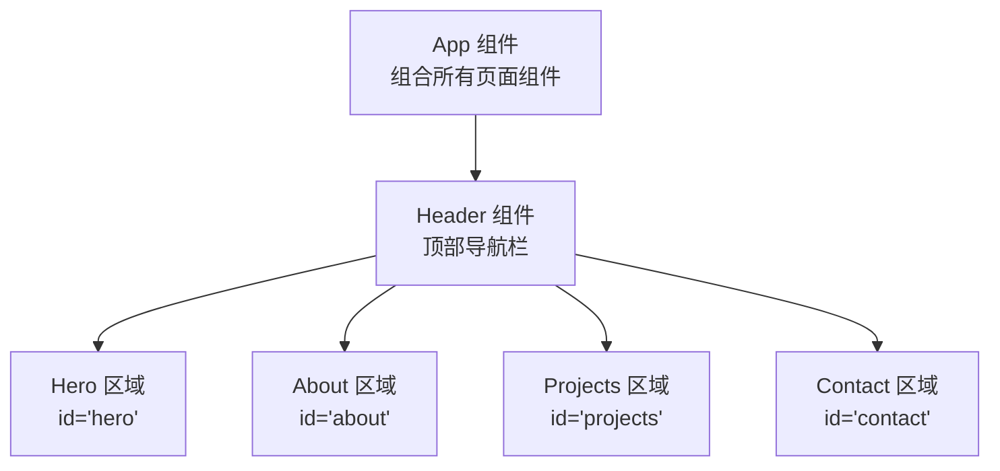
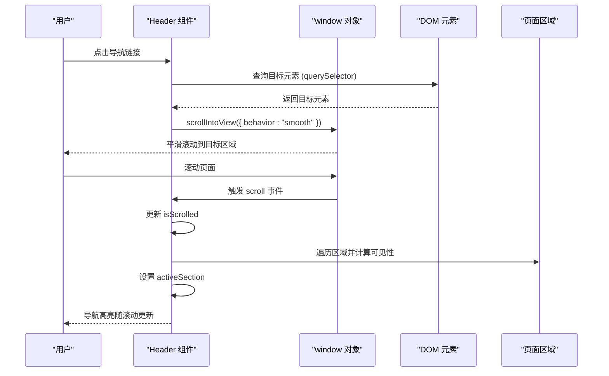
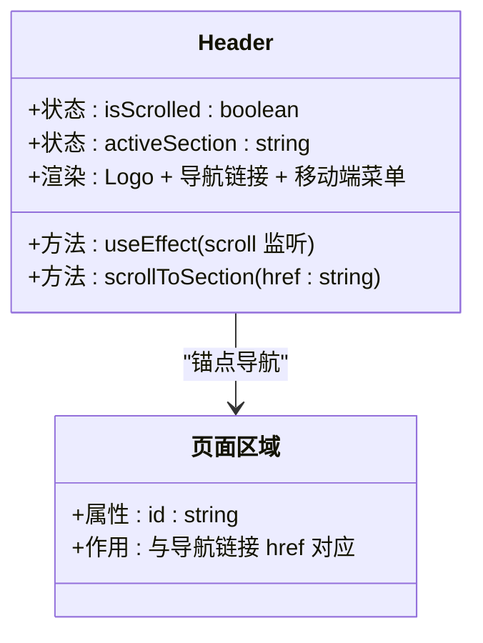
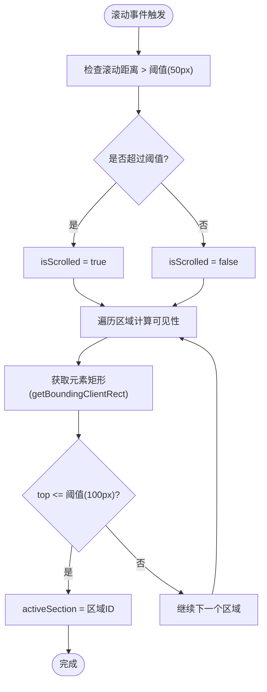
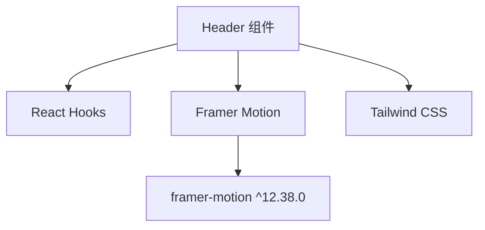

# 导航组件 (Header)

<cite>
**本文档引用的文件**
- [Header.tsx](file://portfolio/src/components/Header.tsx)
- [App.tsx](file://portfolio/src/App.tsx)
- [index.css](file://portfolio/src/index.css)
- [Hero.tsx](file://portfolio/src/components/Hero.tsx)
- [About.tsx](file://portfolio/src/components/About.tsx)
- [Projects.tsx](file://portfolio/src/components/Projects.tsx)
- [Contact.tsx](file://portfolio/src/components/Contact.tsx)
- [package.json](file://portfolio/package.json)
</cite>

## 目录
1. [简介](#简介)
2. [项目结构](#项目结构)
3. [核心组件](#核心组件)
4. [架构总览](#架构总览)
5. [详细组件分析](#详细组件分析)
6. [依赖关系分析](#依赖关系分析)
7. [性能考虑](#性能考虑)
8. [故障排除指南](#故障排除指南)
9. [结论](#结论)
10. [附录](#附录)

## 简介
本文件面向导航组件（Header）的深入技术文档，重点解析以下方面：
- 滚动检测机制：isScrolled 状态管理与 activeSection 区域高亮联动
- 导航链接配置、平滑滚动实现与响应式设计
- Framer Motion 动画配置：入场动画、悬停/点击交互、高亮指示器动画
- 移动端菜单按钮实现与屏幕适配策略
- 可定制化建议：如何自定义导航链接、修改滚动阈值、调整动画效果

该组件采用 React + TypeScript + Tailwind CSS + Framer Motion 构建，配合全局平滑滚动行为，提供流畅的用户体验。

## 项目结构
Header 组件位于组件目录中，作为应用的顶层导航入口，负责：
- 固定定位的导航栏，支持滚动时背景变化与阴影
- Logo 区域与桌面端导航链接
- 移动端汉堡菜单占位符
- 滚动监听与区域高亮联动
- 平滑滚动到目标区域



**图示来源**
- [App.tsx:12-25](file://portfolio/src/App.tsx#L12-L25)
- [Header.tsx:51-127](file://portfolio/src/components/Header.tsx#L51-L127)

**章节来源**
- [App.tsx:12-25](file://portfolio/src/App.tsx#L12-L25)
- [Header.tsx:16-128](file://portfolio/src/components/Header.tsx#L16-L128)

## 核心组件
本节聚焦 Header 组件的关键实现点，包括状态管理、滚动检测、平滑滚动与动画配置。

- 状态管理
  - isScrolled：根据窗口滚动位置判断是否超过阈值（默认 50px），用于控制导航栏外观（背景、边框、透明度）
  - activeSection：记录当前可见区域的标识符（如 hero/about/projects/contact），用于高亮对应导航链接

- 滚动检测机制
  - 使用 useEffect 注册 scroll 事件监听器，在卸载时清理
  - 滚动回调中更新 isScrolled；同时遍历导航链接映射的区域 ID，通过元素的 getBoundingClientRect 计算可见性，设置 activeSection
  - 可见性判断使用阈值（默认 100px）以避免微小滚动导致频繁切换

- 导航链接配置
  - navLinks 数组定义了导航项名称与目标区域的 href 映射
  - 渲染时将 href 转换为 DOM 查询选择器，点击事件中调用 scrollIntoView 实现平滑滚动

- 响应式设计
  - 桌面端使用水平导航栏（隐藏 md 以上）
  - 移动端使用汉堡菜单占位符（隐藏 md 以下）

- Framer Motion 动画
  - Header 初始入场动画：从上方淡入
  - Logo 与导航项的交互动画：悬停缩放、点击按压
  - activeSection 的高亮指示器：使用 layoutId 实现布局动画，弹簧物理参数可调

**章节来源**
- [Header.tsx:17-49](file://portfolio/src/components/Header.tsx#L17-L49)
- [Header.tsx:51-127](file://portfolio/src/components/Header.tsx#L51-L127)

## 架构总览
Header 组件与页面区域通过 id 与 href 锚点建立强关联，滚动检测与区域高亮形成闭环反馈。



**图示来源**
- [Header.tsx:21-41](file://portfolio/src/components/Header.tsx#L21-L41)
- [Header.tsx:44-49](file://portfolio/src/components/Header.tsx#L44-L49)
- [Hero.tsx:9-12](file://portfolio/src/components/Hero.tsx#L9-L12)
- [About.tsx:38-41](file://portfolio/src/components/About.tsx#L38-L41)
- [Projects.tsx:29-33](file://portfolio/src/components/Projects.tsx#L29-L33)
- [Contact.tsx:59-63](file://portfolio/src/components/Contact.tsx#L59-L63)

## 详细组件分析

### 组件类图


**图示来源**
- [Header.tsx:17-49](file://portfolio/src/components/Header.tsx#L17-L49)
- [Hero.tsx:9-12](file://portfolio/src/components/Hero.tsx#L9-L12)
- [About.tsx:38-41](file://portfolio/src/components/About.tsx#L38-L41)
- [Projects.tsx:29-33](file://portfolio/src/components/Projects.tsx#L29-L33)
- [Contact.tsx:59-63](file://portfolio/src/components/Contact.tsx#L59-L63)

### 滚动检测流程图


**图示来源**
- [Header.tsx:21-41](file://portfolio/src/components/Header.tsx#L21-L41)

### 平滑滚动序列图
```mermaid
sequenceDiagram
participant User as "用户"
participant Link as "导航链接"
participant Header as "Header 组件"
participant DOM as "DOM 查询"
participant View as "视口滚动"
User->>Link : 点击链接
Link->>Header : 阻止默认跳转
Header->>DOM : querySelector(href)
DOM-->>Header : 返回目标元素
Header->>View : scrollIntoView({ behavior : "smooth" })
View-->>User : 平滑滚动到目标区域
```

**图示来源**
- [Header.tsx:84-87](file://portfolio/src/components/Header.tsx#L84-L87)
- [Header.tsx:44-49](file://portfolio/src/components/Header.tsx#L44-L49)

### 动画配置要点
- Header 初始入场：y 从 -100 到 0，持续 0.5 秒
- Logo 交互：悬停放大、点击按压
- 导航项交互：悬停上移、点击回弹
- 高亮指示器：layoutId 为 "activeNav"，使用弹簧物理参数（stiffness、damping）控制弹性与阻尼

**章节来源**
- [Header.tsx:52-55](file://portfolio/src/components/Header.tsx#L52-L55)
- [Header.tsx:65-74](file://portfolio/src/components/Header.tsx#L65-L74)
- [Header.tsx:81-95](file://portfolio/src/components/Header.tsx#L81-L95)
- [Header.tsx:98-103](file://portfolio/src/components/Header.tsx#L98-L103)

## 依赖关系分析
- 组件依赖
  - React：useState、useEffect 生命周期钩子
  - Framer Motion：motion 组件与手势交互（whileHover、whileTap）、布局动画（layoutId）
  - Tailwind CSS：样式类名（颜色、背景、边框、响应式断点）

- 外部依赖
  - framer-motion：版本 12.38.0
  - lucide-react：图标库（在其他组件中使用）
  - react、react-dom：框架基础



**图示来源**
- [Header.tsx:1-2](file://portfolio/src/components/Header.tsx#L1-L2)
- [package.json:12-16](file://portfolio/package.json#L12-L16)

**章节来源**
- [package.json:12-16](file://portfolio/package.json#L12-L16)

## 性能考虑
- 滚动事件优化
  - 当前实现直接在 scroll 事件中执行计算，可能引发高频重排。建议在生产环境使用节流（throttle）或防抖（debounce）策略，例如每 16-33ms 最多执行一次
  - 可将可见性阈值（100px）改为更保守的值，减少频繁切换

- DOM 查询优化
  - navLinks 映射区域 ID 的过程可在组件初始化时缓存，避免每次滚动都重复计算
  - 使用 IntersectionObserver 替代 getBoundingClientRect 可显著降低主线程压力

- 动画性能
  - 将需要频繁更新的状态（如 isScrolled）拆分为独立的 effect，避免不必要的重渲染
  - 高亮指示器的布局动画（layoutId）在大量节点时可能造成布局抖动，建议限制活跃区域数量或使用 transform 过渡替代

- 响应式性能
  - 移动端菜单按钮目前为空占位，未绑定实际交互，建议在移动端添加展开/收起逻辑，减少不必要的 DOM 结构

[本节为通用性能建议，不直接分析具体文件]

## 故障排除指南
- 高亮指示器不出现
  - 检查 activeSection 是否与导航链接 href 对应的区域 ID 一致
  - 确认目标区域存在且有 id 属性
  - 验证 layoutId 为 "activeNav" 的元素是否存在于导航项中

- 平滑滚动无效
  - 确认目标元素存在（querySelector 返回非空）
  - 检查全局滚动行为是否被覆盖（index.css 中设置了 scroll-behavior: smooth）

- 滚动阈值不生效
  - 检查 isScrolled 的阈值（50px）与可见性阈值（100px）是否符合预期
  - 调整阈值以适应不同设备或内容高度

- 移动端菜单无响应
  - 当前移动端菜单按钮为占位符，未绑定任何交互逻辑
  - 建议添加展开/收起状态与动画，结合媒体查询控制显示

**章节来源**
- [Header.tsx:21-41](file://portfolio/src/components/Header.tsx#L21-L41)
- [Header.tsx:44-49](file://portfolio/src/components/Header.tsx#L44-L49)
- [index.css:10-13](file://portfolio/src/index.css#L10-L13)

## 结论
Header 组件通过简洁的状态管理与滚动检测，实现了导航栏外观与区域高亮的联动体验。配合 Framer Motion 的细腻交互与全局平滑滚动，整体视觉与交互表现良好。建议在生产环境中引入滚动节流、IntersectionObserver 与移动端交互完善，以进一步提升性能与可用性。

[本节为总结性内容，不直接分析具体文件]

## 附录

### Props 接口与状态管理
- 状态
  - isScrolled: boolean —— 滚动超过阈值时为 true
  - activeSection: string —— 当前可见区域的标识符（如 "hero"、"about" 等）

- 方法
  - useEffect(scroll 监听)：注册/清理滚动事件，更新 isScrolled 与 activeSection
  - scrollToSection(href: string)：平滑滚动到目标区域

- 渲染
  - Logo：点击回到 #hero
  - 导航链接：点击平滑滚动到对应区域
  - 移动端菜单：占位符（待实现）

**章节来源**
- [Header.tsx:17-49](file://portfolio/src/components/Header.tsx#L17-L49)
- [Header.tsx:51-127](file://portfolio/src/components/Header.tsx#L51-L127)

### 自定义指南
- 自定义导航链接
  - 修改 navLinks 数组中的 name 与 href，确保 href 与目标区域 id 对应
  - 示例路径：[Header.tsx:5-10](file://portfolio/src/components/Header.tsx#L5-L10)

- 修改滚动阈值
  - 调整 isScrolled 的阈值（当前为 50px）
  - 调整可见性阈值（当前为 100px）
  - 示例路径：[Header.tsx:22-36](file://portfolio/src/components/Header.tsx#L22-L36)

- 调整动画效果
  - 修改 Header 初始入场动画的 y 与 duration
  - 调整高亮指示器的 layoutId 与弹簧参数（stiffness、damping）
  - 示例路径：[Header.tsx:52-55](file://portfolio/src/components/Header.tsx#L52-L55), [Header.tsx:98-103](file://portfolio/src/components/Header.tsx#L98-L103)

- 移动端菜单按钮实现
  - 添加展开/收起状态与动画
  - 结合媒体查询控制显示
  - 示例路径：[Header.tsx:108-123](file://portfolio/src/components/Header.tsx#L108-L123)