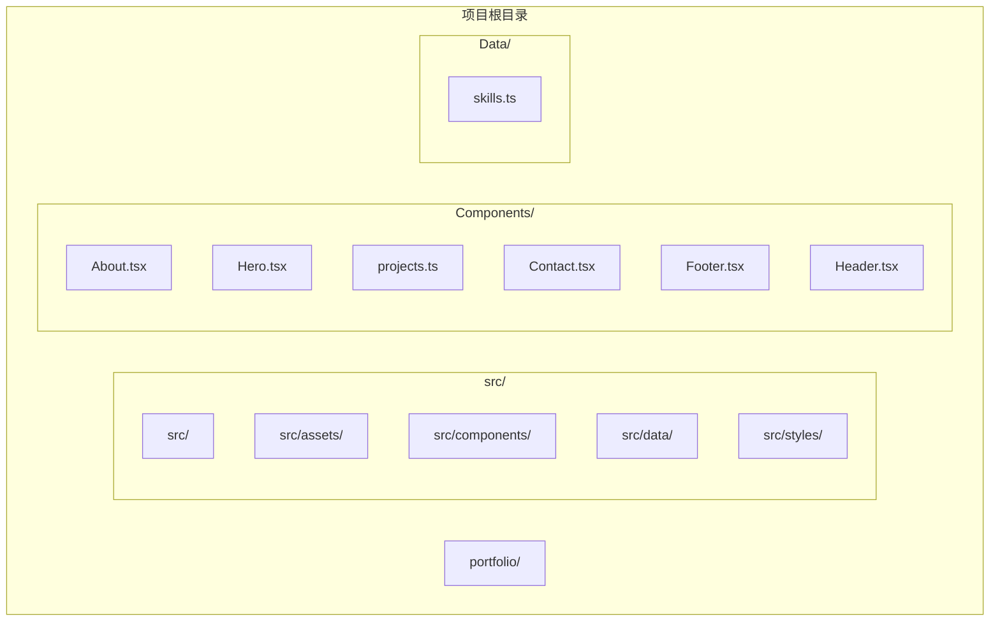
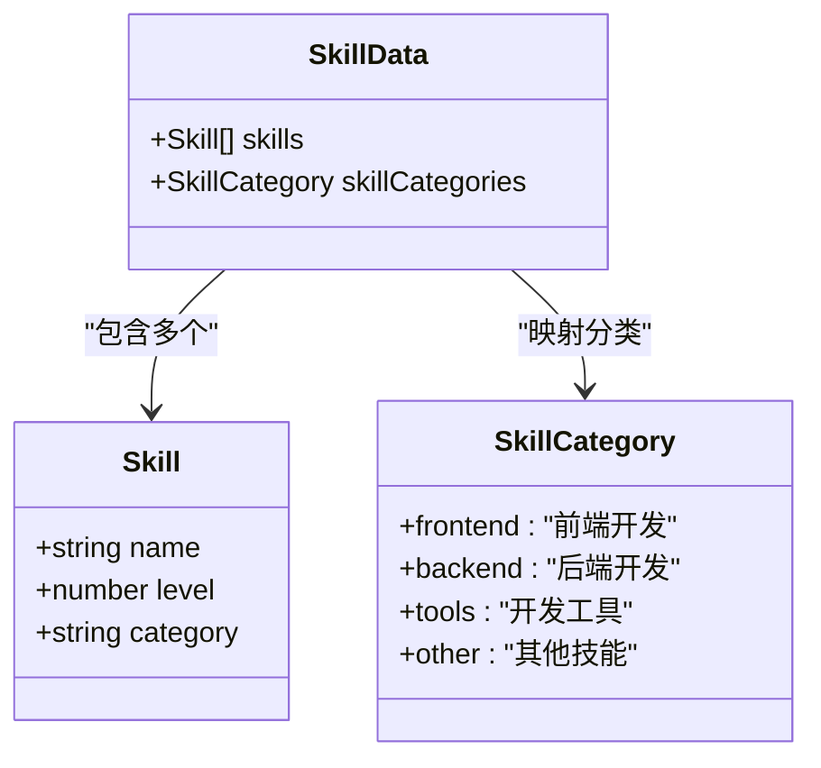
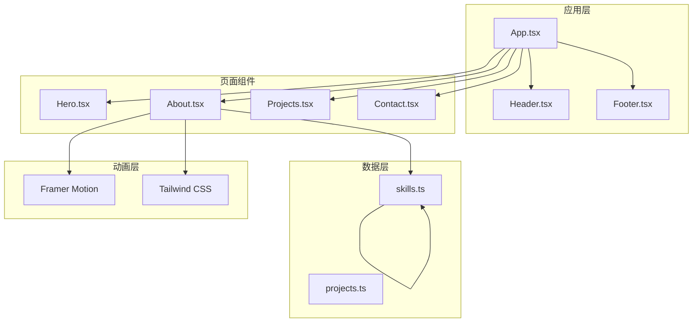
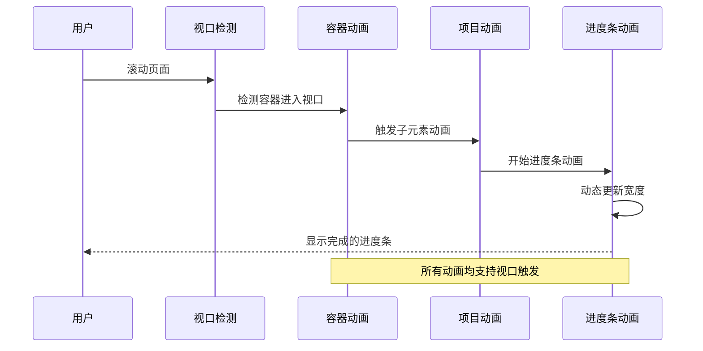
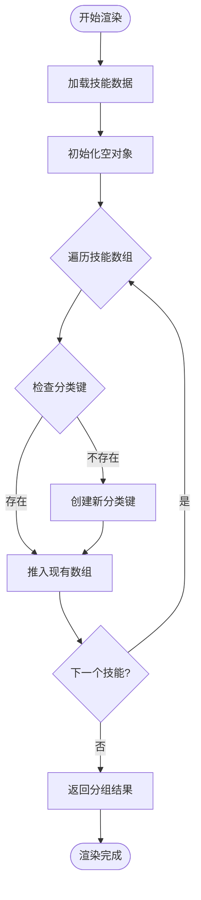
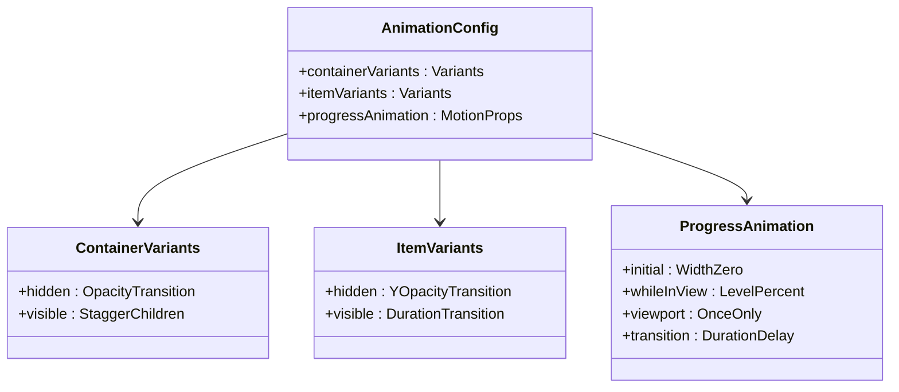
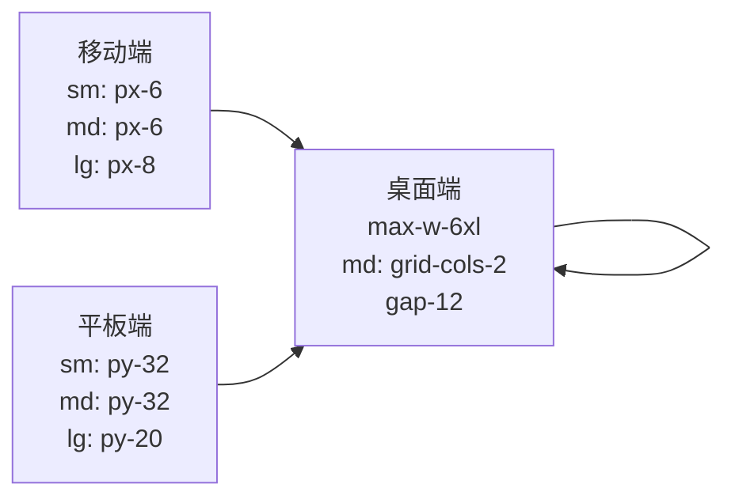
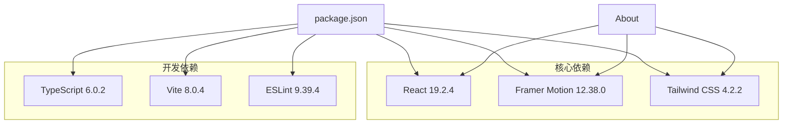
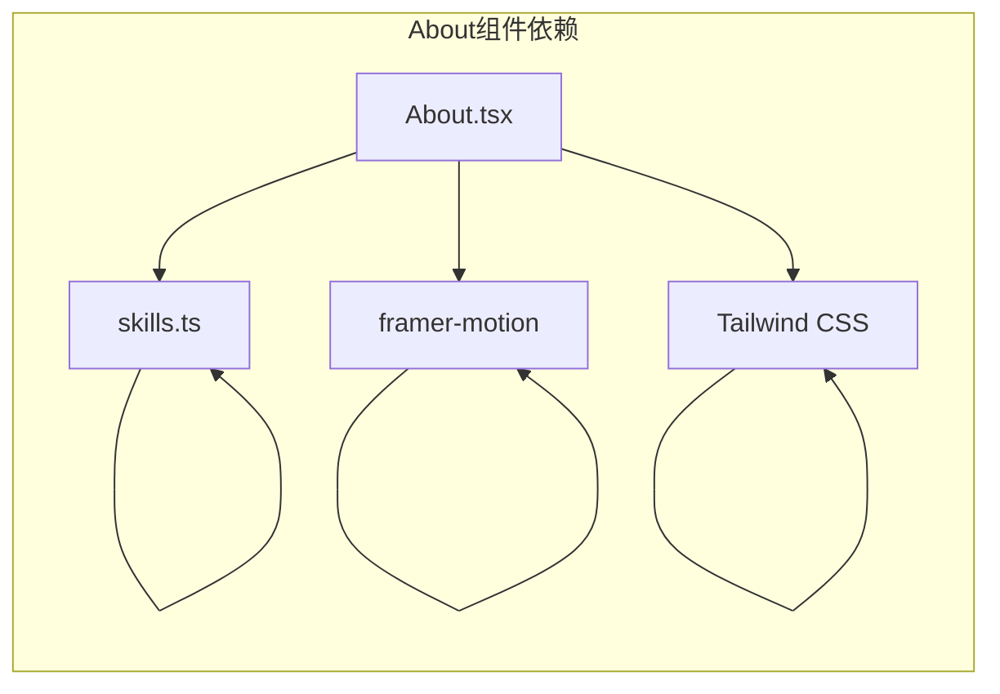
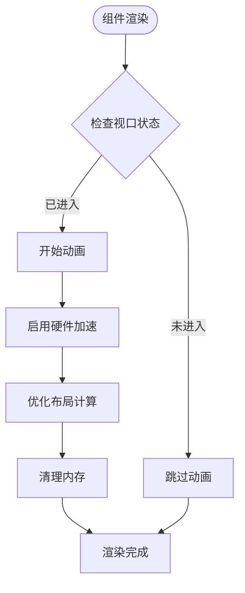

# 技能展示组件（About）

<cite>
**本文档引用的文件**
- [About.tsx](file://portfolio/src/components/About.tsx)
- [skills.ts](file://portfolio/src/data/skills.ts)
- [App.tsx](file://portfolio/src/App.tsx)
- [index.css](file://portfolio/src/index.css)
- [package.json](file://portfolio/package.json)
</cite>

## 目录
1. [简介](#简介)
2. [项目结构](#项目结构)
3. [核心组件](#核心组件)
4. [架构概览](#架构概览)
5. [详细组件分析](#详细组件分析)
6. [依赖关系分析](#依赖关系分析)
7. [性能考虑](#性能考虑)
8. [故障排除指南](#故障排除指南)
9. [结论](#结论)
10. [附录](#附录)

## 简介

技能展示组件（About组件）是个人作品集网站的核心功能模块之一，专门用于展示开发者的技能水平和专业能力。该组件通过精美的动画效果和响应式设计，为用户提供了直观、动态的技能可视化体验。

组件采用现代化的技术栈实现，包括：
- **Framer Motion**：提供流畅的动画效果和视口触发机制
- **Tailwind CSS**：实现响应式布局和现代化视觉设计
- **TypeScript**：确保类型安全和更好的开发体验
- **渐变色彩系统**：营造科技感和专业感的视觉效果

## 项目结构

该项目采用模块化的组织方式，将功能按职责分离到不同的目录中：



**图表来源**
- [About.tsx:1-151](file://portfolio/src/components/About.tsx#L1-L151)
- [skills.ts:1-39](file://portfolio/src/data/skills.ts#L1-L39)

**章节来源**
- [About.tsx:1-151](file://portfolio/src/components/About.tsx#L1-L151)
- [skills.ts:1-39](file://portfolio/src/data/skills.ts#L1-L39)

## 核心组件

### About 组件概述

About组件是一个功能完整的技能展示模块，包含以下主要特性：

1. **技能分类展示**：将技能按照前端开发、后端开发、开发工具和其他技能进行分类
2. **动态进度条**：每个技能都配有动画进度条，展示技能熟练程度
3. **响应式设计**：支持桌面端和移动端的自适应布局
4. **渐变色彩系统**：使用现代化的渐变色彩方案增强视觉效果
5. **视口触发动画**：当元素进入可视区域时触发动画效果

### 数据模型定义

组件使用强类型的TypeScript接口来定义技能数据结构：



**图表来源**
- [skills.ts:2-6](file://portfolio/src/data/skills.ts#L2-L6)
- [skills.ts:33-38](file://portfolio/src/data/skills.ts#L33-L38)

**章节来源**
- [skills.ts:2-6](file://portfolio/src/data/skills.ts#L2-L6)
- [skills.ts:33-38](file://portfolio/src/data/skills.ts#L33-L38)

## 架构概览

### 整体架构设计



**图表来源**
- [App.tsx:1-28](file://portfolio/src/App.tsx#L1-L28)
- [About.tsx:1-2](file://portfolio/src/components/About.tsx#L1-L2)
- [skills.ts:1-39](file://portfolio/src/data/skills.ts#L1-L39)

### 动画系统架构

组件采用多层动画架构，确保流畅的用户体验：



**图表来源**
- [About.tsx:18-35](file://portfolio/src/components/About.tsx#L18-L35)
- [About.tsx:131-137](file://portfolio/src/components/About.tsx#L131-L137)

## 详细组件分析

### 技能数据处理逻辑

#### 数据分组算法

组件使用reduce函数对技能数据进行智能分组：



**图表来源**
- [About.tsx:9-16](file://portfolio/src/components/About.tsx#L9-L16)

#### 分类映射机制

技能分类通过skillCategories对象进行本地化映射：

| 英文分类 | 中文显示 |
|---------|---------|
| frontend | 前端开发 |
| backend | 后端开发 |
| tools | 开发工具 |
| other | 其他技能 |

**章节来源**
- [About.tsx:9-16](file://portfolio/src/components/About.tsx#L9-L16)
- [skills.ts:33-38](file://portfolio/src/data/skills.ts#L33-L38)

### 动画系统实现

#### 主要动画配置

组件实现了多层次的动画效果：



**图表来源**
- [About.tsx:18-35](file://portfolio/src/components/About.tsx#L18-L35)
- [About.tsx:131-137](file://portfolio/src/components/About.tsx#L131-L137)

#### 动画参数详解

| 动画类型 | 参数 | 默认值 | 说明 |
|---------|------|--------|------|
| 容器动画 | staggerChildren | 0.1 | 子元素延迟间隔 |
| 项目动画 | duration | 0.5 | 动画持续时间 |
| 进度条动画 | duration | 1 | 宽度变化时间 |
| 进度条动画 | delay | 0.2 | 动画启动延迟 |
| 视口触发 | once | true | 仅触发一次 |

**章节来源**
- [About.tsx:18-35](file://portfolio/src/components/About.tsx#L18-L35)
- [About.tsx:131-137](file://portfolio/src/components/About.tsx#L131-L137)

### 响应式设计实现

#### 断点配置

组件使用Tailwind CSS的响应式断点系统：



**图表来源**
- [About.tsx:40-41](file://portfolio/src/components/About.tsx#L40-L41)

#### 栅格系统应用

技能展示区域采用双列栅格布局：

| 屏幕尺寸 | 列数 | 间距 | 对齐方式 |
|---------|------|------|----------|
| 移动端 | 1 | 6 | 居中 |
| 平板端 | 1 | 8 | 居中 |
| 桌面端 | 2 | 12 | 顶部对齐 |

**章节来源**
- [About.tsx:57-146](file://portfolio/src/components/About.tsx#L57-L146)

### 样式系统架构

#### 渐变色彩系统

组件使用统一的渐变色彩方案：

```mermaid
graph TB
subgraph "渐变色彩"
Gradient[linear-gradient(135deg, #667eea 0%, #764ba2 100%)]
Primary[#667eea]
Secondary[#764ba2]
Background[#0a0a0a]
Foreground[#ffffff]
end
subgraph "应用位置"
Title[标题文本]
Progress[进度条背景]
Stats[统计数据框]
Hover[悬停效果]
end
Gradient --> Title
Gradient --> Progress
Gradient --> Stats
Gradient --> Hover
```

**图表来源**
- [About.tsx:52](file://portfolio/src/components/About.tsx#L52)
- [About.tsx:136](file://portfolio/src/components/About.tsx#L136)
- [index.css:4-8](file://portfolio/src/index.css#L4-L8)

#### 背景和前景对比

组件采用深色主题设计，确保良好的视觉对比度：

| 元素类型 | 颜色值 | 透明度 | 用途 |
|---------|--------|--------|------|
| 背景 | #0a0a0a | 100% | 页面背景 |
| 前景 | #ffffff | 100% | 标题文字 |
| 次要文字 | #cccccc | 100% | 描述文字 |
| 占位符 | #666666 | 100% | 统计数据 |

**章节来源**
- [index.css:4-8](file://portfolio/src/index.css#L4-L8)
- [About.tsx:66-79](file://portfolio/src/components/About.tsx#L66-L79)

## 依赖关系分析

### 外部依赖

组件依赖以下关键外部库：



**图表来源**
- [package.json:12-35](file://portfolio/package.json#L12-L35)

### 内部依赖关系



**图表来源**
- [About.tsx:1-2](file://portfolio/src/components/About.tsx#L1-L2)
- [skills.ts:1-39](file://portfolio/src/data/skills.ts#L1-L39)

**章节来源**
- [package.json:12-35](file://portfolio/package.json#L12-L35)
- [About.tsx:1-2](file://portfolio/src/components/About.tsx#L1-L2)

## 性能考虑

### 动画性能优化

组件采用了多项性能优化策略：

1. **视口触发机制**：使用viewport属性确保动画只在元素可见时执行
2. **一次性动画**：通过once属性避免重复触发动画
3. **硬件加速**：利用transform属性实现GPU加速的动画效果
4. **内存管理**：合理使用React的key属性确保列表项的正确更新

### 渲染性能优化



**图表来源**
- [About.tsx:47](file://portfolio/src/components/About.tsx#L47)
- [About.tsx:115](file://portfolio/src/components/About.tsx#L115)

### 响应式性能

组件的响应式设计在不同设备上都有良好的性能表现：

- **移动端**：简化动画效果，减少计算开销
- **平板端**：平衡动画复杂度和视觉效果
- **桌面端**：充分利用硬件性能，提供丰富的动画效果

## 故障排除指南

### 常见问题及解决方案

#### 动画不生效

**问题描述**：技能进度条动画没有出现

**可能原因**：
1. Framer Motion库未正确安装
2. 视口检测配置错误
3. CSS样式冲突

**解决方案**：
1. 确认framer-motion版本兼容性
2. 检查viewport属性配置
3. 验证CSS类名冲突

#### 数据显示异常

**问题描述**：技能数据显示不完整或格式错误

**可能原因**：
1. 技能数据格式不符合接口定义
2. 分类映射配置错误
3. TypeScript类型检查失败

**解决方案**：
1. 验证Skill接口字段完整性
2. 检查skillCategories映射表
3. 运行TypeScript编译检查

#### 响应式布局问题

**问题描述**：在某些屏幕尺寸下布局错乱

**可能原因**：
1. Tailwind CSS断点配置不当
2. 样式优先级冲突
3. 浏览器兼容性问题

**解决方案**：
1. 检查断点值配置
2. 验证样式优先级
3. 测试浏览器兼容性

**章节来源**
- [package.json:12-17](file://portfolio/package.json#L12-L17)
- [skills.ts:2-6](file://portfolio/src/data/skills.ts#L2-L6)

## 结论

技能展示组件（About组件）是一个功能完整、设计精良的技能可视化模块。它成功地将现代动画技术与实用的数据展示功能相结合，为用户提供了优秀的交互体验。

### 主要优势

1. **技术先进性**：采用最新的React和Framer Motion技术栈
2. **用户体验优秀**：流畅的动画效果和响应式设计
3. **代码质量高**：TypeScript类型安全和模块化架构
4. **可扩展性强**：清晰的组件结构便于功能扩展

### 改进建议

1. **性能监控**：添加动画性能监控和优化建议
2. **无障碍访问**：增强屏幕阅读器支持
3. **国际化支持**：添加多语言切换功能
4. **数据持久化**：支持技能数据的动态更新

## 附录

### 使用示例

#### 添加新技能

要在技能列表中添加新技能，需要修改skills.ts文件中的skills数组：

```typescript
// 在skills数组中添加新的技能对象
{
  name: "新技能名称",
  level: 85, // 1-100的数值
  category: "frontend" | "backend" | "tools" | "other"
}
```

#### 自定义动画效果

可以通过修改About.tsx中的动画配置来自定义动画行为：

```typescript
// 修改容器动画延迟
const containerVariants = {
  hidden: { opacity: 0 },
  visible: {
    opacity: 1,
    transition: {
      staggerChildren: 0.2 // 增加延迟
    }
  }
}

// 修改进度条动画时长
<motion.div
  transition={{ duration: 1.5, delay: 0.3 }} // 增加动画时长
/>
```

#### 调整视觉样式

可以通过修改CSS类名或添加新的样式规则来自定义外观：

```css
/* 自定义技能条样式 */
.custom-skill-progress {
  height: 6px;
  border-radius: 3px;
  background: linear-gradient(90deg, #667eea, #764ba2);
}
```

### API参考

#### 组件接口

| 属性 | 类型 | 必需 | 默认值 | 描述 |
|------|------|------|--------|------|
| className | string | 否 | "" | 自定义CSS类名 |
| id | string | 否 | "about" | 元素ID标识 |
| style | CSSProperties | 否 | {} | 内联样式对象 |

#### 动画配置接口

| 配置项 | 类型 | 必需 | 默认值 | 描述 |
|--------|------|------|--------|------|
| duration | number | 否 | 0.5 | 动画持续时间（秒） |
| delay | number | 否 | 0 | 动画延迟时间（秒） |
| once | boolean | 否 | true | 是否只触发一次 |
| viewport | ViewportOptions | 否 | { once: true } | 视口检测配置 |

**章节来源**
- [skills.ts:8-31](file://portfolio/src/data/skills.ts#L8-L31)
- [About.tsx:18-35](file://portfolio/src/components/About.tsx#L18-L35)