# 组件系统

<cite>
**本文档引用的文件**
- [App.tsx](file://portfolio/src/App.tsx)
- [Header.tsx](file://portfolio/src/components/Header.tsx)
- [Hero.tsx](file://portfolio/src/components/Hero.tsx)
- [About.tsx](file://portfolio/src/components/About.tsx)
- [Projects.tsx](file://portfolio/src/components/Projects.tsx)
- [Contact.tsx](file://portfolio/src/components/Contact.tsx)
- [Footer.tsx](file://portfolio/src/components/Footer.tsx)
- [skills.ts](file://portfolio/src/data/skills.ts)
- [projects.ts](file://portfolio/src/data/projects.ts)
- [index.css](file://portfolio/src/index.css)
- [package.json](file://portfolio/package.json)
</cite>

## 目录
1. [简介](#简介)
2. [项目结构](#项目结构)
3. [核心组件](#核心组件)
4. [架构概览](#架构概览)
5. [详细组件分析](#详细组件分析)
6. [依赖分析](#依赖分析)
7. [性能考虑](#性能考虑)
8. [故障排除指南](#故障排除指南)
9. [结论](#结论)

## 简介

AIWs项目是一个现代化的个人作品集网站，采用React + TypeScript + Tailwind CSS + Framer Motion技术栈构建。该组件系统提供了完整的用户界面，包括响应式导航、首屏展示、技能展示、项目展示、联系方式和页脚信息等模块。

项目的核心特点：
- 使用Framer Motion实现流畅的动画效果
- 采用Tailwind CSS进行现代化样式设计
- 支持响应式布局和移动端适配
- 数据驱动的组件架构
- 无状态组件设计模式

## 项目结构

项目采用按功能模块组织的目录结构，主要分为以下几个部分：

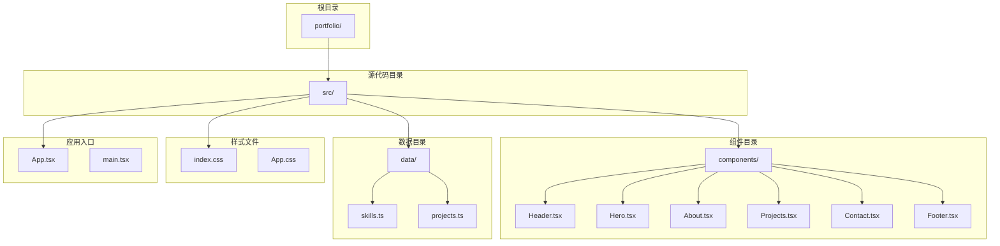

**图表来源**
- [App.tsx:1-28](file://portfolio/src/App.tsx#L1-L28)
- [Header.tsx:1-129](file://portfolio/src/components/Header.tsx#L1-L129)
- [Hero.tsx:1-142](file://portfolio/src/components/Hero.tsx#L1-L142)

**章节来源**
- [App.tsx:1-28](file://portfolio/src/App.tsx#L1-L28)
- [package.json:1-37](file://portfolio/package.json#L1-L37)

## 核心组件

### 组件系统概述

AIWs项目包含6个主要组件，每个组件都有明确的功能定位和职责分工：

| 组件名称 | 功能定位 | 主要特性 |
|---------|----------|----------|
| Header | 顶部导航栏 | 滚动检测、活动区域高亮、平滑滚动 |
| Hero | 首屏展示区域 | 渐变动画、社交链接、滚动提示 |
| About | 关于我区域 | 技能展示、统计数据、个人介绍 |
| Projects | 项目展示区域 | 项目卡片、悬停效果、技术栈标签 |
| Contact | 联系方式区域 | 社交媒体链接、渐变色彩 |
| Footer | 页脚信息 | 版权管理、返回顶部 |

### 组件间通信模式

组件系统采用简单的父子组件通信模式：

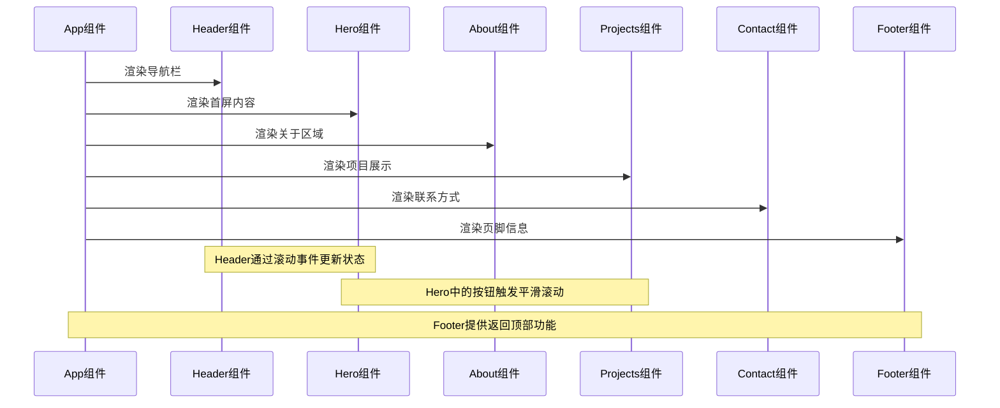

**图表来源**
- [App.tsx:12-25](file://portfolio/src/App.tsx#L12-L25)
- [Header.tsx:21-41](file://portfolio/src/components/Header.tsx#L21-L41)
- [Hero.tsx:68-92](file://portfolio/src/components/Hero.tsx#L68-L92)
- [Footer.tsx:11-13](file://portfolio/src/components/Footer.tsx#L11-L13)

**章节来源**
- [App.tsx:12-25](file://portfolio/src/App.tsx#L12-L25)

## 架构概览

### 整体架构设计

项目采用组件化架构，遵循单一职责原则和组合优于继承的设计理念：

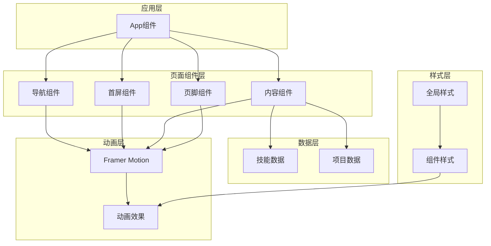

**图表来源**
- [App.tsx:12-25](file://portfolio/src/App.tsx#L12-L25)
- [skills.ts:1-39](file://portfolio/src/data/skills.ts#L1-L39)
- [projects.ts:1-49](file://portfolio/src/data/projects.ts#L1-L49)

### 样式架构

项目采用Tailwind CSS作为主要样式框架，结合自定义CSS变量实现主题一致性：

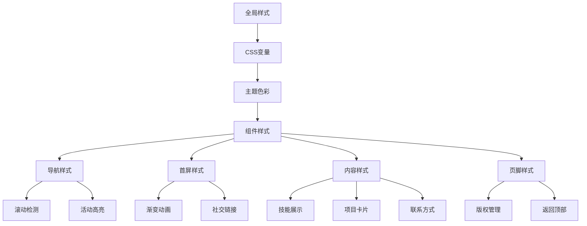

**图表来源**
- [index.css:1-46](file://portfolio/src/index.css#L1-L46)
- [Header.tsx:56-60](file://portfolio/src/components/Header.tsx#L56-L60)
- [Hero.tsx:15-26](file://portfolio/src/components/Hero.tsx#L15-L26)

**章节来源**
- [index.css:1-46](file://portfolio/src/index.css#L1-L46)

## 详细组件分析

### Header 组件分析

Header组件是整个应用的导航中枢，实现了滚动检测、活动区域高亮和平滑滚动功能。

#### 核心功能特性

1. **滚动检测机制**
   - 监听window.scrollY值判断是否超过阈值（50px）
   - 动态切换导航栏样式（透明背景 vs 深色背景）
   - 实现导航栏的显示/隐藏过渡效果

2. **活动区域检测**
   - 基于元素可见性检测当前所在区域
   - 使用getBoundingClientRect()获取元素位置信息
   - 支持顶部偏移量（100px）的精确检测

3. **平滑滚动功能**
   - 提供scrollToSection()方法实现平滑滚动
   - 支持CSS选择器和锚点链接
   - 集成Framer Motion动画效果

#### API参考

| 属性 | 类型 | 必需 | 描述 |
|------|------|------|------|
| 无 | 无 | 无 | Header组件不接受任何props |

| 方法 | 参数 | 返回值 | 描述 |
|------|------|--------|------|
| scrollToSection | href: string | void | 平滑滚动到指定区域 |
| handleScroll | 无 | void | 处理滚动事件，更新状态 |

#### 实现细节

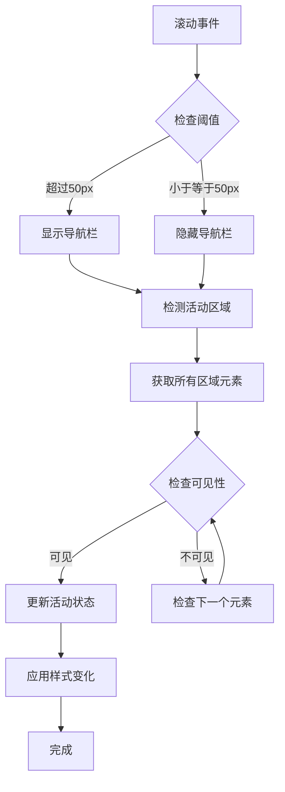

**图表来源**
- [Header.tsx:21-41](file://portfolio/src/components/Header.tsx#L21-L41)
- [Header.tsx:25-36](file://portfolio/src/components/Header.tsx#L25-L36)

**章节来源**
- [Header.tsx:16-129](file://portfolio/src/components/Header.tsx#L16-L129)

### Hero 组件分析

Hero组件负责首屏展示，包含头像、姓名、简介和社交链接等元素。

#### 核心功能特性

1. **渐变动画序列**
   - 头像：scale从0到1，opacity从0到1
   - 文字内容：y位移从20到0，opacity从0到1
   - 按钮：y位移从20到0，opacity从0到1
   - 社交链接：y位移从20到0，opacity从0到1

2. **响应式设计**
   - 支持移动端和桌面端的不同尺寸
   - 使用Flexbox实现居中布局
   - 响应式字体大小调整

3. **交互元素**
   - CTA按钮的悬停效果
   - 社交链接的图标展示
   - 滚动提示动画

#### API参考

| 属性 | 类型 | 必需 | 描述 |
|------|------|------|------|
| 无 | 无 | 无 | Hero组件不接受任何props |

#### 实现细节

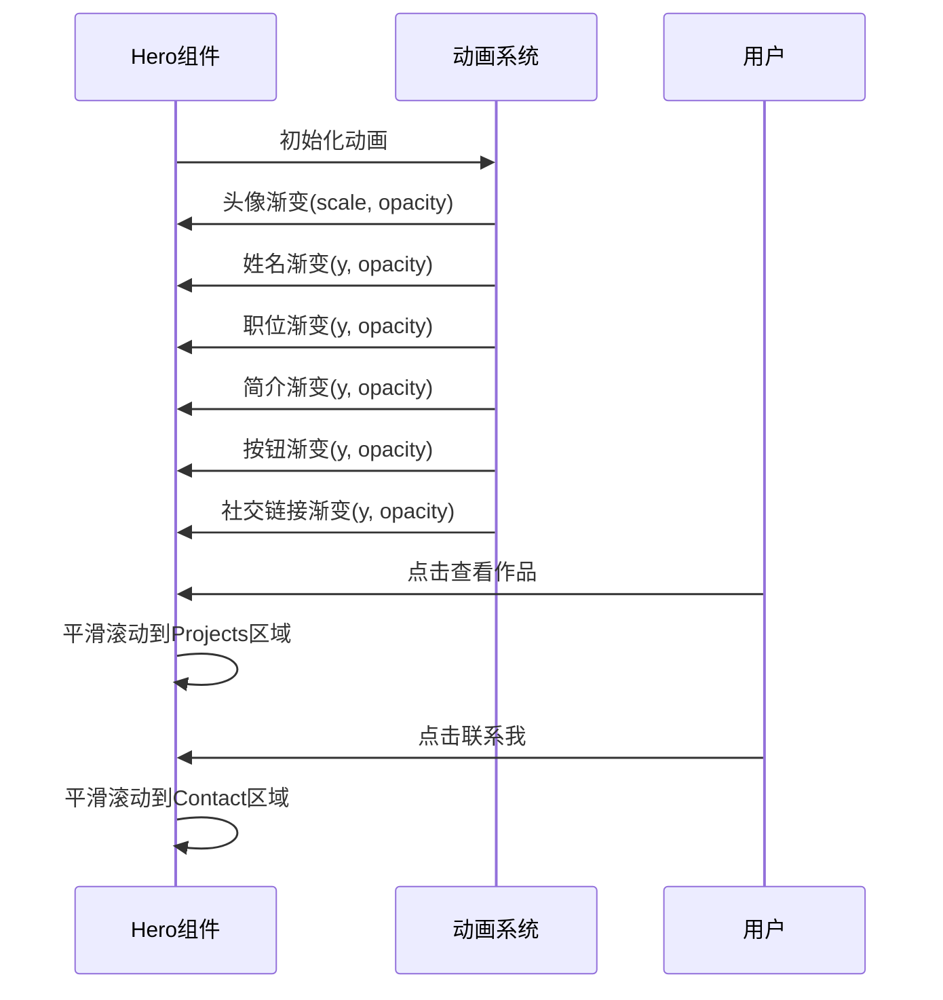

**图表来源**
- [Hero.tsx:15-137](file://portfolio/src/components/Hero.tsx#L15-L137)
- [Hero.tsx:68-92](file://portfolio/src/components/Hero.tsx#L68-L92)

**章节来源**
- [Hero.tsx:7-142](file://portfolio/src/components/Hero.tsx#L7-L142)

### About 组件分析

About组件展示个人介绍和技能列表，采用数据驱动的方式实现动态内容渲染。

#### 核心功能特性

1. **数据分组机制**
   - 按技能类别对技能数据进行分组
   - 支持前端开发、后端开发、开发工具、其他技能四种类别
   - 动态生成技能展示区域

2. **渐变动画系统**
   - 使用Framer Motion的staggerChildren实现有序动画
   - 技能条目的宽度动画展示技能水平
   - 视口检测触发动画效果

3. **统计信息展示**
   - 工作经验统计
   - 项目完成数量
   - 技术栈数量

#### API参考

| 属性 | 类型 | 必需 | 描述 |
|------|------|------|------|
| 无 | 无 | 无 | About组件不接受任何props |

#### 实现细节

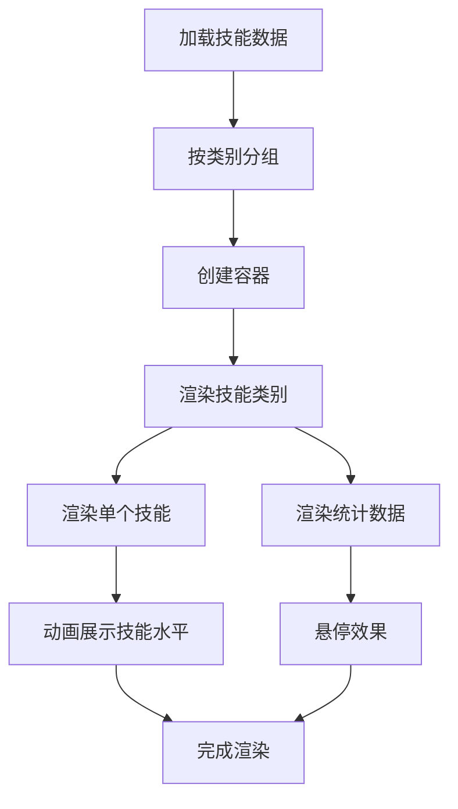

**图表来源**
- [About.tsx:9-16](file://portfolio/src/components/About.tsx#L9-L16)
- [About.tsx:111-144](file://portfolio/src/components/About.tsx#L111-L144)

**章节来源**
- [About.tsx:8-151](file://portfolio/src/components/About.tsx#L8-L151)

### Projects 组件分析

Projects组件展示项目作品集，提供项目卡片的交互式展示。

#### 核心功能特性

1. **项目卡片布局**
   - 响应式网格布局（移动端单列，桌面端双列）
   - 悬停时显示操作按钮（外部链接和GitHub链接）
   - 技术栈标签的动态展示

2. **交互式动画**
   - 卡片悬停时的边框变化
   - 按钮的缩放和颜色变化
   - 整体布局的有序动画效果

3. **数据绑定**
   - 从projects.ts导入项目数据
   - 动态渲染项目信息
   - 条件渲染GitHub链接

#### API参考

| 属性 | 类型 | 必需 | 描述 |
|------|------|------|------|
| 无 | 无 | 无 | Projects组件不接受任何props |

#### 实现细节

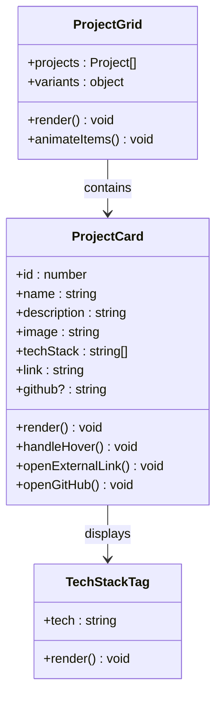

**图表来源**
- [projects.ts:2-10](file://portfolio/src/data/projects.ts#L2-L10)
- [Projects.tsx:60-124](file://portfolio/src/components/Projects.tsx#L60-L124)

**章节来源**
- [Projects.tsx:9-151](file://portfolio/src/components/Projects.tsx#L9-L151)

### Contact 组件分析

Contact组件提供多种联系方式，采用统一的卡片设计模式。

#### 核心功能特性

1. **统一设计模式**
   - 四种不同类型的联系信息卡片
   - 统一的图标、颜色和布局风格
   - 一致的交互体验

2. **渐变色彩系统**
   - 邮箱：红色渐变
   - GitHub：灰色渐变
   - LinkedIn：蓝色渐变
   - Twitter：天空蓝渐变

3. **响应式布局**
   - 移动端单列布局
   - 桌面端双列布局
   - 灵活的间距调整

#### API参考

| 属性 | 类型 | 必需 | 描述 |
|------|------|------|------|
| 无 | 无 | 无 | Contact组件不接受任何props |

#### 实现细节

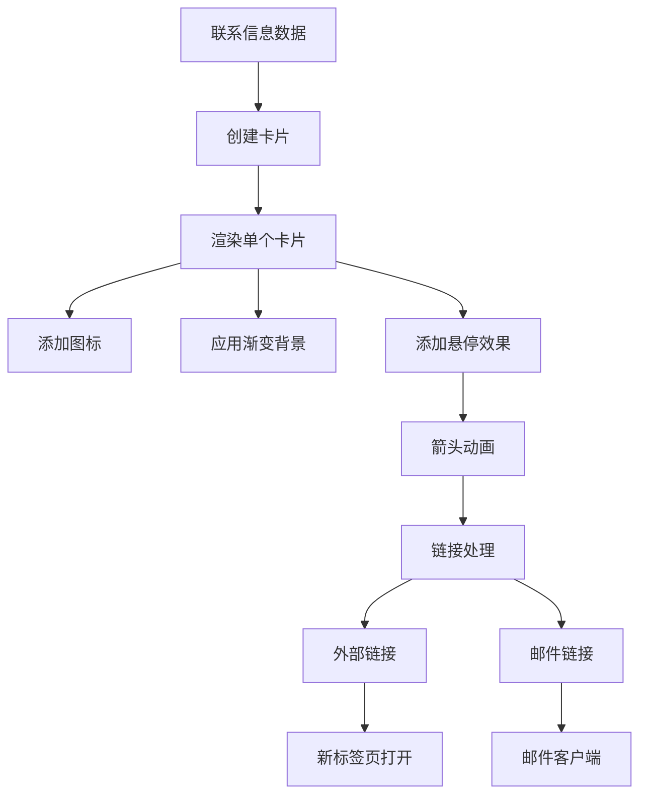

**图表来源**
- [Contact.tsx:9-38](file://portfolio/src/components/Contact.tsx#L9-L38)
- [Contact.tsx:90-130](file://portfolio/src/components/Contact.tsx#L90-L130)

**章节来源**
- [Contact.tsx:8-149](file://portfolio/src/components/Contact.tsx#L8-L149)

### Footer 组件分析

Footer组件提供页脚信息和辅助功能。

#### 核心功能特性

1. **版权信息管理**
   - 动态获取当前年份
   - 心形图标装饰
   - 渐变文字效果

2. **返回顶部功能**
   - 平滑滚动到页面顶部
   - 悬停时的动画效果
   - 响应式布局适配

3. **响应式设计**
   - 移动端垂直排列
   - 桌面端水平排列
   - 灵活的间距控制

#### API参考

| 属性 | 类型 | 必需 | 描述 |
|------|------|------|------|
| 无 | 无 | 无 | Footer组件不接受任何props |

#### 实现细节

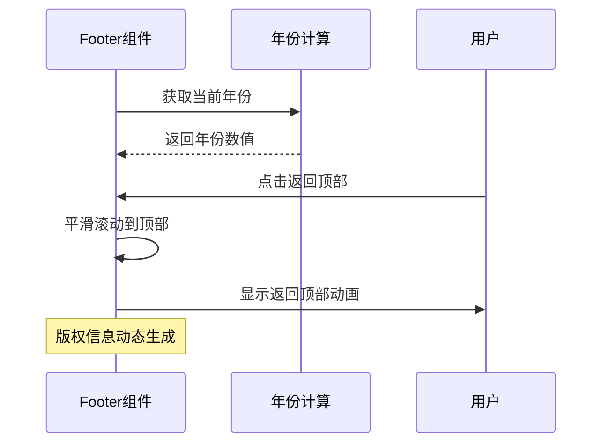

**图表来源**
- [Footer.tsx:9-13](file://portfolio/src/components/Footer.tsx#L9-L13)
- [Footer.tsx:32-42](file://portfolio/src/components/Footer.tsx#L32-L42)

**章节来源**
- [Footer.tsx:8-48](file://portfolio/src/components/Footer.tsx#L8-L48)

## 依赖分析

### 外部依赖关系

项目使用了现代化的前端技术栈，各依赖包承担不同的职责：

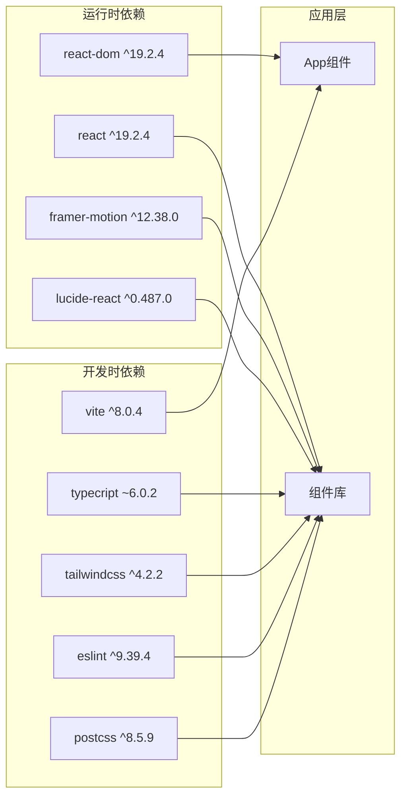

**图表来源**
- [package.json:12-35](file://portfolio/package.json#L12-L35)

### 内部依赖关系

组件间的依赖关系相对简单，主要体现为App组件的组合关系：

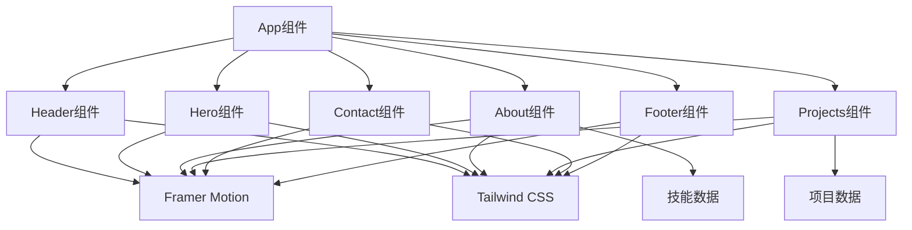

**图表来源**
- [App.tsx:1-6](file://portfolio/src/App.tsx#L1-L6)
- [skills.ts:1-39](file://portfolio/src/data/skills.ts#L1-L39)
- [projects.ts:1-49](file://portfolio/src/data/projects.ts#L1-L49)

**章节来源**
- [package.json:12-35](file://portfolio/package.json#L12-L35)

## 性能考虑

### 动画性能优化

1. **硬件加速**
   - 使用transform属性而非改变布局属性
   - 利用will-change属性优化动画性能
   - 合理设置动画持续时间和缓动函数

2. **滚动性能**
   - 使用requestAnimationFrame优化滚动监听
   - 防抖处理减少事件触发频率
   - 可视区域检测避免不必要的计算

3. **渲染优化**
   - 使用React.memo避免不必要的重渲染
   - 合理使用key属性优化列表渲染
   - 懒加载非关键资源

### 样式性能优化

1. **CSS变量使用**
   - 减少重复的颜色定义
   - 支持主题切换的动态样式
   - 降低CSS文件体积

2. **响应式设计**
   - 使用媒体查询优化移动端性能
   - 避免过度的DOM操作
   - 合理的布局计算

## 故障排除指南

### 常见问题及解决方案

1. **动画不生效**
   - 检查Framer Motion依赖是否正确安装
   - 确认组件使用了正确的motion包装
   - 验证CSS类名是否正确

2. **滚动检测失效**
   - 确认滚动事件监听器正确绑定
   - 检查元素ID与导航链接的一致性
   - 验证getBoundingClientRect()调用

3. **样式显示异常**
   - 检查Tailwind CSS配置
   - 确认CSS变量定义正确
   - 验证响应式断点设置

4. **数据渲染问题**
   - 确认数据接口返回格式正确
   - 检查类型定义与实际数据匹配
   - 验证条件渲染逻辑

**章节来源**
- [Header.tsx:21-41](file://portfolio/src/components/Header.tsx#L21-L41)
- [Hero.tsx:15-137](file://portfolio/src/components/Hero.tsx#L15-L137)

## 结论

AIWs项目的组件系统展现了现代前端开发的最佳实践：

1. **清晰的架构设计**：组件职责明确，层次分明
2. **优秀的用户体验**：流畅的动画效果和响应式设计
3. **可维护的代码结构**：数据驱动的组件设计模式
4. **现代化的技术栈**：充分利用React生态系统的优势

该组件系统为个人作品集网站提供了一个完整、可扩展的解决方案，既满足了功能需求，又保证了良好的性能和用户体验。通过合理的组件拆分和数据管理，为后续的功能扩展和维护奠定了坚实的基础。