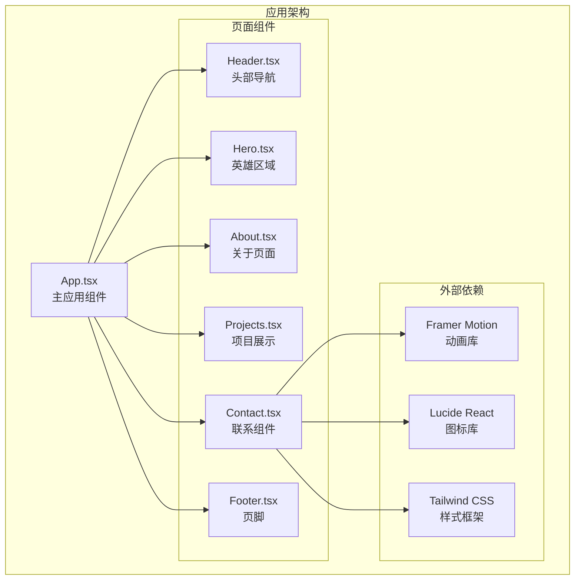
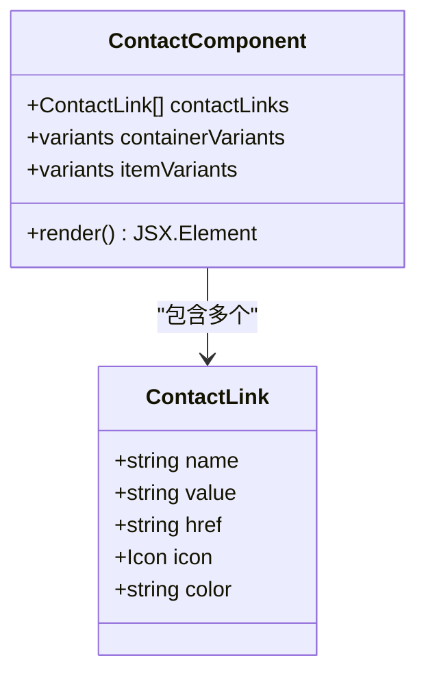
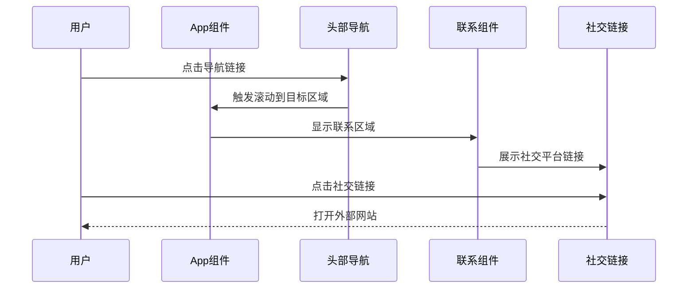
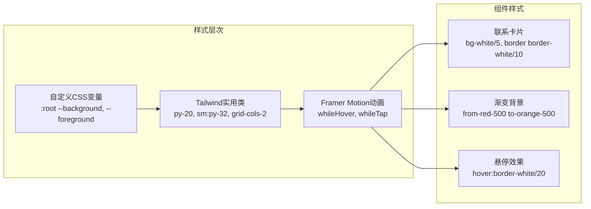
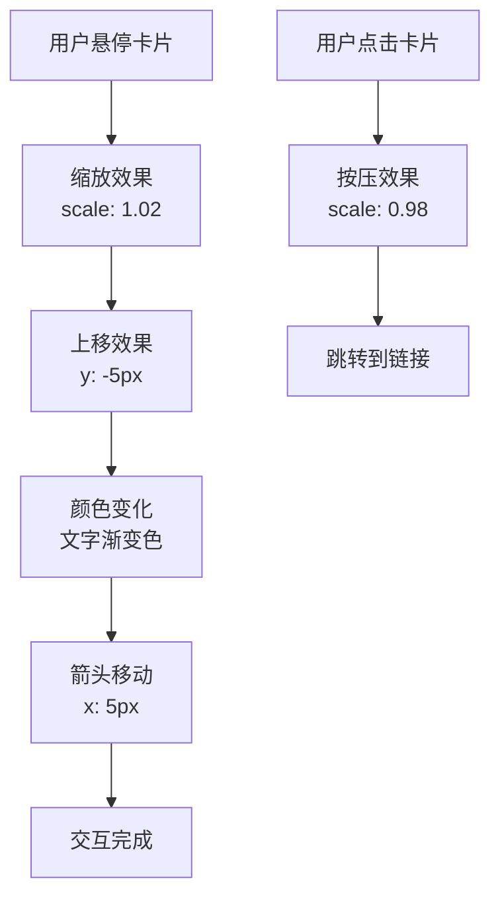
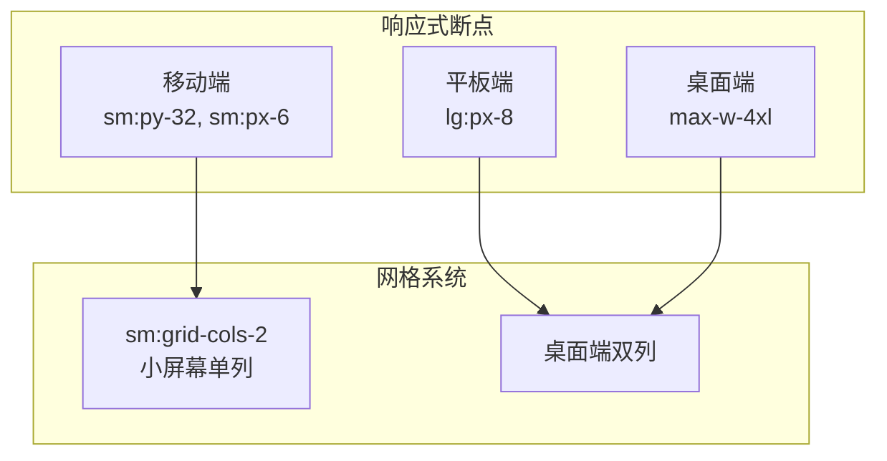
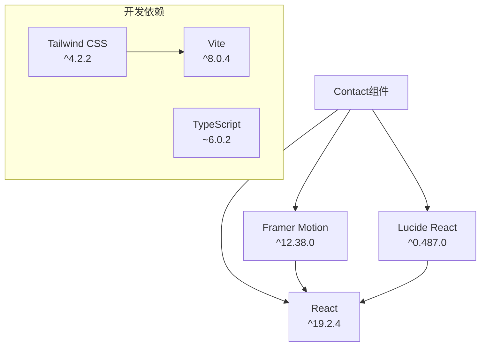

# 联系组件 (Contact)

<cite>
**本文档引用的文件**
- [Contact.tsx](file://portfolio/src/components/Contact.tsx)
- [App.tsx](file://portfolio/src/App.tsx)
- [Header.tsx](file://portfolio/src/components/Header.tsx)
- [Footer.tsx](file://portfolio/src/components/Footer.tsx)
- [Hero.tsx](file://portfolio/src/components/Hero.tsx)
- [index.css](file://portfolio/src/index.css)
- [package.json](file://portfolio/package.json)
- [vite.config.ts](file://portfolio/vite.config.ts)
</cite>

## 目录
1. [简介](#简介)
2. [项目结构](#项目结构)
3. [核心组件](#核心组件)
4. [架构概览](#架构概览)
5. [详细组件分析](#详细组件分析)
6. [依赖关系分析](#依赖关系分析)
7. [性能考虑](#性能考虑)
8. [故障排除指南](#故障排除指南)
9. [结论](#结论)

## 简介

Contact组件是Portfolio项目中的联系信息展示组件，采用现代化的设计理念和响应式布局。该组件提供了优雅的联系信息卡片展示，集成了多种社交平台链接，并实现了流畅的动画效果和良好的用户体验。

组件的核心特性包括：
- 响应式网格布局，支持移动端和桌面端
- 流畅的Framer Motion动画效果
- 渐变色彩设计和现代化视觉风格
- 完整的社交平台链接集成
- 可访问性友好的交互设计

## 项目结构

Portfolio项目采用模块化架构，Contact组件作为独立的功能模块集成在整体应用中：

**图表来源**
- [App.tsx:12-25](file://portfolio/src/App.tsx#L12-L25)
- [Contact.tsx:1-2](file://portfolio/src/components/Contact.tsx#L1-L2)

**章节来源**
- [App.tsx:1-28](file://portfolio/src/App.tsx#L1-L28)
- [package.json:12-17](file://portfolio/package.json#L12-L17)

## 核心组件

Contact组件是一个无状态函数组件，负责展示联系信息和社交链接。组件内部维护了一个联系链接数组，每个链接都包含名称、值、URL、图标和颜色配置。

### 主要数据结构

组件使用统一的数据结构来描述每个联系链接：

**图表来源**
- [Contact.tsx:9-38](file://portfolio/src/components/Contact.tsx#L9-L38)

### 动画配置

组件实现了两层动画系统：
- **容器动画**：控制子元素的交错出现效果
- **项目动画**：为每个联系卡片提供独立的进入动画

**章节来源**
- [Contact.tsx:40-57](file://portfolio/src/components/Contact.tsx#L40-L57)

## 架构概览

Contact组件在整个应用架构中扮演着重要的角色，它不仅展示了静态内容，还与其他组件形成了完整的用户导航体验。

**图表来源**
- [Header.tsx:44-49](file://portfolio/src/components/Header.tsx#L44-L49)
- [Contact.tsx:93-128](file://portfolio/src/components/Contact.tsx#L93-L128)

### 样式系统

组件采用Tailwind CSS进行样式管理，结合自定义CSS变量实现深色主题设计：

**图表来源**
- [index.css:3-8](file://portfolio/src/index.css#L3-L8)
- [Contact.tsx:99-106](file://portfolio/src/components/Contact.tsx#L99-L106)

**章节来源**
- [index.css:1-46](file://portfolio/src/index.css#L1-L46)
- [Contact.tsx:60-147](file://portfolio/src/components/Contact.tsx#L60-L147)

## 详细组件分析

### 表单设计与交互

Contact组件虽然名为"联系"，但实际实现的是静态的联系信息展示，而非传统意义上的表单。组件通过卡片式布局展示联系信息，提供直观的点击交互。

#### 联系信息展示

组件使用卡片布局展示四种主要联系方式：

| 联系方式 | 图标 | 颜色方案 | 链接类型 |
|---------|------|----------|----------|
| Email | Mail | 红色渐变 | mailto链接 |
| GitHub | Github | 灰色渐变 | 外部链接 |
| LinkedIn | Linkedin | 蓝色渐变 | 外部链接 |
| Twitter | Twitter | 天蓝色渐变 | 外部链接 |

#### 交互功能

组件实现了多层次的交互反馈：

**图表来源**
- [Contact.tsx:100-127](file://portfolio/src/components/Contact.tsx#L100-L127)

### 社交链接集成

组件集成了四个主流社交平台的链接，每个链接都有独特的视觉标识和交互效果。

#### 图标系统

使用Lucide React图标库提供的专业图标：
- **Mail**：邮件联系图标
- **Github**：GitHub平台图标  
- **Linkedin**：LinkedIn平台图标
- **Twitter**：Twitter平台图标

#### 链接配置

每个社交链接都经过精心配置：
- **安全属性**：外部链接自动添加`rel="noopener noreferrer"`
- **目标窗口**：外部链接在新窗口打开
- **颜色主题**：每个平台都有专属的渐变色彩

**章节来源**
- [Contact.tsx:9-38](file://portfolio/src/components/Contact.tsx#L9-L38)

### 响应式布局实现

组件采用移动优先的设计策略，通过Tailwind CSS的响应式断点实现多设备适配。

#### 布局断点

**图表来源**
- [Contact.tsx:88](file://portfolio/src/components/Contact.tsx#L88)
- [Contact.tsx:62](file://portfolio/src/components/Contact.tsx#L62)

#### 动画响应

组件的动画效果也具有响应式特性：
- **移动设备**：简化动画以提升性能
- **桌面设备**：提供更丰富的动画效果
- **首次加载**：使用视口检测确保动画只执行一次

**章节来源**
- [Contact.tsx:83-88](file://portfolio/src/components/Contact.tsx#L83-L88)
- [Contact.tsx:66-70](file://portfolio/src/components/Contact.tsx#L66-L70)

### 可访问性设计

组件在设计时充分考虑了可访问性要求：

#### 键盘导航
- 所有链接都是标准的HTML锚点元素
- 支持键盘Tab键导航
- 提供焦点状态指示

#### 屏幕阅读器支持
- 语义化的HTML结构
- 合适的标题层级
- 描述性的链接文本

#### 颜色对比度
- 使用高对比度的颜色方案
- 渐变色彩符合WCAG标准
- 悬停状态提供清晰的视觉反馈

### 跨平台兼容性

组件在不同浏览器和设备上都能保持一致的表现：

#### 浏览器支持
- **现代浏览器**：完整支持所有功能
- **IE11+**：基础样式兼容
- **移动浏览器**：触摸友好的交互

#### 性能优化
- **懒加载**：动画仅在视口内触发
- **内存管理**：一次性渲染，避免重复DOM操作
- **资源优化**：图标按需加载

## 依赖关系分析

Contact组件的依赖关系相对简单，主要依赖于几个关键的第三方库。

**图表来源**
- [package.json:12-17](file://portfolio/package.json#L12-L17)
- [vite.config.ts:6-8](file://portfolio/vite.config.ts#L6-L8)

### 外部依赖特性

#### Framer Motion
- **版本**：12.38.0
- **用途**：提供流畅的动画效果
- **特性**：手势识别、视口检测、布局动画

#### Lucide React
- **版本**：0.487.0
- **用途**：提供高质量的SVG图标
- **特性**：轻量级、可定制、无障碍友好

#### Tailwind CSS
- **版本**：4.2.2
- **用途**：提供实用的CSS框架
- **特性**：响应式设计、可定制主题、原子化样式

**章节来源**
- [package.json:12-35](file://portfolio/package.json#L12-L35)

## 性能考虑

Contact组件在设计时充分考虑了性能优化，采用了多种策略来确保最佳的用户体验。

### 渲染优化

组件使用React.memo模式（隐式）来避免不必要的重新渲染：
- **静态内容**：联系信息不随用户交互变化
- **纯函数组件**：无状态组件，渲染效率高
- **最小化DOM树**：简洁的HTML结构

### 动画性能

Framer Motion提供了高效的动画实现：
- **硬件加速**：使用transform和opacity属性
- **帧率优化**：默认60fps动画
- **内存管理**：自动清理动画资源

### 资源加载

组件的资源加载策略：
- **图标懒加载**：按需导入图标组件
- **CSS优化**：使用Tailwind的按需生成
- **缓存策略**：浏览器自动缓存静态资源

## 故障排除指南

### 常见问题及解决方案

#### 图标不显示
**问题**：社交图标无法正常显示
**原因**：Lucide React包未正确安装
**解决**：运行`npm install lucide-react`

#### 动画不生效
**问题**：卡片动画效果缺失
**原因**：Framer Motion配置错误
**解决**：检查Framer Motion版本兼容性

#### 链接无法打开
**问题**：点击社交链接无法跳转
**原因**：rel属性配置错误
**解决**：确保外部链接添加`rel="noopener noreferrer"`

#### 响应式布局异常
**问题**：移动端显示效果不佳
**原因**：Tailwind断点配置问题
**解决**：检查CSS类名的断点前缀

### 调试技巧

#### 开发者工具
- **React DevTools**：检查组件渲染状态
- **浏览器开发者工具**：监控网络请求和性能
- **移动设备仿真**：测试响应式效果

#### 性能监控
- **Performance面板**：分析渲染性能
- **Memory面板**：检查内存泄漏
- **Lighthouse**：评估可访问性

**章节来源**
- [Contact.tsx:96-97](file://portfolio/src/components/Contact.tsx#L96-L97)
- [package.json:12-17](file://portfolio/package.json#L12-L17)

## 结论

Contact组件是一个设计精良、功能完整的联系信息展示组件。它成功地结合了现代化的设计理念、优秀的用户体验和良好的技术实现。

### 主要优势

1. **设计优雅**：采用渐变色彩和现代化布局
2. **交互流畅**：丰富的动画效果提升用户体验
3. **响应式强**：完美适配各种设备尺寸
4. **可维护性好**：清晰的代码结构和注释
5. **性能优秀**：优化的渲染和动画实现

### 技术亮点

- **Framer Motion集成**：提供专业的动画解决方案
- **Tailwind CSS应用**：实现快速的样式开发
- **响应式设计**：移动优先的布局策略
- **可访问性考虑**：全面的无障碍设计

### 改进建议

1. **表单扩展**：可以考虑添加实际的联系表单功能
2. **国际化支持**：增加多语言文本支持
3. **主题定制**：提供更多主题配置选项
4. **SEO优化**：增强搜索引擎友好性

Contact组件为整个Portfolio项目提供了出色的联系信息展示功能，是现代前端开发的最佳实践案例。