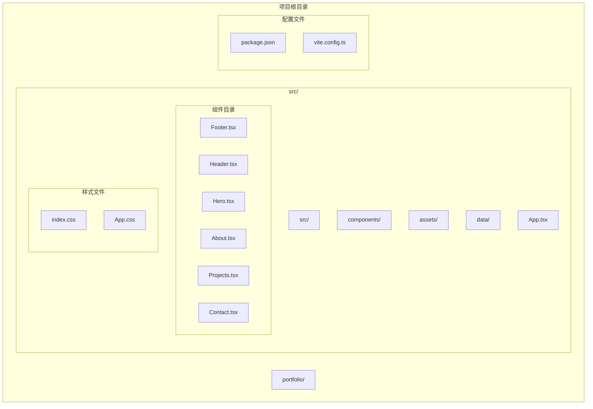
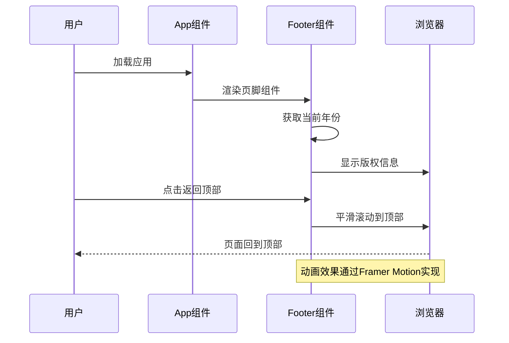
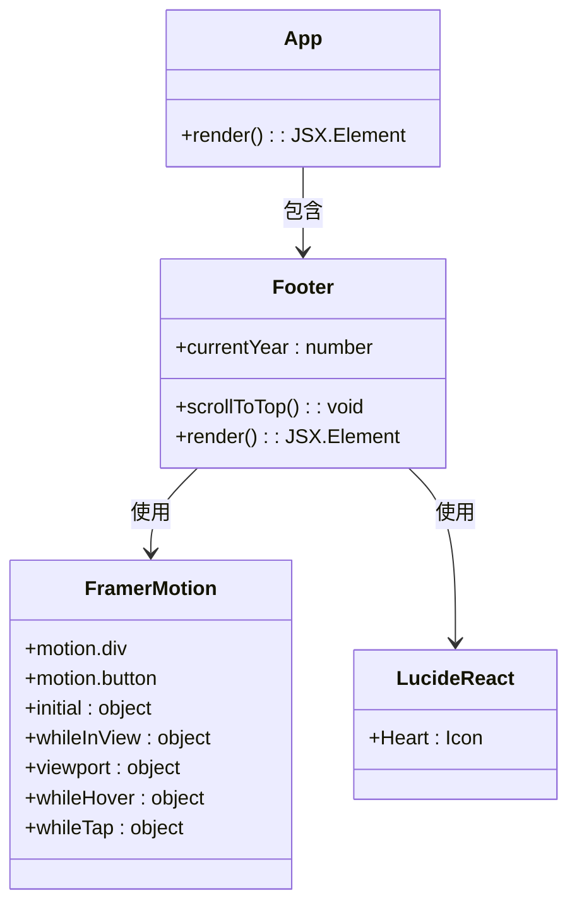
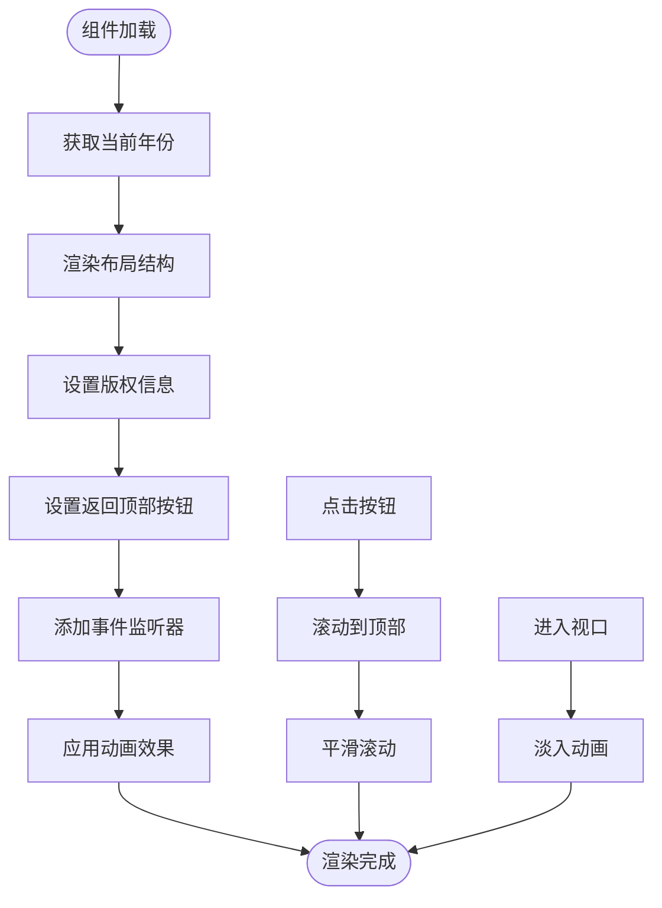
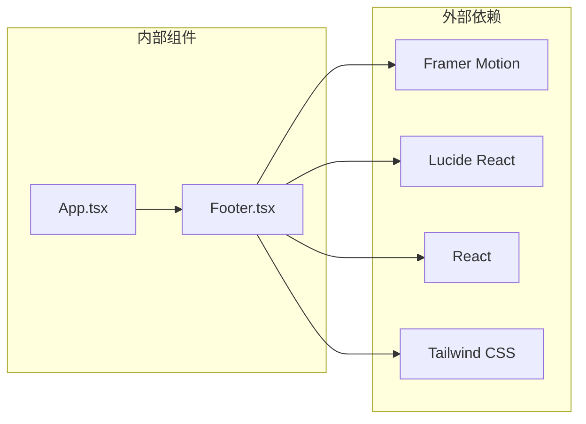

# 页脚组件 (Footer)

<cite>
**本文档引用的文件**
- [Footer.tsx](file://portfolio/src/components/Footer.tsx)
- [App.tsx](file://portfolio/src/App.tsx)
- [index.css](file://portfolio/src/index.css)
- [App.css](file://portfolio/src/App.css)
- [package.json](file://portfolio/package.json)
- [vite.config.ts](file://portfolio/vite.config.ts)
</cite>

## 目录
1. [简介](#简介)
2. [项目结构](#项目结构)
3. [核心组件](#核心组件)
4. [架构概览](#架构概览)
5. [详细组件分析](#详细组件分析)
6. [依赖关系分析](#依赖关系分析)
7. [性能考虑](#性能考虑)
8. [故障排除指南](#故障排除指南)
9. [结论](#结论)

## 简介

页脚组件（Footer）是个人作品集网站的重要组成部分，负责展示版权信息、提供返回顶部功能，并确保在页面底部的固定定位。该组件采用现代化的设计理念，结合了动画效果、响应式布局和深色主题支持，为用户提供流畅的浏览体验。

该组件主要包含两个核心功能：
- **版权信息展示**：动态显示当前年份的版权声明，使用爱心图标增强视觉效果
- **返回顶部功能**：提供平滑滚动到页面顶部的交互体验

## 项目结构

项目采用模块化架构，将页脚组件作为独立的功能模块进行管理。整体项目结构清晰，便于维护和扩展。

**图表来源**
- [Footer.tsx:1-48](file://portfolio/src/components/Footer.tsx#L1-L48)
- [App.tsx:1-28](file://portfolio/src/App.tsx#L1-L28)

**章节来源**
- [Footer.tsx:1-48](file://portfolio/src/components/Footer.tsx#L1-L48)
- [App.tsx:1-28](file://portfolio/src/App.tsx#L1-L28)

## 核心组件

### 组件概述

Footer组件是一个无状态函数组件，采用TypeScript编写，使用Framer Motion进行动画控制，Lucide React提供图标支持。组件设计简洁而功能完整，符合现代Web开发的最佳实践。

### 主要特性

1. **动态版权信息**：自动获取当前年份，无需手动更新
2. **平滑滚动**：提供优雅的返回顶部体验
3. **响应式设计**：适配不同屏幕尺寸的设备
4. **动画效果**：使用Framer Motion增强用户体验
5. **深色主题**：与整体设计语言保持一致

**章节来源**
- [Footer.tsx:4-8](file://portfolio/src/components/Footer.tsx#L4-L8)
- [Footer.tsx:11-13](file://portfolio/src/components/Footer.tsx#L11-L13)

## 架构概览

页脚组件在整个应用架构中扮演着重要的角色，作为应用的最终渲染组件之一，确保用户能够轻松地回到页面顶部。

**图表来源**
- [App.tsx:12-25](file://portfolio/src/App.tsx#L12-L25)
- [Footer.tsx:11-13](file://portfolio/src/components/Footer.tsx#L11-L13)

### 组件关系图

**图表来源**
- [Footer.tsx:1-2](file://portfolio/src/components/Footer.tsx#L1-L2)
- [App.tsx:12-25](file://portfolio/src/App.tsx#L12-L25)

**章节来源**
- [App.tsx:12-25](file://portfolio/src/App.tsx#L12-L25)
- [Footer.tsx:1-48](file://portfolio/src/components/Footer.tsx#L1-L48)

## 详细组件分析

### 组件结构分析

Footer组件采用简洁的结构设计，包含版权信息区域和返回顶部按钮两个主要部分。整个组件使用Flexbox布局，确保在不同屏幕尺寸下都能保持良好的视觉效果。

#### 版权信息区域

版权信息区域使用Framer Motion的`motion.div`组件，实现了淡入动画效果。该区域包含三个元素：
- 年份显示（动态获取）
- 心形图标（红色填充）
- 文本说明

#### 返回顶部按钮

返回顶部按钮使用Framer Motion的`motion.button`组件，提供了丰富的交互反馈：
- 悬停时轻微上移
- 点按时缩放效果
- 平滑滚动到页面顶部

### 样式系统分析

组件采用Tailwind CSS进行样式管理，结合自定义CSS变量实现深色主题支持。

#### 响应式设计

组件使用Tailwind CSS的响应式前缀实现多设备适配：
- 移动端：垂直排列，紧凑间距
- 平板端：水平排列，适当间距
- 桌面端：最大宽度限制，居中对齐

#### 动画系统

使用Framer Motion实现多种动画效果：
- 进入视口时的淡入动画
- 悬停时的微位移动画
- 点按时的缩放动画

**章节来源**
- [Footer.tsx:15-46](file://portfolio/src/components/Footer.tsx#L15-L46)

### 代码流程分析

**图表来源**
- [Footer.tsx:8-47](file://portfolio/src/components/Footer.tsx#L8-L47)

**章节来源**
- [Footer.tsx:8-47](file://portfolio/src/components/Footer.tsx#L8-L47)

## 依赖关系分析

### 外部依赖

Footer组件依赖于以下关键包：

**图表来源**
- [Footer.tsx:1-2](file://portfolio/src/components/Footer.tsx#L1-L2)
- [package.json:12-16](file://portfolio/package.json#L12-L16)

### 依赖版本分析

根据package.json文件，项目使用以下关键依赖版本：
- **Framer Motion**: ^12.38.0 - 提供动画支持
- **Lucide React**: ^0.487.0 - 提供图标组件
- **React**: ^19.2.4 - 核心框架
- **Tailwind CSS**: ^4.2.2 - CSS框架

**章节来源**
- [package.json:12-16](file://portfolio/package.json#L12-L16)

### 开发依赖

项目还包含以下开发工具：
- **Vite**: ^8.0.4 - 构建工具
- **TypeScript**: ~6.0.2 - 类型检查
- **ESLint**: ^9.39.4 - 代码质量工具

**章节来源**
- [package.json:18-34](file://portfolio/package.json#L18-L34)

## 性能考虑

### 渲染优化

Footer组件采用了多项性能优化策略：
- **无状态组件**: 使用函数组件而非类组件，减少内存开销
- **最小化重渲染**: 仅在需要时重新计算年份
- **事件委托**: 使用单一事件处理器处理多个交互

### 动画性能

Framer Motion提供了高效的动画渲染：
- **硬件加速**: 利用GPU进行动画渲染
- **性能监控**: 自动检测和优化动画性能
- **懒加载**: 动画只在需要时加载

### 样式优化

Tailwind CSS提供了以下优化：
- **原子化CSS**: 减少CSS文件大小
- **按需生成**: 只生成使用的样式类
- **缓存友好**: 重复使用相同的样式类

## 故障排除指南

### 常见问题及解决方案

#### 1. 动画不生效

**症状**: 版权信息区域没有淡入动画效果

**可能原因**:
- Framer Motion未正确安装
- viewport配置错误
- 浏览器兼容性问题

**解决方案**:
- 确认Framer Motion版本兼容性
- 检查viewport配置参数
- 测试不同浏览器的兼容性

#### 2. 返回顶部功能失效

**症状**: 点击按钮无法回到页面顶部

**可能原因**:
- JavaScript被禁用
- 滚动容器配置错误
- CSS样式冲突

**解决方案**:
- 检查浏览器JavaScript设置
- 验证滚动容器配置
- 检查CSS z-index层级

#### 3. 响应式布局问题

**症状**: 在移动设备上显示异常

**可能原因**:
- Tailwind CSS断点配置错误
- CSS优先级问题
- 视口设置问题

**解决方案**:
- 验证Tailwind CSS配置
- 检查CSS优先级顺序
- 确认meta viewport标签设置

**章节来源**
- [Footer.tsx:20-29](file://portfolio/src/components/Footer.tsx#L20-L29)
- [Footer.tsx:32-42](file://portfolio/src/components/Footer.tsx#L32-L42)

## 结论

页脚组件（Footer）是一个设计精良、功能完整的React组件，成功实现了版权信息展示和返回顶部的核心功能。组件采用现代化的技术栈，包括Framer Motion动画库、Lucide React图标库和Tailwind CSS样式框架，确保了优秀的用户体验和代码质量。

### 主要优势

1. **简洁设计**: 组件结构清晰，易于理解和维护
2. **响应式布局**: 完美适配各种设备和屏幕尺寸
3. **动画效果**: 提供流畅的用户交互体验
4. **性能优化**: 采用最佳实践确保高效运行
5. **可扩展性**: 良好的架构设计便于功能扩展

### 改进建议

1. **国际化支持**: 添加多语言支持功能
2. **无障碍访问**: 增强屏幕阅读器支持
3. **SEO优化**: 添加适当的语义化标记
4. **测试覆盖**: 增加单元测试和集成测试

该组件为个人作品集网站提供了坚实的基础，可以作为其他类似项目的参考模板。