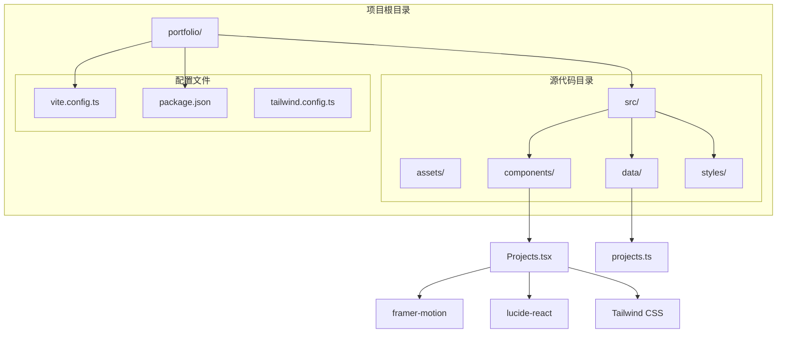
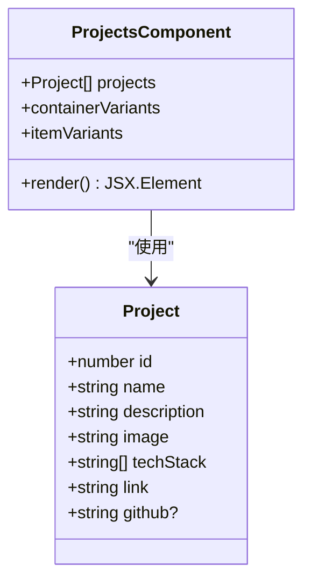
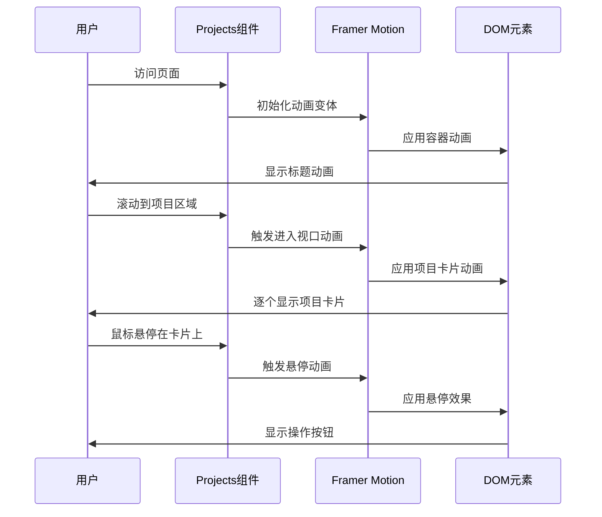
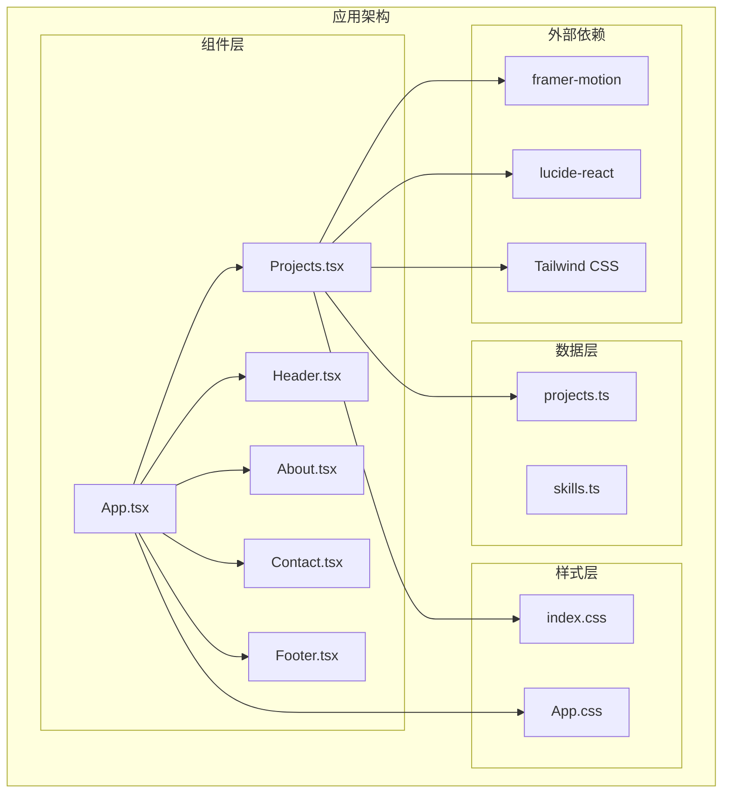
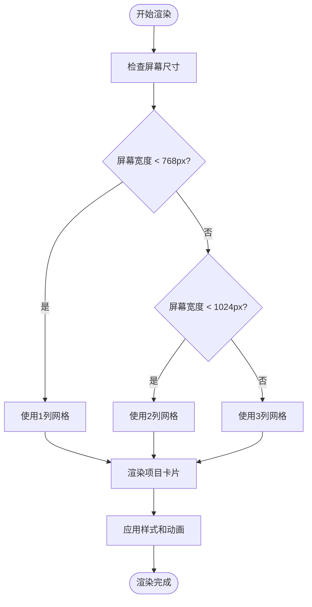
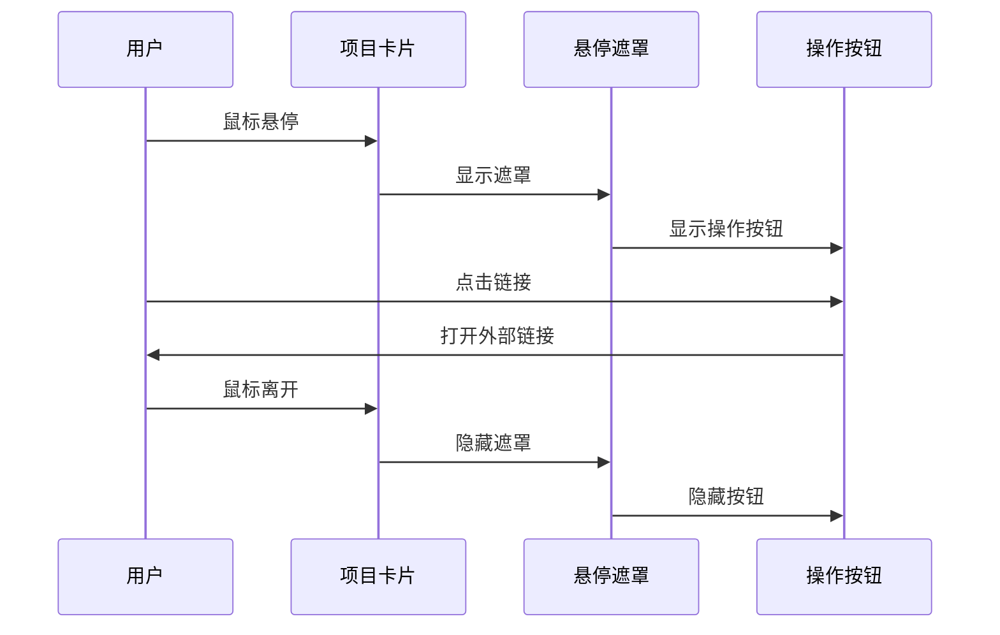
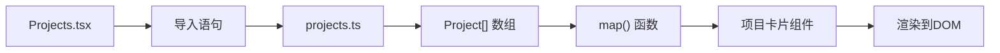
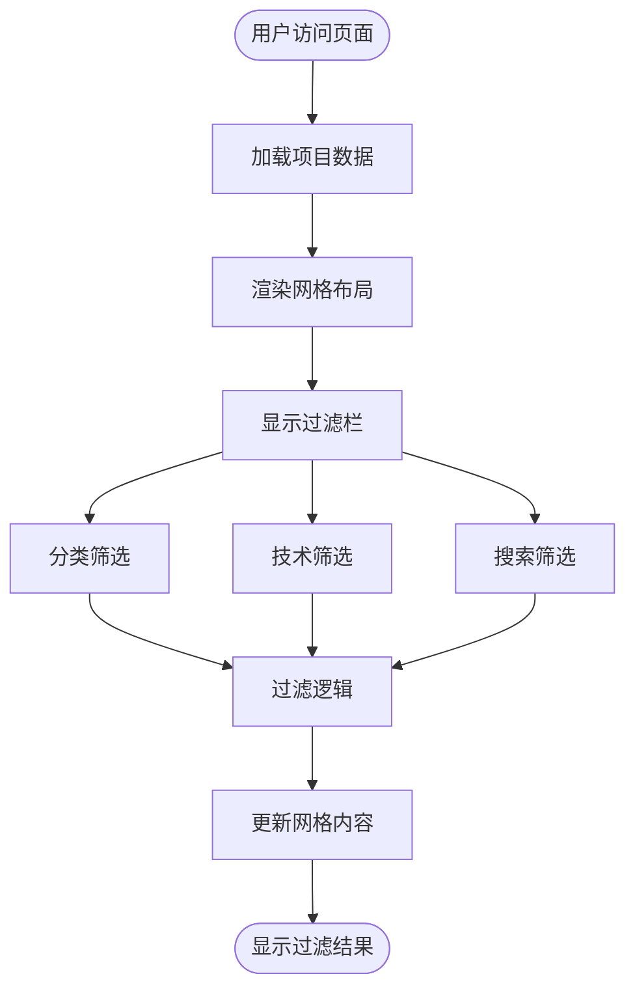
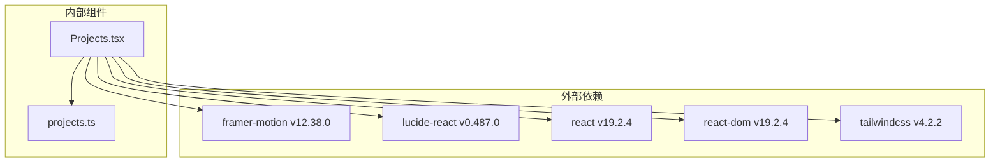
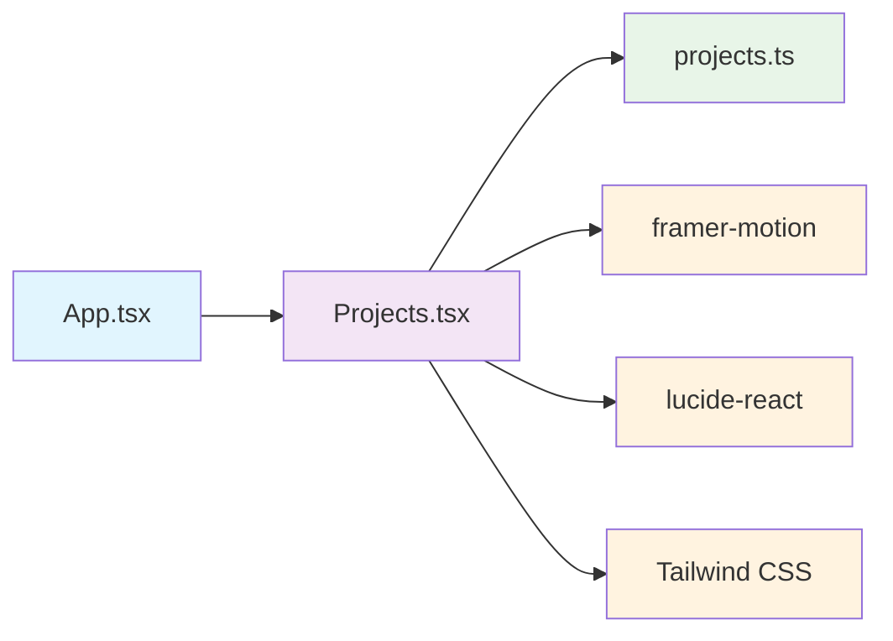

# 项目展示组件 (Projects)

<cite>
**本文档引用的文件**
- [Projects.tsx](file://portfolio/src/components/Projects.tsx)
- [projects.ts](file://portfolio/src/data/projects.ts)
- [App.tsx](file://portfolio/src/App.tsx)
- [index.css](file://portfolio/src/index.css)
- [package.json](file://portfolio/package.json)
- [vite.config.ts](file://portfolio/vite.config.ts)
- [Header.tsx](file://portfolio/src/components/Header.tsx)
</cite>

## 目录
1. [简介](#简介)
2. [项目结构](#项目结构)
3. [核心组件](#核心组件)
4. [架构概览](#架构概览)
5. [详细组件分析](#详细组件分析)
6. [依赖关系分析](#依赖关系分析)
7. [性能考虑](#性能考虑)
8. [故障排除指南](#故障排除指南)
9. [结论](#结论)

## 简介

Projects组件是Portfolio项目中的核心展示组件，负责以美观的卡片形式展示开发者的作品集。该组件采用现代化的设计理念，结合Framer Motion实现流畅的动画效果，使用Tailwind CSS构建响应式布局，并通过TypeScript确保类型安全。

该组件不仅展示了静态的项目数据，还为未来的扩展（如动态过滤、分类筛选等功能）提供了良好的基础架构。组件设计注重用户体验，通过悬停效果、渐变色彩和流畅动画营造专业的视觉体验。

## 项目结构

Portfolio项目采用模块化的组件架构，Projects组件位于src/components目录下，与数据源分离，遵循了清晰的职责分离原则。

**图表来源**
- [Projects.tsx:1-151](file://portfolio/src/components/Projects.tsx#L1-L151)
- [projects.ts:1-49](file://portfolio/src/data/projects.ts#L1-L49)
- [package.json:1-37](file://portfolio/package.json#L1-L37)

**章节来源**
- [Projects.tsx:1-151](file://portfolio/src/components/Projects.tsx#L1-L151)
- [projects.ts:1-49](file://portfolio/src/data/projects.ts#L1-L49)
- [package.json:1-37](file://portfolio/package.json#L1-L37)

## 核心组件

### 项目数据模型

Projects组件的核心是其数据模型，采用TypeScript接口定义，确保类型安全和开发体验。

**图表来源**
- [projects.ts:2-10](file://portfolio/src/data/projects.ts#L2-L10)
- [Projects.tsx:9-151](file://portfolio/src/components/Projects.tsx#L9-L151)

项目数据模型包含以下关键属性：
- `id`: 唯一标识符，用于React key属性
- `name`: 项目名称
- `description`: 项目描述，支持多行文本
- `image`: 项目图片路径
- `techStack`: 技术栈数组，显示项目使用的技术
- `link`: 在线演示链接
- `github`: GitHub源码链接（可选）

**章节来源**
- [projects.ts:2-10](file://portfolio/src/data/projects.ts#L2-L10)

### 动画系统

组件使用Framer Motion实现复杂的动画效果，包括进入动画、悬停效果和过渡动画。

**图表来源**
- [Projects.tsx:10-27](file://portfolio/src/components/Projects.tsx#L10-L27)
- [Projects.tsx:36-50](file://portfolio/src/components/Projects.tsx#L36-L50)

**章节来源**
- [Projects.tsx:10-27](file://portfolio/src/components/Projects.tsx#L10-L27)
- [Projects.tsx:36-50](file://portfolio/src/components/Projects.tsx#L36-L50)

## 架构概览

Projects组件在整个应用架构中扮演着重要的角色，作为展示层的一部分，它与数据层和UI层协同工作。

**图表来源**
- [App.tsx:1-28](file://portfolio/src/App.tsx#L1-L28)
- [Projects.tsx:1-4](file://portfolio/src/components/Projects.tsx#L1-L4)
- [projects.ts:1-49](file://portfolio/src/data/projects.ts#L1-L49)

**章节来源**
- [App.tsx:1-28](file://portfolio/src/App.tsx#L1-L28)
- [Projects.tsx:1-4](file://portfolio/src/components/Projects.tsx#L1-L4)

## 详细组件分析

### 项目卡片设计

Projects组件的项目卡片采用了现代化的设计理念，结合了深色主题和渐变色彩。

#### 卡片布局算法

卡片布局采用响应式网格系统，根据屏幕尺寸自动调整列数：

**图表来源**
- [Projects.tsx:58](file://portfolio/src/components/Projects.tsx#L58)

#### 悬停效果实现

悬停效果通过Framer Motion和Tailwind CSS的组合实现，提供流畅的用户交互体验：

**图表来源**
- [Projects.tsx:71-99](file://portfolio/src/components/Projects.tsx#L71-L99)

**章节来源**
- [Projects.tsx:58](file://portfolio/src/components/Projects.tsx#L58)
- [Projects.tsx:71-99](file://portfolio/src/components/Projects.tsx#L71-L99)

### 数据管理机制

组件通过直接导入项目数据来管理数据流，这种设计简单直接且易于维护。

#### 数据导入流程

**图表来源**
- [Projects.tsx:2](file://portfolio/src/components/Projects.tsx#L2)
- [Projects.tsx:60-124](file://portfolio/src/components/Projects.tsx#L60-L124)

**章节来源**
- [Projects.tsx:2](file://portfolio/src/components/Projects.tsx#L2)
- [Projects.tsx:60-124](file://portfolio/src/components/Projects.tsx#L60-L124)

### 响应式网格布局

组件实现了完整的响应式网格系统，适应不同设备的屏幕尺寸。

#### 响应式断点策略

| 断点 | 最小宽度 | 列数 | 卡片间距 |
|------|----------|------|----------|
| 移动端 | 0px | 1列 | 1rem |
| 平板端 | 768px | 2列 | 2rem |
| 桌面端 | 1024px | 2列 | 2rem |

**章节来源**
- [Projects.tsx:58](file://portfolio/src/components/Projects.tsx#L58)

### 动态过滤功能

虽然当前版本没有实现动态过滤功能，但组件架构为未来扩展提供了良好的基础。

**图表来源**
- [Projects.tsx:60-124](file://portfolio/src/components/Projects.tsx#L60-L124)

## 依赖关系分析

### 外部依赖

Projects组件依赖于多个现代化的前端库来实现其功能特性。

**图表来源**
- [package.json:12-17](file://portfolio/package.json#L12-L17)
- [Projects.tsx:1-3](file://portfolio/src/components/Projects.tsx#L1-L3)

**章节来源**
- [package.json:12-17](file://portfolio/package.json#L12-L17)
- [Projects.tsx:1-3](file://portfolio/src/components/Projects.tsx#L1-L3)

### 内部依赖关系

组件之间的依赖关系相对简单，遵循单一职责原则。

**图表来源**
- [App.tsx:4](file://portfolio/src/App.tsx#L4)
- [Projects.tsx:2](file://portfolio/src/components/Projects.tsx#L2)

**章节来源**
- [App.tsx:4](file://portfolio/src/App.tsx#L4)
- [Projects.tsx:2](file://portfolio/src/components/Projects.tsx#L2)

## 性能考虑

### 渲染优化

Projects组件在性能方面采用了多项优化措施：

1. **React.memo**: 虽然当前未使用，但可以考虑为项目卡片组件添加记忆化以避免不必要的重渲染
2. **虚拟滚动**: 对于大量项目数据，可以考虑实现虚拟滚动来提升性能
3. **懒加载**: 图片资源可以实现懒加载以减少初始加载时间

### 动画性能

Framer Motion提供了高性能的动画实现，但需要注意：

1. **硬件加速**: 使用transform和opacity属性以利用GPU加速
2. **动画节流**: 合理控制动画频率，避免过度频繁的重绘
3. **内存管理**: 及时清理动画监听器和事件处理器

## 故障排除指南

### 常见问题及解决方案

#### 1. 项目数据不显示

**症状**: 页面空白或只显示标题，没有项目卡片

**可能原因**:
- 项目数据导入失败
- 数据格式不正确
- 组件渲染错误

**解决方法**:
1. 检查项目数据文件是否存在
2. 验证数据格式是否符合接口定义
3. 确认组件导入语句正确

#### 2. 动画效果不工作

**症状**: 卡片没有动画效果

**可能原因**:
- Framer Motion库未正确安装
- 动画配置错误
- 浏览器兼容性问题

**解决方法**:
1. 确认framer-motion版本兼容
2. 检查动画变体配置
3. 测试不同浏览器的兼容性

#### 3. 响应式布局异常

**症状**: 在某些设备上布局错乱

**可能原因**:
- Tailwind CSS类名冲突
- CSS优先级问题
- 媒体查询配置错误

**解决方法**:
1. 检查CSS类名的正确性
2. 验证媒体查询的断点设置
3. 使用浏览器开发者工具调试

**章节来源**
- [Projects.tsx:10-27](file://portfolio/src/components/Projects.tsx#L10-L27)
- [projects.ts:12-49](file://portfolio/src/data/projects.ts#L12-L49)

## 结论

Projects组件是一个设计精良的项目展示组件，展现了现代前端开发的最佳实践。组件成功地结合了TypeScript的类型安全、Framer Motion的流畅动画、Tailwind CSS的响应式设计和Lucide Icons的图标系统。

### 主要优势

1. **类型安全**: 完整的TypeScript接口定义确保了数据的一致性和开发体验
2. **动画流畅**: 基于Framer Motion的动画系统提供了优秀的用户体验
3. **响应式设计**: 灵活的网格布局适应各种设备尺寸
4. **模块化架构**: 清晰的组件分离便于维护和扩展
5. **性能优化**: 合理的渲染策略和动画实现

### 改进建议

1. **动态过滤**: 实现项目分类和搜索功能
2. **图片优化**: 添加图片懒加载和格式优化
3. **SEO优化**: 添加meta标签和结构化数据
4. **无障碍访问**: 增强键盘导航和屏幕阅读器支持
5. **国际化**: 支持多语言切换

Projects组件为Portfolio项目提供了一个坚实的基础，为未来的功能扩展和性能优化奠定了良好的基础。其设计体现了现代前端开发的先进理念，是一个值得学习和参考的优秀示例。