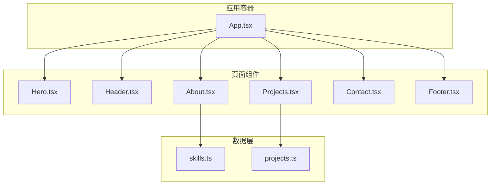
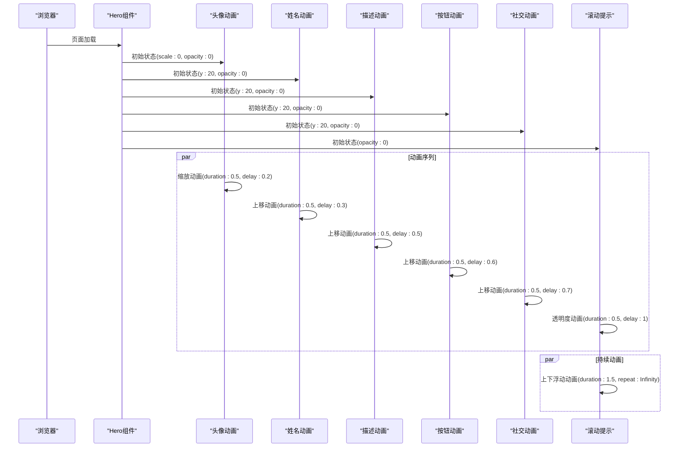
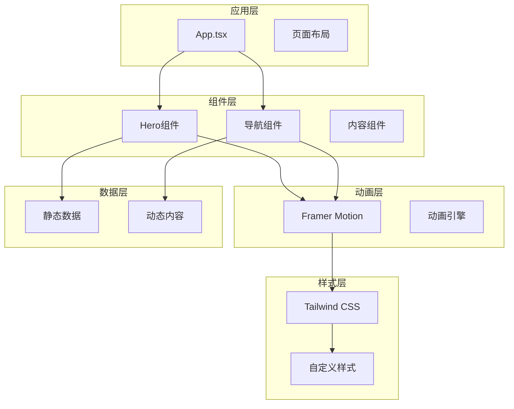
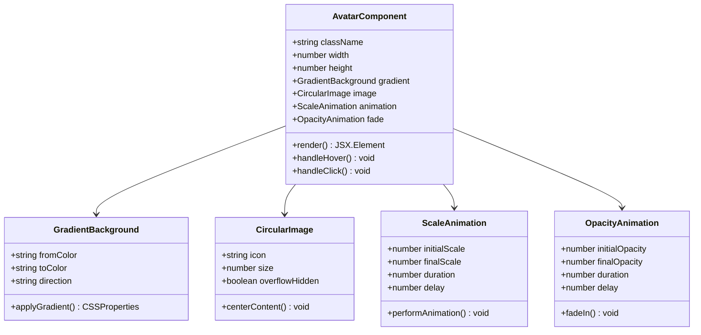
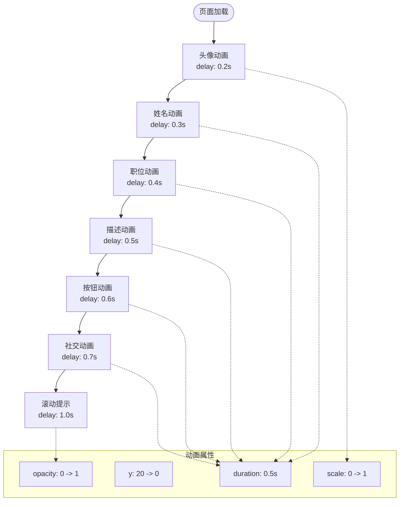
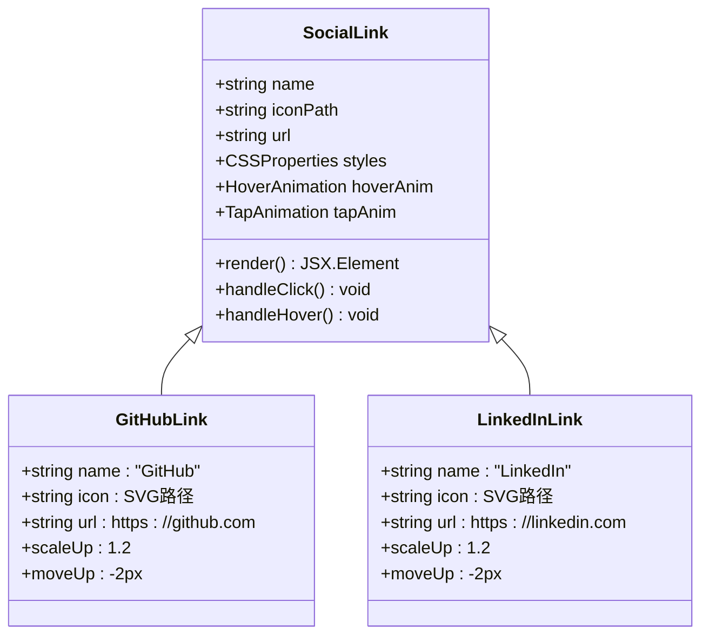
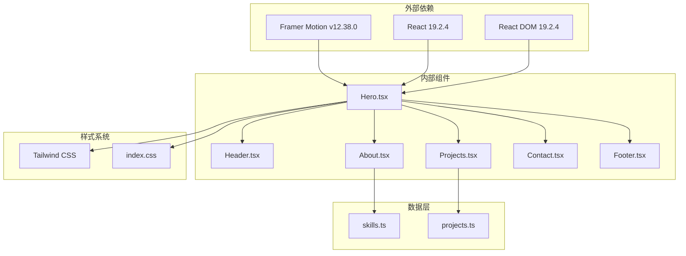

# 首屏展示组件（Hero）

<cite>
**本文档引用的文件**
- [Hero.tsx](file://portfolio/src/components/Hero.tsx)
- [App.tsx](file://portfolio/src/App.tsx)
- [index.css](file://portfolio/src/index.css)
- [package.json](file://portfolio/package.json)
- [vite.config.ts](file://portfolio/vite.config.ts)
- [Header.tsx](file://portfolio/src/components/Header.tsx)
- [About.tsx](file://portfolio/src/components/About.tsx)
- [Projects.tsx](file://portfolio/src/components/Projects.tsx)
- [Contact.tsx](file://portfolio/src/components/Contact.tsx)
- [Footer.tsx](file://portfolio/src/components/Footer.tsx)
- [skills.ts](file://portfolio/src/data/skills.ts)
- [projects.ts](file://portfolio/src/data/projects.ts)
</cite>

## 目录
1. [简介](#简介)
2. [项目结构](#项目结构)
3. [核心组件](#核心组件)
4. [架构概览](#架构概览)
5. [详细组件分析](#详细组件分析)
6. [依赖关系分析](#依赖关系分析)
7. [性能考虑](#性能考虑)
8. [故障排除指南](#故障排除指南)
9. [结论](#结论)

## 简介

Hero组件是Portfolio项目中的首屏展示组件，负责创建引人注目的首页体验。该组件采用现代化的视觉设计，结合Framer Motion动画库实现流畅的入场动画效果，为用户营造沉浸式的首屏体验。

该组件的核心功能包括：
- 头像展示与渐变背景效果
- 响应式布局设计
- 流畅的入场动画序列
- 交互式CTA按钮
- 社交媒体链接集成
- 滚动提示动画

## 项目结构

Portfolio项目采用模块化架构，Hero组件作为应用的主要入口点，与其他页面组件协同工作：



**图表来源**
- [App.tsx:12-25](file://portfolio/src/App.tsx#L12-L25)
- [Hero.tsx:7-141](file://portfolio/src/components/Hero.tsx#L7-L141)

**章节来源**
- [App.tsx:1-28](file://portfolio/src/App.tsx#L1-L28)
- [Hero.tsx:1-142](file://portfolio/src/components/Hero.tsx#L1-L142)

## 核心组件

Hero组件实现了完整的首屏展示功能，包含以下关键特性：

### 视觉设计特点
- **深色主题配色方案**：使用`#0a0a0a`背景色，营造现代科技感
- **渐变色彩系统**：采用`linear-gradient(135deg, #667eea 0%, #764ba2 100%)`作为主要装饰色
- **响应式字体大小**：从移动端到桌面端的渐进式字体缩放
- **圆角设计**：统一的圆角半径提升视觉一致性

### 动画系统架构
组件使用Framer Motion实现多层次的动画效果：



**图表来源**
- [Hero.tsx:15-26](file://portfolio/src/components/Hero.tsx#L15-L26)
- [Hero.tsx:29-38](file://portfolio/src/components/Hero.tsx#L29-L38)
- [Hero.tsx:51-59](file://portfolio/src/components/Hero.tsx#L51-L59)
- [Hero.tsx:62-92](file://portfolio/src/components/Hero.tsx#L62-L92)
- [Hero.tsx:95-119](file://portfolio/src/components/Hero.tsx#L95-L119)
- [Hero.tsx:122-137](file://portfolio/src/components/Hero.tsx#L122-L137)

**章节来源**
- [Hero.tsx:7-141](file://portfolio/src/components/Hero.tsx#L7-L141)

## 架构概览

Hero组件在整个应用架构中扮演着关键角色，作为首屏体验的核心组件：



**图表来源**
- [App.tsx:12-25](file://portfolio/src/App.tsx#L12-L25)
- [Hero.tsx:1-1](file://portfolio/src/components/Hero.tsx#L1-L1)
- [Header.tsx:52-127](file://portfolio/src/components/Header.tsx#L52-L127)

**章节来源**
- [App.tsx:12-25](file://portfolio/src/App.tsx#L12-L25)
- [Hero.tsx:1-142](file://portfolio/src/components/Hero.tsx#L1-L142)

## 详细组件分析

### 头像展示系统

头像组件采用了复杂的渐变背景和圆角设计：



**图表来源**
- [Hero.tsx:15-26](file://portfolio/src/components/Hero.tsx#L15-L26)

头像的渐变背景使用了双色渐变效果：
- 外层渐变：`from-[#667eea] to-[#764ba2]`
- 内层圆形：`from-[#667eea]/20 to-[#764ba2]/20`

**章节来源**
- [Hero.tsx:15-26](file://portfolio/src/components/Hero.tsx#L15-L26)

### 文本内容层次结构

Hero组件包含多个层级的文本内容，每个元素都有独特的动画时序：



**图表来源**
- [Hero.tsx:29-38](file://portfolio/src/components/Hero.tsx#L29-L38)
- [Hero.tsx:41-48](file://portfolio/src/components/Hero.tsx#L41-L48)
- [Hero.tsx:51-59](file://portfolio/src/components/Hero.tsx#L51-L59)
- [Hero.tsx:62-92](file://portfolio/src/components/Hero.tsx#L62-L92)
- [Hero.tsx:95-119](file://portfolio/src/components/Hero.tsx#L95-L119)
- [Hero.tsx:122-137](file://portfolio/src/components/Hero.tsx#L122-L137)

**章节来源**
- [Hero.tsx:29-59](file://portfolio/src/components/Hero.tsx#L29-L59)

### 交互式CTA按钮系统

Hero组件提供了两个主要的行动号召按钮，都集成了丰富的交互反馈：

```mermaid
stateDiagram-v2
[*] --> Idle
Idle --> Hover : 鼠标悬停
Idle --> Tap : 点击触摸
Hover --> ScaleUp : whileHover
Tap --> ScaleDown : whileTap
ScaleUp --> Idle : 悬停离开
ScaleDown --> Idle : 松开点击
note right of ScaleUp : scale : 1.05<br/>transition : 0.2s ease
note right of ScaleDown : scale : 0.95<br/>transition : 0.2s ease
```

**图表来源**
- [Hero.tsx:68-91](file://portfolio/src/components/Hero.tsx#L68-L91)

按钮的交互行为：
- **查看作品**：内部平滑滚动到项目区域
- **联系我**：内部平滑滚动到联系区域
- **悬停效果**：轻微放大10%
- **点击效果**：轻微缩小5%

**章节来源**
- [Hero.tsx:68-91](file://portfolio/src/components/Hero.tsx#L68-L91)

### 社交链接集成

Hero组件集成了两个主要的社交平台链接，都采用了统一的交互模式：



**图表来源**
- [Hero.tsx:101-118](file://portfolio/src/components/Hero.tsx#L101-L118)

社交链接的统一设计规范：
- **图标尺寸**：`w-6 h-6`
- **颜色过渡**：灰色到白色
- **悬停动画**：放大20%并上移2像素
- **点击动画**：缩小10%

**章节来源**
- [Hero.tsx:101-118](file://portfolio/src/components/Hero.tsx#L101-L118)

### 动态元素配置

Hero组件包含了多个动态配置元素，展示了组件的灵活性：

```mermaid
graph LR
subgraph "动态配置"
Config[配置对象]
Social[社交链接数组]
Animations[动画配置]
Layout[布局设置]
end
subgraph "配置详情"
S1[{name: 'GitHub'}]
S2[{name: 'LinkedIn'}]
A1[initial: {y: 20, opacity: 0}]
A2[animate: {y: 0, opacity: 1}]
A3[transition: {duration: 0.5, delay: 0.7}]
L1[className: 'flex justify-center gap-6']
end
Config --> Social
Config --> Animations
Config --> Layout
Social --> S1
Social --> S2
Animations --> A1
Animations --> A2
Animations --> A3
Layout --> L1
```

**图表来源**
- [Hero.tsx:101-118](file://portfolio/src/components/Hero.tsx#L101-L118)
- [Hero.tsx:95-119](file://portfolio/src/components/Hero.tsx#L95-L119)

**章节来源**
- [Hero.tsx:101-118](file://portfolio/src/components/Hero.tsx#L101-L118)

## 依赖关系分析

Hero组件的依赖关系展现了清晰的模块化设计：



**图表来源**
- [package.json:12-17](file://portfolio/package.json#L12-L17)
- [Hero.tsx:1-1](file://portfolio/src/components/Hero.tsx#L1-L1)
- [App.tsx:1-6](file://portfolio/src/App.tsx#L1-L6)

**章节来源**
- [package.json:12-17](file://portfolio/package.json#L12-L17)
- [Hero.tsx:1-1](file://portfolio/src/components/Hero.tsx#L1-L1)

## 性能考虑

Hero组件在性能优化方面采用了多项策略：

### 渲染性能优化
- **CSS硬件加速**：使用transform属性而非改变布局属性
- **最小重绘**：动画仅涉及opacity和transform属性
- **响应式设计**：避免不必要的DOM操作

### 动画性能优化
- **批量动画**：使用延迟序列而非同时触发
- **缓动函数**：采用预计算的缓动曲线
- **内存管理**：及时清理事件监听器

### 加载性能优化
- **懒加载**：非关键资源按需加载
- **CDN集成**：外部依赖通过CDN加载
- **压缩优化**：生产环境自动压缩

## 故障排除指南

### 常见问题及解决方案

**问题1：动画不生效**
- 检查Framer Motion是否正确安装
- 确认React版本兼容性
- 验证CSS类名拼写

**问题2：响应式布局异常**
- 检查Tailwind CSS配置
- 验证断点设置
- 确认视口元标签

**问题3：社交链接无法点击**
- 检查target和rel属性
- 验证URL格式
- 确认事件处理器绑定

**章节来源**
- [Hero.tsx:68-91](file://portfolio/src/components/Hero.tsx#L68-L91)
- [Hero.tsx:101-118](file://portfolio/src/components/Hero.tsx#L101-L118)

## 结论

Hero组件成功地创建了一个现代化、响应迅速且具有吸引力的首屏体验。通过精心设计的动画序列、优雅的渐变色彩和流畅的交互反馈，该组件为整个Portfolio项目奠定了坚实的基础。

组件的主要优势包括：
- **优秀的用户体验**：流畅的动画过渡和直观的交互
- **高度的可定制性**：清晰的配置结构便于修改和扩展
- **良好的性能表现**：优化的渲染策略确保快速加载
- **响应式设计**：适配各种设备和屏幕尺寸

未来可以考虑的改进方向：
- 添加更多动画变体选项
- 实现主题切换功能
- 增强无障碍访问支持
- 优化移动端触摸体验