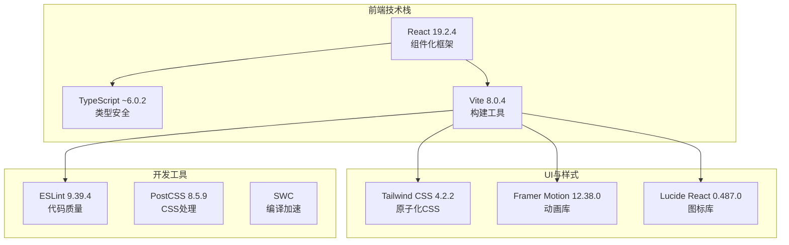
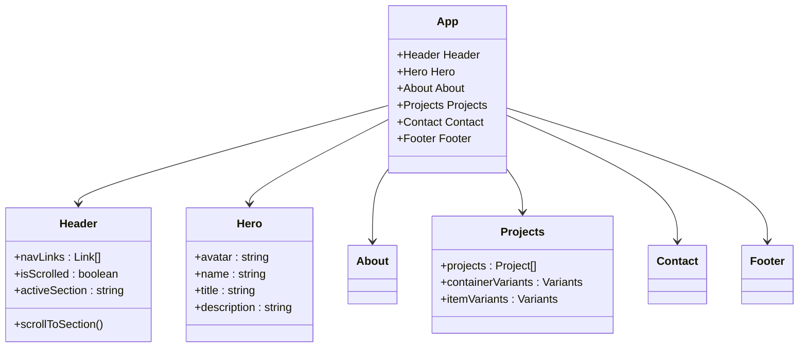
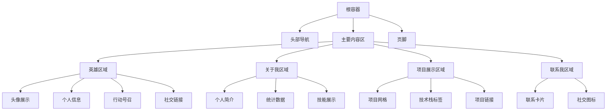
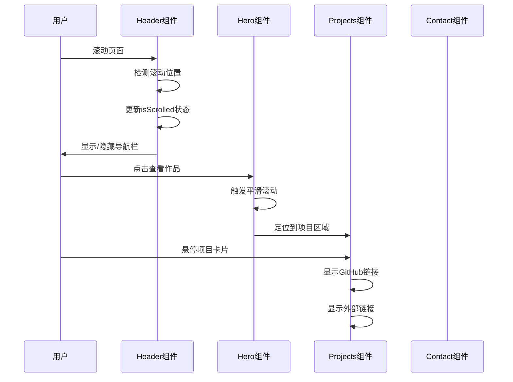
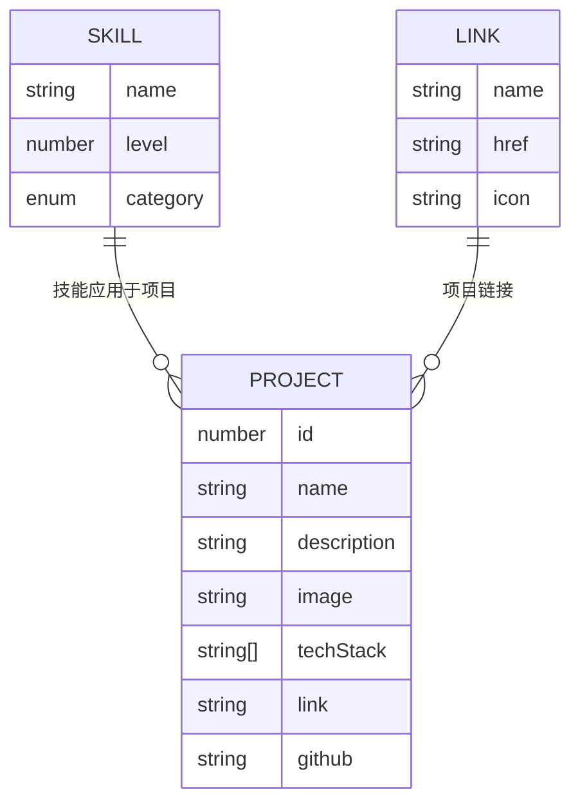
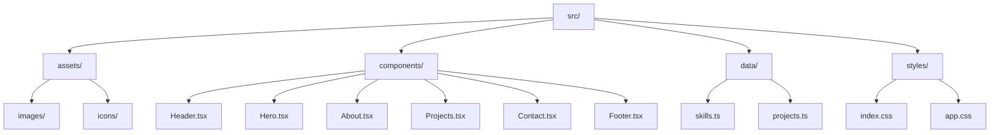
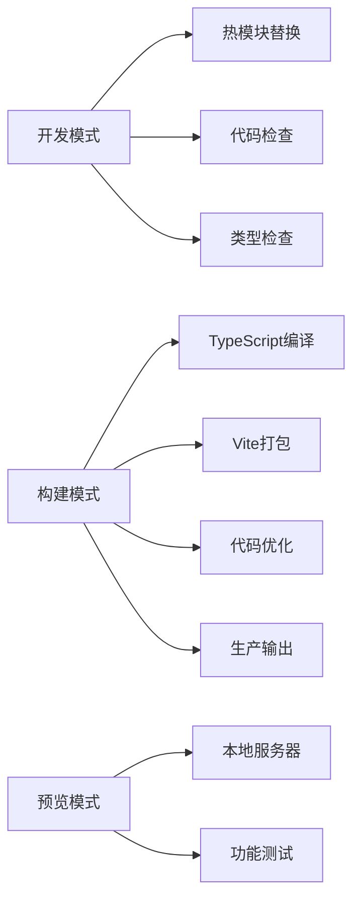

# 项目概述

<cite>
**本文档引用的文件**
- [README.md](file://portfolio/README.md)
- [package.json](file://portfolio/package.json)
- [vite.config.ts](file://portfolio/vite.config.ts)
- [src/main.tsx](file://portfolio/src/main.tsx)
- [src/App.tsx](file://portfolio/src/App.tsx)
- [src/index.css](file://portfolio/src/index.css)
- [src/components/Header.tsx](file://portfolio/src/components/Header.tsx)
- [src/components/Hero.tsx](file://portfolio/src/components/Hero.tsx)
- [src/components/About.tsx](file://portfolio/src/components/About.tsx)
- [src/components/Projects.tsx](file://portfolio/src/components/Projects.tsx)
- [src/components/Contact.tsx](file://portfolio/src/components/Contact.tsx)
- [src/components/Footer.tsx](file://portfolio/src/components/Footer.tsx)
- [src/data/projects.ts](file://portfolio/src/data/projects.ts)
- [src/data/skills.ts](file://portfolio/src/data/skills.ts)
</cite>

## 目录
1. [项目简介](#项目简介)
2. [技术架构](#技术架构)
3. [核心功能特性](#核心功能特性)
4. [组件架构设计](#组件架构设计)
5. [响应式设计实现](#响应式设计实现)
6. [动画与交互体验](#动画与交互体验)
7. [数据管理策略](#数据管理策略)
8. [项目结构分析](#项目结构分析)
9. [性能优化考虑](#性能优化考虑)
10. [部署与构建流程](#部署与构建流程)
11. [总结](#总结)

## 项目简介

AIWs个人作品集项目是一个现代化的个人展示网站，专门用于展示开发者的技能、项目经验和专业背景。该项目采用前沿的React + TypeScript + Vite技术栈构建，体现了现代Web开发的最佳实践。

### 项目目标

- **个人品牌建设**：通过专业的在线作品集展示个人技术实力和职业形象
- **技能展示**：系统性地展示前端、后端、工具和设计等多维度技能
- **项目展示**：以美观的方式呈现个人参与或主导的技术项目
- **职业发展**：为潜在雇主或客户建立专业的数字化名片
- **技术演示**：展示最新的前端技术和开发工具的使用能力

### 主要用途

该作品集网站主要用于：
- 展示个人技能水平和专业能力
- 呈现完整的项目作品集和技术案例
- 提供便捷的联系方式和合作渠道
- 建立个人技术品牌的在线存在感
- 支持远程工作机会和项目合作的沟通平台

## 技术架构

### 技术栈选择

项目采用了业界领先的现代前端技术栈，确保了开发效率、性能表现和未来兼容性：



**图表来源**
- [package.json:12-35](file://portfolio/package.json#L12-L35)
- [vite.config.ts:1-9](file://portfolio/vite.config.ts#L1-L9)

### 构建配置

项目使用Vite作为构建工具，配合React插件和Tailwind CSS插件，实现了快速的开发服务器启动和高效的生产构建：

- **开发环境**：热模块替换(HMR)，即时反馈开发体验
- **生产构建**：代码分割、Tree Shaking、压缩优化
- **类型检查**：TypeScript编译器集成，构建时类型验证
- **ESLint集成**：代码质量保证和风格统一

**章节来源**
- [vite.config.ts:1-9](file://portfolio/vite.config.ts#L1-L9)
- [package.json:6-11](file://portfolio/package.json#L6-L11)

## 核心功能特性

### 1. 组件化架构设计

项目采用高度模块化的组件架构，每个功能区域都被封装为独立的React组件：



**图表来源**
- [src/App.tsx:1-28](file://portfolio/src/App.tsx#L1-L28)
- [src/components/Header.tsx:16-129](file://portfolio/src/components/Header.tsx#L16-L129)
- [src/components/Projects.tsx:9-151](file://portfolio/src/components/Projects.tsx#L9-L151)

### 2. 数据驱动的内容管理

项目采用数据分离的设计理念，将静态内容从组件逻辑中抽离：

- **技能数据**：结构化的技能列表，包含技能名称、熟练度和分类
- **项目数据**：标准化的项目信息，支持GitHub链接和在线演示
- **配置数据**：导航链接、联系方式等可配置内容

**章节来源**
- [src/data/skills.ts:1-39](file://portfolio/src/data/skills.ts#L1-L39)
- [src/data/projects.ts:1-49](file://portfolio/src/data/projects.ts#L1-L49)

### 3. 响应式布局系统

完全基于Tailwind CSS的原子化设计方法，实现了从移动端到桌面端的完美适配：

- **移动优先**：默认针对小屏幕设备优化
- **断点系统**：sm、md、lg、xl等响应式断点
- **弹性布局**：Grid和Flexbox的灵活组合
- **自适应组件**：根据屏幕尺寸调整布局和间距

## 组件架构设计

### 页面结构层次

项目采用清晰的页面结构层次，每个页面区域都有明确的功能定位：



**图表来源**
- [src/App.tsx:12-25](file://portfolio/src/App.tsx#L12-L25)
- [src/components/Hero.tsx:7-142](file://portfolio/src/components/Hero.tsx#L7-L142)
- [src/components/About.tsx:8-151](file://portfolio/src/components/About.tsx#L8-L151)

### 组件通信模式

项目中的组件通信遵循单向数据流原则：

- **父组件到子组件**：通过props传递数据和回调函数
- **子组件到父组件**：通过回调函数向上冒泡状态变化
- **全局状态**：少量共享状态通过React Context管理

**章节来源**
- [src/components/Header.tsx:16-41](file://portfolio/src/components/Header.tsx#L16-L41)
- [src/components/Projects.tsx:9-27](file://portfolio/src/components/Projects.tsx#L9-L27)

## 响应式设计实现

### 设计系统基础

项目建立了完整的设计系统，确保视觉一致性和开发效率：

```mermaid
graph LR
subgraph "设计系统"
Colors[色彩系统<br/>#0a0a0a, #1a1a1a, #667eea]
Typography[字体系统<br/>Inter字体, 渐变文字]
Spacing[间距系统<br/>4px, 8px, 16px基底]
Breakpoints[断点系统<br/>sm:640px, md:768px, lg:1024px]
end
subgraph "组件样式"
DarkTheme[深色主题<br/>#0a0a0a背景]
GradientText[渐变文字<br/>from-[#667eea] to-[#764ba2]]
GlassEffect[毛玻璃效果<br/>backdrop-blur-md]
BorderRadius[圆角系统<br/>rounded-lg, rounded-full]
end
Colors --> Typography
Colors --> Spacing
Colors --> Breakpoints
Typography --> GradientText
DarkTheme --> GlassEffect
BorderRadius --> GlassEffect
```

**图表来源**
- [src/index.css:3-21](file://portfolio/src/index.css#L3-L21)
- [src/components/Header.tsx:56-60](file://portfolio/src/components/Header.tsx#L56-L60)

### 移动端优化策略

- **触摸友好的交互元素**：按钮和链接具有足够的点击区域
- **优化的滚动行为**：平滑滚动和防抖处理
- **性能优化**：懒加载和虚拟滚动减少内存占用
- **网络优化**：资源压缩和CDN加速

**章节来源**
- [src/index.css:11-13](file://portfolio/src/index.css#L11-L13)
- [src/components/Header.tsx:109-123](file://portfolio/src/components/Header.tsx#L109-L123)

## 动画与交互体验

### Framer Motion集成

项目深度集成了Framer Motion，为用户提供了流畅自然的动画体验：



**图表来源**
- [src/components/Header.tsx:21-41](file://portfolio/src/components/Header.tsx#L21-L41)
- [src/components/Hero.tsx:68-92](file://portfolio/src/components/Hero.tsx#L68-L92)
- [src/components/Projects.tsx:72-99](file://portfolio/src/components/Projects.tsx#L72-L99)

### 交互设计原则

- **微交互**：按钮悬停、点击反馈等细节优化
- **过渡动画**：页面切换和状态变化的平滑过渡
- **可访问性**：键盘导航和屏幕阅读器支持
- **性能优先**：动画优化和硬件加速

**章节来源**
- [src/components/About.tsx:18-35](file://portfolio/src/components/About.tsx#L18-L35)
- [src/components/Projects.tsx:60-125](file://portfolio/src/components/Projects.tsx#L60-L125)

## 数据管理策略

### 类型安全的数据模型

项目使用TypeScript定义了严格的数据结构：



**图表来源**
- [src/data/skills.ts:2-6](file://portfolio/src/data/skills.ts#L2-L6)
- [src/data/projects.ts:2-10](file://portfolio/src/data/projects.ts#L2-L10)

### 数据组织架构

- **技能分类**：前端开发、后端开发、开发工具、其他技能
- **项目分类**：按技术栈和项目类型进行组织
- **导航配置**：集中管理导航链接和路由映射
- **静态资源**：图标、图片等静态资源的统一管理

**章节来源**
- [src/data/skills.ts:33-38](file://portfolio/src/data/skills.ts#L33-L38)
- [src/data/projects.ts:12-48](file://portfolio/src/data/projects.ts#L12-L48)

## 项目结构分析

### 目录结构设计

项目采用了清晰的目录组织方式，便于维护和扩展：



**图表来源**
- [src/main.tsx:1-12](file://portfolio/src/main.tsx#L1-L12)
- [src/App.tsx:1-6](file://portfolio/src/App.tsx#L1-L6)

### 文件命名规范

- **组件文件**：采用PascalCase命名，如Header.tsx
- **数据文件**：采用小驼峰命名，如skills.ts
- **样式文件**：采用描述性命名，如index.css
- **配置文件**：采用标准命名，如vite.config.ts

**章节来源**
- [src/components/Header.tsx:16](file://portfolio/src/components/Header.tsx#L16)
- [src/data/skills.ts:1](file://portfolio/src/data/skills.ts#L1)

## 性能优化考虑

### 构建优化策略

项目在构建阶段实施了多项优化措施：

- **代码分割**：按需加载组件和路由
- **Tree Shaking**：移除未使用的代码
- **压缩优化**：生产环境代码压缩和混淆
- **缓存策略**：浏览器缓存和CDN加速

### 运行时性能优化

- **虚拟DOM优化**：React的高效更新机制
- **懒加载**：图片和组件的延迟加载
- **内存管理**：及时清理事件监听器和定时器
- **渲染优化**：useMemo和useCallback的合理使用

**章节来源**
- [package.json:8](file://portfolio/package.json#L8)
- [vite.config.ts:7](file://portfolio/vite.config.ts#L7)

## 部署与构建流程

### 开发工作流程

项目提供了完整的开发工具链：



**图表来源**
- [package.json:6-10](file://portfolio/package.json#L6-L10)

### 部署准备

- **环境配置**：生产环境的环境变量设置
- **资源优化**：静态资源的版本管理和压缩
- **SEO优化**：Meta标签和结构化数据
- **安全配置**：HTTPS和安全头设置

**章节来源**
- [README.md:1-74](file://portfolio/README.md#L1-L74)

## 总结

AIWs个人作品集项目代表了现代前端开发的最佳实践，通过精心设计的技术架构和用户体验，成功地将个人技能和项目经验转化为一个专业、美观且功能完整的在线展示平台。

### 技术亮点

- **现代化技术栈**：React + TypeScript + Vite的黄金组合
- **组件化设计**：高度模块化的架构便于维护和扩展
- **响应式布局**：完美的跨设备兼容性
- **动画体验**：流畅自然的用户交互
- **性能优化**：从构建到运行的全方位优化

### 学习价值

对于初学者而言，该项目提供了：
- 现代前端开发的完整实践案例
- TypeScript类型系统的实际应用
- React组件设计的最佳实践
- 响应式设计的设计思路
- 动画和交互的实现技巧

对于有经验的开发者而言，该项目展示了：
- 现代构建工具的配置和优化
- 数据驱动的内容管理策略
- 组件通信和状态管理的模式
- 性能优化的具体实现方案
- 生产环境部署的完整流程

该项目不仅是一个优秀的个人作品集，更是前端开发技术的综合展示，为读者提供了宝贵的学习资源和实践参考。